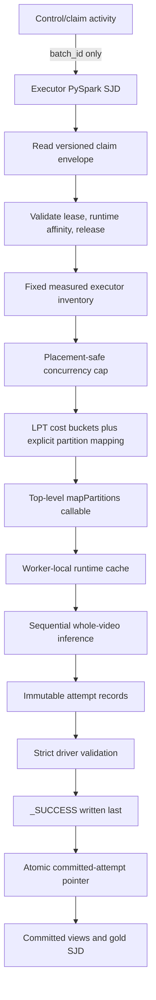

# Spark Candidate A Optimization for `people-counter`

> Production migration, stopped-writer recovery, shadow-routing, and isolated
> benchmark operations are documented in
> [production-migration-benchmark-runbook.md](production-migration-benchmark-runbook.md).
> The force/full gold rebuild path is maintenance-only and non-idempotent; it
> is not a benchmark recovery mechanism.

## Executive Summary

### Final Candidate A CPU verdict (2026-10-06)

**REJECT the Spark/F64 CPU architecture.** The completed bounded optimizer
experiments produced a best actual aggregate throughput of `1.5899x` real
time, against the `416.67x` acceptance threshold. The measured architecture
is therefore `262.07x` below the gate. With the benchmark's capacity headroom,
the observed rate implies 315 F64-equivalent allocations, which is neither a
credible nor an economical route to the target. The six-hour benchmark was
not run because a sustained test cannot rescue a candidate that misses the
throughput gate by this magnitude.

Changed-input gold validation and the subsequent unchanged/no-op proof passed.
Final benchmark recovery and reconciliation reported zero critical and zero
noncritical findings. These correctness results do not override the capacity
failure.

The experiments did not apply every optimization listed in this document, and
this document must not be read as claiming otherwise. Remaining items such as
copy reduction, Spark-action reduction, additional batching, and selective
native relational execution are incremental; they cannot plausibly close a
262-fold measured gap. Stop CPU/Spark inference optimization here. The next
recommended architecture is accelerator-backed inference—preferably a
right-sized GPU worker/service tier—while retaining Spark for manifests,
durable work control, validation, immutable publication, and gold processing.

Candidate A is not a particular computer: it is the design document's **all-Spark executor-partition architecture**. It assigns whole videos to Spark partitions, constructs and reuses an inference runtime inside each partition, disables speculation, and relies on immutable attempt output plus a driver-controlled publication decision.[^1] The repository already contains most of the difficult execution primitives: sequential whole-video processing, typed runtime caching, native-thread controls, lease-aware admission, deterministic largest-cost-first planning, and Delta transaction identities.[^2]

The current production notebook is nevertheless **not ready to be promoted unchanged**. Its physical partitioning, memory cap, dynamic-allocation behavior, task-attempt identity, and default claim size diverge from the stronger benchmark implementation; it also lacks a production Spark Job Definition (SJD) entry point and a completed six-hour capacity result.[^3] The highest-value path is therefore to port the benchmark scheduler's invariants into an importable SJD worker, keep the current stateful tracking semantics, amortize model loading across multiple compatible videos, tune `spark.task.cpus` together with native thread counts, increase detector batch size, and remove avoidable full-frame copies and extra Spark actions.[^4]

The scale gate remains stringent: processing 200,000 source-video hours in 30
days requires 277.78x aggregate real-time speed before allowances and
**416.67x** after the document's 20% headroom and 80% useful-utilization
assumptions.[^5] The final CPU optimizer result of `1.5899x` rejects Candidate
A before the six-hour gate. Any replacement accelerator architecture still
requires fixed-allocation measurement and a six-hour sustained run before
production sizing; nominal node counts or a hard-coded executor profile are
not evidence.[^6]

Fabric's Native Execution Engine (NEE) adds a useful but narrower optimization opportunity. Microsoft now documents native-plan support around Python scalar UDFs, Pandas UDFs, Scala UDFs, and operations over arrays, maps, and structs, with its largest UDF benchmark gains reported for vectorized Pandas UDFs.[^48] This does **not** make OpenCV decode, PyTorch/ONNX inference, ReID, or stateful tracking native. Candidate A should retain whole-video `mapPartitions` for inference while moving eligible control, validation, result-shaping, and gold transformations to Spark SQL/DataFrame expressions first; only transformations that cannot be expressed cleanly with built-ins should enter an isolated Python/Pandas UDF benchmark.[^49]

## Scope and Assumptions

This is a **technical deep dive** covering the package under `src/people_counter`, its Fabric notebooks and pipeline exports, the attached pipeline design, and current official Spark/Fabric guidance. The original Candidate A analysis used repository revision `325a7ccdb41136dd449a432f4679c72216091f6f`. The UDF/NEE update was researched against committed `HEAD` `eecffc99c3d77440c2f1f9060bce42a602a29653`; recommendations that reference newer SJD and gold modules are explicitly cited to that revision.

The term **Candidate A** is interpreted exactly as the attached document uses it: one bounded multi-video Spark application in which whole videos are processed by executor partitions. It is not interpreted as a workstation, VM SKU, or GPU host.[^1] Recommendations below preserve frame-order-dependent tracking and line-counting semantics unless explicitly labeled as an algorithm or model experiment.

## Key Components

| Component | Current role | Spark relevance |
|---|---|---|
| `src/people_counter/api.py` | Typed pipeline dispatch, runtime construction, execution, and result conversion | Stable SDK boundary that should remain below the Spark adapter.[^7] |
| `src/people_counter/video.py` | Ordered OpenCV capture, sampling, and detector-batch formation | Keeps per-video frame order; a major decode and allocation hot path.[^8] |
| `src/people_counter/pipelines/rtdetr_osnet.py` | Batched RT-DETR inference plus ordered stateful tracking/ReID | Candidate A's current CPU baseline and primary optimization target.[^9] |
| `src/people_counter/fabric_executor_partition.py` | Runtime cache, Spark row schema, whole-video partition loop | Correct executor-side abstraction; should be called from a top-level SJD function.[^10] |
| `src/people_counter/fabric_executor_production.py` | Lease checks, planning, local staging, processing, staging validation | Reusable production foundation, but some notebook callers weaken its scheduler guarantees.[^11] |
| `src/people_counter/sjd_process.py` | Current Candidate A SJD partition adapter, task identity, explicit bucket execution, and staged-record validation | Confirms that the whole-video `mapPartitions` boundary has since become an importable implementation surface.[^50] |
| `src/people_counter/sjd_gold.py` | Gold fact, flow, operational, date/time, and validation transformations | Best area for Catalyst-native rewrites and selective UDF benchmarking.[^51] |
| `notebooks/fabric/15_executor_partition_inference.ipynb` | Capacity-aware Candidate A benchmark | Source of the stronger fixed-allocation, memory-safe, explicit-partition algorithm.[^12] |
| `notebooks/fabric/17_process_video_executor.ipynb` | Current production executor notebook | Operational canary, not yet a capacity-approved production SJD.[^13] |
| `src/people_counter/cpu_runtime.py` | Spark-placement-aware native thread budgeting | Essential for preventing PyTorch/OpenCV/BLAS oversubscription.[^14] |

## Current and Target Architecture

### Current execution flow


Notebook 17 validates claims, estimates concurrency, plans whole-video buckets, uses `mapPartitions`, stages each source into an attempt-specific temporary directory, and reuses a compatible runtime while processing the partition's videos sequentially.[^15] This is directionally correct because tracker state is frame ordered and should not be split casually across Spark tasks.[^16]

### Recommended target



The control activity should pass a durable batch identifier rather than embedding a growing `WORK_ITEMS_JSON` payload. Fabric pipeline expressions and activity payloads have finite size limits, while the current exported pipeline forwards serialized work through notebook-specific parameters and consumes notebook `exitValue` output.[^17] An SJD should instead use command-line arguments for small immutable settings and read its versioned claim envelope from durable storage.

## Critical Gaps to Close First

| Priority | Gap | Why it matters | Required correction |
|---|---|---|---|
| P0 | No checked-in SJD main program | Notebook globals, `%%configure`, nested closures, and `notebookutils.notebook.exit` are not a production SJD contract.[^18] | Add one small driver entry point and top-level executor callable; move deployment settings to a validated config object and Fabric Environment. |
| P0 | Unsafe production memory scaling | Production multiplies per-executor memory slots by executor count even though Spark can colocate tasks; the benchmark deliberately avoids this assumption.[^19] | Use the minimum usable executor memory and a placement-independent cap, or enforce a placement strategy that proves the stronger bound. |
| P0 | Hash repartition instead of explicit mapping | Multiple planned bucket keys may collide into one physical partition, reducing concurrency and invalidating the load plan.[^20] | Port the benchmark's custom bucket-to-physical-partition mapping and assert `TaskContext.partitionId()`. |
| P0 | Incomplete retry isolation | Speculation is disabled, but production staging does not fully bind every output to Spark task attempt identity or implement `_SUCCESS`-last sealing.[^21] | Add partition/task attempt fields, immutable attempt bundles, strict validation, a create-only marker, and a committed pointer. |
| P0 | Runtime/dependency mismatch risk | Fabric Runtime 2.0 uses Python 3.13 and native dependencies must be available to every executor.[^22] | Rebuild and validate the Linux/Python 3.13 CPU wheelhouse in a published Full-mode Environment. |
| P1 | Claim defaults eliminate amortization | The exported dispatcher and notebook default to one claimed video, so parallelism and multi-video runtime reuse are inactive.[^23] | Keep one video for canary only; use a measured bounded batch for benchmark and production. |
| P1 | No capacity proof | Existing artifacts do not contain an accepted six-hour Candidate A result or a populated approval dataset.[^24] | Persist reproducible benchmark evidence and run the full acceptance gate before production sizing. |

## Optimization Plan

### 1. Convert the worker, not the entire pipeline, to an SJD

Create an importable driver module, for example `people_counter.fabric_executor_job`, with:

```python
def main(argv: Sequence[str] | None = None) -> int:
    request = parse_and_validate_request(argv)
    spark = SparkSession.builder.appName("people-counter-executor").getOrCreate()
    claims = load_claim_envelope(spark, request.batch_id)
    plan = build_execution_plan(spark, claims, request)
    records = execute_planned_partitions(spark, plan)
    seal_and_publish(spark, request, claims, records)
    return 0
```

The executor function passed to `mapPartitions` should be a top-level wheel-installed callable. Its serialized task specification should contain only primitives and immutable configuration; PyTorch, OpenCV, model artifacts, and runtime objects must be constructed inside the Python worker.[^25] Existing `parse_claimed_items`, `validate_claimed_rows`, lease-budget checks, `plan_largest_cost_first`, `staged_executor_source`, `process_production_partition`, and staging validation can be retained rather than rewritten.[^26]

Do not create one SJD per video or a pipeline `ForEach`. One nonempty claim should start exactly one bounded Spark application so startup and model construction can be amortized.

### 2. Make the scheduler physically match the plan

Use the benchmark algorithm:

1. Inventory active executors after resources are ready.
2. Compute CPU slots per executor:

   \[
   S=\sum_i\left\lfloor\frac{C_i}{T}\right\rfloor
   \]

   where \(C_i\) is observed executor cores and \(T\) is `spark.task.cpus`.
3. Compute a conservative memory cap:

   \[
   M=\left\lfloor\frac{U_{\min}(1-H)}{R_{\text{peak}}}\right\rfloor
   \]

   where \(U_{\min}\) is the minimum usable memory across executors, \(H\) is headroom, and \(R_{\text{peak}}\) is measured worker high-water RSS.
4. Set:

   \[
   P=\min(N,S,M,P_{\text{operator}})
   \]

5. Create \(B=\min(N,PW)\) whole-video buckets, where \(W\) is the number of scheduling waves.
6. Assign videos by descending predicted cost to the least-loaded compatible bucket.
7. Map `bucket_id % P` explicitly to the physical partition in each wave and assert the mapping on the executor.[^27]

Start with duration as the cost only for compatibility. Improve it after telemetry exists:

```text
predicted_seconds =
    intercept
  + duration_seconds / historical_speed_x
  + codec_penalty
  + resolution_pixels * resolution_coefficient
  + sampled_frames * density_coefficient
  + cold_model_load_seconds / videos_sharing_runtime
```

This model should be trained or calibrated from completed attempts and should fall back visibly to duration when a feature or model version is unknown. Long videos that cannot finish within the lease budget should be routed to a larger resource/lease class; do not split them until tracker-state checkpoint and transfer semantics have been validated.[^28]

### 3. Use fixed allocation for approval; treat dynamic allocation as a later experiment

Candidate A is a long-running, model-heavy, partition-oriented workload. Executor removal discards Python workers and their cached models, while executor addition after planning changes the resources available without changing the existing bucket map. The current production notebook enables dynamic allocation but plans from an early snapshot; the benchmark uses fixed executors.[^29]

Recommended profiles:

| Profile | Allocation | Claim size | Purpose |
|---|---|---:|---|
| Canary | Fixed, one executor/task | 1 video | Import, codec, model, path, output, and lease validation |
| Characterization | Fixed, measured executor count | Enough videos for at least 4 per concurrent slot | Compare task widths, detector batches, memory, and model amortization |
| Approval | Fixed winning profile | Inventory-weighted six-hour workload | Prove throughput, correctness, skew, and memory gates |
| Production | Initially the approved fixed profile | Bounded by lease/publication capacity | Predictable model lifetime and repeatable capacity |

Dynamic allocation can be retested later for bursty queues, but only if the planner waits for the intended floor, records actual executor churn, and demonstrates equal or better source-video-hours per billed worker-hour.

### 4. Coordinate task width and native inference threads

Spark task concurrency and native inference parallelism must be tuned as one system. The repository already limits OpenMP, MKL, OpenBLAS, NumExpr, PyTorch, and OpenCV using a placement-safe budget.[^14] Official Spark configuration defines `spark.task.cpus` as the CPUs reserved per task, while PyTorch warns that uncoordinated multiprocessing and intra-op threads cause oversubscription.[^30]

Benchmark these profiles on the actual Fabric pool:

| `spark.task.cpus` | Concurrent tasks on a 4-core executor | PyTorch intra-op | PyTorch inter-op | OpenCV |
|---:|---:|---:|---:|---:|
| 1 | 4 | 1 | 1 | 1 |
| 2 | 2 | 2 | 1 | 1 or 2, measured |
| 4 | 1 | 4 | 1 | 1 or 4, measured |

Set `OMP_NUM_THREADS`, `MKL_NUM_THREADS`, `OPENBLAS_NUM_THREADS`, and `NUMEXPR_NUM_THREADS` before importing or initializing the model stack. Optimize aggregate video throughput, memory stability, and CU-hours—not the latency of one inference call. Avoid a nested `ThreadPoolExecutor`; Spark already provides process-level parallelism, and sharing a mutable model across threads is unsafe for many model libraries.[^31]

### 5. Amortize model loading

`SdkRuntimeProcessor` already caches runtimes by model-construction-compatible settings inside one partition invocation.[^10] The current canary claim size of one prevents this from paying off, and multiple partition waves can create multiple model-load scopes per slot.[^23]

Implement and measure in this order:

1. Increase the homogeneous claimed batch so every active partition normally receives several compatible videos.
2. Compare `PARTITION_WAVES=1` with 2 and 3.
3. Persist `model_load_count`, `model_load_seconds`, cache-key hash, and cache hits.
4. If straggler reduction requires multiple waves, add a lazy Python-worker-global cache keyed by the existing runtime identity.

Worker-global reuse is an optimization, never a correctness dependency: Python workers and executors can be replaced. Every video must receive fresh tracker and result state even when detector weights are reused.

### 6. Increase detector batching before changing models

Candidate A currently uses RT-DETR/OSNet, CPU FP32, and detector batch size 1, although the implementation already forms frame batches and performs one detector call for each batch while preserving ordered tracker updates.[^32] Test detector batch sizes 1, 2, and 4; test 8 only after RSS headroom is demonstrated.

This is preferable to lowering sample FPS or changing the detector because it should preserve the sampled frames and tracker update sequence. Promotion should still require exact final unique-person and directed-line counts, matching sampled frame indices, and bounded detector-score differences near thresholds.

### 7. Remove avoidable image copies and repeated work

The RT-DETR path currently creates a full-resolution BGR-to-RGB copy before resizing to the detector's fixed input dimensions.[^33] A semantics-preserving optimization is:

1. resize BGR to detector dimensions;
2. convert the small detector image to RGB;
3. perform detection;
4. create a full-resolution RGB image only when surviving person candidates require ReID;
5. keep existing full-frame-to-crop behavior initially so ReID input remains identical.

Validate detector tensors byte-for-byte on representative media and verify exact tracking/counting outputs. Crop-only conversion, alternate decode libraries, lower sample rate, quantization, or a different detector should remain separate experiments because they can change model inputs or tracking continuity.

### 8. Reduce storage and Spark action overhead

Several changes are low risk:

- Hash bytes while copying the source into attempt-local staging instead of copying and then rereading the entire staged file for SHA-256.[^34]
- In the benchmark path, avoid `DISK_ONLY` + `count()` followed by another scan for the Delta write; make the Delta append the materializing action and collect counts from partition metrics or the committed snapshot.[^35]
- Avoid per-video `take(1)` and later `count()` calls when the driver already has the publication lists and their lengths.[^36]
- Filter line-count objects before converting every sampled-frame record to dictionaries/JSON. Production should retain crossing changes plus the final cumulative record, rather than one row for every sampled frame.[^37]
- Yield partition results incrementally rather than retaining a complete partition's records in Python memory.

Do not replace local staging with direct remote OpenCV reads until measured. Staging currently provides byte count and hash validation plus predictable seek behavior; removing it trades performance for codec/I/O uncertainty.

### 9. Treat ONNX as a controlled backend experiment

RT-DETR's ONNX adapter can process a detector batch, but ONNX Runtime sessions are created without explicit intra/inter-op thread controls. Multiple sessions can therefore reintroduce oversubscription even when PyTorch and OpenCV are capped.[^38] Add `SessionOptions` tied to the placement-safe budget before comparing ONNX with PyTorch. RF-DETR's ONNX path currently loops over images and is not a truly batched inference implementation, so its batch-size results should not be interpreted as batching gains.[^39]

### 10. Package for the actual Fabric runtime

As of the research date, Fabric Runtime 2.0 documents Spark 4.1, Delta 4.2, Java 21, Scala 2.13, Python 3.13, and Azure Linux 3.0.[^22] Fabric Environments support SJDs, but SJD dependencies must use a published **Full mode** environment; notebook-only quick installation is not an SJD deployment strategy.[^40]

Required preflight:

1. Build the CPU wheelhouse on a Python 3.13 Linux host compatible with the selected runtime.
2. Publish a versioned Full-mode Fabric Environment.
3. Verify on both driver and executor:
   - project import;
   - OpenCV import and codec open/read;
   - PyTorch import and CPU provider;
   - SciPy native extension import;
   - model artifact hashes and offline loading;
   - local scratch write/read/free-space check;
   - OneLake source read through the exact production URI/mount method.
4. Record environment ID/version and release digest in every attempt.

Do not plan around Fabric-native GPUs. Current Microsoft guidance says GPU-accelerated pools are unavailable for this Spark surface.[^41]

## Native Execution Engine and UDF Strategy

### What Fabric's UDF support changes

Fabric documents NEE support for:

- Python scalar UDFs created with `udf()`;
- vectorized Python UDFs created with `@pandas_udf`;
- Scala Spark SQL UDFs;
- native-plan operations over arrays, maps, structs, and selected nested combinations.[^48]

NEE must be enabled at the published Environment, notebook, or SJD level with `spark.native.enabled=true`. Runtime 2.0 is the preferred target and currently documents Spark 4.1, Python 3.13, Scala 2.13, and Delta 4.2.[^52] Supported scans and operators are offloaded through Gluten/Velox, while unsupported plan segments fall back automatically to JVM Spark. Execution must therefore be verified using `EXPLAIN`, Spark UI/History Server, the Gluten SQL/DataFrame view, and Fabric Spark Advisor; enabling the configuration alone is not proof of native execution.[^53]

Microsoft reports internal improvements of up to 5.76x for vectorized Python UDFs and up to 1.08x for scalar Python UDFs.[^48] Those numbers are not video-inference benchmarks and do not establish an expected Candidate A speedup. The documented benefit is primarily a more efficient columnar plan and data-transfer path around Python evaluation; arbitrary OpenCV, Torch, ONNX Runtime, SciPy, and tracker code still executes in its existing native/Python libraries rather than being compiled into Velox.[^54]

Fabric does not explicitly document NEE acceleration for `RDD.mapPartitions`, `mapInPandas`, `applyInPandas`, or `foreachPartition`.[^55] Upstream Spark supports iterator-form Pandas UDFs that initialize expensive state once per iterator, but Fabric's article demonstrates only conventional scalar column-preserving Pandas UDFs. Iterator-form NEE coverage should therefore be treated as unverified until the physical plan and runtime evidence prove it.

### Why inference should remain `mapPartitions`

The inference pipeline is not an independent row transform:

1. OpenCV maintains an ordered decoder cursor while sampling frames.
2. Detector work is batched, but tracker, ReID, coasting, and line-zone updates consume frames in order.
3. Each video needs fresh mutable tracker and result state.
4. Expensive detector/ReID runtime objects should be reused across compatible videos.
5. One video produces a variable number of terminal, telemetry, and crossing records.[^56]

A scalar UDF would hide a whole video behind one opaque row call, provide awkward one-to-many output, and risk repeated evaluation because Spark is free to optimize deterministic UDF calls. A scalar Pandas UDF must preserve total input/output cardinality and would add Arrow and Pandas buffers without reducing the dominant decode, model, or tracking work. Grouped Pandas execution could retain one video's state only by materializing and ordering the entire group, recreating the partition loop with greater memory risk. A Scala UDF would require a full JVM/JNI rewrite of the Python/OpenCV/PyTorch inference stack and would not automatically preserve preprocessing, provider, dtype, or tracker semantics.[^57]

The target remains:

```text
video descriptors
  -> explicit, cost-balanced physical partitions
  -> top-level mapPartitions callable
  -> one reusable immutable model runtime per partition/worker cache key
  -> fresh decoder/tracker/result state per video
  -> typed attempt records
  -> SQL/DataFrame validation and publication
```

NEE can still accelerate compatible scans, filters, projections, joins, and aggregations before and after this Python/native inference island.

### Function placement decision matrix

| Function area | Recommended Spark form | Reason |
|---|---|---|
| Video metadata, decode, sampling, detector preprocessing, inference, ReID, tracking, and line counting | Keep `mapPartitions` | Ordered state, native resources, model reuse, variable-cardinality output, and task identity are fundamental.[^56] |
| Executor runtime cache and SJD bucket adapter | Keep `mapPartitions` | Current code validates physical partition identity and emits Spark task-attempt metadata; a UDF would weaken these invariants.[^50] |
| Simple numeric/time projections, lease-cost columns, scalar validators, sparse line-record selection | SQL/DataFrame built-ins | Catalyst-visible expressions are more optimizable and avoid a language boundary.[^58] |
| Gold facts, flow, operations, dimensions, PK/FK checks, observability | SQL/DataFrame built-ins | These are relational joins, windows, groups, aggregates, anti-joins, and validation queries.[^51] |
| URI normalization | Retain the existing Python scalar UDF initially | It contains strict, security-sensitive percent-decoding and traversal behavior; any SQL or Scala replacement needs a conformance corpus.[^59] |
| IANA timezone validation | Retain the existing Python scalar UDF initially | It deliberately uses Python `ZoneInfo`/tzdata; a JVM port can disagree if timezone databases differ.[^59] |
| Claim-envelope, cryptographic, membership, duplicate, runtime-affinity, and terminal-cardinality validation | Driver decision, with SQL diagnostics where useful | The authoritative result is batch-wide and fail-closed; independent row UDFs cannot establish set equality or atomic validity.[^60] |
| Delta publication, committed pointer, cleanup, and replay | Driver-only | UDFs must remain side-effect free and cannot own transaction-level publication. |

There is currently no strong reason to transform inference functions into UDFs. The most promising UDF possibilities are downstream parsing/classification functions where the best correct native expression is either unwieldy or unavailable.

### Candidate UDF experiments

Run the UDF work as a separate downstream Spark SQL benchmark, not as part of the six-hour inference capacity run.

#### 1. Attempt-path parsing

The current gold path extracts exactly one nonempty `batch=` and `attempt=` segment and fails closed on ambiguity.[^61] Compare:

- native `split`/`filter`/`size`/`element_at`;
- native regular-expression extraction with explicit cardinality checks;
- Arrow-enabled scalar Python UDF returning `{ok, batch_id, process_attempt_id, error_code}`;
- Pandas UDF returning the same typed result.

This is the strongest initial UDF candidate because exact segment cardinality is sufficiently branch-heavy to make custom vectorized logic plausible.

#### 2. JSON payload validation and projection

Compare the current Python `json.loads` path with:

- native `from_json` into a fixed schema plus typed projection;
- Arrow-enabled scalar Python UDF;
- Pandas UDF;
- a Scala UDF only if no Python/native option qualifies.[^62]

Malformed JSON and non-object roots must produce visible validation errors. A permissive null result is not acceptable.

#### 3. Effective event timestamp

Compare the current rule—absolute `observed_at_utc` wins, otherwise add finite nonnegative `video_seconds` to capture time—with:

- native timestamp expressions and explicit validity predicates;
- Arrow-enabled scalar Python UDF;
- Pandas UTC datetime arithmetic.[^63]

Correctness cases must include offsets, naive timestamps, DST boundaries, Boolean numerics, NaN/Inf, negative values, precision, and overflow.

#### 4. Operational status classification

Keep grouping and aggregation native. Benchmark only the branch-heavy row classifier that selects completion time and maps statuses to succeeded, failed, or deferred outcomes. Compare native `when`/`coalesce` with Python and Pandas UDF variants before native `groupBy`, `count_if`, `sum`, `avg`, and percentile operations.[^64]

#### 5. Committed-pointer qualification

Treat this mainly as a negative control. The expected winner is native joins, equality predicates, anti-joins, and grouped error diagnostics. Compare a scalar or Pandas UDF only after the relevant tables have been joined; do not hide cross-table membership logic inside a UDF.[^65]

### UDF benchmark protocol

Use an isolated benchmark SJD and benchmark-only Delta paths. It must not invoke inference, load models, stage videos, update publication pointers, or write production tables.

Run each transformation against:

1. a 300-500 row adversarial correctness corpus;
2. a version-pinned replay of benchmark work, attempts, publications, batches, and staged records;
3. deterministic scale tiers, for example:
   - S: 1 million control rows / 5 million staged records;
   - M: 10 million / 50 million;
   - L: 50 million / 250 million.

For every variant:

1. fix the Environment, executor topology, shuffle partitions, input Delta versions, and output schema;
2. run with NEE disabled and enabled;
3. capture `EXPLAIN FORMATTED`, Spark application ID, physical plan, native/fallback node counts, and Advisor alerts;
4. perform two warm-ups and seven measured repetitions in randomized order;
5. repeat shortlisted variants in three fresh applications;
6. force complete evaluation and persist an aggregate output hash;
7. record wall time, CU-hours, rows/MiB per second, Python time, serialization, RSS, GC, shuffle, spill, skew, retries, and worker restarts.[^66]

Correctness is a prerequisite:

- exact schema, types, nullability, row count, and uniqueness;
- empty `exceptAll` in both directions against the oracle;
- identical error category and offending identity;
- exact UTC timestamps at microsecond precision;
- identical canonical digests where applicable;
- deterministic output across runs and fresh applications;
- no partial output or nonbenchmark access.

Adopt a Python/Pandas UDF only when all of these hold on tier M:

- median end-to-end wall time is at least 15% faster than the best correct no-UDF implementation;
- the 95% lower confidence bound for speedup is at least 1.10x;
- CU per million rows improves at least 10%;
- p95 wall time improves at least 10%;
- peak RSS is no more than 1.20x baseline;
- no unexplained native fallback, worker crash, OOM, or task failure;
- tier L shows no reversal larger than 5%.

If a native expression is within 5% of the UDF, choose the native expression. It has better Catalyst visibility, fewer runtime dependencies, and lower long-term maintenance cost.

### Scala decision

The repository is Python-first and currently has no Scala/SBT/JAR module. Fabric Runtime 2.0 can run Scala 2.13 SJDs and Microsoft documents Scala UDF participation in NEE plans, but the Scala function itself remains JVM code rather than Velox-compiled logic.[^67]

Create a Scala benchmark module only if:

1. a Python/Pandas UDF passes every correctness and operational gate;
2. that function still consumes at least 20% of the gold stage's CPU time;
3. no built-in expression is semantically adequate;
4. a Scala prototype improves full-query wall time by at least 20% and CU cost by at least 15% over the qualifying Python/Pandas UDF;
5. expected six-month capacity savings justify dual-language build, test, deployment, and on-call complexity.

Do not port the Candidate A inference worker to Scala merely because Scala UDF support exists.

## Reliable Attempt Publication

Spark may recompute a failed task, so executor work can happen more than once even with speculation disabled. Correctness must come from immutable attempt identity and publication, not from assuming exactly-once execution.

Use:

```text
.../delta-staging/v1/
  batch=<batch_id>/
    attempt=<batch_attempt_id>/
      records/
        _delta_log/
        part-...
      _SUCCESS
```

Each row should include `batch_id`, `batch_attempt_id`, `manifest_sha256`, `work_id`, control-plane `attempt_id`, `record_type`, `record_sequence`, payload hash, release digest, executor identity, Spark partition ID, Spark task attempt ID, and Spark attempt number. Require exactly one successful `video_result` or one failed `error` terminal row per claimed attempt, with no detail rows for failures.[^42]

The driver sequence should be:

1. materialize one immutable Delta snapshot;
2. read it back;
3. validate schema, expected membership, task/attempt identity, terminal cardinality, sequence uniqueness, payload hashes, counts, and release identity;
4. verify the lease fence;
5. create canonical `_SUCCESS` JSON **last** with create-if-absent semantics;
6. verify the marker by rereading it;
7. verify the fence again;
8. atomically insert attempt history and set the winning committed-attempt pointer.

Consumers must read only pointer-backed committed views, never discover output by recursively listing staging. A sealed but uncommitted attempt is an auditable orphan; it is not visible output. Cleanup should delete only whole unreferenced attempt directories after a retention period and after proving that no live lease or attempt-history row references them.[^43]

## Measurement and Acceptance Plan

### Evidence to persist for every run

- Git commit, SDK version, release digest, model hashes, and runtime cache-key hash;
- Fabric runtime, Environment version, capacity SKU, pool, and Spark application ID;
- exact immutable video multiset and hashes;
- requested and observed executors, slots, task overlap, task attempts, and executor churn;
- model load count/time, cache hits, processing time, sampled frames, source duration, and high-water RSS;
- planned bucket cost, actual partition wall time, cold/warm classification, and submission-to-first-code time;
- Delta table/version, bundle digest, and publication pointer.[^44]

### Correctness gate

Before throughput tuning, run the same labeled corpus through notebook 04 and Candidate A with identical release/model/config hashes. Require:

- exact source and sampled-frame counts;
- exactly one terminal result per input attempt;
- no missing or duplicate visible output;
- exact final directed line counts;
- Candidate A and notebook 04 to produce the same unique-person count;
- entry/exit intervals within one sampled-frame interval;
- human-truth unique-count error no worse than `max(1 person, 5%)`;
- interval precision and recall at least 0.95 and mean temporal IoU at least 0.80.[^45]

These suggested truth thresholds need product-owner approval; architectural equivalence should remain mandatory even if quality thresholds change.

### Performance matrix

Run fixed, non-overlapping experiments over:

- `spark.task.cpus`: 1, 2, 4;
- detector batch: 1, 2, 4;
- partition waves: 1, 2, 3;
- auto and reviewed explicit concurrency caps;
- balanced and deliberately skewed video mixes;
- codec, resolution, bitrate, duration, camera, and motion/object-density strata.[^46]

Use one warm-up and at least five measured repetitions for short characterization. The approval run must hold intended slots for at least six continuous hours and use the one-sided 95% lower confidence bound for throughput. Candidate A passes the design target only when that lower bound reaches **416.67x aggregate real time**, with no correctness, memory, queue, or publication failure.[^5]

Additional gates:

- actual longest partition no more than 1.30x median on a balanced mix;
- idle tail no more than 20% of inference wall time;
- observed concurrency reaches at least 90% of plan while sufficient work remains;
- every homogeneous partition with at least four videos reports one model load and at least three cache hits;
- post-warmup p95 RSS in the final hour is no more than 10% above the first hour;
- zero executor OOMs, Python-worker crashes, missing terminal results, or visible partial outputs.[^47]

## Phased Implementation Roadmap

### Phase 0: Preserve and instrument

1. Add model-load, cache-hit, task-attempt, partition timing, and high-water RSS fields.
2. Add a clean local Spark serialization/import integration test.
3. Persist benchmark provenance and configuration hashes.
4. Establish notebook 04 versus Candidate A labeled equivalence.

### Phase 1: Correct Spark topology

1. Port explicit bucket-to-partition mapping.
2. Replace the unsafe production memory multiplication with the benchmark cap.
3. Use fixed executors for characterization.
4. Increase claim size only within lease and publication budgets.

### Phase 2: Create the SJD

1. Extract notebook-only config/source/publication helpers into typed modules.
2. Add one main driver file and one top-level executor callable.
3. Replace serialized work payloads with a durable batch ID.
4. Build and publish the Runtime 2.0-compatible Full-mode Environment.

### Phase 3: Optimize the hot path

1. Select `spark.task.cpus` and detector batch size from measured throughput/RSS.
2. Reduce waves or add safe worker-level runtime reuse.
3. Defer full-resolution RGB conversion.
4. Hash while staging and remove redundant Spark actions.
5. Add explicit ONNX thread controls before backend comparison.

### Phase 4: Harden publication

1. Add complete attempt/task identity to rows.
2. Implement strict post-write validation.
3. Write `_SUCCESS` last and atomically set the committed pointer.
4. Add executor-loss, recomputation, crash-point, and orphan-cleanup tests.

### Phase 5: Capacity approval

1. Run the inventory-weighted matrix.
2. Freeze the winning fixed profile.
3. Execute the six-hour acceptance run.
4. Size production from the lower confidence bound of source-video-hours per billed worker-hour.
5. Revisit dynamic allocation, ONNX/OpenVINO, decode replacement, sampling rate, or model changes only as separately gated experiments.

### Phase 6: Selective NEE/UDF optimization

1. Enable NEE in a cloned benchmark Environment and record the effective runtime.
2. Rewrite downstream relational work with SQL/DataFrame built-ins before introducing UDFs.
3. Benchmark path parsing, JSON projection, timestamp derivation, status classification, and pointer qualification.
4. Inspect physical plans and reject unexplained JVM/native fallback.
5. Shadow qualifying transformations against current gold output.
6. Promote only variants that pass the correctness, confidence-bound, CU-cost, RSS, and scale gates.
7. Keep this result separate from the inference capacity result; rerun the six-hour gate if promotion changes the shared Candidate A Environment.

## Expected Outcome

This section records the original optimization hypothesis, not the final
capacity decision. The bounded CPU experiments did not realize enough gain,
and the final verdict above supersedes CPU promotion recommendations.

The proposed work does not change Candidate A's fundamental algorithm: whole videos remain the stateful unit, sampled frames remain ordered, and runtime reuse remains isolated from per-video tracking state. It changes the deployment boundary, makes logical scheduling match physical Spark partitions, prevents unsafe memory assumptions, reduces model and data-movement overhead, and turns retry behavior into an explicit immutable publication protocol.

The largest near-term gains are likely to come from **multi-video model amortization**, **task-width/native-thread tuning**, and **detector batches above one**. Full-resolution RGB deferral, fewer Spark actions, sparse line output, and single-pass staging are secondary but additive. Decode replacement, lower sampling, quantization, and model substitution may deliver larger gains, but they are accuracy-sensitive and should not be mixed into the first architecture approval.

## Confidence Assessment

**High confidence**

- Candidate A's definition, throughput target, and whole-video/stateful constraints are explicit in the attached design.
- The repository already implements executor-side runtime reuse, CPU thread controls, lease-aware planning, and a stronger benchmark partition mapper.
- The production notebook differs materially from the benchmark in memory capping and physical partition mapping.
- No six-hour Candidate A CPU result exists because the `1.5899x` bounded
  result failed the `416.67x` prerequisite by `262.07x`.
- Scalar/Pandas/Scala UDF support does not make OpenCV, PyTorch/ONNX, ReID, or tracking execute inside Fabric's native engine.
- Whole-video `mapPartitions` remains the correct inference boundary; SQL/DataFrame built-ins are the preferred boundary for downstream relational work.

**Medium confidence**

- Detector batch sizes 2 or 4, fewer waves, and deferred RGB conversion should improve CPU throughput. Their exact gain depends on the Fabric node, video mix, model artifacts, and memory behavior.
- A worker-global cache may improve multi-wave runs, but Python-worker reuse is opportunistic and must not become a correctness requirement.
- Duration-plus-media-feature cost prediction should reduce skew, but it requires production telemetry before coefficients can be trusted.
- Path parsing and branch-heavy operational classification are plausible UDF candidates, but the best native expression is still expected to win most downstream transformations.

**Tenant/runtime validation required**

- Exact OneLake path behavior from executor-local OpenCV/native libraries;
- codec availability in the selected Fabric Runtime;
- native wheel compatibility with Python 3.13;
- actual capacity quota, cold allocation, pool shape, and SJD activity output schema;
- the production executor count needed for 416.67x throughput.
- exact NEE coverage for iterator-form Pandas UDFs, `mapInPandas`, and surrounding mixed native/JVM plan segments;
- observed native fallback reasons and performance for this project's Delta schemas and complex types.

## Footnotes

[^1]: `research-how-we-can-create-the-whole-pipeline-desc.md:202-211`
[^2]: [src/people_counter/fabric_executor_partition.py:57-197](https://github.com/martins-vds/people-counter/blob/325a7ccdb41136dd449a432f4679c72216091f6f/src/people_counter/fabric_executor_partition.py#L57-L197), [src/people_counter/fabric_executor_production.py:80-307](https://github.com/martins-vds/people-counter/blob/325a7ccdb41136dd449a432f4679c72216091f6f/src/people_counter/fabric_executor_production.py#L80-L307)
[^3]: [notebooks/fabric/17_process_video_executor.ipynb:349-497](https://github.com/martins-vds/people-counter/blob/325a7ccdb41136dd449a432f4679c72216091f6f/notebooks/fabric/17_process_video_executor.ipynb#L349-L497), [docs/fabric-performance-assessment-2026-09-26.md:27-63](https://github.com/martins-vds/people-counter/blob/325a7ccdb41136dd449a432f4679c72216091f6f/docs/fabric-performance-assessment-2026-09-26.md#L27-L63)
[^4]: [src/people_counter/pipelines/rtdetr_osnet.py:880-1001](https://github.com/martins-vds/people-counter/blob/325a7ccdb41136dd449a432f4679c72216091f6f/src/people_counter/pipelines/rtdetr_osnet.py#L880-L1001), [src/people_counter/cpu_runtime.py:48-110](https://github.com/martins-vds/people-counter/blob/325a7ccdb41136dd449a432f4679c72216091f6f/src/people_counter/cpu_runtime.py#L48-L110)
[^5]: `research-how-we-can-create-the-whole-pipeline-desc.md:585-604,696-703`
[^6]: [docs/fabric-performance-assessment-2026-09-26.md:104-169](https://github.com/martins-vds/people-counter/blob/325a7ccdb41136dd449a432f4679c72216091f6f/docs/fabric-performance-assessment-2026-09-26.md#L104-L169)
[^7]: [src/people_counter/api.py:22-94](https://github.com/martins-vds/people-counter/blob/325a7ccdb41136dd449a432f4679c72216091f6f/src/people_counter/api.py#L22-L94)
[^8]: [src/people_counter/video.py:38-126](https://github.com/martins-vds/people-counter/blob/325a7ccdb41136dd449a432f4679c72216091f6f/src/people_counter/video.py#L38-L126)
[^9]: [src/people_counter/pipelines/rtdetr_osnet.py:761-1001](https://github.com/martins-vds/people-counter/blob/325a7ccdb41136dd449a432f4679c72216091f6f/src/people_counter/pipelines/rtdetr_osnet.py#L761-L1001)
[^10]: [src/people_counter/fabric_executor_partition.py:57-197](https://github.com/martins-vds/people-counter/blob/325a7ccdb41136dd449a432f4679c72216091f6f/src/people_counter/fabric_executor_partition.py#L57-L197)
[^11]: [src/people_counter/fabric_executor_production.py:80-518](https://github.com/martins-vds/people-counter/blob/325a7ccdb41136dd449a432f4679c72216091f6f/src/people_counter/fabric_executor_production.py#L80-L518)
[^12]: [notebooks/fabric/15_executor_partition_inference.ipynb:1096-1786](https://github.com/martins-vds/people-counter/blob/325a7ccdb41136dd449a432f4679c72216091f6f/notebooks/fabric/15_executor_partition_inference.ipynb#L1096-L1786)
[^13]: [notebooks/fabric/README.md:8150-8166](https://github.com/martins-vds/people-counter/blob/325a7ccdb41136dd449a432f4679c72216091f6f/notebooks/fabric/README.md#L8150-L8166)
[^14]: [src/people_counter/cpu_runtime.py:33-110](https://github.com/martins-vds/people-counter/blob/325a7ccdb41136dd449a432f4679c72216091f6f/src/people_counter/cpu_runtime.py#L33-L110)
[^15]: [notebooks/fabric/17_process_video_executor.ipynb:402-497](https://github.com/martins-vds/people-counter/blob/325a7ccdb41136dd449a432f4679c72216091f6f/notebooks/fabric/17_process_video_executor.ipynb#L402-L497), [src/people_counter/fabric_executor_production.py:334-449](https://github.com/martins-vds/people-counter/blob/325a7ccdb41136dd449a432f4679c72216091f6f/src/people_counter/fabric_executor_production.py#L334-L449)
[^16]: `research-how-we-can-create-the-whole-pipeline-desc.md:831-850`
[^17]: [notebooks/fabric/exports/pc-dispatcher-executor-00.json:73-145](https://github.com/martins-vds/people-counter/blob/325a7ccdb41136dd449a432f4679c72216091f6f/notebooks/fabric/exports/pc-dispatcher-executor-00.json#L73-L145), [Microsoft Fabric Data Factory limitations](https://learn.microsoft.com/en-us/fabric/data-factory/data-factory-limitations)
[^18]: [notebooks/fabric/17_process_video_executor.ipynb:13-81](https://github.com/martins-vds/people-counter/blob/325a7ccdb41136dd449a432f4679c72216091f6f/notebooks/fabric/17_process_video_executor.ipynb#L13-L81), [Create a Spark Job Definition](https://learn.microsoft.com/en-us/fabric/data-engineering/create-spark-job-definition)
[^19]: [docs/fabric-executor-capacity-design.md:134-176](https://github.com/martins-vds/people-counter/blob/325a7ccdb41136dd449a432f4679c72216091f6f/docs/fabric-executor-capacity-design.md#L134-L176), [notebooks/fabric/17_process_video_executor.ipynb:402-414](https://github.com/martins-vds/people-counter/blob/325a7ccdb41136dd449a432f4679c72216091f6f/notebooks/fabric/17_process_video_executor.ipynb#L402-L414)
[^20]: [notebooks/fabric/17_process_video_executor.ipynb:463-490](https://github.com/martins-vds/people-counter/blob/325a7ccdb41136dd449a432f4679c72216091f6f/notebooks/fabric/17_process_video_executor.ipynb#L463-L490), [notebooks/fabric/15_executor_partition_inference.ipynb:1740-1786](https://github.com/martins-vds/people-counter/blob/325a7ccdb41136dd449a432f4679c72216091f6f/notebooks/fabric/15_executor_partition_inference.ipynb#L1740-L1786)
[^21]: `research-how-we-can-create-the-whole-pipeline-desc.md:203-209`
[^22]: [Microsoft Fabric Runtime 2.0](https://learn.microsoft.com/en-us/fabric/data-engineering/runtime-2-0), [pyproject.toml:10-20](https://github.com/martins-vds/people-counter/blob/325a7ccdb41136dd449a432f4679c72216091f6f/pyproject.toml#L10-L20)
[^23]: [notebooks/fabric/exports/pc-dispatcher-executor-00.json:315-322](https://github.com/martins-vds/people-counter/blob/325a7ccdb41136dd449a432f4679c72216091f6f/notebooks/fabric/exports/pc-dispatcher-executor-00.json#L315-L322), [notebooks/fabric/17_process_video_executor.ipynb:71-81](https://github.com/martins-vds/people-counter/blob/325a7ccdb41136dd449a432f4679c72216091f6f/notebooks/fabric/17_process_video_executor.ipynb#L71-L81)
[^24]: [docs/fabric-performance-assessment-2026-09-26.md:27-145](https://github.com/martins-vds/people-counter/blob/325a7ccdb41136dd449a432f4679c72216091f6f/docs/fabric-performance-assessment-2026-09-26.md#L27-L145)
[^25]: [Apache Spark `RDD.mapPartitions`](https://spark.apache.org/docs/latest/api/python/reference/api/pyspark.RDD.mapPartitions.html), [Apache Spark configuration: `spark.python.worker.reuse`](https://spark.apache.org/docs/latest/configuration.html)
[^26]: [src/people_counter/fabric_executor_production.py:151-518](https://github.com/martins-vds/people-counter/blob/325a7ccdb41136dd449a432f4679c72216091f6f/src/people_counter/fabric_executor_production.py#L151-L518)
[^27]: [docs/fabric-executor-capacity-design.md:134-176](https://github.com/martins-vds/people-counter/blob/325a7ccdb41136dd449a432f4679c72216091f6f/docs/fabric-executor-capacity-design.md#L134-L176), [notebooks/fabric/15_executor_partition_inference.ipynb:1161-1786](https://github.com/martins-vds/people-counter/blob/325a7ccdb41136dd449a432f4679c72216091f6f/notebooks/fabric/15_executor_partition_inference.ipynb#L1161-L1786)
[^28]: [src/people_counter/fabric_executor_production.py:239-307](https://github.com/martins-vds/people-counter/blob/325a7ccdb41136dd449a432f4679c72216091f6f/src/people_counter/fabric_executor_production.py#L239-L307), `research-how-we-can-create-the-whole-pipeline-desc.md:830-831`
[^29]: [notebooks/fabric/17_process_video_executor.ipynb:25-60](https://github.com/martins-vds/people-counter/blob/325a7ccdb41136dd449a432f4679c72216091f6f/notebooks/fabric/17_process_video_executor.ipynb#L25-L60), [notebooks/fabric/15_executor_partition_inference.ipynb:35-52](https://github.com/martins-vds/people-counter/blob/325a7ccdb41136dd449a432f4679c72216091f6f/notebooks/fabric/15_executor_partition_inference.ipynb#L35-L52)
[^30]: [Apache Spark configuration](https://spark.apache.org/docs/latest/configuration.html), [PyTorch multiprocessing best practices: CPU oversubscription](https://docs.pytorch.org/docs/stable/notes/multiprocessing.html#cpu-in-multiprocessing)
[^31]: [PyTorch threading environment variables](https://docs.pytorch.org/docs/stable/threading_environment_variables.html), [Ultralytics thread-safe inference](https://docs.ultralytics.com/guides/yolo-thread-safe-inference/)
[^32]: [notebooks/fabric/16_executor_partition_benchmark_control.ipynb:106-118](https://github.com/martins-vds/people-counter/blob/325a7ccdb41136dd449a432f4679c72216091f6f/notebooks/fabric/16_executor_partition_benchmark_control.ipynb#L106-L118), [src/people_counter/pipelines/rtdetr_osnet.py:958-1001](https://github.com/martins-vds/people-counter/blob/325a7ccdb41136dd449a432f4679c72216091f6f/src/people_counter/pipelines/rtdetr_osnet.py#L958-L1001)
[^33]: [src/people_counter/pipelines/rtdetr_osnet.py:880-958](https://github.com/martins-vds/people-counter/blob/325a7ccdb41136dd449a432f4679c72216091f6f/src/people_counter/pipelines/rtdetr_osnet.py#L880-L958)
[^34]: [src/people_counter/fabric_executor_production.py:334-385](https://github.com/martins-vds/people-counter/blob/325a7ccdb41136dd449a432f4679c72216091f6f/src/people_counter/fabric_executor_production.py#L334-L385)
[^35]: [notebooks/fabric/15_executor_partition_inference.ipynb:1778-1810](https://github.com/martins-vds/people-counter/blob/325a7ccdb41136dd449a432f4679c72216091f6f/notebooks/fabric/15_executor_partition_inference.ipynb#L1778-L1810)
[^36]: [notebooks/fabric/17_process_video_executor.ipynb:246-257](https://github.com/martins-vds/people-counter/blob/325a7ccdb41136dd449a432f4679c72216091f6f/notebooks/fabric/17_process_video_executor.ipynb#L246-L257), [notebooks/fabric/17_process_video_executor.ipynb:587-617](https://github.com/martins-vds/people-counter/blob/325a7ccdb41136dd449a432f4679c72216091f6f/notebooks/fabric/17_process_video_executor.ipynb#L587-L617)
[^37]: [src/people_counter/line_counting.py:107-145](https://github.com/martins-vds/people-counter/blob/325a7ccdb41136dd449a432f4679c72216091f6f/src/people_counter/line_counting.py#L107-L145), [src/people_counter/fabric_executor_production.py:318-333](https://github.com/martins-vds/people-counter/blob/325a7ccdb41136dd449a432f4679c72216091f6f/src/people_counter/fabric_executor_production.py#L318-L333)
[^38]: [src/people_counter/onnx_runtime.py:21-89](https://github.com/martins-vds/people-counter/blob/325a7ccdb41136dd449a432f4679c72216091f6f/src/people_counter/onnx_runtime.py#L21-L89)
[^39]: [src/people_counter/onnx_runtime.py:144-190](https://github.com/martins-vds/people-counter/blob/325a7ccdb41136dd449a432f4679c72216091f6f/src/people_counter/onnx_runtime.py#L144-L190)
[^40]: [Microsoft Fabric Environment library management](https://learn.microsoft.com/en-us/fabric/data-engineering/environment-manage-library), [notebooks/fabric/README.md:997-1017](https://github.com/martins-vds/people-counter/blob/325a7ccdb41136dd449a432f4679c72216091f6f/notebooks/fabric/README.md#L997-L1017)
[^41]: [Microsoft Fabric Spark compute](https://learn.microsoft.com/en-us/fabric/data-engineering/spark-compute)
[^42]: `research-how-we-can-create-the-whole-pipeline-desc.md:203-209`, [src/people_counter/fabric_executor_partition.py:119-197](https://github.com/martins-vds/people-counter/blob/325a7ccdb41136dd449a432f4679c72216091f6f/src/people_counter/fabric_executor_partition.py#L119-L197)
[^43]: [src/people_counter/fabric_control.py:107-211](https://github.com/martins-vds/people-counter/blob/325a7ccdb41136dd449a432f4679c72216091f6f/src/people_counter/fabric_control.py#L107-L211), `research-how-we-can-create-the-whole-pipeline-desc.md:91-105`
[^44]: [docs/fabric-inference-performance-plan.md:139-184](https://github.com/martins-vds/people-counter/blob/325a7ccdb41136dd449a432f4679c72216091f6f/docs/fabric-inference-performance-plan.md#L139-L184)
[^45]: [notebooks/tracking_quality_analysis.ipynb:4-101](https://github.com/martins-vds/people-counter/blob/325a7ccdb41136dd449a432f4679c72216091f6f/notebooks/tracking_quality_analysis.ipynb#L4-L101)
[^46]: `research-how-we-can-create-the-whole-pipeline-desc.md:678-702`
[^47]: [docs/fabric-performance-assessment-2026-09-26.md:487-512](https://github.com/martins-vds/people-counter/blob/325a7ccdb41136dd449a432f4679c72216091f6f/docs/fabric-performance-assessment-2026-09-26.md#L487-L512)
[^48]: [Microsoft Fabric: Python UDFs, Scala UDFs, and complex types in the native execution engine](https://learn.microsoft.com/en-us/fabric/data-engineering/native-execution-engine-udf-complex-types)
[^49]: [src/people_counter/sjd_process.py:483-603](https://github.com/martins-vds/people-counter/blob/eecffc99c3d77440c2f1f9060bce42a602a29653/src/people_counter/sjd_process.py#L483-L603), [src/people_counter/sjd_gold.py:1241-1692](https://github.com/martins-vds/people-counter/blob/eecffc99c3d77440c2f1f9060bce42a602a29653/src/people_counter/sjd_gold.py#L1241-L1692)
[^50]: [src/people_counter/sjd_process.py:483-786](https://github.com/martins-vds/people-counter/blob/eecffc99c3d77440c2f1f9060bce42a602a29653/src/people_counter/sjd_process.py#L483-L786)
[^51]: [src/people_counter/sjd_gold.py:1241-1692](https://github.com/martins-vds/people-counter/blob/eecffc99c3d77440c2f1f9060bce42a602a29653/src/people_counter/sjd_gold.py#L1241-L1692), [src/people_counter/sjd_gold.py:2064-2250](https://github.com/martins-vds/people-counter/blob/eecffc99c3d77440c2f1f9060bce42a602a29653/src/people_counter/sjd_gold.py#L2064-L2250)
[^52]: [Microsoft Fabric Native Execution Engine overview](https://learn.microsoft.com/en-us/fabric/data-engineering/native-execution-engine-overview), [Microsoft Fabric Runtime 2.0](https://learn.microsoft.com/en-us/fabric/data-engineering/runtime-2-0)
[^53]: [Microsoft Fabric: identify native engine operations](https://learn.microsoft.com/en-us/fabric/data-engineering/native-execution-engine-overview#identify-operations-executed-by-the-engine), [Microsoft Fabric Spark Advisor alerts](https://learn.microsoft.com/en-us/fabric/data-engineering/native-execution-engine-overview#fabric-spark-advisor-alerts)
[^54]: [Microsoft Fabric UDF performance results](https://learn.microsoft.com/en-us/fabric/data-engineering/native-execution-engine-udf-complex-types#performance-results)
[^55]: [Apache Spark 4.1 `pandas_udf`](https://spark.apache.org/docs/4.1.0/api/python/reference/pyspark.sql/api/pyspark.sql.functions.pandas_udf.html), [Apache Spark 4.1 `mapInPandas`](https://spark.apache.org/docs/4.1.0/api/python/reference/pyspark.sql/api/pyspark.sql.DataFrame.mapInPandas.html)
[^56]: [src/people_counter/video.py:37-95](https://github.com/martins-vds/people-counter/blob/eecffc99c3d77440c2f1f9060bce42a602a29653/src/people_counter/video.py#L37-L95), [src/people_counter/pipelines/rtdetr_osnet.py:880-1000](https://github.com/martins-vds/people-counter/blob/eecffc99c3d77440c2f1f9060bce42a602a29653/src/people_counter/pipelines/rtdetr_osnet.py#L880-L1000), [src/people_counter/line_counting.py:74-132](https://github.com/martins-vds/people-counter/blob/eecffc99c3d77440c2f1f9060bce42a602a29653/src/people_counter/line_counting.py#L74-L132)
[^57]: [Apache Spark 4.1 Python UDF documentation](https://spark.apache.org/docs/4.1.0/api/python/reference/pyspark.sql/api/pyspark.sql.functions.udf.html), [src/people_counter/fabric_executor_partition.py:57-197](https://github.com/martins-vds/people-counter/blob/eecffc99c3d77440c2f1f9060bce42a602a29653/src/people_counter/fabric_executor_partition.py#L57-L197)
[^58]: [src/people_counter/fabric_executor_production.py:108-110](https://github.com/martins-vds/people-counter/blob/eecffc99c3d77440c2f1f9060bce42a602a29653/src/people_counter/fabric_executor_production.py#L108-L110), [src/people_counter/fabric_executor_production.py:318-330](https://github.com/martins-vds/people-counter/blob/eecffc99c3d77440c2f1f9060bce42a602a29653/src/people_counter/fabric_executor_production.py#L318-L330)
[^59]: [notebooks/fabric/02_register_backfill.ipynb:150-244](https://github.com/martins-vds/people-counter/blob/eecffc99c3d77440c2f1f9060bce42a602a29653/notebooks/fabric/02_register_backfill.ipynb#L150-L244)
[^60]: [src/people_counter/sjd_process.py:189-272](https://github.com/martins-vds/people-counter/blob/eecffc99c3d77440c2f1f9060bce42a602a29653/src/people_counter/sjd_process.py#L189-L272), [src/people_counter/fabric_executor_production.py:184-236](https://github.com/martins-vds/people-counter/blob/eecffc99c3d77440c2f1f9060bce42a602a29653/src/people_counter/fabric_executor_production.py#L184-L236), [src/people_counter/fabric_executor_production.py:508-542](https://github.com/martins-vds/people-counter/blob/eecffc99c3d77440c2f1f9060bce42a602a29653/src/people_counter/fabric_executor_production.py#L508-L542)
[^61]: [src/people_counter/fabric_candidate_a_gold.py:595-604](https://github.com/martins-vds/people-counter/blob/eecffc99c3d77440c2f1f9060bce42a602a29653/src/people_counter/fabric_candidate_a_gold.py#L595-L604)
[^62]: [src/people_counter/fabric_candidate_a_gold.py:65-104](https://github.com/martins-vds/people-counter/blob/eecffc99c3d77440c2f1f9060bce42a602a29653/src/people_counter/fabric_candidate_a_gold.py#L65-L104), [src/people_counter/sjd_gold.py:1884-1925](https://github.com/martins-vds/people-counter/blob/eecffc99c3d77440c2f1f9060bce42a602a29653/src/people_counter/sjd_gold.py#L1884-L1925)
[^63]: [src/people_counter/sjd_gold.py:1351-1372](https://github.com/martins-vds/people-counter/blob/eecffc99c3d77440c2f1f9060bce42a602a29653/src/people_counter/sjd_gold.py#L1351-L1372)
[^64]: [src/people_counter/sjd_gold.py:1401-1504](https://github.com/martins-vds/people-counter/blob/eecffc99c3d77440c2f1f9060bce42a602a29653/src/people_counter/sjd_gold.py#L1401-L1504)
[^65]: [src/people_counter/fabric_candidate_a_gold.py:105-172](https://github.com/martins-vds/people-counter/blob/eecffc99c3d77440c2f1f9060bce42a602a29653/src/people_counter/fabric_candidate_a_gold.py#L105-L172)
[^66]: [src/people_counter/fabric_benchmark.py:1183-1223](https://github.com/martins-vds/people-counter/blob/eecffc99c3d77440c2f1f9060bce42a602a29653/src/people_counter/fabric_benchmark.py#L1183-L1223), [Apache Spark 4.1 `EXPLAIN`](https://spark.apache.org/docs/4.1.0/sql-ref-syntax-qry-explain.html)
[^67]: [Microsoft Fabric: create a Spark Job Definition](https://learn.microsoft.com/en-us/fabric/data-engineering/create-spark-job-definition), [Microsoft Fabric: Scala UDF support](https://learn.microsoft.com/en-us/fabric/data-engineering/native-execution-engine-udf-complex-types#scala-udf-support)
