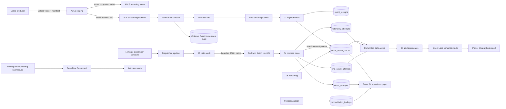
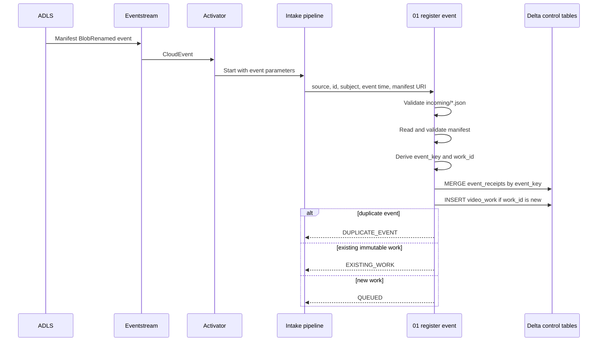
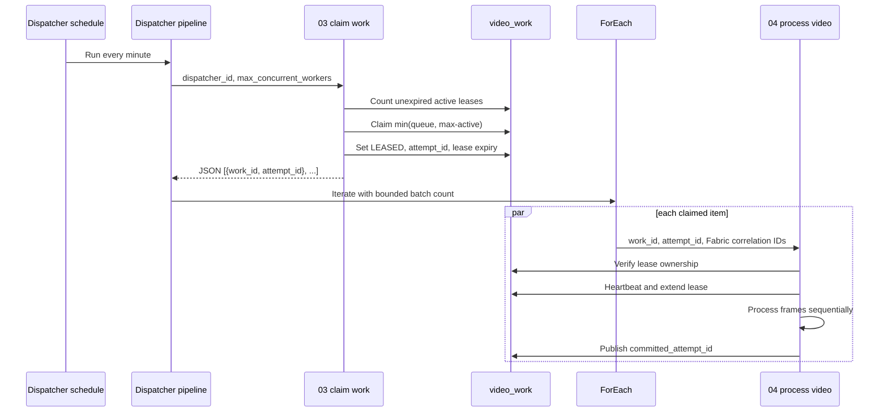
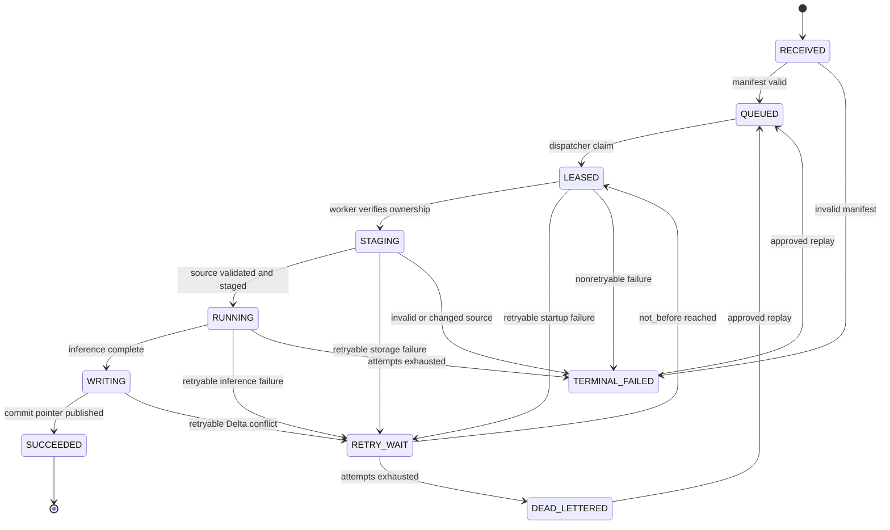
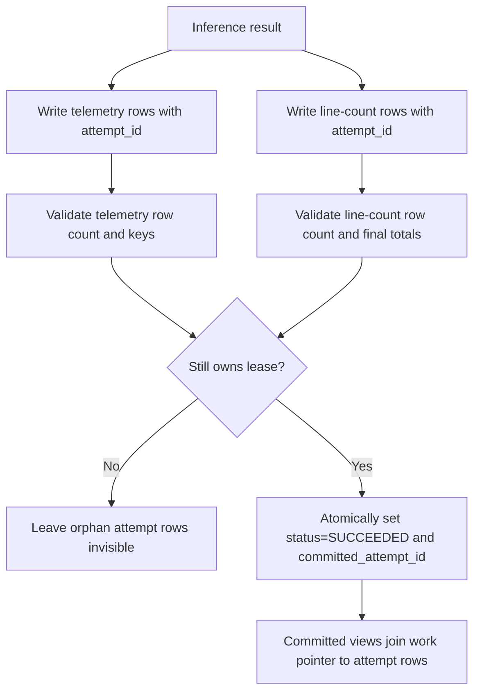
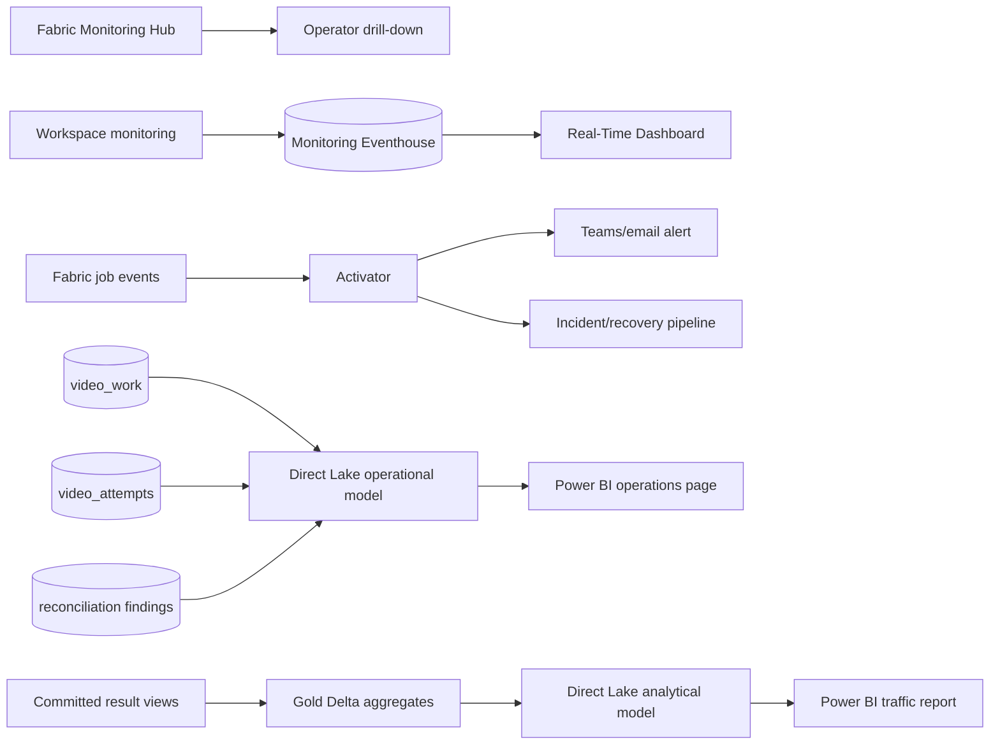

# Microsoft Fabric implementation plan

This folder defines the production implementation for an event-driven
people-counting platform on Microsoft Fabric. It supports two operating modes
with one control plane:

1. a one-time backfill of 200,000 video-hours in at most 30 days; and
2. a lower-volume, event-driven steady-state feed from ADLS Gen2.

The design assumes:

- producers upload a video under `staging/`, move the completed video into
  `incoming/`, then move its JSON manifest into `incoming/` last;
- the manifest is the authoritative source of camera, location, capture time,
  immutable asset version, and expected video metadata;
- Fabric-native compute is used;
- a Delta-backed intake queue and dispatcher enforce bounded concurrency; and
- capacity is selected only after a benchmark proves the required throughput.

The implementation provides deduplicated work and exactly-once **visible**
results. Azure/Fabric events and notebook execution remain at-least-once.

## Deployment placeholders

Values in angle brackets are environment-specific and must be replaced during
deployment:

| Placeholder | Meaning |
|---|---|
| `<environment>` | Environment name such as `dev`, `test`, or `prod` |
| `<workspace-name>` | Fabric workspace name |
| `<workspace-id>` | Fabric workspace GUID |
| `<lakehouse-name>` | Fabric Lakehouse name |
| `<lakehouse-id>` | Fabric Lakehouse item GUID |
| `<storage-account>` | ADLS Gen2 storage-account name |
| `<source-filesystem>` | ADLS filesystem/container containing footage |
| `<shortcut-name>` | Lakehouse shortcut name under `Files` |
| `<eventstream-stream-name>` | Stream name assigned in Eventstream |
| `<activator-source-name>` | Source name generated in Activator |
| `<manifest-file>` | Any valid test manifest filename |
| `<video-file>` | Any representative test video filename |
| `<partition-path>` | Environment-specific backfill partition prefix |
| `<bundle-manifest-sha256>` | SHA-256 of the deployed SDK bundle's `manifest.json`; constant for one deployed release, not one video |

Examples must not depend on a particular tenant, GUID, file name, or measured
frame count. Obtain OneLake ABFS identifiers from shortcut **Properties** and
configure them separately for every environment.

## Artifact map

Run or deploy the notebooks in this order:

| Notebook | Pipeline role | When it runs |
|---|---|---|
| [`00_bootstrap_lakehouse.ipynb`](./00_bootstrap_lakehouse.ipynb) | Creates control, attempt, output, benchmark, and gold tables plus committed-output views | Once per environment and after compatible schema releases |
| [`01_register_event.ipynb`](./01_register_event.ipynb) | Validates an ADLS manifest event and registers a deduplicated `QUEUED` work item | Once for every matching storage event |
| [`02_register_backfill.ipynb`](./02_register_backfill.ipynb) | Bulk-registers historical manifests without bypassing the normal queue | Once per backfill partition |
| [`03_claim_work.ipynb`](./03_claim_work.ipynb) | Claims no more than the available worker slots and returns a JSON work batch | Every dispatcher pipeline run |
| [`04_process_video.ipynb`](./04_process_video.ipynb) | Owns a lease, processes one video sequentially, writes attempt-scoped output, and publishes the committed attempt | Once per claimed work item |
| [`05_watchdog_recovery.ipynb`](./05_watchdog_recovery.ipynb) | Requeues expired retryable leases and dead-letters exhausted work | Every five minutes |
| [`06_reconcile_publication.ipynb`](./06_reconcile_publication.ipynb) | Detects ledger/output/job-correlation anomalies and records reconciliation findings | Every 15 minutes and after releases |
| [`07_build_gold_aggregates.ipynb`](./07_build_gold_aggregates.ipynb) | Builds minute, hour, camera, and operational aggregates for Direct Lake reports | Incrementally after committed work |
| [`08_capacity_benchmark.ipynb`](./08_capacity_benchmark.ipynb) | Measures processing speed and calculates the minimum parallelism for the 30-day target | Before selecting capacity and after model/runtime changes |
| [`09_maintain_delta.ipynb`](./09_maintain_delta.ipynb) | Removes expired uncommitted output and runs reviewed Delta optimization/vacuum | Daily or weekly according to retention policy |
| [`10_replay_work.ipynb`](./10_replay_work.ipynb) | Audits and requeues one terminal/dead-lettered work item | Operator-approved incident recovery |
| [`11_validate_observability.ipynb`](./11_validate_observability.ipynb) | Validates running-job, queue, burn-down, flow, and camera-level reporting data | Before dashboard release and during incident diagnosis |
| [`12_plan_gold_refresh.ipynb`](./12_plan_gold_refresh.ipynb) | Discovers date partitions changed within a lookback window for gold refresh | At the start of every gold-refresh pipeline run |

The earlier
[`fabric_retry_safe_pipeline.ipynb`](../fabric_retry_safe_pipeline.ipynb) is a
useful single-run prototype. Do not deploy it alongside this control plane: it
uses a pipeline run ID as work identity, has no exclusive lease, overwrites
attempt history, and publishes across multiple Delta tables without a commit
pointer.

## 1. End-to-end architecture



### Why storage events do not invoke inference directly

Fabric event delivery is at-least-once and does not provide a hard global
worker limit. A fast intake notebook durably records the event and returns.
The dispatcher then admits work according to measured capacity. This keeps
event bursts from starting an unbounded number of model-heavy notebooks.

## 2. Producer and manifest contract

### Required publication sequence

1. Upload `staging/<asset-version>/<name>.mp4`.
2. Upload `staging/<asset-version>/<name>.json`.
3. Complete multipart/block upload and calculate the final size, ETag/version,
   and required SHA-256.
4. Move the video to `incoming/<yyyy>/<mm>/<dd>/<asset-version>/<name>.mp4`.
5. Move the manifest to the same `incoming/` folder **last**.
6. Never mutate an object in `incoming/`. Corrections use a new
   `asset_version`.

The Eventstream/Activator rule filters for JSON files under `incoming/`.
Therefore a manifest event means the referenced video is ready.

### Manifest version 1

```json
{
  "schema_version": 1,
  "asset_id": "camera-17_20260917T210000Z_0001",
  "asset_version": "01K5EDQ4AJ7MYW6W8F6Y8B4SCP",
  "video_uri": "abfss://<source-filesystem>@<storage-account>.dfs.core.windows.net/incoming/2026/09/17/<asset-version>/<video-file>",
  "source_etag": "0x8DEE...",
  "expected_size_bytes": 2489912034,
  "expected_sha256": "required-lowercase-hex-sha256",
  "camera_id": "camera-17",
  "location_id": "north-entrance",
  "captured_at_utc": "2026-09-17T21:00:00Z",
  "camera_timezone": "America/Denver",
  "counting_line": [0, 540, 1919, 540],
  "content_type": "video/mp4",
  "duration_seconds": 1800.0
}
```

Required fields are `schema_version`, `asset_id`, `asset_version`,
`video_uri`, `source_etag`, `expected_size_bytes`, `camera_id`,
`location_id`, `captured_at_utc`, `camera_timezone`, `counting_line`, and
`expected_sha256`. Reversing the counting-line endpoints reverses `in` and
`out`.

Logical identities:

```text
event_key = SHA256(cloud_event_source + "\n" + cloud_event_id)
work_id   = SHA256(normalized_video_uri + "\n" + asset_version)
attempt_id = a new UUID for every lease claim
```

`event_key` suppresses duplicate delivery. `work_id` suppresses repeat work
for the same immutable asset. `pipeline_run_id` and `activity_run_id` are
correlation fields only.

The worker retains the producer ETag/version for provenance. Because Fabric
`notebookutils.fs.getProperties` is unavailable in PySpark notebooks, runtime
content validation uses the required byte size and SHA-256 after staging.

## 3. Control-plane workflows

### Event intake and deduplication



### Bounded dispatch and worker execution



### Work state machine



Allowed state changes must be conditional on the current state and, after
claim, `lease_owner_attempt_id`. A worker that loses its lease must stop and
must not publish.

## 4. Exactly-once visible publication

Delta transactions do not span the work, telemetry, and line-count tables.
The worker therefore writes immutable attempt-scoped output first and commits
visibility by updating one `video_work` row.



Readers must use the committed views created by
[`00_bootstrap_lakehouse.ipynb`](./00_bootstrap_lakehouse.ipynb), never the
attempt tables directly.

## 5. Delta data contracts

All timestamps are UTC.

Columns described as required in the contracts below are enforced by the
registration and worker notebooks. The bootstrap creates tables through the
DataFrame Delta writer instead of interpolated `CREATE TABLE` SQL, and removes
column-level `NOT NULL` from its schema strings for Fabric Runtime
compatibility. The resulting physical Delta columns are nullable.

### Control tables

#### `people_counter_event_receipts`

One row per unique CloudEvent.

```text
event_key PK, event_source, event_id, event_type, event_time, subject,
manifest_uri, work_id, received_at, registration_status, pipeline_run_id,
error_type, error_message
```

#### `people_counter_video_work`

One mutable current-state row per immutable video version.

```text
work_id PK, asset_id, asset_version, source_uri, manifest_uri, source_etag,
expected_size_bytes, expected_sha256, camera_id, location_id,
captured_at_utc, camera_timezone, duration_seconds, priority,
status, received_at, queued_at, not_before_at, attempt_count, max_attempts,
lease_owner_attempt_id, lease_acquired_at, lease_expires_at,
lease_dispatcher_id, last_heartbeat_at, committed_attempt_id, completed_at,
last_error_category, last_error_type, last_error_message,
config_json, config_sha256
```

#### `people_counter_dispatcher_leases`

A single `global` row serializes the short claim transaction. This prevents
overlapping scheduled or manually started dispatchers from jointly exceeding
the worker limit. The mutex is released immediately after claims are
materialized; it does not serialize video processing.

#### `people_counter_registration_leases`

A pre-seeded single-row mutex serializes the short event/backfill registration
transaction. Delta tables do not enforce primary-key uniqueness, so the
mutex, post-write cardinality checks, and immutable-field comparisons are
required to prevent concurrent duplicate `event_key` or `work_id` rows.
Keep backfill manifest partitions small enough to finish inside the
registration lease.

#### `people_counter_video_attempts`

One durable row per attempt. Attempts are never reused or deleted by a retry.

```text
attempt_id PK, work_id, dispatcher_id, pipeline_run_id, activity_run_id,
fabric_job_instance_id, sdk_version, bundle_manifest_sha256, config_sha256,
status, claimed_at, staging_started_at,
inference_started_at, writing_started_at, completed_at, last_heartbeat_at,
input_sha256, source_size_bytes, source_duration_seconds, source_fps,
total_source_frames, processed_frames, effective_sample_fps,
processing_seconds, distinct_people, line_in_count, line_out_count,
retryable, error_category, error_type, error_message
```

#### `people_counter_replay_requests`

An append-only audit record for every operator-approved replay:

```text
replay_id PK, work_id, requested_by, reason, requested_at,
previous_status, applied_at, capture_date
```

### Attempt output tables

`people_counter_telemetry_attempts` is keyed by
`(work_id, attempt_id, person_id)`.

In addition to the SDK telemetry fields it stores:

```text
camera_id, location_id, captured_at_utc, person_entry_at_utc,
person_exit_at_utc, recorded_at
```

`people_counter_line_count_attempts` is keyed by
`(work_id, attempt_id, frame)`.

In addition to the SDK line-count fields it stores:

```text
camera_id, location_id, captured_at_utc, observed_at_utc, recorded_at
```

To keep the 200,000-hour backfill tractable, the worker persists rows where a
crossing occurred plus the final cumulative checkpoint for every video. It
does not persist zero-change rows for every sampled frame. This preserves
event-time flow charts and final-total reconciliation while avoiding roughly
2.16 billion line rows at a 3 FPS sample rate.

Tracker `person_id` values are scoped to one attempt/video. They are not
global human identities and must not be deduplicated across cameras.

### Operational and analytical tables

```text
people_counter_reconciliation_findings
people_counter_processing_benchmarks
people_counter_gold_flow_minute
people_counter_gold_flow_hour
people_counter_gold_video
people_counter_gold_operations_hour
```

Partition large attempt/output tables by a derived capture date, not by
high-cardinality `work_id`.

## 6. Pipeline implementation in Fabric

Create separate Fabric workspaces for development, test, and production.
Create one Lakehouse per environment and attach it as the default Lakehouse
to every notebook.

### 6.1 Environment and SDK

1. From a host matching the Fabric runtime, build the CPU bundle:

   ```bash
   uv run python scripts/build_sdk_bundle.py cpu
   ```

2. In Fabric, create an **Environment** named
   `people-counter-<environment>`.
3. Upload every wheel from the bundle's `wheels/` directory under custom
   libraries.
4. Publish the Environment.
5. Select the Environment in each notebook.
6. Pin the Environment and notebook to the tested Fabric runtime. Do not
   silently upgrade during the backfill.
7. Record the SDK version and bundle manifest SHA-256 in every attempt.

Fabric-native compute is a hard constraint. Do not start the backfill until
[`08_capacity_benchmark.ipynb`](./08_capacity_benchmark.ipynb) proves that an
available capacity can finish with headroom.

Fabric Spark currently documents CPU/memory node families only; it does not
document a native GPU Spark pool. This implementation therefore rejects GPU
device settings. Custom Spark pools support at most 200 nodes, and Spark
admission is core-based/FIFO. Queued jobs expire after 24 hours, while jobs
submitted during capacity throttling can be rejected instead of queued.
Treat every one of these as a benchmark and alerting constraint, not as
capacity headroom.

### 6.2 Lakehouse bootstrap

1. Create the environment Lakehouse named `<lakehouse-name>`.
   Fabric Lakehouse names can contain only letters, numbers, and underscores.
2. Import the repository notebooks as Fabric notebook items:
   - Open the target Fabric workspace.
   - From the workspace toolbar, select **Import** and then **Notebook**.
     Depending on the current Fabric navigation, this entry can also appear
     under **New item** or the Data Engineering home page.
   - Upload all `.ipynb` files from this [`notebooks/fabric/`](./) folder.
     Fabric supports importing standard Jupyter `.ipynb` files and creates
     one Fabric notebook item per file.
   - Keep the numeric prefixes and names, such as
     `00_bootstrap_lakehouse` and `01_register_event`, so the pipeline
     instructions match the Fabric items.
   - Open each imported notebook and locate the code cell containing its
     uppercase configuration variables.
   - Open that cell's **...** menu and select **Toggle parameter cell**.
     Imported Jupyter `tags: ["parameters"]` metadata does not reliably
     activate Fabric parameter injection by itself.
   - Confirm the cell displays Fabric's parameter-cell indicator and that
     exactly one code cell is marked as the parameter cell.
   - Save the notebook before using it in a Notebook pipeline activity.
3. Attach the Lakehouse to **every imported notebook**:
   - Open the notebook.
   - In the Lakehouse explorer, select **Add lakehouse**.
   - Select **Existing lakehouse**, choose
     `people_counter_<environment>`, and add it.
   - Pin it or select **Set as default** so it is the notebook's default
     Lakehouse.
   - Save the notebook and confirm the default Lakehouse remains attached
     after reopening it.
4. Select the published `people-counter-<environment>` Environment for every
   notebook. This is required for the worker/benchmark package and keeps all
   notebook runtimes consistent.
5. Run [`00_bootstrap_lakehouse.ipynb`](./00_bootstrap_lakehouse.ipynb).
6. Verify every expected Delta table and committed view from the SQL
   analytics endpoint.
7. Create the tenant-validated ADLS service-principal connection:
   - In the Fabric header, select the **Settings** gear.
   - Open **Manage connections and gateways -> Connections -> New -> Cloud**.
   - Select the Azure Data Lake Storage Gen2/Azure Storage connection type
     used for `<storage-account>`.
   - Name it `pc_adls_service_principal_<environment>`.
   - Set the storage endpoint/account to `<storage-account>`.
   - For **Authentication method**, select **Service principal**.
   - Enter the tenant ID, client/application ID, and client secret. The
     development environment successfully used the same service principal
     created for the workspace identity, with a separately created secret.
   - Enable **Allow Code-First Artifacts like Notebooks to access this
     connection (Preview)**.
   - Create/save the connection.
   - Return to every Data Pipeline Notebook activity, open **Settings ->
     Connection**, select **Refresh**, and choose
     `pc_adls_service_principal_<environment>`.

   The workspace-identity authentication option shown by this tenant did not
   provide working Azure Storage access for the raw external
   `notebookutils.fs` path. The service-principal connection above is the
   tested configuration. Without an explicit activity Connection, Fabric can
   fall back to the pipeline's last-modified user; do not rely on that mutable
   human identity in production. The Eventstream payload's
   `identity=$superuser` value is also unrelated to notebook execution.

   Reusing the workspace identity's service principal with a client secret
   changes it from a fully secretless operational assumption to a manually
   credentialed principal. Record the secret owner and expiration, alert
   before expiry, rotate it through the Fabric connection, and never place it
   in notebook code, pipeline parameters, source control, or output logs. A
   separately managed application service principal is preferable if
   organizational policy requires clear separation from Fabric-managed
   workspace-identity lifecycle.
8. Grant the selected service principal ADLS data-plane access:
   - In Azure portal, open storage account `<storage-account>`.
   - Open **Access control (IAM) -> Add -> Add role assignment**.
   - Select the **Storage Blob Data Reader** role. Azure subscription
     `Reader`, resource-group `Contributor`, and `Storage Account
     Contributor` do not grant blob data access.
   - For **Assign access to**, choose **User, group, or service principal**,
     then locate the service principal by application ID.
   - Scope it to `<source-filesystem>` when the portal supports
     filesystem/container-scoped IAM; otherwise scope it to the storage
     account.
   - Wait for role-assignment propagation, then run the access verification
     below.

   With ADLS hierarchical namespace, Azure RBAC `Storage Blob Data Reader`
   grants read/list access without additional path ACLs. If policy requires
   ACL-only access instead, grant execute (`--x`) on the container root and
   every parent directory, and read (`r--`) on the manifest/video files.
   Prefer RBAC here because the worker must read many historical paths.

   If the storage account firewall blocks public network access, direct
   external `abfss://` access requires additional networking validation.
   Trusted workspace access requires purchased Fabric F capacity and is not
   supported on Trial capacity.

### 6.2.1 ADLS shortcut data path

This tenant can read ADLS data through a OneLake shortcut but cannot read the
raw external
`abfss://<source-filesystem>@<storage-account>.dfs.core.windows.net/...` path from the
notebook runtime. The shortcut is therefore the supported data path; original
Azure URIs remain event/provenance metadata.

1. Open `people_counter_<environment>` in Lakehouse view.
2. Under **Files**, select **... -> New shortcut**.
3. Select **Azure Data Lake Storage Gen2**.
4. Enter:

   ```text
   https://<storage-account>.dfs.core.windows.net
   ```

5. Select the validated service-principal connection.
6. Select the `<source-filesystem>` filesystem/container root.
7. Name the shortcut `<shortcut-name>`.
8. Obtain each environment's authoritative OneLake ABFS root from the
   shortcut's **Properties**. The tested development root is:

   ```text
   abfss://<workspace-id>@onelake.dfs.fabric.microsoft.com/<lakehouse-id>/Files/<shortcut-name>
   ```

9. Verify:

   ```python
   import notebookutils

   shortcut_root = (
       "abfss://<workspace-id>"
       "@onelake.dfs.fabric.microsoft.com/"
       "<lakehouse-id>/Files/<shortcut-name>"
   )
   print(
       notebookutils.fs.head(
           f"{shortcut_root}/incoming/<manifest-file>",
           1024 * 1024,
       )
   )
   ```

10. Event-to-shortcut mapping is:

    ```text
    https://<storage-account>.dfs.core.windows.net/<source-filesystem>/<path>
    -> <shortcut ABFS root>/<path>
    ```

    The mapper validates the exact scheme, host, container, and path and
    rejects query strings, fragments, traversal, encoded separators, and
    empty relative paths.
11. Keep Azure Blob Storage as the Eventstream source. OneLake does not emit
    events for shortcut-backed data, but Azure Storage remains the event
    producer.
12. Continue staging videos locally. The worker copies from:

    ```text
    /lakehouse/default/Files/<shortcut-name>/<path>
    ```

    to `/tmp`, then opens the staged file with OpenCV. This avoids the
    documented `notebookutils.fs.cp` limitation for shortcuts targeting an
    ADLS container root. Direct OpenCV use of the shortcut mount remains a
    benchmark candidate, not the production default.

Direct OpenCV access to the OneLake `abfss://` URI was tested in the
development Fabric runtime and failed `VideoCapture.isOpened()`. Do not pass
OneLake or external ABFS URIs directly to OpenCV. Validate the production
staging path instead:

```python
import cv2
import shutil
from pathlib import Path

shortcut_name = "<shortcut-name>"
video_file = "<video-file>"
shortcut_source = (
    Path("/lakehouse/default/Files")
    / shortcut_name
    / "incoming"
    / video_file
)
staged_video = Path("/tmp") / video_file

if not shortcut_source.is_file():
    raise FileNotFoundError(shortcut_source)

shutil.copyfile(shortcut_source, staged_video)

capture = cv2.VideoCapture(str(staged_video))
if not capture.isOpened():
    raise RuntimeError(f"Could not open staged video: {staged_video}")

frames = 0
try:
    while True:
        success, frame = capture.read()
        if not success:
            break
        frames += 1
finally:
    capture.release()
    staged_video.unlink(missing_ok=True)

print(f"Decoded {frames} frames")
```

This is the flow implemented by
[`04_process_video.ipynb`](./04_process_video.ipynb): derive a
traversal-safe shortcut-mounted path, copy to attempt-local `/tmp`, verify
size and SHA-256, process the local file, and remove it in `finally`.
A development validation copied a representative MP4 through this path and
OpenCV decoded it to end-of-stream. The resulting frame count depends on the
selected video and is not an acceptance constant. Benchmark staging
throughput and local disk pressure across representative formats, sizes, and
concurrent workers before approving backfill concurrency. Direct shortcut URI
decoding is not a supported candidate for this runtime.

After toggling or changing a parameter cell, reopen the corresponding
pipeline Notebook activity and reselect/refresh the notebook so Fabric
reloads its Base parameters. Verify the expressions and types before running
the pipeline.

### 6.3 ADLS Eventstream and Activator data connection

Azure Blob/ADLS events are not a storage inventory and are not replayed for
objects that existed before the Eventstream connected. Existing video files
therefore do not populate the preview. This design also triggers on a newly
moved JSON manifest, not on the video object itself.

1. Confirm the source account is ADLS Gen2/StorageV2 and supported in the
   Fabric region.
2. In Fabric Real-Time Hub, add Azure Blob Storage events for the production
   account and container. Once created, do not use the source-node pencil to
   change the account or event-link configuration; Fabric does not support
   updating this event link in place.
3. The required event type is `Microsoft.Storage.BlobRenamed` because the
   producer moves the completed manifest from `staging/` to `incoming/`. A
   hierarchical-namespace rename is not a `BlobCreated` event. If the source
   wizard does not offer an event-type selector, keep the source unchanged
   and filter `type` downstream after the first event supplies a schema.
4. Before adding a Filter node, generate a live schema-bootstrap event:
   - Start/connect the Eventstream source and leave the canvas open.
   - Create a valid manifest under `staging/<asset-version>/<name>.json` for
     one of the existing videos.
   - Rename/move that manifest into
     `incoming/<yyyy>/<mm>/<dd>/<asset-version>/<name>.json`.
   - Select the source or stream node, set preview to **Last hour**, and
     refresh. Wait until the CloudEvent fields appear.
   - Only then connect/configure the Filter nodes. The Filter field selector
     stays empty while the upstream stream has no inferred schema.
5. Add three Filter nodes in series because the Eventstream Filter operator
   allows only one condition per node. The serial nodes implement a logical
   AND:

   ```text
   filter_blob_renamed:
   type equals:
   Microsoft.Storage.BlobRenamed

   filter_incoming_manifests:
   subject starts with:
   /blobServices/default/containers/<container>/blobs/incoming/

   filter_json_manifests:
   subject ends with:
   .json
   ```

   Connect them as:

   ```text
   Azure Blob Storage events
     -> filter_blob_renamed
     -> filter_incoming_manifests
     -> filter_json_manifests
     -> Activator/Eventhouse destination
   ```

   Do not trigger for videos; the manifest-last move is the readiness event.

6. Verify the output of `filter_json_manifests`; this is not another
   transformation step:
   - Select `filter_json_manifests`.
   - Open its data preview and confirm that the event still contains
     `source`, `id`, `type`, `time`, `subject`, and
     `data.destinationUrl`.
   - If Fabric displays nested properties as flattened columns, the last
     field might appear simply as `destinationUrl`.
   - Do not add a **Manage fields** operation that removes these values.

   `destinationUrl` is the final `incoming/...json` path after the rename.
   Do not use `sourceUrl`, which points to the old pre-rename path. The
   observed Fabric event can include an `eTag`, but that is the manifest
   blob's ETag—not the referenced video's ETag. The referenced video ETag and
   SHA-256 come from the manifest content.
7. Add the Activator destination shown in the Eventstream UI:

   | Field | Value |
   |---|---|
   | **Destination name** | `to_pc_manifest_arrival_activator` |
   | **Workspace** | `<workspace-name>` |
   | **Activator** | Select **Create new**, then name it `pc_manifest_arrival_activator` |
   | **Input data format** | `Json` |
   | **Activate ingestion after adding the data source** | Checked |

   Select **Save**. The destination name identifies the Eventstream
   connection; the Activator name identifies the Fabric item created in the
   workspace.
8. Stop here after saving the destination. At this point Eventstream is
   delivering filtered manifest events into the Activator item, but no rule
   invokes a pipeline yet.

If the live manifest move still produces no preview:

1. Confirm the move happened **after** the Eventstream source was connected.
2. Confirm `BlobRenamed` was selected and inspect the source-node monitoring
   errors before configuring downstream operators.
3. Confirm the storage account is StorageV2 with hierarchical namespace
   enabled and the move uses a file rename rather than copy-and-delete.
4. Confirm the Fabric workspace capacity region supports the Azure Blob
   Storage events connector. It is not supported in Central US, Germany West
   Central, South-Central US, West US2, West US3, or West India.
5. Check tenant/workspace private-link and outbound-access policies. Blocking
   public access can prevent Azure event delivery unless the documented
   Real-Time Events connectivity is configured.
6. Temporarily remove downstream Filter/Activator nodes and verify the raw
   source first. Re-add the three serial filters only after raw events are
   visible.

#### Recover `Update event link is not supported`

This publish error means Fabric is trying to mutate the Azure Storage event
link behind the existing source:

```text
dataSourceErrors:
  <source>: Update event link is not supported.
```

The filter or Activator edit usually exposes the problem, but the failing
resource is the Blob source link. Use this recovery order:

1. Copy the three filter expressions and Activator destination settings.
2. Discard the failed draft if Fabric offers that option, reopen the
   Eventstream, and confirm its previously published Live view still works.
3. In Edit mode, delete only the **Azure Blob Storage Events** source node and
   publish that deletion. Deleting and recreating is supported; updating the
   existing event link is not.
4. Add a new Azure Blob Storage Events source for
   `<storage-account>`. Configure the account once and publish it without
   reopening/saving the source settings.
5. Select **Stream events**, generate a new rename event, and confirm raw
   preview data.
6. Recreate/reconnect
   `filter_blob_renamed -> filter_incoming_manifests ->
   filter_json_manifests`.
7. Publish the filters before adding a destination.
8. Re-add the Activator destination, selecting the existing
   `pc_manifest_arrival_activator`, and publish again.

If deleting the source also removes its connected nodes, recreate those nodes
from the copied settings. If the source-only replacement still produces the
same error, create a new Eventstream in parallel from Real-Time Hub, validate
it end to end, and retire the old Eventstream only after the replacement is
live.

### 6.4 Event intake pipeline

The Activator does not run inside this pipeline. It is an external trigger
that invokes the pipeline after section 6.5 configures the rule.

Create `pc-event-intake`:

1. Create a new Fabric Data Pipeline named `pc-event-intake`.
2. On the pipeline canvas, select the blank canvas, open **Settings**, and
   create these pipeline parameters. Use type **String** and leave the
   default value empty; the Activator supplies them at runtime:

   ```text
   EVENT_SOURCE
   EVENT_ID
   EVENT_TYPE
   EVENT_TIME
   SUBJECT
   MANIFEST_URI
   ```
3. Add one Notebook activity targeting
   the imported `01_register_event` Fabric notebook item, sourced from
   [`01_register_event.ipynb`](./01_register_event.ipynb). If it does not
   appear in the activity selector, return to section 6.2, import/save it,
   and attach the default Lakehouse first.
   In **Settings -> Connection**, select
   `pc_adls_service_principal_<environment>`. If the dropdown is empty,
   create the centrally managed service-principal cloud connection from
   section 6.2, enable code-first Notebook access, then select **Refresh**.
4. Select the Notebook activity, open **Settings**, and find **Base
   parameters**. For each event/correlation parameter below, select its
   **Value** field, choose **Add dynamic content**, and enter the expression
   exactly as shown. `Expression` is not a parameter type. Set **Type** to
   `String` and put the expression in **Value** without surrounding quotes:

   | Notebook base parameter | Type | Value |
   |---|---|---|
   | `EVENT_SOURCE` | `String` | `@pipeline().parameters.EVENT_SOURCE` |
   | `EVENT_ID` | `String` | `@pipeline().parameters.EVENT_ID` |
   | `EVENT_TYPE` | `String` | `@pipeline().parameters.EVENT_TYPE` |
   | `EVENT_TIME` | `String` | `@pipeline().parameters.EVENT_TIME` |
   | `SUBJECT` | `String` | `@pipeline().parameters.SUBJECT` |
   | `MANIFEST_URI` | `String` | `@pipeline().parameters.MANIFEST_URI` |
   | `PIPELINE_RUN_ID` | `String` | `@pipeline().RunId` |

   Configure the remaining base parameters as literal values, not dynamic
   expressions:

   | Notebook base parameter | Type | Literal value |
   |---|---|---|
   | `DATABASE` | `String` | Empty; uses the attached default Lakehouse |
   | `TABLE_PREFIX` | `String` | `people_counter` |
   | `SOURCE_STORAGE_ACCOUNT` | `String` | `<storage-account>` |
   | `SOURCE_CONTAINER` | `String` | `<source-filesystem>` |
   | `SOURCE_SHORTCUT_ABFS_ROOT` | `String` | Environment shortcut ABFS root from section 6.2.1 |
   | `MAX_ATTEMPTS` | `Int` | `4` |
   | `PRIORITY` | `Int` | `100` |
   | `PIPELINE` | `String` | `rtdetr-osnet` |
   | `DEVICE_VARIANT` | `String` | `cpu` |
   | `DEVICE` | `String` | `cpu` |
   | `BATCH_SIZE` | `Int` | `1` |
   | `SAMPLE_FPS` | `Float` | `3.0` |
   | `DETECTION_THRESHOLD` | `Float` | `0.6` |
   | `USE_FP16` | `Bool` | `false` |
   | `DETECTOR_MODEL` | `String` | `r18` |
   | `CAMERA_MOTION_COMPENSATION` | `String` | Empty; parsed as null |

   If Fabric already populated these literal defaults from the notebook's
   tagged parameter cell, verify them rather than adding duplicate rows.
5. Do not validate the notebook by running its registration cell
   interactively with blank defaults. Pipeline parameters are injected only
   when the Notebook activity runs. For an interactive smoke test, populate
   the tagged parameter cell from one Eventstream preview event, rerun that
   cell, and then run the registration cell.
6. In the Notebook activity **General** settings, use this initial production
   policy:

   | Setting | Value |
   |---|---|
   | **Timeout** | `0.00:30:00` (30 minutes; format is `D.HH:MM:SS`) |
   | **Enable retries** | Checked |
   | **Retry** | `3` additional attempts |
   | **Retry interval type** | `Increasing Delay` |
   | **Retry interval (sec)** | `60` |
   | **Max retry interval (sec)** | `900` |
   | **Retry conditions (preview)** | Leave empty initially |

   An empty condition list means retry on every failure. This is intentional
   for the initial deployment because Fabric Notebook activities can wrap
   Python, Spark, storage, capacity, and Delta errors under tenant/runtime-
   specific codes. `01_register_event` is idempotent: duplicate events merge
   by `event_key`, and deterministic validation failures remain recorded as
   `REJECTED`. A malformed manifest can therefore consume the three retries,
   but it cannot create duplicate work.

   The 30-minute timeout includes Spark admission/session startup, manifest
   read, validation, and Delta writes. It is not a video-processing timeout.
   No additional action is required on this activity-settings screen. Before
   production, complete the 20-minute intake-duration alert described in
   section 8 under **Alerts**. Sustained queueing near 30 minutes means
   capacity/admission needs correction rather than a larger timeout.
7. After test runs expose the actual error envelope in your tenant, you may
   enable **Retry conditions (preview)** to avoid retrying deterministic
   validation failures. Conditions determine which failures are retried; join
   these rows with **Or**, not **And**:

   | Field | Operator | Value |
   |---|---|---|
   | `Failure type` | `Contains` | `System error` |
   | `Error code` | `Contains` | `429` |
   | `Error code` | `Contains` | `430` |
   | `Error code` | `Contains` | `500` |
   | `Error code` | `Contains` | `502` |
   | `Error code` | `Contains` | `503` |
   | `Error code` | `Contains` | `504` |
   | `Error message` | `Contains` | `Concurrent` |
   | `Error message` | `Contains` | `temporarily unavailable` |
   | `Error message` | `Contains` | `timed out` |

   Do not add conditions speculatively. First force one representative
   storage failure, Delta conflict, capacity failure, and invalid manifest;
   inspect each Notebook activity's **Output** in Monitoring Hub, then keep
   only conditions that match the observed transient failures. Confirm that
   an invalid manifest containing `ValueError`, `Unsupported manifest`, or
   `REJECTED` does not match. Fabric waits for the retry interval before
   evaluating a condition, so a nonmatching failure can still incur one
   delay.
8. Save the pipeline so it becomes selectable by the Activator rule.
9. After the complete event flow is validated, add terminal-failure alerting
   for this pipeline:
   - Open **Real-Time hub** and select **Fabric events**.
   - Find **Job events**, select **...**, and choose **Set alert**.
   - For **Rule name**, enter `alert_pc_event_intake_failed`.
   - Under **Monitor**, choose **Select source events**.
   - For **Event types**, select
     `Microsoft.Fabric.ItemJobFailed`.
   - For **Event source**, select **By item**.
   - Select `<workspace-name>`.
   - For **Item**, select the `pc-event-intake` Data Pipeline.
   - Do not add another status filter; the selected event type already means
     the item job failed, became stuck, or was canceled.
   - Save the source connection.
   - Under **Condition**, configure:

     | Field | Value |
     |---|---|
     | **Check** | `On each event when` |
     | **Grouping field** | Leave empty |
     | **When** | `__type` |
     | **Condition** | `Is equal to` |
     | **Value** | Select the failure type shown by the Activator schema; in the current UI this is `Microsoft.Fabric.JobEvents.ItemJobFailed` |

     The source is already restricted to `pc-event-intake` and the
     `ItemJobFailed` event type. Activator exposes the top-level CloudEvent
     field as `__type`. Do not select `jobType`: that field describes the
     workload operation, such as a pipeline or notebook run, rather than the
     event category. If another Fabric runtime displays
     `Microsoft.Fabric.ItemJobFailed` instead, use the exact `__type` value
     visible in that event preview. This predicate repeats the event-type
     check only because the current Activator UI requires a **When** field.
   - Under **Action**, choose one or both:
     - **Send email** to the operations distribution list.
     - **Teams → Channel post** to the operations team/channel.
   - Use a subject/headline such as:

     ```text
     [Fabric][<environment>] pc-event-intake failed
     ```

   - Include the available job context fields in the notification:
     `JobInstanceId`, workspace, item, event time, failure details, and
     invocation type.
   - If Fabric asks where to save the rule, create or select an Activator
     named `pc_job_failure_activator`.
   - Save and start/activate the rule.

   Validate it in development before production:
   - Temporarily set the intake Notebook activity retry count to `0` so the
     test completes quickly.
   - Manually run `pc-event-intake` with a unique `EVENT_ID` and a
     `MANIFEST_URI` that points to a development-only invalid manifest.
   - Confirm the pipeline fails, a `Microsoft.Fabric.ItemJobFailed` event is
     produced, and the notification contains the job correlation fields.
   - Restore the retry count to `3`.
   - Keep the rejected event receipt as an audit record, or remove it only
     according to the approved development-data cleanup process.

#### Resolve ADLS `403 AccessDeniedException`

An error from `notebookutils.fs.head` containing:

```text
403 HEAD ... action=getStatus
This request is not authorized to perform this operation using this permission
```

means event mapping and URI normalization succeeded, but the pipeline
execution identity cannot read the manifest. It is not fixed by retrying:

1. Stop the manifest-arrival Activator rule temporarily so it does not create
   repeated failed pipeline runs.
2. Configure the `pc-event-intake` Notebook activity **Connection** to use
   `pc_adls_service_principal_<environment>`, then complete the
   `Storage Blob Data Reader` assignment from section 6.2 for that service
   principal. If no Connection override is configured, granting the role to
   the pipeline's last-modified user is only a temporary development
   fallback.
3. Wait for Azure role propagation.
4. Validate this exact path by running a Notebook activity with the same
   service-principal Connection:

   ```python
   import notebookutils

   shortcut_root = (
       "abfss://<workspace-id>@onelake.dfs.fabric.microsoft.com/"
       "<lakehouse-id>/Files/<shortcut-name>"
   )
   notebookutils.fs.head(
       f"{shortcut_root}/incoming/<manifest-file>",
       1024 * 1024,
   )
   ```

5. If it still returns 403, check whether the role was assigned to the wrong
   user/principal or has an ABAC condition. If no RBAC data role is granted,
   verify ADLS ACL execute permission on `/` and `/incoming`, plus read
   permission on the file.
6. If authorization is correct but access still fails, inspect Storage
   firewall/private-endpoint and Fabric workspace outbound-access settings.
7. Restart the Activator rule only after `notebookutils.fs.head` returns the
   manifest text successfully.

### 6.5 Activator rule and pipeline action

Return to the Activator item created in section 6.3:

1. In `<workspace-name>`, open the Activator item
   `pc_manifest_arrival_activator`, then select the **Events** tab.
2. In **Explorer**, select the event source created by the Eventstream
   destination `to_pc_manifest_arrival_activator`. The center pane should
   show **Live feed**, **Analytics**, and **Manage source** tabs. Confirm that
   recent events contain `api=RenameFile` and the final `destinationUrl`.

   Fabric generates `<activator-source-name>` independently from
   `<eventstream-stream-name>` and the operator names. Do not infer
   destination placement from the Activator source name; verify the edge on
   the Eventstream canvas.

   Do not select the Job-events hierarchy
   `pc-event-intake -> <workspace-name> event ->
   alert_pc_event_intake_failed`; that source monitors pipeline failures and
   is separate from manifest arrivals. If Explorer shows only that hierarchy,
   the Eventstream Activator destination is not yet connected/published to
   this Activator. Return to the Eventstream and add or repair
   `to_pc_manifest_arrival_activator` before continuing.

   **Do not start a manifest rule whose Definition pane shows
   `Monitor -> Event -> <workspace-name> event`.** That is the job-events
   source. Pointing its action back to `pc-event-intake` could create a
   feedback loop in which pipeline job events start more pipeline runs.
3. With the manifest-arrival event source selected, choose **New rule** from
   either the top Events toolbar or the **New rule** button in the Live feed
   pane. If Fabric has already opened an empty rule definition pane, use that
   pane instead.
4. For **Rule name**, enter:

   ```text
   run_pc_event_intake_on_manifest_renamed
   ```

5. In **Definition -> Condition -> Condition 1**, open **Operation**. The
   current UI groups operations under Numeric change/state, Text
   change/state, Logical change/state, Common change, and Heartbeat. Select:

   | Field | Value |
   |---|---|
   | **Operation category** | `Heartbeat` |
   | **Operation** | `On every value` |

   Do not select **No presence of data**. `On every value` runs the action
   once for every event reaching the selected Activator source. No additional
   field, comparison, or value is required because the three serial
   Eventstream filters already restrict the source to renamed JSON manifests
   under `incoming/`.
6. Under **Action**, open the action dropdown shown in the UI and select
   **Run Pipeline** under **Run Fabric activities**. Do not select Email,
   Run Notebook, or Publish Business event for this rule.
7. In the OneLake catalog/item picker:
   - Select workspace `<workspace-name>`.
   - Select the Data Pipeline `pc-event-intake`.
   - Confirm the selection.
8. Select **Edit action** or expand the selected pipeline action. Add the six
   pipeline parameters below. The parameter names and type must exactly match
   the parameters created in section 6.4. For each **Value**, use the dynamic
   property picker/tag icon rather than typing a literal:

   | Pipeline parameter | Type | Dynamic event property |
   |---|---|---|
   | `EVENT_SOURCE` | `String` | `source` |
   | `EVENT_ID` | `String` | `id` |
   | `EVENT_TYPE` | `String` | `type` |
   | `EVENT_TIME` | `String` | `time` |
   | `SUBJECT` | `String` | `subject` |
   | `MANIFEST_URI` | `String` | `data.destinationUrl` |

   Select the original unprefixed Eventstream columns. Do not select
   Activator's `__source`, `__id`, `__type`, `__time`, or `__subject`
   wrapper metadata. For example, `__type` is
   `Microsoft.Fabric.EventstreamEvents.Custom`, not the original
   `Microsoft.Storage.BlobRenamed` type. In the current Activator source, the
   storage payload remains nested under `data`, so select
   `data.destinationUrl` exactly as displayed by the dynamic-property picker.
   Do not use `data.sourceUrl` or `data.sourceBlobUrl`; they identify the
   pre-rename object. The original `source` plus `id` is the event
   deduplication key.

   Each Value field should contain one dynamic-property token/chip. Fabric
   can serialize an automatic leading or trailing space around the resolved
   token value; this is safe because `01_register_event` calls `.strip()` on
   every event string. Do not type non-whitespace characters such as `@` or
   quotes before or after the token. After trimming,
   `MANIFEST_URI.value` must end exactly in `.json`; a value such as
   `" https://.../manifest.json "` is accepted, while
   `"https://.../manifest.json@"` is intentionally rejected.
9. Select **Save**.
10. Before starting, verify the Definition pane shows all three of these
   values:

   | Definition section | Required value |
   |---|---|
   | **Monitor -> Event** | `<activator-source-name>` created by `to_pc_manifest_arrival_activator` |
   | **Condition -> Operation** | `On every value` |
   | **Action -> Action** | `Run Pipeline` |

   Confirm destination placement on the Eventstream canvas: the connection
   must be `filter_json_manifests -> to_pc_manifest_arrival_activator`. The
   Activator source name can remain generated or retain an older stream name
   and is not evidence that filters were bypassed.

   If **Action -> Action** shows `Email`, stop/edit the rule, select
   **Run Pipeline**, select `pc-event-intake`, add the six parameter
   mappings, and select **Save and update**.
11. Select **Start** and confirm the rule status changes to **Running**.
12. Generate a **new** valid manifest rename after the Eventstream
   destination and rule are running. Activator does not replay the matching
   event previously used to infer the Eventstream schema.
13. Trace the new event in this order:
   - Activator source **Live feed** shows the event.
   - Rule **Analytics** shows at least one projected activation.
   - Rule **History** shows an action execution.
   - Monitoring Hub shows a `pc-event-intake` pipeline run.
14. If **Live feed** remains empty, troubleshoot the Eventstream destination
   connection and publish state; changing the rule condition cannot fix an
   empty Activator source.
15. If Live feed has an event but projected activations remain zero, confirm
   the rule is **Running** and its operation is **On every value**.
16. If projected activation exists but no pipeline run appears, inspect rule
   **History**, then verify the action is **Run Pipeline**, the selected item
   is `pc-event-intake`, and all six mappings use dynamic event properties.
17. Inspect the Notebook activity output:
   - A complete valid manifest should return `QUEUED` or `EXISTING_WORK`.
   - A smoke-test/invalid manifest should fail visibly as `REJECTED`.
   - A `FileNotFoundException` on the mapped OneLake shortcut path means the
     event references a destination object that no longer exists. Compare
     `EVENT_TIME`, `MANIFEST_URI`, and the shortcut contents; Activator
     **Test action** can reuse an older sampled event and does not recreate
     its file.
18. Use these exact names in development, test, and production so deployment
   comparisons and monitoring filters stay consistent. Activator-to-item
   parameter passing is currently Preview and supports scalar string,
   Boolean, and numeric parameters only.
19. Optionally route the unmodified event stream to Eventhouse for an
   independent ingress audit.
20. Upload and move one test video/manifest pair twice and verify two event
   receipts resolve to one work item.

A minimal placeholder manifest is sufficient to prove that rename events and
filters work, but it is not a valid processing manifest unless it contains
every required manifest-version-1 field. Replace smoke-test content with the
complete manifest contract before testing `01_register_event.ipynb`.

For the end-to-end validation, do not rely on an old sampled event:

1. Create `<manifest-file>` with a complete manifest under the producer's
   staging path.
2. Rename it once into
   `<source-filesystem>/incoming/<manifest-file>`.
3. Verify the exact mapped file exists before waiting for the pipeline:

   ```python
   import notebookutils

   shortcut_root = (
       "abfss://<workspace-id>@onelake.dfs.fabric.microsoft.com/"
       "<lakehouse-id>/Files/<shortcut-name>"
   )
   manifest_path = f"{shortcut_root}/incoming/<manifest-file>"

   assert notebookutils.fs.exists(manifest_path), manifest_path
   print(notebookutils.fs.head(manifest_path, 1024 * 1024))
   ```

4. Confirm the resulting pipeline Input has a recent `EVENT_TIME` and a
   `MANIFEST_URI` ending in that same `<manifest-file>`.
5. If using **Test action**, explicitly select the new event sample. Prefer a
   fresh live rename for the final test because sampled events may outlive
   their referenced blobs.

### 6.6 Dispatcher pipeline

Create `pc-dispatcher-00` with a one-minute fixed schedule. Fabric fixed
schedules require start and end dates, so choose a reviewed far-future end
date and alert before it expires:

1. Create these parameters on the `pc-dispatcher-00` pipeline before adding
   activities. Select the blank pipeline canvas, open **Settings ->
   Parameters**, and add:

   | Pipeline parameter | Type | Initial default |
   |---|---|---|
   | `MAX_CONCURRENT_WORKERS` | `Int` | `4` |
   | `CLAIM_LIMIT` | `Int` | `4` |
   | `LEASE_MINUTES` | `Int` | `30` |
   | `BUNDLE_MANIFEST_SHA256` | `String` | Empty for initial development; set to the deployed release hash before production |

   Do not create a `DISPATCHER_ID` pipeline parameter. Every pipeline run
   already has a unique `@pipeline().RunId`, which is the dispatcher ID.
   Start with these conservative defaults; replace the worker limits only
   after the capacity benchmark approves a higher value.
2. Add a Notebook activity to the canvas and name the activity `ClaimWork`.
   Target the imported `03_claim_work` Fabric notebook item, sourced from
   [`03_claim_work.ipynb`](./03_claim_work.ipynb).
   - Confirm the notebook's configuration cell is toggled as its parameter
     cell.
   - Confirm `<lakehouse-name>` is attached and pinned as its default
     Lakehouse.
   - In **Settings -> Connection**, select the environment's validated
     Notebook activity connection, then refresh/reselect the notebook if the
     Base parameters do not populate.
3. In `ClaimWork` **Settings -> Base parameters**, configure:

   | Notebook base parameter | Type | Value |
   |---|---|---|
   | `DISPATCHER_ID` | `String` | `@pipeline().RunId` |
   | `MAX_CONCURRENT_WORKERS` | `Int` | `@pipeline().parameters.MAX_CONCURRENT_WORKERS` |
   | `CLAIM_LIMIT` | `Int` | `@pipeline().parameters.CLAIM_LIMIT` |
   | `LEASE_MINUTES` | `Int` | `@pipeline().parameters.LEASE_MINUTES` |
   | `DATABASE` | `String` | Empty; uses the attached default Lakehouse |
   | `TABLE_PREFIX` | `String` | `people_counter` |

   For the first four rows, select the **Value** field, choose **Add dynamic
   content**, and enter the expression exactly as shown without quotes. The
   **Type** remains `String` or `Int`; `Expression` is not a type.
4. In the `ClaimWork` activity **General** settings, configure:

   | Setting | Value |
   |---|---|
   | **Timeout** | `0.00:30:00` |
   | **Enable retries** | Checked |
   | **Retry** | `3` |
   | **Retry interval type** | `Increasing Delay` |
   | **Retry interval (sec)** | `30` |
   | **Max retry interval (sec)** | `300` |
   | **Retry conditions (preview)** | Leave empty initially |

   `ClaimWork` is idempotent for one `DISPATCHER_ID`: a retry returns that
   dispatcher run's existing unexpired claims rather than allocating another
   batch.
5. Do not add a parsing activity. `ClaimWork` returns its result as a JSON
   string in the Notebook activity output, and the downstream expressions
   parse that string inline. Use this expected output path:

   ```text
   output.result.exitValue
   ```

   Its value is a JSON string shaped like:

   ```json
   {
     "dispatcher_id": "<pipeline-run-id>",
     "active_before": 0,
     "claimed_count": 1,
     "items": [
       {
         "work_id": "<work-id>",
         "attempt_id": "<attempt-id>"
       }
     ]
   }
   ```

   The expression that converts this string to the `items` array is:

   ```text
   @json(activity('ClaimWork').output.result.exitValue).items
   ```

   Do not test `ClaimWork` by itself while real work is queued: it would
   create leases without starting workers. Wire the complete flow first.
   After the first complete dispatcher run, open **View run history ->
   ClaimWork -> Output** and verify this property path. If the current tenant
   uses a different path, update the next two expressions before enabling the
   schedule.
6. Do not add an **If Condition**. Fabric does not support nesting a
   `ForEach` inside an `If Condition`. A top-level `ForEach` given an empty
   array performs zero iterations and completes successfully, so the extra
   condition is unnecessary.
7. Add a top-level **ForEach** activity directly on the pipeline canvas:
   - Name it `ForEachClaimedWork`.
   - Connect the green **On success** output of `ClaimWork` directly to
     `ForEachClaimedWork`.
   - In **Settings -> Items**, choose **Add dynamic content** and enter:

     ```text
     @json(activity('ClaimWork').output.result.exitValue).items
     ```

   Each iteration's `@item()` is one object containing `work_id` and
   `attempt_id`. If `items` is empty, `ForEachClaimedWork` runs zero child
   activities and the dispatcher succeeds as a no-op.
8. In `ForEachClaimedWork` **Settings**:
   - Turn **Sequential** off.
   - Set **Batch count** to the literal integer `4`.

   Yes: the sensible initial Batch count is the same numeric value as the
   `CLAIM_LIMIT` pipeline parameter. Fabric's Batch count field is a maximum
   concurrency setting, not the `CLAIM_LIMIT` expression itself, so enter
   `4`, not `@pipeline().parameters.CLAIM_LIMIT`.

   Keep these values aligned:

   ```text
   CLAIM_LIMIT pipeline default = 4
   ForEach Batch count          = 4
   MAX_CONCURRENT_WORKERS       = 4
   ```

   `CLAIM_LIMIT` controls how many new leases one dispatcher can create.
   Batch count controls how many claimed items that pipeline run can process
   concurrently. `MAX_CONCURRENT_WORKERS` limits active leases across
   dispatcher runs. If Batch count is lower than `CLAIM_LIMIT`, some claimed
   items wait inside the ForEach while their leases are already aging.

   After benchmarking, change `CLAIM_LIMIT` and Batch count together, keep
   both at or below `50`, and set `MAX_CONCURRENT_WORKERS` to the approved
   aggregate concurrency. With dispatcher shards, each shard keeps
   `CLAIM_LIMIT = Batch count <= 50`, while all shards share the global
   `MAX_CONCURRENT_WORKERS`.
9. Open `ForEachClaimedWork` and add a Notebook activity. Name the child
   activity `ProcessVideo` and target the imported `04_process_video` Fabric
   notebook item, sourced from
   [`04_process_video.ipynb`](./04_process_video.ipynb).
   - Confirm its configuration cell is toggled as the parameter cell.
   - Confirm `<lakehouse-name>` is attached and pinned as its default
     Lakehouse.
   - Select the environment's validated Notebook activity connection.
10. In `ProcessVideo` **Settings -> Base parameters**, configure every
    parameter:

    | Notebook base parameter | Type | Value source | Value |
    |---|---|---|---|
    | `WORK_ID` | `String` | Dynamic | `@item().work_id` |
    | `ATTEMPT_ID` | `String` | Dynamic | `@item().attempt_id` |
    | `PIPELINE_RUN_ID` | `String` | Dynamic | `@pipeline().RunId` |
    | `ACTIVITY_RUN_ID` | `String` | Dynamic | `@concat(pipeline().RunId, '/', item().attempt_id)` |
    | `FABRIC_JOB_INSTANCE_ID` | `String` | Literal | Empty; populated later by monitoring reconciliation |
    | `BUNDLE_MANIFEST_SHA256` | `String` | Dynamic | `@pipeline().parameters.BUNDLE_MANIFEST_SHA256` |
    | `SOURCE_STORAGE_ACCOUNT` | `String` | Literal | `<storage-account>` |
    | `SOURCE_CONTAINER` | `String` | Literal | `<source-filesystem>` |
    | `SOURCE_SHORTCUT_LOCAL_ROOT` | `String` | Literal | `/lakehouse/default/Files/<shortcut-name>` |
    | `DATABASE` | `String` | Literal | Empty; uses the attached default Lakehouse |
    | `TABLE_PREFIX` | `String` | Literal | `people_counter` |
    | `LEASE_MINUTES` | `Int` | Literal | `30` |
    | `HEARTBEAT_SECONDS` | `Int` | Literal | `600` |

    For the five Dynamic rows, select **Value -> Add dynamic content** and
    enter the expression exactly as shown without quotes. `ACTIVITY_RUN_ID`
    is a synthetic correlation ID because Fabric does not expose the Data
    Factory activity-run ID or monitoring `JobInstanceId` to the notebook.

    `BUNDLE_MANIFEST_SHA256` identifies the SDK deployment bundle, not the
    per-video manifest. Set the pipeline parameter once per deployed release
    to the SHA-256 of that bundle's `manifest.json`. The per-video content
    hash remains `expected_sha256` inside each input manifest. Do not
    hard-code a placeholder string in `ProcessVideo`.

11. In `ProcessVideo` **General**, leave **Enable retries** unchecked. Do not
    enable Fabric activity retries for the worker. A failed attempt records
    `RETRY_WAIT`; a later dispatcher claim creates a fresh attempt ID. This
    prevents an activity timeout from running two executions under the same
    lease.

12. Set the initial `ProcessVideo` **Timeout** to:

    ```text
    0.06:00:00
    ```

    This six-hour value is a conservative deployment default while workload
    benchmarks are incomplete. Before the backfill, replace it per video-
    duration bucket with:

    ```text
    max(1 hour, measured p99 end-to-end runtime × 1.25)
    ```

    End-to-end runtime includes Spark admission, shortcut-to-local staging,
    model loading, inference, Delta writes, and cleanup. If any approved
    bucket needs more than six hours, create a separate worker
    activity/pipeline for that bucket rather than silently increasing every
    video's timeout. Fabric activity timeout must remain within the platform
    maximum.

13. Fabric does not document a fixed-schedule no-overlap switch. The
    dispatcher notebook therefore takes a short global Delta mutex before
    counting active leases and claiming work.

Fabric `ForEach` parallelism is capped at 50. If the benchmark requires more
than 50 concurrent notebook activities, clone the dispatcher pipeline into
`pc-dispatcher-00` through `pc-dispatcher-NN` and offset their schedules.
Do not add a `DISPATCHER_ID` pipeline parameter to any clone. In every
clone's `ClaimWork` Notebook activity, keep this base-parameter mapping:

```text
DISPATCHER_ID = @pipeline().RunId
```

Fabric supplies a different run ID for every execution of every clone, so
each dispatcher run is already unique. Each shard still uses
`CLAIM_LIMIT <= 50`; the global mutex and `MAX_CONCURRENT_WORKERS` enforce
the aggregate limit. The capacity gate must prove that Fabric can admit the
resulting Spark jobs—creating more pipeline activities does not create more
capacity.

### 6.7 Watchdog, reconciliation, and aggregation

Complete these shared prerequisites first:

1. Import `05_watchdog_recovery`, `06_reconcile_publication`,
   `07_build_gold_aggregates`, `09_maintain_delta`, and
   `12_plan_gold_refresh`.
2. Toggle each notebook's configuration cell as its parameter cell.
3. Attach and pin `<lakehouse-name>` as every notebook's default Lakehouse.
4. Select the environment's validated Notebook activity connection in every
   pipeline activity.
5. Do not create schedules until all four pipelines pass one manual run.

#### 6.7.1 Create `pc-watchdog`

1. Create a Data Pipeline named `pc-watchdog`.
2. Add a Notebook activity named `WatchdogRecovery`.
3. Target
   [`05_watchdog_recovery.ipynb`](./05_watchdog_recovery.ipynb).
4. Configure base parameters:

   | Parameter | Type | Value |
   |---|---|---|
   | `DATABASE` | `String` | Empty |
   | `TABLE_PREFIX` | `String` | `people_counter` |
   | `EXPIRY_GRACE_MINUTES` | `Int` | `5` |
   | `HEARTBEAT_TIMEOUT_MINUTES` | `Int` | `20` |
   | `MAX_RECOVERIES_PER_RUN` | `Int` | `1000` |

5. Configure General settings:

   | Setting | Value |
   |---|---|
   | Timeout | `0.00:10:00` |
   | Enable retries | Yes |
   | Retry | `2` |
   | Interval type | Increasing Delay |
   | Initial interval | `30` seconds |
   | Max interval | `120` seconds |
   | Retry conditions | Empty |

6. Save and run manually. Verify the output reports
   `expired_candidates`, `fenced_attempts`, `requeued`, and
   `dead_lettered`.

#### 6.7.2 Create `pc-reconcile`

1. Create a Data Pipeline named `pc-reconcile`.
2. Add a Notebook activity named `ReconcilePublication`.
3. Target
   [`06_reconcile_publication.ipynb`](./06_reconcile_publication.ipynb).
4. Configure base parameters:

   | Parameter | Type | Value |
   |---|---|---|
   | `DATABASE` | `String` | Empty |
   | `TABLE_PREFIX` | `String` | `people_counter` |

5. Configure General settings:

   | Setting | Value |
   |---|---|
   | Timeout | `0.00:30:00` |
   | Enable retries | Yes |
   | Retry | `2` |
   | Interval type | Increasing Delay |
   | Initial interval | `60` seconds |
   | Max interval | `300` seconds |
   | Retry conditions | Empty |

6. Save and run manually. Inspect
   `people_counter_reconciliation_findings`; resolve any `ERROR` finding
   before enabling the schedule.

#### 6.7.3 Create `pc-gold-refresh`

Do not manually calculate `FLOW_DATE`, `CAPTURE_DATE`, or `OPERATION_DATE`.
The planner discovers recently affected dates.

1. Create a Data Pipeline named `pc-gold-refresh`.
2. Create one pipeline parameter:

   | Parameter | Type | Default |
   |---|---|---:|
   | `LOOKBACK_HOURS` | `Int` | `48` |

3. Add a Notebook activity named `PlanGoldRefresh`.
4. Target
   [`12_plan_gold_refresh.ipynb`](./12_plan_gold_refresh.ipynb).
5. Configure its base parameters:

   | Parameter | Type | Value |
   |---|---|---|
   | `LOOKBACK_HOURS` | `Int` | `@pipeline().parameters.LOOKBACK_HOURS` |
   | `DATABASE` | `String` | Empty |
   | `TABLE_PREFIX` | `String` | `people_counter` |

6. Configure `PlanGoldRefresh` General settings:

   | Setting | Value |
   |---|---|
   | Timeout | `0.00:30:00` |
   | Enable retries | Yes |
   | Retry | `2` |
   | Interval type | Increasing Delay |
   | Initial interval | `60` seconds |
   | Max interval | `300` seconds |
   | Retry conditions | Empty |

7. Add a top-level ForEach named `ForEachGoldPartition` and connect
   `PlanGoldRefresh` success directly to it.
8. Set its Items expression to:

   ```text
   @json(activity('PlanGoldRefresh').output.result.exitValue).items
   ```

9. Turn Sequential off and set Batch count to `4`.
10. Inside the ForEach, add a Notebook activity named
    `BuildGoldAggregates`.
11. Target
    [`07_build_gold_aggregates.ipynb`](./07_build_gold_aggregates.ipynb).
12. Configure its base parameters:

    | Parameter | Type | Value |
    |---|---|---|
    | `FLOW_DATE` | `String` | `@item().partition_date` |
    | `CAPTURE_DATE` | `String` | `@item().partition_date` |
    | `OPERATION_DATE` | `String` | `@item().partition_date` |
    | `DATABASE` | `String` | Empty |
    | `TABLE_PREFIX` | `String` | `people_counter` |

13. Configure `BuildGoldAggregates` General settings:

    | Setting | Value |
    |---|---|
    | Timeout | `0.02:00:00` |
    | Enable retries | Yes |
    | Retry | `2` |
    | Interval type | Increasing Delay |
    | Initial interval | `60` seconds |
    | Max interval | `600` seconds |
    | Retry conditions | Empty |

14. Save and run manually with `LOOKBACK_HOURS=48`.
15. Verify `PlanGoldRefresh` output contains `partition_count` and `items`,
    and verify the corresponding `people_counter_gold_*` partitions.
16. If existing completed work is older than 48 hours, temporarily increase
    `LOOKBACK_HOURS`, run once, and restore it to `48`.

#### 6.7.4 Create `pc-delta-maintenance`

1. Create a Data Pipeline named `pc-delta-maintenance`.
2. Add a Notebook activity named `MaintainDelta`.
3. Target [`09_maintain_delta.ipynb`](./09_maintain_delta.ipynb).
4. Configure base parameters:

   | Parameter | Type | Value |
   |---|---|---|
   | `DATABASE` | `String` | Empty |
   | `TABLE_PREFIX` | `String` | `people_counter` |
   | `UNCOMMITTED_RETENTION_DAYS` | `Int` | `30` |
   | `OPTIMIZE_LOOKBACK_DAYS` | `Int` | `7` |
   | `VACUUM_RETENTION_HOURS` | `Int` | `168` |
   | `RUN_VACUUM` | `Bool` | `false` |

5. Configure General settings:

   | Setting | Value |
   |---|---|
   | Timeout | `0.06:00:00` |
   | Enable retries | Yes |
   | Retry | `1` |
   | Interval type | Increasing Delay |
   | Initial interval | `300` seconds |
   | Max interval | `900` seconds |
   | Retry conditions | Empty |

6. Keep `RUN_VACUUM=false` until retention is approved.
7. Save and run manually during a low-admission window. Verify
   `stale_uncommitted_attempts`, `optimize_start`, and `vacuum_ran`.

#### 6.7.5 Enable schedules

Only after all four manual runs succeed:

1. Schedule `pc-watchdog` every five minutes.
2. Schedule `pc-reconcile` every 15 minutes, offset at least two minutes from
   the watchdog.
3. Schedule `pc-gold-refresh` hourly and invoke it after controlled backfill
   batches as a catch-up.
4. Schedule `pc-delta-maintenance` daily during the backfill and weekly in
   steady state, during a low-admission window.
5. Use reviewed far-future end dates because Fabric fixed schedules require
   start and end dates.
6. If a run regularly overlaps its next schedule, reduce its per-run scope
   or lengthen the cadence; do not solve sustained overlap only by increasing
   timeout.

The worker defaults to a 10-minute heartbeat and a 30-minute renewable lease
to limit Delta contention; tune both from the benchmark and p99 batch time.
The watchdog may requeue only work whose lease or heartbeat is expired and
whose current attempt is not already committed.

#### 6.7.6 Create the manual `pc-replay` pipeline

This pipeline is an operator recovery tool, not a scheduled or event-driven
pipeline.

1. Create a Data Pipeline named `pc-replay`.
2. Do **not** add a schedule, Eventstream trigger, Activator action, or call
   from another production pipeline.
3. Restrict access to the operations group responsible for incident
   recovery. If the workspace permissions are broader than that group, place
   the pipeline in a restricted operations workspace or apply supported
   item-level sharing. The event-trigger identity must not be able to run it.
4. Create these pipeline parameters with empty defaults except
   `MAX_ATTEMPTS`:

   | Pipeline parameter | Type | Default | How the operator obtains it |
   |---|---|---|---|
   | `REPLAY_ID` | `String` | Empty | Generate one UUID for the recovery request; reuse the same UUID if retrying that request |
   | `WORK_ID` | `String` | Empty | At run time, select one eligible failed work row using the query in step 9, then copy that row's `work_id` |
   | `REQUESTED_BY` | `String` | Empty | Operator's corporate UPN/email |
   | `REASON` | `String` | Empty | Incident/change ticket plus a concise recovery reason |
   | `MAX_ATTEMPTS` | `Int` | `4` | Approved new attempt budget |

   Generate `REPLAY_ID` with a standard UUID tool, for example `uuidgen` on
   Linux/macOS or `[guid]::NewGuid()` in PowerShell. Do not generate a new ID
   when retrying the same partially completed replay.
5. Add a Notebook activity named `ReplayWork`.
6. Target the imported
   [`10_replay_work.ipynb`](./10_replay_work.ipynb). Confirm its parameter
   cell, default Lakehouse, and validated Notebook activity connection.
7. Configure `ReplayWork` base parameters:

   | Notebook base parameter | Type | Value |
   |---|---|---|
   | `REPLAY_ID` | `String` | `@pipeline().parameters.REPLAY_ID` |
   | `WORK_ID` | `String` | `@pipeline().parameters.WORK_ID` |
   | `REQUESTED_BY` | `String` | `@pipeline().parameters.REQUESTED_BY` |
   | `REASON` | `String` | `@pipeline().parameters.REASON` |
   | `MAX_ATTEMPTS` | `Int` | `@pipeline().parameters.MAX_ATTEMPTS` |
   | `DATABASE` | `String` | Empty |
   | `TABLE_PREFIX` | `String` | `people_counter` |

   Use **Add dynamic content** for the five pipeline-parameter values.
8. Configure `ReplayWork` General settings:

   | Setting | Value |
   |---|---|
   | Timeout | `0.00:30:00` |
   | Enable retries | No; leave unchecked |

   A replay is an operator-approved administrative action. Deterministic
   errors such as an ineligible status should fail immediately rather than
   retry automatically. If a transient Fabric/Delta failure occurs after a
   partial write, rerun the `pc-replay` pipeline manually with the exact same
   `REPLAY_ID`, `WORK_ID`, `REQUESTED_BY`, and `REASON`; the notebook
   reconciles the partially applied request idempotently.
9. Before every replay, open a separate operator/diagnostic Fabric notebook
   in the target environment. Attach and pin `<lakehouse-name>` as that
   notebook's default Lakehouse. First list only replay-eligible work:

   ```python
   from pyspark.sql import functions as F

   eligible = (
       spark.table("people_counter_video_work")
       .where(
           F.col("status").isin("TERMINAL_FAILED", "DEAD_LETTERED")
           & F.col("committed_attempt_id").isNull()
       )
       .select(
           "work_id",
           "asset_id",
           "asset_version",
           "source_uri",
           "camera_id",
           "location_id",
           "status",
           "attempt_count",
           "max_attempts",
           "completed_at",
           "last_error_category",
           "last_error_type",
           "last_error_message",
       )
       .orderBy(F.col("completed_at").asc_nulls_last(), "work_id")
   )
   display(eligible)
   ```

   Match the incident/change ticket to the intended row using `asset_id`,
   `asset_version`, `source_uri`, camera/location, and the last error. Do not
   select a row merely because it appears first. Copy the complete `work_id`
   from that exact row and run a final single-row check:

   ```python
   work_id = "<copied-work-id>"
   display(
       spark.table("people_counter_video_work")
       .where(F.col("work_id") == work_id)
       .select(
           "work_id",
           "status",
           "attempt_count",
           "max_attempts",
           "committed_attempt_id",
           "last_error_category",
           "last_error_type",
           "last_error_message",
       )
   )
   ```

   Continue only if this returns exactly one row, its `status` is
   `TERMINAL_FAILED` or `DEAD_LETTERED`, `committed_attempt_id` is null, and
   the row matches the intended incident. Never choose work in `QUEUED`,
   `LEASED`, `STAGING`, `RUNNING`, `WRITING`, `RETRY_WAIT`, or `SUCCEEDED`.
   The replay notebook independently enforces eligibility and rejects replay
   of committed work.

   If an operator nevertheless submits noneligible work, the notebook handles
   it safely:

   | Selected work state | Result |
   |---|---|
   | Work ID does not exist | Pipeline fails with `Work row does not exist` |
   | `SUCCEEDED` or `committed_attempt_id` is populated | Pipeline fails with `Committed work cannot be replayed` |
   | `QUEUED`, `LEASED`, `STAGING`, `RUNNING`, `WRITING`, or `RETRY_WAIT` | Pipeline fails with `Work is not eligible for replay: status=...` |
   | Duplicate rows for the work ID | Pipeline fails closed with a duplicate-row error |

   For a new `REPLAY_ID`, these checks happen before the replay request is
   inserted or the work row is changed. The pipeline therefore fails without
   requeueing or modifying the selected work. An existing partially applied
   replay request is handled separately so rerunning the same request ID can
   finish reconciliation.
10. Return to the `pc-replay` **Data Pipeline** item—not the diagnostic
    notebook—and select **Run** from the pipeline toolbar. In the pipeline
    parameter prompt, supply `REPLAY_ID`, `WORK_ID`, `REQUESTED_BY`, `REASON`,
    and `MAX_ATTEMPTS`. Have the operator confirm the work ID, new attempt
    budget, and reason before submitting the pipeline run.
11. After the `pc-replay` pipeline succeeds, return to the separate
    operator/diagnostic Fabric notebook from step 9. Confirm
    `<lakehouse-name>` is still attached and pinned as its default Lakehouse,
    then run this code in a notebook code cell to verify the result:

    ```python
    replay_id = "<replay-id>"
    work_id = "<work-id>"

    display(
        spark.table("people_counter_replay_requests")
        .where(F.col("replay_id") == replay_id)
    )
    display(
        spark.table("people_counter_video_work")
        .where(F.col("work_id") == work_id)
        .select(
            "work_id",
            "status",
            "attempt_count",
            "max_attempts",
            "queued_at",
            "committed_attempt_id",
        )
    )
    ```

    Expect one replay-request row with `applied_at` populated and one work row
    with `status=QUEUED`, `attempt_count=0`, the approved `max_attempts`, and
    no committed attempt.

## 7. Backfill plan for 200,000 video-hours

The deadline provides 720 wall-clock hours. Required aggregate throughput is:

```text
200,000 / 720 = 277.78 video-hours per wall-clock hour
```

If one worker measures `R` times real-time and expected useful utilization is
`U`, minimum workers are:

```text
minimum_workers = ceil(200,000 * H / (720 * R * U))
```

At 80% useful utilization (`U=0.8`) and 20% headroom (`H=1.2`):

| Measured speed per worker | Minimum workers |
|---:|---:|
| 0.25x real-time | 1,667 |
| 0.5x real-time | 834 |
| 1x real-time | 417 |
| 2x real-time | 209 |
| 5x real-time | 84 |
| 10x real-time | 42 |

This is why capacity cannot be selected from SKU labels alone.

### Backfill registration pipeline

`02_register_backfill` does not belong in `pc-event-intake`. Create a
separate pipeline named `pc-backfill-register` for the historical load:

1. Create the Fabric Data Pipeline `pc-backfill-register`.
2. Add one String pipeline parameter named `MANIFEST_GLOB`. A pipeline run
   supplies one bounded OneLake shortcut partition, for example:

   ```text
   abfss://<workspace-id>@onelake.dfs.fabric.microsoft.com/<lakehouse-id>/Files/<shortcut-name>/incoming/<partition-path>/*.json
   ```

3. Add one Notebook activity targeting the imported
   `02_register_backfill` Fabric notebook item, sourced from
   [`02_register_backfill.ipynb`](./02_register_backfill.ipynb).
4. Confirm `people_counter_<environment>` is attached and pinned as that
   notebook's default Lakehouse.
5. Configure these Notebook activity base parameters:

   | Notebook base parameter | Type | Value |
   |---|---|---|
   | `MANIFEST_GLOB` | `String` | `@pipeline().parameters.MANIFEST_GLOB` |
   | `REGISTRATION_ID` | `String` | `@pipeline().RunId` |
   | `SOURCE_STORAGE_ACCOUNT` | `String` | `<storage-account>` |
   | `SOURCE_CONTAINER` | `String` | `<source-filesystem>` |
   | `SOURCE_SHORTCUT_NAME` | `String` | `<shortcut-name>` |
   | `DATABASE` | `String` | Empty; uses the attached default Lakehouse |
   | `TABLE_PREFIX` | `String` | `people_counter` |
   | `MAX_ATTEMPTS` | `Int` | `4` |
   | `PRIORITY` | `Int` | `10` |
   | `PIPELINE` | `String` | `rtdetr-osnet` |
   | `DEVICE_VARIANT` | `String` | `cpu` |
   | `DEVICE` | `String` | `cpu` |
   | `BATCH_SIZE` | `Int` | `1` |
   | `SAMPLE_FPS` | `Float` | `3.0` |
   | `DETECTION_THRESHOLD` | `Float` | `0.6` |
   | `USE_FP16` | `Bool` | `false` |
   | `DETECTOR_MODEL` | `String` | `r18` |
   | `CAMERA_MOTION_COMPENSATION` | `String` | Empty; parsed as null |

   `MANIFEST_GLOB` and `REGISTRATION_ID` use **Add dynamic content** in the
   Value field; their Type remains `String`.
6. Set **Timeout** to `0.01:00:00`, enable `3` retries, choose
   **Increasing Delay**, set the initial interval to `60` seconds and the
   maximum to `900` seconds. Leave preview retry conditions empty initially.
7. Keep each `MANIFEST_GLOB` partition small enough that validation and
   registration finish comfortably inside the notebook's 15-minute
   registration mutex. Start with at most 1,000 manifests and adjust only
   after measuring duration.
8. Save the pipeline. Run it once per inventory partition or call it from a
   separate bounded inventory/ForEach orchestration pipeline.
9. Verify the returned JSON counts:
   `manifest_count`, `already_registered`, and `newly_registered`.

Event intake and backfill registration share the global registration mutex.
Event intake uses `event_key` as the lock owner; backfill uses the pipeline
run ID supplied through `REGISTRATION_ID`. Do not run both registration paths
outside these notebooks or append directly to `video_work`.

### Backfill execution phases

1. **Inventory:** partition manifest inventory by capture date and storage
   prefix.
2. **Representative benchmark:** use at least three duration/resolution/motion
   buckets in [`08_capacity_benchmark.ipynb`](./08_capacity_benchmark.ipynb).
   Give every sustained concurrent run one `BENCHMARK_BATCH_ID`; the gate uses
   observed aggregate video seconds divided by batch wall-clock time, not the
   declared worker count or SDK inference-only duration.
   After all benchmark workers finish, run the notebook with
   `RUN_INFERENCE=false` and `ENFORCE_CAPACITY_GATE=true`; the activity must
   fail and block promotion when no six-hour batch meets required aggregate
   throughput.
3. **Capacity gate:** calculate required parallel workers, Spark cores,
   memory, CU consumption, and 20% retry/variance headroom.
4. **Pilot 0.1%:** register 200 video-hours and validate counts, output volume,
   queue behavior, and cost.
5. **Pilot 1%:** register 2,000 video-hours, sustain target concurrency for at
   least six hours, and verify no memory or Delta contention trend.
6. **Ramp:** increase admission in 25% steps while monitoring queue age,
   throughput, failures, capacity throttling, and output-file health.
7. **Daily checkpoint:** compare completed video-hours with the burn-down
   target and recalculate the forecast completion date.
8. **Stop condition:** pause new claims when the projected completion misses
   the deadline, error rate breaches the SLO, or capacity throttling is
   sustained. Do not compensate by silently exceeding proven concurrency.
9. **Completion:** reconcile the inventory, committed work, and dead-letter
   queue before declaring the backfill complete.

The backfill pipeline and event intake create the same `work_id` and rows, so
a backfill item and a later duplicate storage event converge.

## 8. Observability design



### Operations dashboard

Enable Workspace monitoring and use its `ItemJobEventLogs` in a Real-Time
Dashboard for Fabric job telemetry. Add:

- running and not-started jobs;
- jobs by item and status;
- oldest running/not-started age;
- pipeline/notebook median and p95 duration;
- failures by item and error;
- capacity/workspace correlation.

Configure it in Fabric:

1. Open the production workspace, select **Workspace settings**, then
   **Monitoring**, select **+ Eventhouse**, and enable Workspace monitoring.
2. Wait for Fabric to provision the monitoring Eventhouse/KQL database and
   confirm that `ItemJobEventLogs` contains both Data Pipeline and
   `PipelineRunNotebook` jobs.
3. Open **Real-Time Intelligence**, create a Real-Time Dashboard, and add the
   monitoring KQL database as its data source.
4. Create tiles grouped by `JobStatus` and distinct `JobInstanceId` for
   `Not started`, `In progress`, `Completed`, and `Failed`. Add start-time,
   duration, item, workspace, and capacity filters.
5. Add parameters for pipeline, notebook, status, and time window.
6. Pin running-job count, oldest not-started age, p95 duration, and recent
   failures to the first page.
7. From the dashboard, choose **Set alert** and create Activator rules for
   failed jobs, queue age, and runtime SLA breaches.
8. Separately subscribe to Fabric job events in Real-Time Hub for immediate
   terminal-failure notifications; dashboard polling is for stuck/SLA
   conditions.

Workspace monitoring retains 30 days, is read-only, consumes Fabric capacity,
and currently does not support private links. Keep the Delta attempt ledger
for longer operational history.

Create a Power BI operations page over `video_work`, `video_attempts`, and
`reconciliation_findings` for application state:

- queue depth and oldest queued age;
- active leases and oldest heartbeat age;
- work by state;
- completed video-hours versus the 200,000-hour target;
- actual versus required daily burn-down;
- retry and dead-letter counts;
- median and p95 staging/inference/write duration;
- processing speed relative to real time;
- input and output freshness;
- orphan and correlation findings.

Run
[`11_validate_observability.ipynb`](./11_validate_observability.ipynb) before
publishing dashboards to verify that each visual has populated, correctly
scoped source data.

### Analytical report

Create an explicit Direct Lake semantic model over the gold tables. Include:

Dimensions:

```text
Date, Time, Camera, Location, Video, ModelConfig
```

Measures:

```text
Entries, Exits, NetFlow, VideosProcessed, VideoHoursProcessed,
DistinctTracksPerVideo, AverageDwellSeconds, P50DwellSeconds,
P95DwellSeconds, ProcessingFPS, ProcessingSpeedXRealTime,
SuccessRate, FailureRate, DataFreshnessMinutes
```

Recommended visuals:

- entries and exits by observation time;
- cumulative flow and estimated occupancy;
- peak traffic by hour and weekday;
- camera/location comparison;
- dwell-duration distribution;
- distinct tracks per video;
- completed video-hours and forecast completion;
- data-quality and freshness indicators.

Configure the analytical model in Fabric:

1. Open the Lakehouse SQL analytics endpoint and verify the committed views
   and all `people_counter_gold_*` Delta tables are visible.
2. Select **New semantic model**, choose Direct Lake storage mode, and add the
   four gold tables. New Lakehouses do not automatically create this model.
3. Create Date, Time, Camera, Location, and Video dimensions. Relate them to
   the gold facts with one-to-many, single-direction relationships.
4. Mark the Date table and set UTC as the storage time zone. Add local-time
   display columns from the manifest's IANA camera timezone; do not rewrite
   fact timestamps.
5. Add the measures listed below and format counts as whole numbers,
   durations as seconds/minutes, and rates explicitly.
6. Build separate **Operations**, **Backfill**, **Traffic**, **Dwell**, and
   **Data quality** report pages.
7. Apply row-level security by authorized `location_id`/`camera_id`.
8. Validate each report result against
   [`11_validate_observability.ipynb`](./11_validate_observability.ipynb)
   before publishing the app.

Estimated occupancy is valid only when an initial occupancy and consistent
line direction are configured. Distinct tracker IDs must not be summed across
videos or cameras as unique humans.

### Alerts

Use Fabric job events and Activator for immediate terminal failures. Use
scheduled/KQL or ledger checks for:

```text
queue age > queue SLA
heartbeat age > lease SLA
event receipt with no work row
Fabric job with no attempt correlation
failure rate > threshold
dead-letter count > 0
daily completed hours below burn-down target
capacity queue/throttling sustained
reconciliation severity = ERROR
```

Configure the intake-duration alert before production:

1. Enable Workspace monitoring and confirm `ItemJobEventLogs` contains
   `pc-event-intake` pipeline and `01_register_event` notebook jobs.
2. In the Real-Time Dashboard, create a query/tile restricted to those items
   where `JobStatus` is `Not started` or `In progress`.
3. Calculate elapsed minutes from the job's scheduled/start timestamp to the
   current UTC time.
4. Filter to elapsed time greater than or equal to `20` minutes.
5. Create an Activator alert named
   `alert_pc_event_intake_duration_20m` from that tile.
6. Notify the operations email/Teams channel on each matching job and include
   `JobInstanceId`, status, start time, workspace, and capacity.
7. Resolve the incident by checking capacity admission, Spark queueing,
   throttling, or a stuck notebook. Do not increase the 30-minute timeout
   until the cause is understood and a measured p95/p99 runtime justifies it.

## 9. Security, privacy, and lifecycle

1. Use the tenant-validated service-principal Fabric connection for external
   ADLS access. Store and rotate its secret only through Fabric connection
   management; do not put client secrets, storage keys, or SAS tokens in
   notebooks or pipeline parameters.
2. Grant source read and target write permissions separately.
3. Keep raw videos in a restricted storage zone. Reports expose aggregates,
   not video URLs, unless the user is explicitly authorized.
4. Define retention separately for raw video, event receipts, attempts,
   failed snapshots, committed telemetry, and gold aggregates.
5. Record the operator, reason, and timestamp for every replay.
6. Apply row-level security in the semantic model for location/camera access.
7. Treat camera IDs and timestamps as potentially sensitive operational data.
8. Define a deletion workflow that removes or tombstones all facts derived
   from a deleted source asset where policy requires it.

Recommended starting retention, subject to policy approval:

| Data | Initial retention |
|---|---:|
| Event receipts and attempts | 13 months |
| Reconciliation findings | 13 months |
| Failed/uncommitted output | 30 days |
| Committed detailed line counts | 13 months |
| Gold hourly aggregates | 7 years |
| Raw video | Business/privacy policy |

Schedule Delta optimization and vacuum only after confirming that retention
does not conflict with replay, audit, or legal-hold requirements.

## 10. Deployment and release plan

### Phase 0: feasibility

- Run [`08_capacity_benchmark.ipynb`](./08_capacity_benchmark.ipynb).
- Select the capacity and approved concurrency.
- Stop if no Fabric-native capacity plan meets the deadline and budget.

### Phase 1: contracts and control plane

- Approve manifest schema and producer move protocol.
- Run [`00_bootstrap_lakehouse.ipynb`](./00_bootstrap_lakehouse.ipynb).
- Deploy event intake and backfill registration.
- Prove duplicate events and duplicate manifests converge.

### Phase 2: leases and publication

- Deploy dispatcher and worker notebooks.
- Inject concurrent claims, expired leases, notebook termination, and Delta
  failures.
- Verify that only `committed_attempt_id` becomes visible.

### Phase 3: operations

- Enable Workspace monitoring and job events.
- Deploy watchdog and reconciliation schedules.
- Create alerts and operator runbooks for replay, pause, resume, and
  dead-letter handling.

### Phase 4: analytics

- Deploy gold aggregates.
- Create explicit Direct Lake semantic models.
- Validate observation time, camera timezone handling, line direction, and
  non-additive distinct-person semantics.

### Phase 5: backfill ramp

- Execute the 0.1%, 1%, and stepped ramp plan.
- Track the daily forecast against the 30-day objective.
- Freeze runtime, bundle, configuration, and schema during sustained backfill
  unless a controlled migration is approved.

### Phase 6: steady state

- Reduce `MAX_CONCURRENT_WORKERS` to the ongoing rate.
- Keep the event intake path, queue, leases, watchdog, and committed views.
- Revisit capacity after observing at least 30 days of arrival patterns.

Use Fabric deployment pipelines or source control promotion for
development-to-test-to-production. Never promote queued work or attempt data
between environments. Deployment rules do not cover arbitrary pipeline,
Environment, Eventstream, Activator, retention, or concurrency settings, so
manage those with target-stage Variable Libraries where supported and a
reviewed post-deployment configuration checklist.

The current deployment-pipeline experience and several supported item types
are Preview. Treat production promotion as a controlled release with explicit
post-deployment verification, not as a fully parameterized immutable deploy.

In Fabric:

1. Create a deployment pipeline with Development, Test, and Production
   stages and assign one workspace to each stage.
2. Keep the same notebook and pipeline item names across stages.
3. Use the notebook default-Lakehouse rule and semantic-model data-source
   rules where supported. Allow same-workspace dependency binding to connect
   notebooks to the corresponding target Environment and Lakehouse.
4. Deploy definitions only. Bootstrap each target Lakehouse independently;
   never copy control-plane or fact-table contents between stages.
5. Run bootstrap, duplicate-event, lease-race, failure-injection,
   reconciliation, and report-validation tests in Test.
6. Require the capacity benchmark gate and an approved rollback plan before
   Production deployment.
7. Manually or programmatically configure the target ADLS Eventstream
   binding, Activator recipients, schedules, Variable Library values, and
   custom Spark pool after deployment. Custom Spark pools do not promote with
   an Environment.

## 11. Acceptance tests

The implementation is ready only when all checks pass:

### Ingestion and identity

- Duplicate delivery of the same `source + id` creates one event receipt.
- Two event IDs for the same immutable asset create one work item.
- A changed `asset_version` creates a new work item.
- A manifest outside `incoming/`, with an unsupported schema, or referencing
  a missing/mismatched video fails visibly.

### Concurrency and recovery

- Two dispatchers cannot grant two valid leases for one `work_id`.
- A worker cannot publish after losing its lease.
- An expired retryable lease requeues once.
- Exhausted attempts transition to `DEAD_LETTERED`.
- An approved replay records operator and reason.

### Publication

- Failure after telemetry write but before commit exposes no new committed
  records.
- A retry may leave uncommitted rows but only one attempt is visible.
- Final line totals reconcile with the committed work row.
- Empty telemetry or line-count results still commit with valid schemas.

### Observability

- Every Fabric job correlates to a pipeline run and application attempt.
- Running count, queue depth, queue age, retries, and dead letters are visible.
- Failure and stale-heartbeat alerts fire and resolve.
- Backfill burn-down forecasts the completion date.

### Analytics

- UTC observation times equal capture time plus video-relative time.
- Camera timezone is used only for presentation.
- Direct Lake measures do not double-count uncommitted attempts.
- Tracker identities are not treated as global people.

### Performance

- A six-hour test sustains the required video-hours/hour with at least 20%
  deadline headroom.
- Failure rate, p95 duration, queue age, memory, capacity throttling, and Delta
  conflicts remain within approved thresholds.

## 12. Official references

- [Fabric event delivery guarantees](https://learn.microsoft.com/fabric/real-time-hub/fabric-event-delivery-guarantees)
- [Build event-driven Fabric pipelines](https://learn.microsoft.com/fabric/real-time-hub/tutorial-build-event-driven-data-pipelines)
- [Azure Blob Storage events in Fabric](https://learn.microsoft.com/fabric/real-time-hub/get-azure-blob-storage-events)
- [Azure Blob/ADLS event schemas](https://learn.microsoft.com/azure/event-grid/event-schema-blob-storage)
- [Activator actions for Fabric items](https://learn.microsoft.com/fabric/real-time-intelligence/data-activator/activator-trigger-fabric-items)
- [Fabric pipeline runs and triggers](https://learn.microsoft.com/fabric/data-factory/pipeline-runs)
- [Fabric pipeline expression language](https://learn.microsoft.com/fabric/data-factory/expression-language)
- [Activity retries](https://learn.microsoft.com/fabric/data-factory/activity-retries)
- [Notebook activity](https://learn.microsoft.com/fabric/data-factory/notebook-activity)
- [Create, import, and connect Fabric notebooks](https://learn.microsoft.com/fabric/data-engineering/how-to-use-notebook)
- [Fabric workspace identity](https://learn.microsoft.com/fabric/security/workspace-identity)
- [Authenticate with workspace identity](https://learn.microsoft.com/fabric/security/workspace-identity-authenticate)
- [Trusted workspace access](https://learn.microsoft.com/fabric/security/security-trusted-workspace-access)
- [Create an ADLS Gen2 shortcut](https://learn.microsoft.com/fabric/onelake/create-adls-shortcut)
- [Access OneLake shortcuts in Spark](https://learn.microsoft.com/fabric/onelake/access-onelake-shortcuts)
- [OneLake shortcut overview](https://learn.microsoft.com/fabric/onelake/onelake-shortcuts)
- [ForEach activity](https://learn.microsoft.com/fabric/data-factory/foreach-activity)
- [Spark concurrency and queueing](https://learn.microsoft.com/fabric/data-engineering/spark-job-concurrency-and-queueing)
- [Fabric Spark compute](https://learn.microsoft.com/fabric/data-engineering/spark-compute)
- [Custom Spark pools](https://learn.microsoft.com/fabric/data-engineering/create-custom-spark-pools)
- [Monitoring Hub](https://learn.microsoft.com/fabric/admin/monitoring-hub)
- [Workspace monitoring](https://learn.microsoft.com/fabric/fundamentals/workspace-monitoring-overview)
- [Item job event logs](https://learn.microsoft.com/fabric/fundamentals/item-job-event-logs)
- [Real-Time Dashboards](https://learn.microsoft.com/fabric/real-time-intelligence/dashboard-real-time-create)
- [Lakehouse SQL analytics endpoint](https://learn.microsoft.com/fabric/data-engineering/lakehouse-sql-analytics-endpoint)
- [Direct Lake overview](https://learn.microsoft.com/fabric/fundamentals/direct-lake-overview)
- [Fabric semantic models](https://learn.microsoft.com/fabric/data-warehouse/semantic-models)
- [Fabric Capacity Metrics app](https://learn.microsoft.com/fabric/enterprise/metrics-app)
- [Fabric deployment pipelines](https://learn.microsoft.com/fabric/cicd/deployment-pipelines/intro-to-deployment-pipelines)
- [Deployment rules](https://learn.microsoft.com/fabric/cicd/deployment-pipelines/create-rules)
