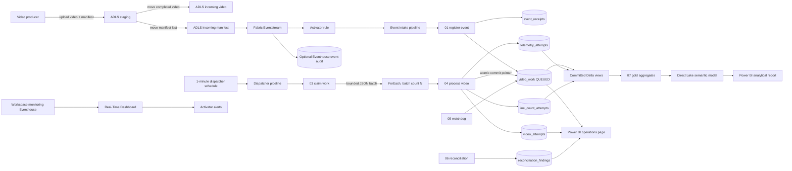
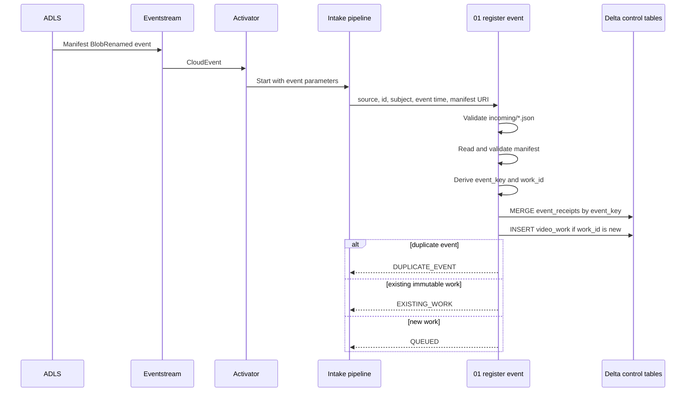
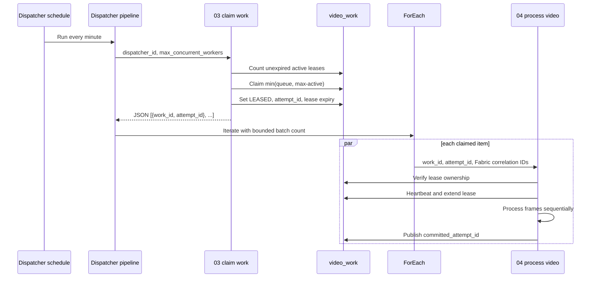
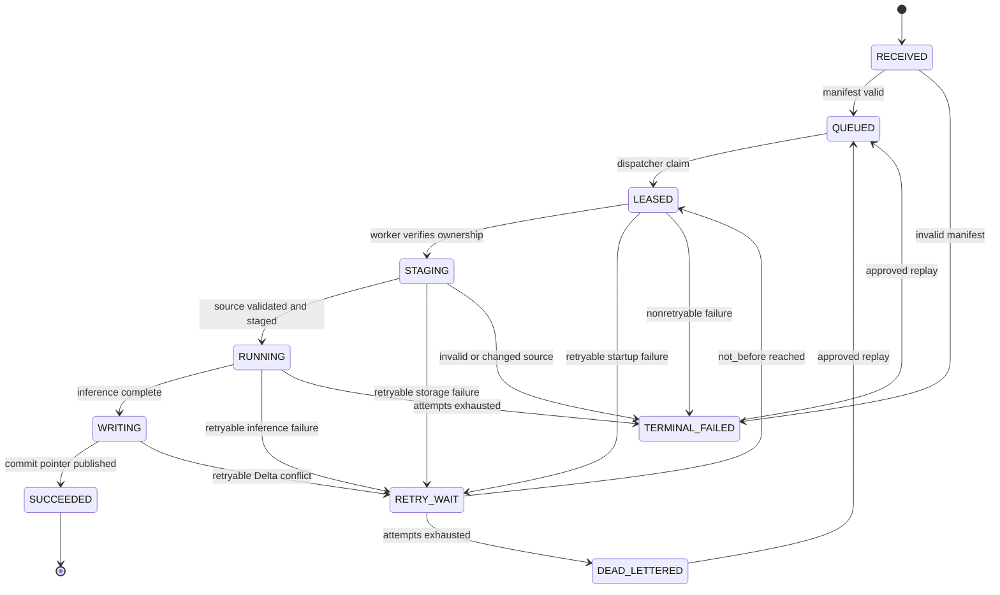
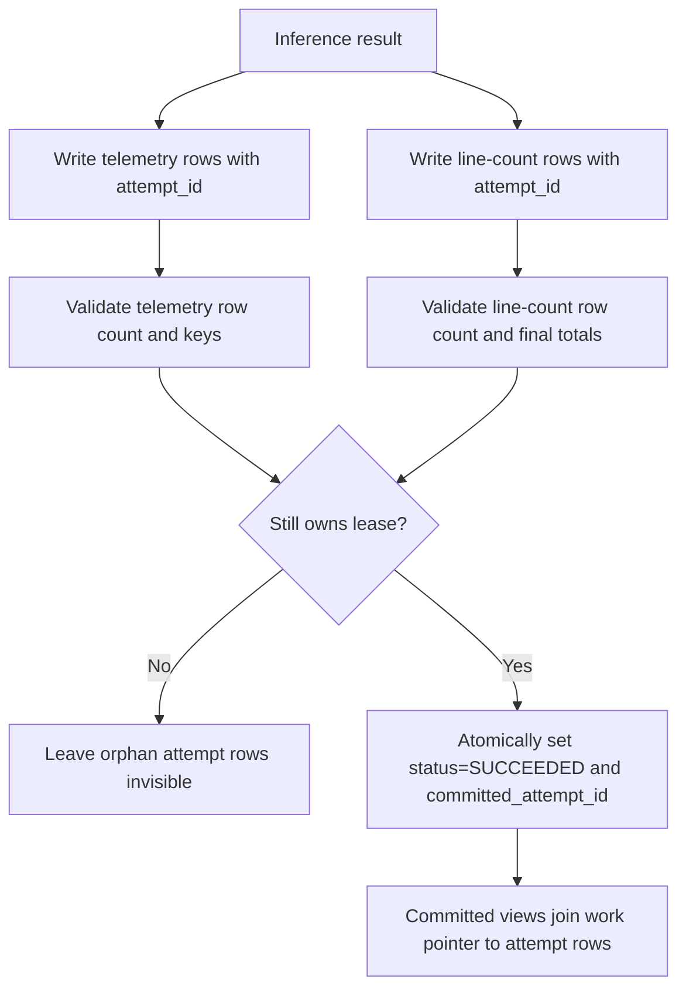
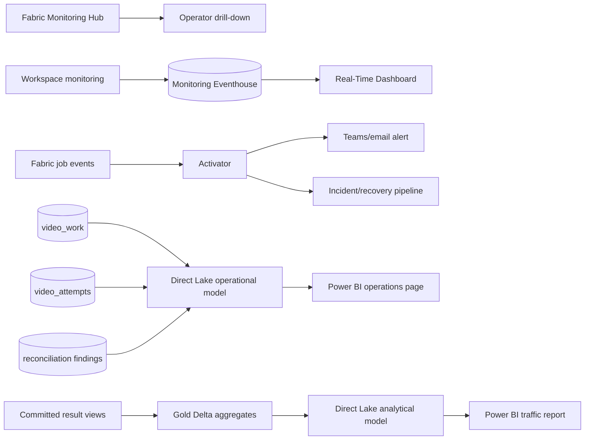

# Microsoft Fabric implementation plan

This folder defines the production implementation for an event-driven
people-counting platform on Microsoft Fabric. It supports two operating modes
with one control plane:

1. a one-time backfill of 200,000 video-hours in at most 30 days; and
2. a lower-volume, event-driven steady-state feed from ADLS Gen2.

The design assumes:

- producers upload a video under `staging/`, move the completed video into
  `incoming/`, then move its JSON manifest into `incoming/` last;
- the manifest is the authoritative source of camera, location, capture time,
  immutable asset version, and expected video metadata;
- Fabric-native compute is used;
- a Delta-backed intake queue and dispatcher enforce bounded concurrency; and
- capacity is selected only after a benchmark proves the required throughput.

The implementation provides deduplicated work and exactly-once **visible**
results. Azure/Fabric events and notebook execution remain at-least-once.

## Artifact map

Run or deploy the notebooks in this order:

| Notebook | Pipeline role | When it runs |
|---|---|---|
| [`00_bootstrap_lakehouse.ipynb`](./00_bootstrap_lakehouse.ipynb) | Creates control, attempt, output, benchmark, and gold tables plus committed-output views | Once per environment and after compatible schema releases |
| [`01_register_event.ipynb`](./01_register_event.ipynb) | Validates an ADLS manifest event and registers a deduplicated `QUEUED` work item | Once for every matching storage event |
| [`02_register_backfill.ipynb`](./02_register_backfill.ipynb) | Bulk-registers historical manifests without bypassing the normal queue | Once per backfill partition |
| [`03_claim_work.ipynb`](./03_claim_work.ipynb) | Claims no more than the available worker slots and returns a JSON work batch | Every dispatcher pipeline run |
| [`04_process_video.ipynb`](./04_process_video.ipynb) | Owns a lease, processes one video sequentially, writes attempt-scoped output, and publishes the committed attempt | Once per claimed work item |
| [`05_watchdog_recovery.ipynb`](./05_watchdog_recovery.ipynb) | Requeues expired retryable leases and dead-letters exhausted work | Every five minutes |
| [`06_reconcile_publication.ipynb`](./06_reconcile_publication.ipynb) | Detects ledger/output/job-correlation anomalies and records reconciliation findings | Every 15 minutes and after releases |
| [`07_build_gold_aggregates.ipynb`](./07_build_gold_aggregates.ipynb) | Builds minute, hour, camera, and operational aggregates for Direct Lake reports | Incrementally after committed work |
| [`08_capacity_benchmark.ipynb`](./08_capacity_benchmark.ipynb) | Measures processing speed and calculates the minimum parallelism for the 30-day target | Before selecting capacity and after model/runtime changes |
| [`09_maintain_delta.ipynb`](./09_maintain_delta.ipynb) | Removes expired uncommitted output and runs reviewed Delta optimization/vacuum | Daily or weekly according to retention policy |
| [`10_replay_work.ipynb`](./10_replay_work.ipynb) | Audits and requeues one terminal/dead-lettered work item | Operator-approved incident recovery |
| [`11_validate_observability.ipynb`](./11_validate_observability.ipynb) | Validates running-job, queue, burn-down, flow, and camera-level reporting data | Before dashboard release and during incident diagnosis |

The earlier
[`fabric_retry_safe_pipeline.ipynb`](../fabric_retry_safe_pipeline.ipynb) is a
useful single-run prototype. Do not deploy it alongside this control plane: it
uses a pipeline run ID as work identity, has no exclusive lease, overwrites
attempt history, and publishes across multiple Delta tables without a commit
pointer.

## 1. End-to-end architecture



### Why storage events do not invoke inference directly

Fabric event delivery is at-least-once and does not provide a hard global
worker limit. A fast intake notebook durably records the event and returns.
The dispatcher then admits work according to measured capacity. This keeps
event bursts from starting an unbounded number of model-heavy notebooks.

## 2. Producer and manifest contract

### Required publication sequence

1. Upload `staging/<asset-version>/<name>.mp4`.
2. Upload `staging/<asset-version>/<name>.json`.
3. Complete multipart/block upload and calculate the final size, ETag/version,
   and required SHA-256.
4. Move the video to `incoming/<yyyy>/<mm>/<dd>/<asset-version>/<name>.mp4`.
5. Move the manifest to the same `incoming/` folder **last**.
6. Never mutate an object in `incoming/`. Corrections use a new
   `asset_version`.

The Eventstream/Activator rule filters for JSON files under `incoming/`.
Therefore a manifest event means the referenced video is ready.

### Manifest version 1

```json
{
  "schema_version": 1,
  "asset_id": "camera-17_20260917T210000Z_0001",
  "asset_version": "01K5EDQ4AJ7MYW6W8F6Y8B4SCP",
  "video_uri": "abfss://videos@account.dfs.core.windows.net/incoming/2026/09/17/01K5.../segment.mp4",
  "source_etag": "0x8DEE...",
  "expected_size_bytes": 2489912034,
  "expected_sha256": "required-lowercase-hex-sha256",
  "camera_id": "camera-17",
  "location_id": "north-entrance",
  "captured_at_utc": "2026-09-17T21:00:00Z",
  "camera_timezone": "America/Denver",
  "counting_line": [0, 540, 1919, 540],
  "content_type": "video/mp4",
  "duration_seconds": 1800.0
}
```

Required fields are `schema_version`, `asset_id`, `asset_version`,
`video_uri`, `source_etag`, `expected_size_bytes`, `camera_id`,
`location_id`, `captured_at_utc`, `camera_timezone`, `counting_line`, and
`expected_sha256`. Reversing the counting-line endpoints reverses `in` and
`out`.

Logical identities:

```text
event_key = SHA256(cloud_event_source + "\n" + cloud_event_id)
work_id   = SHA256(normalized_video_uri + "\n" + asset_version)
attempt_id = a new UUID for every lease claim
```

`event_key` suppresses duplicate delivery. `work_id` suppresses repeat work
for the same immutable asset. `pipeline_run_id` and `activity_run_id` are
correlation fields only.

The worker retains the producer ETag/version for provenance. Because Fabric
`notebookutils.fs.getProperties` is unavailable in PySpark notebooks, runtime
content validation uses the required byte size and SHA-256 after staging.

## 3. Control-plane workflows

### Event intake and deduplication



### Bounded dispatch and worker execution



### Work state machine



Allowed state changes must be conditional on the current state and, after
claim, `lease_owner_attempt_id`. A worker that loses its lease must stop and
must not publish.

## 4. Exactly-once visible publication

Delta transactions do not span the work, telemetry, and line-count tables.
The worker therefore writes immutable attempt-scoped output first and commits
visibility by updating one `video_work` row.



Readers must use the committed views created by
[`00_bootstrap_lakehouse.ipynb`](./00_bootstrap_lakehouse.ipynb), never the
attempt tables directly.

## 5. Delta data contracts

All timestamps are UTC.

Columns described as required in the contracts below are enforced by the
registration and worker notebooks. The bootstrap creates tables through the
DataFrame Delta writer instead of interpolated `CREATE TABLE` SQL, and removes
column-level `NOT NULL` from its schema strings for Fabric Runtime
compatibility. The resulting physical Delta columns are nullable.

### Control tables

#### `people_counter_event_receipts`

One row per unique CloudEvent.

```text
event_key PK, event_source, event_id, event_type, event_time, subject,
manifest_uri, work_id, received_at, registration_status, pipeline_run_id,
error_type, error_message
```

#### `people_counter_video_work`

One mutable current-state row per immutable video version.

```text
work_id PK, asset_id, asset_version, source_uri, manifest_uri, source_etag,
expected_size_bytes, expected_sha256, camera_id, location_id,
captured_at_utc, camera_timezone, duration_seconds, priority,
status, received_at, queued_at, not_before_at, attempt_count, max_attempts,
lease_owner_attempt_id, lease_acquired_at, lease_expires_at,
lease_dispatcher_id, last_heartbeat_at, committed_attempt_id, completed_at,
last_error_category, last_error_type, last_error_message,
config_json, config_sha256
```

#### `people_counter_dispatcher_leases`

A single `global` row serializes the short claim transaction. This prevents
overlapping scheduled or manually started dispatchers from jointly exceeding
the worker limit. The mutex is released immediately after claims are
materialized; it does not serialize video processing.

#### `people_counter_registration_leases`

A pre-seeded single-row mutex serializes the short event/backfill registration
transaction. Delta tables do not enforce primary-key uniqueness, so the
mutex, post-write cardinality checks, and immutable-field comparisons are
required to prevent concurrent duplicate `event_key` or `work_id` rows.
Keep backfill manifest partitions small enough to finish inside the
registration lease.

#### `people_counter_video_attempts`

One durable row per attempt. Attempts are never reused or deleted by a retry.

```text
attempt_id PK, work_id, dispatcher_id, pipeline_run_id, activity_run_id,
fabric_job_instance_id, sdk_version, bundle_manifest_sha256, config_sha256,
status, claimed_at, staging_started_at,
inference_started_at, writing_started_at, completed_at, last_heartbeat_at,
input_sha256, source_size_bytes, source_duration_seconds, source_fps,
total_source_frames, processed_frames, effective_sample_fps,
processing_seconds, distinct_people, line_in_count, line_out_count,
retryable, error_category, error_type, error_message
```

#### `people_counter_replay_requests`

An append-only audit record for every operator-approved replay:

```text
replay_id PK, work_id, requested_by, reason, requested_at,
previous_status, applied_at, capture_date
```

### Attempt output tables

`people_counter_telemetry_attempts` is keyed by
`(work_id, attempt_id, person_id)`.

In addition to the SDK telemetry fields it stores:

```text
camera_id, location_id, captured_at_utc, person_entry_at_utc,
person_exit_at_utc, recorded_at
```

`people_counter_line_count_attempts` is keyed by
`(work_id, attempt_id, frame)`.

In addition to the SDK line-count fields it stores:

```text
camera_id, location_id, captured_at_utc, observed_at_utc, recorded_at
```

To keep the 200,000-hour backfill tractable, the worker persists rows where a
crossing occurred plus the final cumulative checkpoint for every video. It
does not persist zero-change rows for every sampled frame. This preserves
event-time flow charts and final-total reconciliation while avoiding roughly
2.16 billion line rows at a 3 FPS sample rate.

Tracker `person_id` values are scoped to one attempt/video. They are not
global human identities and must not be deduplicated across cameras.

### Operational and analytical tables

```text
people_counter_reconciliation_findings
people_counter_processing_benchmarks
people_counter_gold_flow_minute
people_counter_gold_flow_hour
people_counter_gold_video
people_counter_gold_operations_hour
```

Partition large attempt/output tables by a derived capture date, not by
high-cardinality `work_id`.

## 6. Pipeline implementation in Fabric

Create separate Fabric workspaces for development, test, and production.
Create one Lakehouse per environment and attach it as the default Lakehouse
to every notebook.

### 6.1 Environment and SDK

1. From a host matching the Fabric runtime, build the CPU bundle:

   ```bash
   uv run python scripts/build_sdk_bundle.py cpu
   ```

2. In Fabric, create an **Environment** named
   `people-counter-<environment>`.
3. Upload every wheel from the bundle's `wheels/` directory under custom
   libraries.
4. Publish the Environment.
5. Select the Environment in each notebook.
6. Pin the Environment and notebook to the tested Fabric runtime. Do not
   silently upgrade during the backfill.
7. Record the SDK version and bundle manifest SHA-256 in every attempt.

Fabric-native compute is a hard constraint. Do not start the backfill until
[`08_capacity_benchmark.ipynb`](./08_capacity_benchmark.ipynb) proves that an
available capacity can finish with headroom.

Fabric Spark currently documents CPU/memory node families only; it does not
document a native GPU Spark pool. This implementation therefore rejects GPU
device settings. Custom Spark pools support at most 200 nodes, and Spark
admission is core-based/FIFO. Queued jobs expire after 24 hours, while jobs
submitted during capacity throttling can be rejected instead of queued.
Treat every one of these as a benchmark and alerting constraint, not as
capacity headroom.

### 6.2 Lakehouse bootstrap

1. Create a `people_counter_<environment>` Lakehouse, for example
   `people_counter_dev`, `people_counter_test`, or `people_counter_prod`.
   Fabric Lakehouse names can contain only letters, numbers, and underscores.
2. Import the repository notebooks as Fabric notebook items:
   - Open the target Fabric workspace.
   - From the workspace toolbar, select **Import** and then **Notebook**.
     Depending on the current Fabric navigation, this entry can also appear
     under **New item** or the Data Engineering home page.
   - Upload all `.ipynb` files from this [`notebooks/fabric/`](./) folder.
     Fabric supports importing standard Jupyter `.ipynb` files and creates
     one Fabric notebook item per file.
   - Keep the numeric prefixes and names, such as
     `00_bootstrap_lakehouse` and `01_register_event`, so the pipeline
     instructions match the Fabric items.
   - Open each imported notebook and verify that its tagged parameter cell is
     recognized before using it in a Notebook pipeline activity.
3. Attach the Lakehouse to **every imported notebook**:
   - Open the notebook.
   - In the Lakehouse explorer, select **Add lakehouse**.
   - Select **Existing lakehouse**, choose
     `people_counter_<environment>`, and add it.
   - Pin it or select **Set as default** so it is the notebook's default
     Lakehouse.
   - Save the notebook and confirm the default Lakehouse remains attached
     after reopening it.
4. Select the published `people-counter-<environment>` Environment for every
   notebook. This is required for the worker/benchmark package and keeps all
   notebook runtimes consistent.
5. Run [`00_bootstrap_lakehouse.ipynb`](./00_bootstrap_lakehouse.ipynb).
6. Verify every expected Delta table and committed view from the SQL
   analytics endpoint.
7. Grant the runtime identity read access to ADLS and write access to the
   Lakehouse.

### 6.3 ADLS Eventstream and Activator data connection

Azure Blob/ADLS events are not a storage inventory and are not replayed for
objects that existed before the Eventstream connected. Existing video files
therefore do not populate the preview. This design also triggers on a newly
moved JSON manifest, not on the video object itself.

1. Confirm the source account is ADLS Gen2/StorageV2 and supported in the
   Fabric region.
2. In Fabric Real-Time Hub, add Azure Blob Storage events for the production
   account and container. Once created, do not use the source-node pencil to
   change the account or event-link configuration; Fabric does not support
   updating this event link in place.
3. The required event type is `Microsoft.Storage.BlobRenamed` because the
   producer moves the completed manifest from `staging/` to `incoming/`. A
   hierarchical-namespace rename is not a `BlobCreated` event. If the source
   wizard does not offer an event-type selector, keep the source unchanged
   and filter `type` downstream after the first event supplies a schema.
4. Before adding a Filter node, generate a live schema-bootstrap event:
   - Start/connect the Eventstream source and leave the canvas open.
   - Create a valid manifest under `staging/<asset-version>/<name>.json` for
     one of the existing videos.
   - Rename/move that manifest into
     `incoming/<yyyy>/<mm>/<dd>/<asset-version>/<name>.json`.
   - Select the source or stream node, set preview to **Last hour**, and
     refresh. Wait until the CloudEvent fields appear.
   - Only then connect/configure the Filter nodes. The Filter field selector
     stays empty while the upstream stream has no inferred schema.
5. Add three Filter nodes in series because the Eventstream Filter operator
   allows only one condition per node. The serial nodes implement a logical
   AND:

   ```text
   filter_blob_renamed:
   type equals:
   Microsoft.Storage.BlobRenamed

   filter_incoming_manifests:
   subject starts with:
   /blobServices/default/containers/<container>/blobs/incoming/

   filter_json_manifests:
   subject ends with:
   .json
   ```

   Connect them as:

   ```text
   Azure Blob Storage events
     -> filter_blob_renamed
     -> filter_incoming_manifests
     -> filter_json_manifests
     -> Activator/Eventhouse destination
   ```

   Do not trigger for videos; the manifest-last move is the readiness event.

6. Verify the output of `filter_json_manifests`; this is not another
   transformation step:
   - Select `filter_json_manifests`.
   - Open its data preview and confirm that the event still contains
     `source`, `id`, `type`, `time`, `subject`, and
     `data.destinationUrl`.
   - If Fabric displays nested properties as flattened columns, the last
     field might appear simply as `destinationUrl`.
   - Do not add a **Manage fields** operation that removes these values.

   `destinationUrl` is the final `incoming/...json` path after the rename.
   Do not use `sourceUrl`, which points to the old pre-rename path. The
   observed Fabric event can include an `eTag`, but that is the manifest
   blob's ETag—not the referenced video's ETag. The referenced video ETag and
   SHA-256 come from the manifest content.
7. Add the Activator destination shown in the Eventstream UI:

   | Field | Value |
   |---|---|
   | **Destination name** | `to_pc_manifest_arrival_activator` |
   | **Workspace** | Current environment workspace, such as `people-counter-dev` |
   | **Activator** | Select **Create new**, then name it `pc_manifest_arrival_activator` |
   | **Input data format** | `Json` |
   | **Activate ingestion after adding the data source** | Checked |

   Select **Save**. The destination name identifies the Eventstream
   connection; the Activator name identifies the Fabric item created in the
   workspace.
8. Stop here after saving the destination. At this point Eventstream is
   delivering filtered manifest events into the Activator item, but no rule
   invokes a pipeline yet.

If the live manifest move still produces no preview:

1. Confirm the move happened **after** the Eventstream source was connected.
2. Confirm `BlobRenamed` was selected and inspect the source-node monitoring
   errors before configuring downstream operators.
3. Confirm the storage account is StorageV2 with hierarchical namespace
   enabled and the move uses a file rename rather than copy-and-delete.
4. Confirm the Fabric workspace capacity region supports the Azure Blob
   Storage events connector. It is not supported in Central US, Germany West
   Central, South-Central US, West US2, West US3, or West India.
5. Check tenant/workspace private-link and outbound-access policies. Blocking
   public access can prevent Azure event delivery unless the documented
   Real-Time Events connectivity is configured.
6. Temporarily remove downstream Filter/Activator nodes and verify the raw
   source first. Re-add the three serial filters only after raw events are
   visible.

#### Recover `Update event link is not supported`

This publish error means Fabric is trying to mutate the Azure Storage event
link behind the existing source:

```text
dataSourceErrors:
  <source>: Update event link is not supported.
```

The filter or Activator edit usually exposes the problem, but the failing
resource is the Blob source link. Use this recovery order:

1. Copy the three filter expressions and Activator destination settings.
2. Discard the failed draft if Fabric offers that option, reopen the
   Eventstream, and confirm its previously published Live view still works.
3. In Edit mode, delete only the **Azure Blob Storage Events** source node and
   publish that deletion. Deleting and recreating is supported; updating the
   existing event link is not.
4. Add a new Azure Blob Storage Events source for
   `peoplecountingfootage`. Configure the account once and publish it without
   reopening/saving the source settings.
5. Select **Stream events**, generate a new rename event, and confirm raw
   preview data.
6. Recreate/reconnect
   `filter_blob_renamed -> filter_incoming_manifests ->
   filter_json_manifests`.
7. Publish the filters before adding a destination.
8. Re-add the Activator destination, selecting the existing
   `pc_manifest_arrival_activator`, and publish again.

If deleting the source also removes its connected nodes, recreate those nodes
from the copied settings. If the source-only replacement still produces the
same error, create a new Eventstream in parallel from Real-Time Hub, validate
it end to end, and retire the old Eventstream only after the replacement is
live.

### 6.4 Event intake pipeline

The Activator does not run inside this pipeline. It is an external trigger
that invokes the pipeline after section 6.5 configures the rule.

Create `pc-event-intake`:

1. Create a new Fabric Data Pipeline named `pc-event-intake`.
2. Define these string pipeline parameters:
   `EVENT_SOURCE`, `EVENT_ID`, `EVENT_TYPE`, `EVENT_TIME`, `SUBJECT`, and
   `MANIFEST_URI`.
3. Add one Notebook activity targeting
   the imported `01_register_event` Fabric notebook item, sourced from
   [`01_register_event.ipynb`](./01_register_event.ipynb). If it does not
   appear in the activity selector, return to section 6.2, import/save it,
   and attach the default Lakehouse first.
4. In the Notebook activity **Settings** under **Base parameters**, map every
   imported notebook parameter to dynamic pipeline content:

   | Notebook base parameter | Dynamic value |
   |---|---|
   | `EVENT_SOURCE` | `@pipeline().parameters.EVENT_SOURCE` |
   | `EVENT_ID` | `@pipeline().parameters.EVENT_ID` |
   | `EVENT_TYPE` | `@pipeline().parameters.EVENT_TYPE` |
   | `EVENT_TIME` | `@pipeline().parameters.EVENT_TIME` |
   | `SUBJECT` | `@pipeline().parameters.SUBJECT` |
   | `MANIFEST_URI` | `@pipeline().parameters.MANIFEST_URI` |
   | `PIPELINE_RUN_ID` | `@pipeline().RunId` |

   Leave the remaining notebook base parameters at their reviewed
   environment defaults.
5. Do not validate the notebook by running its registration cell
   interactively with blank defaults. Pipeline parameters are injected only
   when the Notebook activity runs. For an interactive smoke test, populate
   the tagged parameter cell from one Eventstream preview event, rerun that
   cell, and then run the registration cell.
6. Set a short timeout because this pipeline validates a small manifest and
   writes control rows; it does not process video.
7. Enable retries for transient storage, capacity, and Delta conflicts. Do
   not retry a schema-invalid manifest.
8. Save the pipeline so it becomes selectable by the Activator rule.
9. Add terminal-failure alerting after the complete event flow is validated.

The event and backfill registration notebooks share a global registration
mutex. Pass `REGISTRATION_ID=@pipeline().RunId` to
[`02_register_backfill.ipynb`](./02_register_backfill.ipynb); event intake
uses `event_key` as its lock owner. Do not bypass these notebooks with direct
appends to `video_work`.

### 6.5 Activator rule and pipeline action

Return to the Activator item created in section 6.3:

1. Open `pc_manifest_arrival_activator` and create a rule named
   `run_pc_event_intake_on_manifest_renamed` that invokes the
   `pc-event-intake` pipeline for each event emitted by
   `filter_json_manifests`. Use these exact names in development, test, and
   production so deployment comparisons and monitoring filters stay
   consistent. Activator-to-item parameter passing is currently Preview and
   supports scalar string, Boolean, and numeric parameters only. Pass event
   properties individually, not as one event object.
2. In the Activator **Run a Fabric item** action, map the filtered event
   fields to the intake pipeline's scalar parameters:

   | Pipeline parameter | Filtered event field |
   |---|---|
   | `EVENT_SOURCE` | `source` |
   | `EVENT_ID` | `id` |
   | `EVENT_TYPE` | `type` |
   | `EVENT_TIME` | `time` |
   | `SUBJECT` | `subject` |
   | `MANIFEST_URI` | `data.destinationUrl` or flattened `destinationUrl` |

   Keep the complete `source` and `id`; together they form the event
   deduplication key. Do not substitute a filename or pipeline run ID.
   The intake notebook normalizes the destination Blob HTTPS URL to an
   `abfss://` URI.
3. Save and activate
   `run_pc_event_intake_on_manifest_renamed`.
4. Optionally route the unmodified event stream to Eventhouse for an
   independent ingress audit.
5. Upload and move one test video/manifest pair twice and verify two event
   receipts resolve to one work item.

The observed 16-byte `manifest.json` is sufficient to prove that rename
events and filters work, but it is not a valid processing manifest unless it
contains every required manifest-version-1 field. Replace the smoke-test
content with the complete manifest contract before testing
`01_register_event.ipynb`.

### 6.6 Dispatcher pipeline

Create `pc-dispatcher-00` with a one-minute fixed schedule. Fabric fixed
schedules require start and end dates, so choose a reviewed far-future end
date and alert before it expires:

1. Add a Notebook activity targeting
   [`03_claim_work.ipynb`](./03_claim_work.ipynb).
2. Pass `DISPATCHER_ID` as the dispatcher pipeline run ID,
   `MAX_CONCURRENT_WORKERS`, `CLAIM_LIMIT`, and lease settings.
3. Parse the notebook string exit value as JSON. Start with
   `@json(activity('ClaimWork').output.result.exitValue).items`, then run the
   claim activity once and inspect its Output in the target tenant to verify
   the exact exit-value path.
4. Add an `If` activity that skips the `ForEach` when the returned list is
   empty.
5. Add a `ForEach` over the claimed `{work_id, attempt_id}` objects.
6. Set `ForEach` batch count to the benchmark-approved per-pipeline
   concurrency, with an upper bound of 50. Never set it higher than
   `CLAIM_LIMIT`.
7. Inside `ForEach`, add a Notebook activity targeting
   [`04_process_video.ipynb`](./04_process_video.ipynb).
8. Pass `WORK_ID=@item().work_id`,
   `ATTEMPT_ID=@item().attempt_id`, and
   `PIPELINE_RUN_ID=@pipeline().RunId`. Fabric does not expose the Data
   Factory activity-run ID or monitoring `JobInstanceId` to the notebook.
   Set `ACTIVITY_RUN_ID` to a clearly synthetic correlation such as
   `@concat(pipeline().RunId, '/', item().attempt_id)` and leave
   `FABRIC_JOB_INSTANCE_ID` empty for later monitoring reconciliation.
9. Set the worker Notebook activity retry count to zero. A failed activity
   records `RETRY_WAIT`; a later dispatcher claim creates a fresh attempt ID.
   This prevents an activity timeout from running two executions under the
   same lease.
10. Set the activity timeout from benchmark p99 runtime by duration bucket,
    with staging and capacity headroom.
11. Fabric does not document a fixed-schedule no-overlap switch. The
    dispatcher notebook therefore takes a short global Delta mutex before
    counting active leases and claiming work.

Fabric `ForEach` parallelism is capped at 50. If the benchmark requires more
than 50 concurrent notebook activities, clone the dispatcher pipeline into
`pc-dispatcher-00` through `pc-dispatcher-NN`, offset their schedules, and
give every run a unique `DISPATCHER_ID`. Each shard still uses
`CLAIM_LIMIT <= 50`; the global mutex and `MAX_CONCURRENT_WORKERS` enforce the
aggregate limit. The capacity gate must prove that Fabric can admit the
resulting Spark jobs—creating more pipeline activities does not create more
capacity.

### 6.7 Watchdog, reconciliation, and aggregation

Create four scheduled pipelines:

- `pc-watchdog`, every five minutes, runs
  [`05_watchdog_recovery.ipynb`](./05_watchdog_recovery.ipynb).
- `pc-reconcile`, every 15 minutes, runs
  [`06_reconcile_publication.ipynb`](./06_reconcile_publication.ipynb).
- `pc-gold-refresh`, after commits, determines the distinct historical
  `capture_date` partitions and `to_date(observed_at_utc)` flow partitions
  changed since its last watermark and runs
  [`07_build_gold_aggregates.ipynb`](./07_build_gold_aggregates.ipynb) once
  per `FLOW_DATE`/`CAPTURE_DATE`; it also supplies the current
  `OPERATION_DATE`.
- `pc-delta-maintenance`, daily or weekly according to approved retention,
  runs [`09_maintain_delta.ipynb`](./09_maintain_delta.ipynb).

The worker defaults to a 10-minute heartbeat and a 30-minute renewable lease
to limit Delta contention; tune both from the benchmark and p99 batch time.
The watchdog may requeue only work whose lease or heartbeat is expired and
whose current attempt is not already committed. Replays from `TERMINAL_FAILED` or
`DEAD_LETTERED` require an operator-supplied reason and a new attempt.

Create a manually invoked, operator-restricted `pc-replay` pipeline around
[`10_replay_work.ipynb`](./10_replay_work.ipynb). Require `REPLAY_ID`,
`WORK_ID`, `REQUESTED_BY`, and `REASON`; do not expose this pipeline to the
event-trigger identity.

## 7. Backfill plan for 200,000 video-hours

The deadline provides 720 wall-clock hours. Required aggregate throughput is:

```text
200,000 / 720 = 277.78 video-hours per wall-clock hour
```

If one worker measures `R` times real-time and expected useful utilization is
`U`, minimum workers are:

```text
minimum_workers = ceil(200,000 * H / (720 * R * U))
```

At 80% useful utilization (`U=0.8`) and 20% headroom (`H=1.2`):

| Measured speed per worker | Minimum workers |
|---:|---:|
| 0.25x real-time | 1,667 |
| 0.5x real-time | 834 |
| 1x real-time | 417 |
| 2x real-time | 209 |
| 5x real-time | 84 |
| 10x real-time | 42 |

This is why capacity cannot be selected from SKU labels alone.

### Backfill execution phases

1. **Inventory:** partition manifest inventory by capture date and storage
   prefix.
2. **Representative benchmark:** use at least three duration/resolution/motion
   buckets in [`08_capacity_benchmark.ipynb`](./08_capacity_benchmark.ipynb).
   Give every sustained concurrent run one `BENCHMARK_BATCH_ID`; the gate uses
   observed aggregate video seconds divided by batch wall-clock time, not the
   declared worker count or SDK inference-only duration.
   After all benchmark workers finish, run the notebook with
   `RUN_INFERENCE=false` and `ENFORCE_CAPACITY_GATE=true`; the activity must
   fail and block promotion when no six-hour batch meets required aggregate
   throughput.
3. **Capacity gate:** calculate required parallel workers, Spark cores,
   memory, CU consumption, and 20% retry/variance headroom.
4. **Pilot 0.1%:** register 200 video-hours and validate counts, output volume,
   queue behavior, and cost.
5. **Pilot 1%:** register 2,000 video-hours, sustain target concurrency for at
   least six hours, and verify no memory or Delta contention trend.
6. **Ramp:** increase admission in 25% steps while monitoring queue age,
   throughput, failures, capacity throttling, and output-file health.
7. **Daily checkpoint:** compare completed video-hours with the burn-down
   target and recalculate the forecast completion date.
8. **Stop condition:** pause new claims when the projected completion misses
   the deadline, error rate breaches the SLO, or capacity throttling is
   sustained. Do not compensate by silently exceeding proven concurrency.
9. **Completion:** reconcile the inventory, committed work, and dead-letter
   queue before declaring the backfill complete.

Use [`02_register_backfill.ipynb`](./02_register_backfill.ipynb) to register
partitions. It must create the same `work_id` and rows as event intake so a
backfill item and a later duplicate event converge.

## 8. Observability design



### Operations dashboard

Enable Workspace monitoring and use its `ItemJobEventLogs` in a Real-Time
Dashboard for Fabric job telemetry. Add:

- running and not-started jobs;
- jobs by item and status;
- oldest running/not-started age;
- pipeline/notebook median and p95 duration;
- failures by item and error;
- capacity/workspace correlation.

Configure it in Fabric:

1. Open the production workspace, select **Workspace settings**, then
   **Monitoring**, select **+ Eventhouse**, and enable Workspace monitoring.
2. Wait for Fabric to provision the monitoring Eventhouse/KQL database and
   confirm that `ItemJobEventLogs` contains both Data Pipeline and
   `PipelineRunNotebook` jobs.
3. Open **Real-Time Intelligence**, create a Real-Time Dashboard, and add the
   monitoring KQL database as its data source.
4. Create tiles grouped by `JobStatus` and distinct `JobInstanceId` for
   `Not started`, `In progress`, `Completed`, and `Failed`. Add start-time,
   duration, item, workspace, and capacity filters.
5. Add parameters for pipeline, notebook, status, and time window.
6. Pin running-job count, oldest not-started age, p95 duration, and recent
   failures to the first page.
7. From the dashboard, choose **Set alert** and create Activator rules for
   failed jobs, queue age, and runtime SLA breaches.
8. Separately subscribe to Fabric job events in Real-Time Hub for immediate
   terminal-failure notifications; dashboard polling is for stuck/SLA
   conditions.

Workspace monitoring retains 30 days, is read-only, consumes Fabric capacity,
and currently does not support private links. Keep the Delta attempt ledger
for longer operational history.

Create a Power BI operations page over `video_work`, `video_attempts`, and
`reconciliation_findings` for application state:

- queue depth and oldest queued age;
- active leases and oldest heartbeat age;
- work by state;
- completed video-hours versus the 200,000-hour target;
- actual versus required daily burn-down;
- retry and dead-letter counts;
- median and p95 staging/inference/write duration;
- processing speed relative to real time;
- input and output freshness;
- orphan and correlation findings.

Run
[`11_validate_observability.ipynb`](./11_validate_observability.ipynb) before
publishing dashboards to verify that each visual has populated, correctly
scoped source data.

### Analytical report

Create an explicit Direct Lake semantic model over the gold tables. Include:

Dimensions:

```text
Date, Time, Camera, Location, Video, ModelConfig
```

Measures:

```text
Entries, Exits, NetFlow, VideosProcessed, VideoHoursProcessed,
DistinctTracksPerVideo, AverageDwellSeconds, P50DwellSeconds,
P95DwellSeconds, ProcessingFPS, ProcessingSpeedXRealTime,
SuccessRate, FailureRate, DataFreshnessMinutes
```

Recommended visuals:

- entries and exits by observation time;
- cumulative flow and estimated occupancy;
- peak traffic by hour and weekday;
- camera/location comparison;
- dwell-duration distribution;
- distinct tracks per video;
- completed video-hours and forecast completion;
- data-quality and freshness indicators.

Configure the analytical model in Fabric:

1. Open the Lakehouse SQL analytics endpoint and verify the committed views
   and all `people_counter_gold_*` Delta tables are visible.
2. Select **New semantic model**, choose Direct Lake storage mode, and add the
   four gold tables. New Lakehouses do not automatically create this model.
3. Create Date, Time, Camera, Location, and Video dimensions. Relate them to
   the gold facts with one-to-many, single-direction relationships.
4. Mark the Date table and set UTC as the storage time zone. Add local-time
   display columns from the manifest's IANA camera timezone; do not rewrite
   fact timestamps.
5. Add the measures listed below and format counts as whole numbers,
   durations as seconds/minutes, and rates explicitly.
6. Build separate **Operations**, **Backfill**, **Traffic**, **Dwell**, and
   **Data quality** report pages.
7. Apply row-level security by authorized `location_id`/`camera_id`.
8. Validate each report result against
   [`11_validate_observability.ipynb`](./11_validate_observability.ipynb)
   before publishing the app.

Estimated occupancy is valid only when an initial occupancy and consistent
line direction are configured. Distinct tracker IDs must not be summed across
videos or cameras as unique humans.

### Alerts

Use Fabric job events and Activator for immediate terminal failures. Use
scheduled/KQL or ledger checks for:

```text
queue age > queue SLA
heartbeat age > lease SLA
event receipt with no work row
Fabric job with no attempt correlation
failure rate > threshold
dead-letter count > 0
daily completed hours below burn-down target
capacity queue/throttling sustained
reconciliation severity = ERROR
```

## 9. Security, privacy, and lifecycle

1. Use managed identities or workspace identities; do not put storage keys or
   SAS tokens in notebooks.
2. Grant source read and target write permissions separately.
3. Keep raw videos in a restricted storage zone. Reports expose aggregates,
   not video URLs, unless the user is explicitly authorized.
4. Define retention separately for raw video, event receipts, attempts,
   failed snapshots, committed telemetry, and gold aggregates.
5. Record the operator, reason, and timestamp for every replay.
6. Apply row-level security in the semantic model for location/camera access.
7. Treat camera IDs and timestamps as potentially sensitive operational data.
8. Define a deletion workflow that removes or tombstones all facts derived
   from a deleted source asset where policy requires it.

Recommended starting retention, subject to policy approval:

| Data | Initial retention |
|---|---:|
| Event receipts and attempts | 13 months |
| Reconciliation findings | 13 months |
| Failed/uncommitted output | 30 days |
| Committed detailed line counts | 13 months |
| Gold hourly aggregates | 7 years |
| Raw video | Business/privacy policy |

Schedule Delta optimization and vacuum only after confirming that retention
does not conflict with replay, audit, or legal-hold requirements.

## 10. Deployment and release plan

### Phase 0: feasibility

- Run [`08_capacity_benchmark.ipynb`](./08_capacity_benchmark.ipynb).
- Select the capacity and approved concurrency.
- Stop if no Fabric-native capacity plan meets the deadline and budget.

### Phase 1: contracts and control plane

- Approve manifest schema and producer move protocol.
- Run [`00_bootstrap_lakehouse.ipynb`](./00_bootstrap_lakehouse.ipynb).
- Deploy event intake and backfill registration.
- Prove duplicate events and duplicate manifests converge.

### Phase 2: leases and publication

- Deploy dispatcher and worker notebooks.
- Inject concurrent claims, expired leases, notebook termination, and Delta
  failures.
- Verify that only `committed_attempt_id` becomes visible.

### Phase 3: operations

- Enable Workspace monitoring and job events.
- Deploy watchdog and reconciliation schedules.
- Create alerts and operator runbooks for replay, pause, resume, and
  dead-letter handling.

### Phase 4: analytics

- Deploy gold aggregates.
- Create explicit Direct Lake semantic models.
- Validate observation time, camera timezone handling, line direction, and
  non-additive distinct-person semantics.

### Phase 5: backfill ramp

- Execute the 0.1%, 1%, and stepped ramp plan.
- Track the daily forecast against the 30-day objective.
- Freeze runtime, bundle, configuration, and schema during sustained backfill
  unless a controlled migration is approved.

### Phase 6: steady state

- Reduce `MAX_CONCURRENT_WORKERS` to the ongoing rate.
- Keep the event intake path, queue, leases, watchdog, and committed views.
- Revisit capacity after observing at least 30 days of arrival patterns.

Use Fabric deployment pipelines or source control promotion for
development-to-test-to-production. Never promote queued work or attempt data
between environments. Deployment rules do not cover arbitrary pipeline,
Environment, Eventstream, Activator, retention, or concurrency settings, so
manage those with target-stage Variable Libraries where supported and a
reviewed post-deployment configuration checklist.

The current deployment-pipeline experience and several supported item types
are Preview. Treat production promotion as a controlled release with explicit
post-deployment verification, not as a fully parameterized immutable deploy.

In Fabric:

1. Create a deployment pipeline with Development, Test, and Production
   stages and assign one workspace to each stage.
2. Keep the same notebook and pipeline item names across stages.
3. Use the notebook default-Lakehouse rule and semantic-model data-source
   rules where supported. Allow same-workspace dependency binding to connect
   notebooks to the corresponding target Environment and Lakehouse.
4. Deploy definitions only. Bootstrap each target Lakehouse independently;
   never copy control-plane or fact-table contents between stages.
5. Run bootstrap, duplicate-event, lease-race, failure-injection,
   reconciliation, and report-validation tests in Test.
6. Require the capacity benchmark gate and an approved rollback plan before
   Production deployment.
7. Manually or programmatically configure the target ADLS Eventstream
   binding, Activator recipients, schedules, Variable Library values, and
   custom Spark pool after deployment. Custom Spark pools do not promote with
   an Environment.

## 11. Acceptance tests

The implementation is ready only when all checks pass:

### Ingestion and identity

- Duplicate delivery of the same `source + id` creates one event receipt.
- Two event IDs for the same immutable asset create one work item.
- A changed `asset_version` creates a new work item.
- A manifest outside `incoming/`, with an unsupported schema, or referencing
  a missing/mismatched video fails visibly.

### Concurrency and recovery

- Two dispatchers cannot grant two valid leases for one `work_id`.
- A worker cannot publish after losing its lease.
- An expired retryable lease requeues once.
- Exhausted attempts transition to `DEAD_LETTERED`.
- An approved replay records operator and reason.

### Publication

- Failure after telemetry write but before commit exposes no new committed
  records.
- A retry may leave uncommitted rows but only one attempt is visible.
- Final line totals reconcile with the committed work row.
- Empty telemetry or line-count results still commit with valid schemas.

### Observability

- Every Fabric job correlates to a pipeline run and application attempt.
- Running count, queue depth, queue age, retries, and dead letters are visible.
- Failure and stale-heartbeat alerts fire and resolve.
- Backfill burn-down forecasts the completion date.

### Analytics

- UTC observation times equal capture time plus video-relative time.
- Camera timezone is used only for presentation.
- Direct Lake measures do not double-count uncommitted attempts.
- Tracker identities are not treated as global people.

### Performance

- A six-hour test sustains the required video-hours/hour with at least 20%
  deadline headroom.
- Failure rate, p95 duration, queue age, memory, capacity throttling, and Delta
  conflicts remain within approved thresholds.

## 12. Official references

- [Fabric event delivery guarantees](https://learn.microsoft.com/fabric/real-time-hub/fabric-event-delivery-guarantees)
- [Build event-driven Fabric pipelines](https://learn.microsoft.com/fabric/real-time-hub/tutorial-build-event-driven-data-pipelines)
- [Azure Blob Storage events in Fabric](https://learn.microsoft.com/fabric/real-time-hub/get-azure-blob-storage-events)
- [Azure Blob/ADLS event schemas](https://learn.microsoft.com/azure/event-grid/event-schema-blob-storage)
- [Activator actions for Fabric items](https://learn.microsoft.com/fabric/real-time-intelligence/data-activator/activator-trigger-fabric-items)
- [Fabric pipeline runs and triggers](https://learn.microsoft.com/fabric/data-factory/pipeline-runs)
- [Fabric pipeline expression language](https://learn.microsoft.com/fabric/data-factory/expression-language)
- [Activity retries](https://learn.microsoft.com/fabric/data-factory/activity-retries)
- [Notebook activity](https://learn.microsoft.com/fabric/data-factory/notebook-activity)
- [Create, import, and connect Fabric notebooks](https://learn.microsoft.com/fabric/data-engineering/how-to-use-notebook)
- [ForEach activity](https://learn.microsoft.com/fabric/data-factory/foreach-activity)
- [Spark concurrency and queueing](https://learn.microsoft.com/fabric/data-engineering/spark-job-concurrency-and-queueing)
- [Fabric Spark compute](https://learn.microsoft.com/fabric/data-engineering/spark-compute)
- [Custom Spark pools](https://learn.microsoft.com/fabric/data-engineering/create-custom-spark-pools)
- [Monitoring Hub](https://learn.microsoft.com/fabric/admin/monitoring-hub)
- [Workspace monitoring](https://learn.microsoft.com/fabric/fundamentals/workspace-monitoring-overview)
- [Item job event logs](https://learn.microsoft.com/fabric/fundamentals/item-job-event-logs)
- [Real-Time Dashboards](https://learn.microsoft.com/fabric/real-time-intelligence/dashboard-real-time-create)
- [Lakehouse SQL analytics endpoint](https://learn.microsoft.com/fabric/data-engineering/lakehouse-sql-analytics-endpoint)
- [Direct Lake overview](https://learn.microsoft.com/fabric/fundamentals/direct-lake-overview)
- [Fabric semantic models](https://learn.microsoft.com/fabric/data-warehouse/semantic-models)
- [Fabric Capacity Metrics app](https://learn.microsoft.com/fabric/enterprise/metrics-app)
- [Fabric deployment pipelines](https://learn.microsoft.com/fabric/cicd/deployment-pipelines/intro-to-deployment-pipelines)
- [Deployment rules](https://learn.microsoft.com/fabric/cicd/deployment-pipelines/create-rules)
