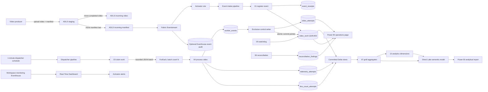
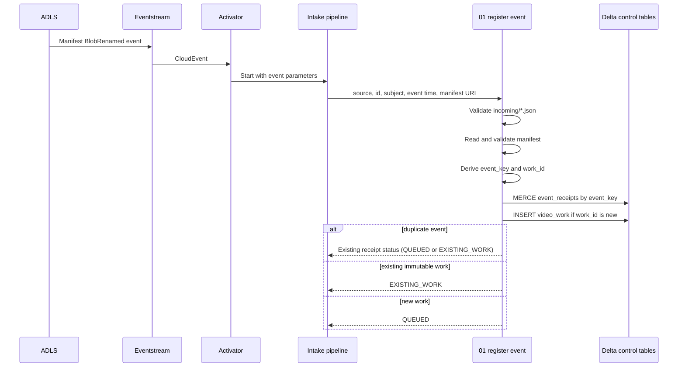
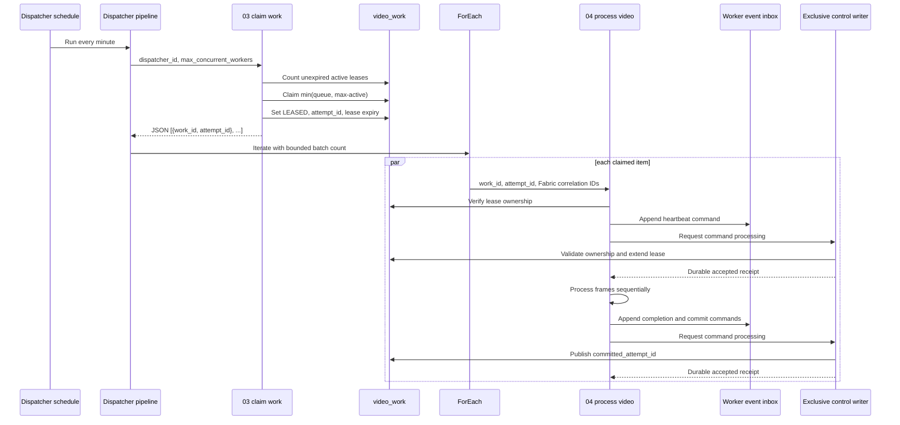
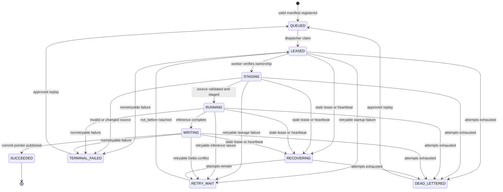
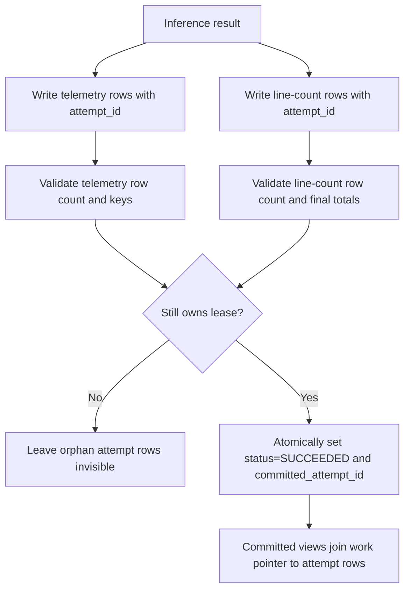
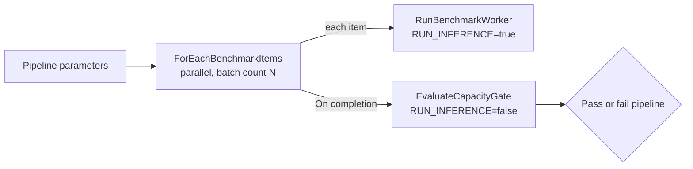
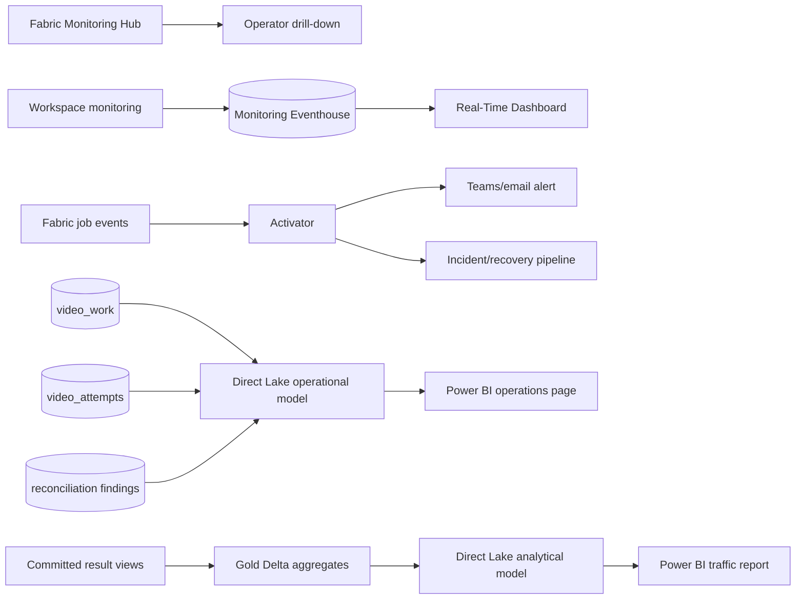

# Microsoft Fabric implementation plan

This folder defines the production implementation for an event-driven
people-counting platform on Microsoft Fabric. It supports two operating modes
with one control plane:

1. a one-time backfill of 200,000 video-hours in at most 30 days; and
2. a lower-volume, event-driven steady-state feed from ADLS Gen2.

The design assumes:

- producers upload a video under `staging/`, move the completed video into
  `incoming/`, then move its JSON manifest into `incoming/` last;
- producers generate manifests from a reviewed camera catalog and automatic
  video discovery; operators provide only exceptional capture-time overrides
  that code cannot derive;
- the manifest is the authoritative source of camera, location, capture time,
  immutable asset version, and expected video metadata;
- Fabric-native compute is used;
- a Delta-backed intake queue and dispatcher enforce bounded concurrency; and
- capacity is selected only after a benchmark proves the required throughput.

The implementation provides deduplicated work and exactly-once **visible**
results. Azure/Fabric events and notebook execution remain at-least-once.

## Deployment placeholders

Values in angle brackets are environment-specific and must be replaced during
deployment:

| Placeholder | Meaning |
|---|---|
| `<environment>` | Environment name such as `dev`, `test`, or `prod` |
| `<workspace-name>` | Fabric workspace name |
| `<workspace-id>` | Fabric workspace GUID |
| `<lakehouse-name>` | Fabric Lakehouse name |
| `<lakehouse-id>` | Fabric Lakehouse item GUID |
| `<storage-account>` | ADLS Gen2 storage-account name |
| `<source-filesystem>` | ADLS filesystem/container containing footage |
| `<shortcut-name>` | Lakehouse shortcut name under `Files` |
| `<eventstream-stream-name>` | Stream name assigned in Eventstream |
| `<activator-source-name>` | Source name generated in Activator |
| `<manifest-file>` | Any valid test manifest filename |
| `<video-file>` | Any representative test video filename |
| `<partition-path>` | Environment-specific backfill partition prefix |
| `<bundle-manifest-sha256>` | SHA-256 of the deployed SDK bundle's `manifest.json`; constant for one deployed release, not one video |

Examples must not depend on a particular tenant, GUID, file name, or measured
frame count. Obtain OneLake ABFS identifiers from shortcut **Properties** and
configure them separately for every environment.

## Artifact map

Run or deploy the notebooks in this order:

| Notebook | Pipeline role | When it runs |
|---|---|---|
| [`00_bootstrap_lakehouse.ipynb`](./00_bootstrap_lakehouse.ipynb) | Creates control, attempt, output, benchmark, and gold tables plus committed-output views | Once per environment and after compatible schema releases |
| [`01_register_event.ipynb`](./01_register_event.ipynb) | Validates an ADLS manifest event and registers a deduplicated `QUEUED` work item | Once for every matching storage event |
| [`02_register_backfill.ipynb`](./02_register_backfill.ipynb) | Bulk-registers historical manifests without bypassing the normal queue | Once per backfill partition |
| [`03_claim_work.ipynb`](./03_claim_work.ipynb) | Claims no more than the available worker slots and returns a JSON work batch | Every dispatcher pipeline run |
| [`04_process_video.ipynb`](./04_process_video.ipynb) | Owns a lease, processes one video sequentially, writes attempt-scoped output, and publishes the committed attempt | Once per claimed work item |
| [`05_watchdog_recovery.ipynb`](./05_watchdog_recovery.ipynb) | Requeues expired retryable leases and dead-letters exhausted work | Every five minutes |
| [`06_reconcile_publication.ipynb`](./06_reconcile_publication.ipynb) | Detects ledger and committed-output anomalies and records reconciliation findings | Every 15 minutes and after releases |
| [`07_build_gold_aggregates.ipynb`](./07_build_gold_aggregates.ipynb) | Builds minute-flow, hourly-flow, video, and operational facts for Direct Lake reports | Incrementally after committed work |
| [`08_capacity_benchmark.ipynb`](./08_capacity_benchmark.ipynb) | Measures processing speed and calculates the minimum parallelism for the 30-day target | Before selecting capacity and after model/runtime changes |
| [`09_maintain_delta.ipynb`](./09_maintain_delta.ipynb) | Removes expired uncommitted output and runs reviewed Delta optimization/vacuum | Daily or weekly according to retention policy |
| [`10_replay_work.ipynb`](./10_replay_work.ipynb) | Audits and requeues one terminal/dead-lettered work item | Operator-approved incident recovery |
| [`11_validate_observability.ipynb`](./11_validate_observability.ipynb) | Validates application status, queue, attempts, global throughput, flow, and camera-level reporting data | Before dashboard release and during incident diagnosis |
| [`12_plan_gold_refresh.ipynb`](./12_plan_gold_refresh.ipynb) | Discovers date partitions affected by recent queue, attempt, and commit activity | At the start of every gold-refresh pipeline run |
| [`13_build_analytics_dimensions.ipynb`](./13_build_analytics_dimensions.ipynb) | Builds physical Date, Time, Camera, Location, Video, and ModelConfig Delta dimensions | After gold fact partitions finish refreshing |
| [`14_reset_test_data.ipynb`](./14_reset_test_data.ipynb) | Deletes Development/Test rows while preserving Delta schemas, committed views, and the registration-lock seed | Manually, after the section 12.2 stop gate; never in Production |

Notebook `14_reset_test_data` is a destructive test utility, not part of the
normal deployment sequence. Do not deploy it to a Production workspace or
call it from a pipeline, schedule, Eventstream trigger, or Activator action.

Notebook
[`15_executor_partition_inference.ipynb`](./15_executor_partition_inference.ipynb)
is an opt-in CPU executor-partition prototype for benchmarking a
`mapPartitions` architecture. It deliberately does not replace
[`04_process_video.ipynb`](./04_process_video.ipynb) or its lease, attempt,
heartbeat, and commit contract. Use it only with prepared Delta input and
controlled prototype output tables until a production migration plan preserves
the existing control-plane semantics.

Before running the prototype:

- prepare one input row per whole video with a worker-local
  `local_video_path` and a non-empty `models_dir` containing the pinned offline
  artifacts;
- set `EXECUTOR_CORES` to the executor profile's vCore count and
  `ACTIVE_TASKS_PER_EXECUTOR` to the intended simultaneous tasks per executor;
- set `TARGET_PARTITIONS` high enough to occupy the intended executor tasks;
- provide a batch-specific `OUTPUT_TXN_APP_ID` and a non-negative,
  monotonically managed `OUTPUT_TXN_VERSION`; the defaults intentionally fail
  closed;
- use only `device_variant="cpu"` and `device="cpu"`.

The driver calculates the Spark task CPU request, while each executor Python
worker applies the matching OpenMP, MKL, PyTorch, and OpenCV limits before
loading a model runtime. A reused Python worker accepts the same limits but
fails rather than silently changing an already initialized native runtime.

Manifest generation is a producer-side responsibility, not another Fabric
inference notebook. For a large historical load, use the
`prepare-manifests` command described in section 7.2 to turn a
reviewed camera catalog and automatically discovered video metadata into a
destination-independent manifest package. A later
`publish-manifests` run validates that package and publishes
the final manifests.

The earlier
[`fabric_retry_safe_pipeline.ipynb`](../fabric_retry_safe_pipeline.ipynb) is a
useful single-run prototype. Do not deploy it alongside this control plane: it
uses a pipeline run ID as work identity, has no exclusive lease, overwrites
attempt history, and publishes across multiple Delta tables without a commit
pointer.

## 1. End-to-end architecture



### Why storage events do not invoke inference directly

Fabric event delivery is at-least-once and does not provide a hard global
worker limit. A fast intake notebook durably records the event and returns.
The dispatcher then admits work according to measured capacity. This keeps
event bursts from starting an unbounded number of model-heavy notebooks.

## 2. Producer and manifest contract

### Required publication sequence

1. Upload
   `staging/<asset-id>/<asset-version>/<name>.mp4`.
2. Upload
   `staging/<asset-id>/<asset-version>/<name>.json`.
3. Complete multipart/block upload and calculate the final size, ETag/version,
   and required SHA-256.
4. Move the video to
   `incoming/<yyyy>/<mm>/<dd>/<asset-id>/<asset-version>/<name>.mp4`.
5. Move the manifest to the same `incoming/` folder **last**.
6. Never mutate an object in `incoming/`. Corrections use a new
   `asset_version`.

The Eventstream/Activator rule filters for JSON files under `incoming/`.
Therefore a manifest event means the referenced video is ready.

### Manifest version 1

```json
{
  "schema_version": 1,
  "asset_id": "camera-17_20260917T210000Z_0001",
  "asset_version": "01K5EDQ4AJ7MYW6W8F6Y8B4SCP",
  "video_uri": "abfss://<source-filesystem>@<storage-account>.dfs.core.windows.net/incoming/2026/09/17/<asset-id>/<asset-version>/<video-file>",
  "source_etag": "0x8DEE...",
  "expected_size_bytes": 2489912034,
  "expected_sha256": "required-lowercase-hex-sha256",
  "camera_id": "camera-17",
  "location_id": "north-entrance",
  "captured_at_utc": "2026-09-17T21:00:00Z",
  "camera_timezone": "America/Denver",
  "counting_line": [0, 540, 1919, 540],
  "content_type": "video/mp4",
  "duration_seconds": 1800.0
}
```

Required fields are `schema_version`, `asset_id`, `asset_version`,
`video_uri`, `source_etag`, `expected_size_bytes`, `camera_id`,
`location_id`, `captured_at_utc`, `camera_timezone`, `counting_line`, and
`expected_sha256`. Reversing the counting-line endpoints reverses `in` and
`out`.

Treat `camera_id` as the stable identity of one physical camera placement.
It must map to exactly one `location_id` and one IANA `camera_timezone`.
When a camera is moved to another location or its timezone identity changes,
publish subsequent manifests with a new `camera_id`. The analytics-dimension
build fails visibly rather than combining conflicting camera identities.

Logical identities:

```text
event_key = SHA256(cloud_event_source + "\n" + cloud_event_id)
work_id   = SHA256(normalized_video_uri + "\n" + asset_version)
attempt_id = a new UUID for every lease claim
```

`event_key` suppresses duplicate delivery. `work_id` suppresses repeat work
for the same immutable asset. `pipeline_run_id` and `activity_run_id` are
correlation fields only.

The worker retains the producer ETag/version for provenance. Because Fabric
`notebookutils.fs.getProperties` is unavailable in PySpark notebooks, runtime
content validation uses the required byte size and SHA-256 after staging.

## 3. Control-plane workflows

### Event intake and deduplication



### Bounded dispatch and worker execution



### Work state machine



Invalid manifests do not create a `video_work` row. They create an
`event_receipts` row with `registration_status=REJECTED`; receipt status and
work status are separate state machines. `LEASE_LOST` is an attempt status,
not a durable work status.

Allowed state changes must be conditional on the current state and, after
claim, `lease_owner_attempt_id`. A worker that loses its lease must stop and
must not publish.

## 4. Exactly-once visible publication

Delta transactions do not span the work, telemetry, and line-count tables.
The worker therefore writes immutable attempt-scoped output first and commits
visibility by updating one `video_work` row.



Readers must use the committed views created by
[`00_bootstrap_lakehouse.ipynb`](./00_bootstrap_lakehouse.ipynb), never the
attempt tables directly.

### 4.1 Parallel workers and a single control writer

Different `work_id` and `attempt_id` values do not isolate concurrent Delta
mutations inside the same `capture_date` partition. In particular, three
workers updating different attempts can still repeatedly raise
`ConcurrentAppendException`. More retries, replacing `MERGE` with `UPDATE`,
or adding the same literal date predicate to every worker does not remove
that overlap. Fabric documents Serializable isolation and recommends
[append-only staging followed by a single merge writer](https://learn.microsoft.com/fabric/data-engineering/delta-lake-concurrency-control).
Deletion vectors alone are not a guarantee of row-level concurrency.

The coordination boundary is now:

```text
parallel video workers -> append-only worker_events
                                      |
                            exclusive control writer
                                      |
                  video_work + video_attempts + event receipts
```

The writer is an exclusive role, not a separate always-running Spark job.
After appending a command, a worker synchronously requests that role, drains
a bounded batch of pending commands, and waits for its durable receipt before
continuing. Dispatcher and watchdog runs also drain pending commands before
claiming work or deciding that a worker is stale. Inference and result appends
remain parallel; the worker no longer directly merges or deletes control
table rows.

[`fabric_control.py`](../../src/people_counter/fabric_control.py) enforces
one mutation authority across Spark sessions through the pre-seeded
`people_counter_control_writer` row. Registration, claiming, recovery, replay,
and reconciliation use the same authority when executing mutations.
Existing registration and dispatcher leases remain in place: they protect
multi-step business rules, while the global writer protects Delta's shared
physical conflict domain. A queued command is not a lease grant or successful
publication. Workers must receive an accepted result from
[`fabric_events.py`](../../src/people_counter/fabric_events.py).

The inbox and receipts are separate append-only tables. Stable event IDs,
per-execution sequences, current-state validation, and replay-safe commands
prevent duplicate delivery or delayed commands from overwriting a newer
lease or regressing completed work. Attempt updates modify only the supplied
fields, never a stale copy of the entire row.

Attempt result tables are append-only during processing. Each output table
uses `txnAppId=<qualified-table>:<attempt_id>` and `txnVersion=0`. A
failure-snapshot write therefore cannot duplicate a previously committed
append for that attempt/table. A new attempt gets a new transaction identity.
Do not expire Delta transaction identifiers while a corresponding worker or
failure-snapshot retry could still run.

**Failure is deliberately fail-closed.** The writer permit has no automatic
expiry. A paused or disconnected Spark driver can still commit after a
time-based lease expires, and Delta cannot atomically fence that driver
across several tables. If a mutation fails or its outcome is ambiguous, the
permit is retained and the owner token is logged. Other callers wait for a
bounded interval and fail visibly rather than taking over from a potentially
live writer. This trades automatic availability after an uncertain write
failure for correct single-writer ownership.

#### Upgrade an existing deployment

Do not deploy only the worker notebook or mix old direct writers with the new
coordinator.

1. Disable every dispatcher shard, event-intake/backfill trigger, watchdog,
   replay, reconciliation, and maintenance schedule. Stop external
   submissions, and wait for or explicitly stop all affected pipeline and
   Spark notebook runs. A stale heartbeat is not proof that a driver stopped.
2. Build a fresh SDK deployment bundle, upload its wheels to the Fabric
   Environment, and publish that Environment. Both new coordinator modules
   must be available to every updated notebook. Record the new
   `BUNDLE_MANIFEST_SHA256`.
3. Update the imported notebooks `00`, `01`, `02`, `03`, `04`, `05`, `06`,
   `09`, `10`, and the test-only `14` from this directory. Preserve each
   parameter-cell marker, Environment attachment, default Lakehouse, and
   activity connection.
4. Run [`00_bootstrap_lakehouse.ipynb`](./00_bootstrap_lakehouse.ipynb) with
   `CONFIRM_WRITERS_STOPPED=true`. The upgrade adds the writer, event, and
   receipt tables and seeds an unowned writer row; it does not repartition,
   truncate, or reset existing work. An existing owned writer must be
   recovered explicitly, not overwritten by bootstrap.
5. Run the updated watchdog to recover stopped old attempts and pending
   commands. Use the approved replay workflow for exhausted attempts rather
   than recycling an old attempt or execution ID.
6. Re-enable admission and test at least three videos with the **same**
   capture date concurrently. Keep worker activity retries disabled. Verify
   accepted command receipts, one owner per attempt, one committed attempt
   per successful work item, and no duplicated telemetry or line counts.
7. Test command redelivery, an outdated execution ID, and writer failure
   before resuming normal schedules. After a writer failure, verify that
   other writers refuse takeover and that recovery preserves publication
   and lease fencing.

#### Recover an orphaned writer permit

Never clear a permit based only on its age or a notebook timeout.

1. Pause all writers and admission as above. Inspect
   `people_counter_control_writer` and record the exact `owner_id`.
2. Verify in Fabric monitoring that the owning driver and any associated
   child Spark jobs have stopped and can no longer commit. If that cannot be
   established, do not clear the permit.
3. In a controlled maintenance notebook, using the correct database and
   prefix, inspect the row again and release only the observed owner:

   ```python
   from delta.tables import DeltaTable
   from pyspark.sql import functions as F

   lock_table = "people_counter_control_writer"
   confirmed_stopped_owner = "<exact-owner-id-verified-stopped>"
   rows = spark.table(lock_table).where(F.col("lock_name") == "global").collect()
   if len(rows) != 1 or rows[0].owner_id != confirmed_stopped_owner:
       raise RuntimeError("Writer ownership changed; investigate before recovery")
   DeltaTable.forName(spark, lock_table).update(
       condition=(
           (F.col("lock_name") == "global")
           & (F.col("owner_id") == confirmed_stopped_owner)
       ),
       set={"owner_id": F.lit(None).cast("string"),
            "acquired_at": F.lit(None).cast("timestamp")},
   )
   rows = spark.table(lock_table).where(F.col("lock_name") == "global").collect()
   if len(rows) != 1 or rows[0].owner_id is not None:
       raise RuntimeError("Writer permit was not released")
   ```

4. Run the updated watchdog before resuming admission. It replays pending
   worker commands before inspecting stale work. Inspect receipts and
   committed pointers, then run reconciliation.

Schema changes, reset, output deletion, `OPTIMIZE`, and `VACUUM` require an
exclusive stopped-writer maintenance window. A global metadata permit does
not stop already-running workers from appending immutable output.

## 5. Delta data contracts

All timestamps are UTC.

Columns described as required in the contracts below are enforced by the
registration and worker notebooks. The bootstrap creates tables through the
DataFrame Delta writer instead of interpolated `CREATE TABLE` SQL, and removes
column-level `NOT NULL` from its schema strings for Fabric Runtime
compatibility. The resulting physical Delta columns are nullable.

### Control tables

#### `people_counter_event_receipts`

One row per unique CloudEvent.

```text
event_key PK, event_source, event_id, event_type, event_time, subject,
manifest_uri, work_id, received_at, registration_status, pipeline_run_id,
error_type, error_message
```

#### `people_counter_video_work`

One mutable current-state row per immutable video version.

```text
work_id PK, asset_id, asset_version, source_uri, manifest_uri, source_etag,
expected_size_bytes, expected_sha256, camera_id, location_id,
captured_at_utc, camera_timezone, duration_seconds, priority,
status, received_at, queued_at, queue_entered_at, not_before_at,
attempt_count, max_attempts,
lease_owner_attempt_id, lease_acquired_at, lease_expires_at,
lease_dispatcher_id, last_heartbeat_at, committed_attempt_id, completed_at,
last_error_category, last_error_type, last_error_message,
last_replay_id, replay_generation, config_json, config_sha256, capture_date
```

#### `people_counter_dispatcher_leases`

A single `global` row serializes the short claim transaction. This prevents
overlapping scheduled or manually started dispatchers from jointly exceeding
the worker limit. The mutex is released immediately after claims are
materialized; it does not serialize video processing.

#### `people_counter_registration_leases`

A pre-seeded single-row mutex serializes the short event/backfill registration
transaction. Delta tables do not enforce primary-key uniqueness, so the
mutex, post-write cardinality checks, and immutable-field comparisons are
required to prevent concurrent duplicate `event_key` or `work_id` rows.
Keep backfill manifest partitions small enough to finish inside the
registration lease.

#### `people_counter_control_writer`

Exactly one pre-seeded row, `lock_name=global`:

```text
lock_name, owner_id, acquired_at
```

`owner_id=NULL` is available. A non-null owner is never automatically expired
or stolen; follow the recovery procedure in section 4.1.

#### `people_counter_worker_events` and `people_counter_worker_event_receipts`

Durable worker commands:

```text
event_id, work_id, attempt_id, worker_execution_id, capture_date,
sequence, event_kind, payload_json, created_at
```

Durable coordinator receipts:

```text
event_id, work_id, attempt_id, worker_execution_id, sequence,
outcome, message, applied_at
```

Only the coordinator writes receipts. Commands and receipts remain
append-only; ordinary maintenance does not independently delete either
side of the replay ledger.

#### `people_counter_video_attempts`

One durable row per attempt. Attempts are never reused or deleted by a retry.

```text
attempt_id PK, work_id, dispatcher_id, pipeline_run_id, activity_run_id,
fabric_job_instance_id, worker_execution_id, sdk_version,
bundle_manifest_sha256, config_sha256,
status, claimed_at, staging_started_at,
inference_started_at, writing_started_at, completed_at, last_heartbeat_at,
input_sha256, source_size_bytes, source_duration_seconds, source_fps,
total_source_frames, processed_frames, effective_sample_fps,
processing_seconds, distinct_people, line_in_count, line_out_count,
retryable, error_category, error_type, error_message, capture_date
```

#### `people_counter_replay_requests`

An append-only audit record for every operator-approved replay:

```text
replay_id PK, work_id, requested_by, reason, requested_at,
previous_status, replay_generation, applied_at, capture_date
```

### Attempt output tables

`people_counter_telemetry_attempts` is keyed by
`(work_id, attempt_id, person_id)`.

In addition to the SDK telemetry fields it stores:

```text
camera_id, location_id, captured_at_utc, person_entry_at_utc,
person_exit_at_utc, recorded_at, capture_date
```

`people_counter_line_count_attempts` is keyed by
`(work_id, attempt_id, frame)`.

In addition to the SDK line-count fields it stores:

```text
camera_id, location_id, captured_at_utc, observed_at_utc, recorded_at,
capture_date
```

To keep the 200,000-hour backfill tractable, the worker persists rows where a
crossing occurred plus the final cumulative checkpoint for every video. It
does not persist zero-change rows for every sampled frame. This preserves
event-time flow charts and final-total reconciliation while avoiding roughly
2.16 billion line rows at a 3 FPS sample rate.

Tracker `person_id` values are scoped to one attempt/video. They are not
global human identities and must not be deduplicated across cameras.

### Operational and analytical tables

```text
people_counter_reconciliation_findings
people_counter_processing_benchmarks
people_counter_gold_flow_minute
people_counter_gold_flow_hour
people_counter_gold_video
people_counter_gold_operations_hour
people_counter_gold_dim_date
people_counter_gold_dim_time
people_counter_gold_dim_camera
people_counter_gold_dim_location
people_counter_gold_dim_video
people_counter_gold_dim_model_config
```

Partition large attempt/output tables by a derived capture date, not by
high-cardinality `work_id`.

## 6. Pipeline implementation in Fabric

Create separate Fabric workspaces for development, test, and production.
Create one Lakehouse per environment and attach it as the default Lakehouse
to every notebook.

### 6.1 Environment and SDK

1. From a host matching the Fabric runtime, build the CPU bundle:

   ```bash
   uv run python scripts/build_sdk_bundle.py cpu
   ```

2. In Fabric, create an **Environment** named
   `people-counter-<environment>`.
3. Upload every wheel from the bundle's `wheels/` directory under custom
   libraries.
4. Publish the Environment.
5. Select the Environment in each notebook.
6. Pin the Environment and notebook to the tested Fabric runtime. Do not
   silently upgrade during the backfill.
7. Record the SDK version and bundle manifest SHA-256 in every attempt.

Fabric-native compute is a hard constraint. Do not start the backfill until
[`08_capacity_benchmark.ipynb`](./08_capacity_benchmark.ipynb) proves that an
available capacity can finish with headroom.

Fabric Spark currently documents CPU/memory node families only; it does not
document a native GPU Spark pool. This implementation therefore rejects GPU
device settings. Custom Spark pools support at most 200 nodes, and Spark
admission is core-based/FIFO. Queued jobs expire after 24 hours, while jobs
submitted during capacity throttling can be rejected instead of queued.
Treat every one of these as a benchmark and alerting constraint, not as
capacity headroom.

### 6.2 Lakehouse bootstrap

1. Create the environment Lakehouse named `<lakehouse-name>`.
   Fabric Lakehouse names can contain only letters, numbers, and underscores.
2. Import the repository notebooks as Fabric notebook items:
   - Open the target Fabric workspace.
   - From the workspace toolbar, select **Import** and then **Notebook**.
     Depending on the current Fabric navigation, this entry can also appear
     under **New item** or the Data Engineering home page.
   - Upload all `.ipynb` files from this [`notebooks/fabric/`](./) folder.
     Fabric supports importing standard Jupyter `.ipynb` files and creates
     one Fabric notebook item per file.
   - Keep the numeric prefixes and names, such as
     `00_bootstrap_lakehouse` and `01_register_event`, so the pipeline
     instructions match the Fabric items.
   - Open each imported notebook and locate the code cell containing its
     uppercase configuration variables.
   - Open that cell's **...** menu and select **Toggle parameter cell**.
     Imported Jupyter `tags: ["parameters"]` metadata does not reliably
     activate Fabric parameter injection by itself.
   - Confirm the cell displays Fabric's parameter-cell indicator and that
     exactly one code cell is marked as the parameter cell.
   - Save the notebook before using it in a Notebook pipeline activity.
3. Attach the Lakehouse to **every imported notebook**:
   - Open the notebook.
   - In the Lakehouse explorer, select **Add lakehouse**.
   - Select **Existing lakehouse**, choose
     `people_counter_<environment>`, and add it.
   - Pin it or select **Set as default** so it is the notebook's default
     Lakehouse.
   - Save the notebook and confirm the default Lakehouse remains attached
     after reopening it.
4. Select the published `people-counter-<environment>` Environment for every
   notebook. This is required for the worker/benchmark package and keeps all
   notebook runtimes consistent.
5. Run [`00_bootstrap_lakehouse.ipynb`](./00_bootstrap_lakehouse.ipynb).
6. Verify every expected Delta table and committed view from the SQL
   analytics endpoint.
7. Create the tenant-validated ADLS service-principal connection:
   - In the Fabric header, select the **Settings** gear.
   - Open **Manage connections and gateways -> Connections -> New -> Cloud**.
   - Select the Azure Data Lake Storage Gen2/Azure Storage connection type
     used for `<storage-account>`.
   - Name it `pc_adls_service_principal_<environment>`.
   - Set the storage endpoint/account to `<storage-account>`.
   - For **Authentication method**, select **Service principal**.
   - Enter the tenant ID, client/application ID, and client secret. The
     development environment successfully used the same service principal
     created for the workspace identity, with a separately created secret.
   - Enable **Allow Code-First Artifacts like Notebooks to access this
     connection (Preview)**.
   - Create/save the connection.
   - Return to every Data Pipeline Notebook activity, open **Settings ->
     Connection**, select **Refresh**, and choose
     `pc_adls_service_principal_<environment>`.

   The workspace-identity authentication option shown by this tenant did not
   provide working Azure Storage access for the raw external
   `notebookutils.fs` path. The service-principal connection above is the
   tested configuration. Without an explicit activity Connection, Fabric can
   fall back to the pipeline's last-modified user; do not rely on that mutable
   human identity in production. The Eventstream payload's
   `identity=$superuser` value is also unrelated to notebook execution.

   Reusing the workspace identity's service principal with a client secret
   changes it from a fully secretless operational assumption to a manually
   credentialed principal. Record the secret owner and expiration, alert
   before expiry, rotate it through the Fabric connection, and never place it
   in notebook code, pipeline parameters, source control, or output logs. A
   separately managed application service principal is preferable if
   organizational policy requires clear separation from Fabric-managed
   workspace-identity lifecycle.
8. Grant the selected service principal ADLS data-plane access:
   - In Azure portal, open storage account `<storage-account>`.
   - Open **Access control (IAM) -> Add -> Add role assignment**.
   - Select the **Storage Blob Data Reader** role. Azure subscription
     `Reader`, resource-group `Contributor`, and `Storage Account
     Contributor` do not grant blob data access.
   - For **Assign access to**, choose **User, group, or service principal**,
     then locate the service principal by application ID.
   - Scope it to `<source-filesystem>` when the portal supports
     filesystem/container-scoped IAM; otherwise scope it to the storage
     account.
   - Wait for role-assignment propagation, then run the access verification
     below.

   With ADLS hierarchical namespace, Azure RBAC `Storage Blob Data Reader`
   grants read/list access without additional path ACLs. If policy requires
   ACL-only access instead, grant execute (`--x`) on the container root and
   every parent directory, and read (`r--`) on the manifest/video files.
   Prefer RBAC here because the worker must read many historical paths.

   If the storage account firewall blocks public network access, direct
   external `abfss://` access requires additional networking validation.
   Trusted workspace access requires purchased Fabric F capacity and is not
   supported on Trial capacity.

### 6.2.1 ADLS shortcut data path

This tenant can read ADLS data through a OneLake shortcut but cannot read the
raw external
`abfss://<source-filesystem>@<storage-account>.dfs.core.windows.net/...` path from the
notebook runtime. The shortcut is therefore the supported data path; original
Azure URIs remain event/provenance metadata.

1. Open `people_counter_<environment>` in Lakehouse view.
2. Under **Files**, select **... -> New shortcut**.
3. Select **Azure Data Lake Storage Gen2**.
4. Enter:

   ```text
   https://<storage-account>.dfs.core.windows.net
   ```

5. Select the validated service-principal connection.
6. Select the `<source-filesystem>` filesystem/container root.
7. Name the shortcut `<shortcut-name>`.
8. Obtain each environment's authoritative OneLake ABFS root from the
   shortcut's **Properties**. The tested development root is:

   ```text
   abfss://<workspace-id>@onelake.dfs.fabric.microsoft.com/<lakehouse-id>/Files/<shortcut-name>
   ```

9. Verify:

   ```python
   import notebookutils

   shortcut_root = (
       "abfss://<workspace-id>"
       "@onelake.dfs.fabric.microsoft.com/"
       "<lakehouse-id>/Files/<shortcut-name>"
   )
   print(
       notebookutils.fs.head(
           f"{shortcut_root}/incoming/<manifest-file>",
           1024 * 1024,
       )
   )
   ```

10. Event-to-shortcut mapping is:

    ```text
    https://<storage-account>.dfs.core.windows.net/<source-filesystem>/<path>
    -> <shortcut ABFS root>/<path>
    ```

    The mapper validates the exact scheme, host, container, and path and
    rejects query strings, fragments, traversal, encoded separators, and
    empty relative paths.
11. Keep Azure Blob Storage as the Eventstream source. OneLake does not emit
    events for shortcut-backed data, but Azure Storage remains the event
    producer.
12. Continue staging videos locally. The worker copies from:

    ```text
    /lakehouse/default/Files/<shortcut-name>/<path>
    ```

    to `/tmp`, then opens the staged file with OpenCV. This avoids the
    documented `notebookutils.fs.cp` limitation for shortcuts targeting an
    ADLS container root. Direct OpenCV use of the shortcut mount remains a
    benchmark candidate, not the production default.

Direct OpenCV access to the OneLake `abfss://` URI was tested in the
development Fabric runtime and failed `VideoCapture.isOpened()`. Do not pass
OneLake or external ABFS URIs directly to OpenCV. Validate the production
staging path instead:

```python
import cv2
import shutil
from pathlib import Path

shortcut_name = "<shortcut-name>"
video_file = "<video-file>"
shortcut_source = (
    Path("/lakehouse/default/Files")
    / shortcut_name
    / "incoming"
    / video_file
)
staged_video = Path("/tmp") / video_file

if not shortcut_source.is_file():
    raise FileNotFoundError(shortcut_source)

shutil.copyfile(shortcut_source, staged_video)

capture = cv2.VideoCapture(str(staged_video))
if not capture.isOpened():
    raise RuntimeError(f"Could not open staged video: {staged_video}")

frames = 0
try:
    while True:
        success, frame = capture.read()
        if not success:
            break
        frames += 1
finally:
    capture.release()
    staged_video.unlink(missing_ok=True)

print(f"Decoded {frames} frames")
```

This is the flow implemented by
[`04_process_video.ipynb`](./04_process_video.ipynb): derive a
traversal-safe shortcut-mounted path, copy to attempt-local `/tmp`, verify
size and SHA-256, process the local file, and remove it in `finally`.
A development validation copied a representative MP4 through this path and
OpenCV decoded it to end-of-stream. The resulting frame count depends on the
selected video and is not an acceptance constant. Benchmark staging
throughput and local disk pressure across representative formats, sizes, and
concurrent workers before approving backfill concurrency. Direct shortcut URI
decoding is not a supported candidate for this runtime.

After toggling or changing a parameter cell, reopen the corresponding
pipeline Notebook activity and reselect/refresh the notebook so Fabric
reloads its Base parameters. Verify the expressions and types before running
the pipeline.

### 6.3 ADLS Eventstream and Activator data connection

Azure Blob/ADLS events are not a storage inventory and are not replayed for
objects that existed before the Eventstream connected. Existing video files
therefore do not populate the preview. This design also triggers on a newly
moved JSON manifest, not on the video object itself.

1. Confirm the source account is ADLS Gen2/StorageV2 and supported in the
   Fabric region.
2. In Fabric Real-Time Hub, add Azure Blob Storage events for the production
   account and container. Once created, do not use the source-node pencil to
   change the account or event-link configuration; Fabric does not support
   updating this event link in place.
3. The required event type is `Microsoft.Storage.BlobRenamed` because the
   producer moves the completed manifest from `staging/` to `incoming/`. A
   hierarchical-namespace rename is not a `BlobCreated` event. If the source
   wizard does not offer an event-type selector, keep the source unchanged
   and filter `type` downstream after the first event supplies a schema.
4. Before adding a Filter node, generate a live schema-bootstrap event:
   - Start/connect the Eventstream source and leave the canvas open.
   - Create a valid manifest under
     `staging/<asset-id>/<asset-version>/<name>.json` for one of the
     existing videos.
   - Rename/move that manifest into
     `incoming/<yyyy>/<mm>/<dd>/<asset-id>/<asset-version>/<name>.json`.
   - Select the source or stream node, set preview to **Last hour**, and
     refresh. Wait until the CloudEvent fields appear.
   - Only then connect/configure the Filter nodes. The Filter field selector
     stays empty while the upstream stream has no inferred schema.
5. Add three Filter nodes in series because the Eventstream Filter operator
   allows only one condition per node. The serial nodes implement a logical
   AND:

   ```text
   filter_blob_renamed:
   type equals:
   Microsoft.Storage.BlobRenamed

   filter_incoming_manifests:
   subject starts with:
   /blobServices/default/containers/<container>/blobs/incoming/

   filter_json_manifests:
   subject ends with:
   .json
   ```

   Connect them as:

   ```text
   Azure Blob Storage events
     -> filter_blob_renamed
     -> filter_incoming_manifests
     -> filter_json_manifests
     -> Activator/Eventhouse destination
   ```

   Do not trigger for videos; the manifest-last move is the readiness event.

6. Verify the output of `filter_json_manifests`; this is not another
   transformation step:
   - Select `filter_json_manifests`.
   - Open its data preview and confirm that the event still contains
     `source`, `id`, `type`, `time`, `subject`, and
     `data.destinationUrl`.
   - If Fabric displays nested properties as flattened columns, the last
     field might appear simply as `destinationUrl`.
   - Do not add a **Manage fields** operation that removes these values.

   `destinationUrl` is the final `incoming/...json` path after the rename.
   Do not use `sourceUrl`, which points to the old pre-rename path. The
   observed Fabric event can include an `eTag`, but that is the manifest
   blob's ETag—not the referenced video's ETag. The referenced video ETag and
   SHA-256 come from the manifest content.
7. Add the Activator destination shown in the Eventstream UI:

   | Field | Value |
   |---|---|
   | **Destination name** | `to_pc_manifest_arrival_activator` |
   | **Workspace** | `<workspace-name>` |
   | **Activator** | Select **Create new**, then name it `pc_manifest_arrival_activator` |
   | **Input data format** | `Json` |
   | **Activate ingestion after adding the data source** | Checked |

   Select **Save**. The destination name identifies the Eventstream
   connection; the Activator name identifies the Fabric item created in the
   workspace.
8. Stop here after saving the destination. At this point Eventstream is
   delivering filtered manifest events into the Activator item, but no rule
   invokes a pipeline yet.

If the live manifest move still produces no preview:

1. Confirm the move happened **after** the Eventstream source was connected.
2. Confirm `BlobRenamed` was selected and inspect the source-node monitoring
   errors before configuring downstream operators.
3. Confirm the storage account is StorageV2 with hierarchical namespace
   enabled and the move uses a file rename rather than copy-and-delete.
4. Confirm the Fabric workspace capacity region supports the Azure Blob
   Storage events connector. It is not supported in Central US, Germany West
   Central, South-Central US, West US2, West US3, or West India.
5. Check tenant/workspace private-link and outbound-access policies. Blocking
   public access can prevent Azure event delivery unless the documented
   Real-Time Events connectivity is configured.
6. Temporarily remove downstream Filter/Activator nodes and verify the raw
   source first. Re-add the three serial filters only after raw events are
   visible.

#### Recover `Update event link is not supported`

This publish error means Fabric is trying to mutate the Azure Storage event
link behind the existing source:

```text
dataSourceErrors:
  <source>: Update event link is not supported.
```

The filter or Activator edit usually exposes the problem, but the failing
resource is the Blob source link. Use this recovery order:

1. Copy the three filter expressions and Activator destination settings.
2. Discard the failed draft if Fabric offers that option, reopen the
   Eventstream, and confirm its previously published Live view still works.
3. In Edit mode, delete only the **Azure Blob Storage Events** source node and
   publish that deletion. Deleting and recreating is supported; updating the
   existing event link is not.
4. Add a new Azure Blob Storage Events source for
   `<storage-account>`. Configure the account once and publish it without
   reopening/saving the source settings.
5. Select **Stream events**, generate a new rename event, and confirm raw
   preview data.
6. Recreate/reconnect
   `filter_blob_renamed -> filter_incoming_manifests ->
   filter_json_manifests`.
7. Publish the filters before adding a destination.
8. Re-add the Activator destination, selecting the existing
   `pc_manifest_arrival_activator`, and publish again.

If deleting the source also removes its connected nodes, recreate those nodes
from the copied settings. If the source-only replacement still produces the
same error, create a new Eventstream in parallel from Real-Time Hub, validate
it end to end, and retire the old Eventstream only after the replacement is
live.

### 6.4 Event intake pipeline

The Activator does not run inside this pipeline. It is an external trigger
that invokes the pipeline after section 6.5 configures the rule.

Create `pc-event-intake`:

1. Create a new Fabric Data Pipeline named `pc-event-intake`.
2. On the pipeline canvas, select the blank canvas, open **Settings**, and
   create these pipeline parameters. Use type **String** and leave the
   default value empty; the Activator supplies them at runtime:

   ```text
   EVENT_SOURCE
   EVENT_ID
   EVENT_TYPE
   EVENT_TIME
   SUBJECT
   MANIFEST_URI
   ```
3. Add one Notebook activity targeting
   the imported `01_register_event` Fabric notebook item, sourced from
   [`01_register_event.ipynb`](./01_register_event.ipynb). If it does not
   appear in the activity selector, return to section 6.2, import/save it,
   and attach the default Lakehouse first.
   In **Settings -> Connection**, select
   `pc_adls_service_principal_<environment>`. If the dropdown is empty,
   create the centrally managed service-principal cloud connection from
   section 6.2, enable code-first Notebook access, then select **Refresh**.
4. Select the Notebook activity, open **Settings**, and find **Base
   parameters**. For each event/correlation parameter below, select its
   **Value** field, choose **Add dynamic content**, and enter the expression
   exactly as shown. `Expression` is not a parameter type. Set **Type** to
   `String` and put the expression in **Value** without surrounding quotes:

   | Notebook base parameter | Type | Value |
   |---|---|---|
   | `EVENT_SOURCE` | `String` | `@pipeline().parameters.EVENT_SOURCE` |
   | `EVENT_ID` | `String` | `@pipeline().parameters.EVENT_ID` |
   | `EVENT_TYPE` | `String` | `@pipeline().parameters.EVENT_TYPE` |
   | `EVENT_TIME` | `String` | `@pipeline().parameters.EVENT_TIME` |
   | `SUBJECT` | `String` | `@pipeline().parameters.SUBJECT` |
   | `MANIFEST_URI` | `String` | `@pipeline().parameters.MANIFEST_URI` |
   | `PIPELINE_RUN_ID` | `String` | `@pipeline().RunId` |

   Configure the remaining base parameters as literal values, not dynamic
   expressions:

   | Notebook base parameter | Type | Literal value |
   |---|---|---|
   | `DATABASE` | `String` | Empty; uses the attached default Lakehouse |
   | `TABLE_PREFIX` | `String` | `people_counter` |
   | `SOURCE_STORAGE_ACCOUNT` | `String` | `<storage-account>` |
   | `SOURCE_CONTAINER` | `String` | `<source-filesystem>` |
   | `SOURCE_SHORTCUT_ABFS_ROOT` | `String` | Environment shortcut ABFS root from section 6.2.1 |
   | `MAX_ATTEMPTS` | `Int` | `4` |
   | `PRIORITY` | `Int` | `100` |
   | `PIPELINE` | `String` | `rtdetr-osnet` |
   | `DEVICE_VARIANT` | `String` | `cpu` |
   | `DEVICE` | `String` | `cpu` |
   | `BATCH_SIZE` | `Int` | `1` |
   | `SAMPLE_FPS` | `Float` | `3.0` |
   | `DETECTION_THRESHOLD` | `Float` | `0.6` |
   | `USE_FP16` | `Bool` | `false` |
   | `DETECTOR_MODEL` | `String` | `r18` |
   | `CAMERA_MOTION_COMPENSATION` | `String` | Empty; parsed as null |

   If Fabric already populated these literal defaults from the notebook's
   tagged parameter cell, verify them rather than adding duplicate rows.
5. Do not validate the notebook by running its registration cell
   interactively with blank defaults. Pipeline parameters are injected only
   when the Notebook activity runs. For an interactive smoke test, populate
   the tagged parameter cell from one Eventstream preview event, rerun that
   cell, and then run the registration cell.
6. In the Notebook activity **General** settings, use this initial production
   policy:

   | Setting | Value |
   |---|---|
   | **Timeout** | `0.00:30:00` (30 minutes; format is `D.HH:MM:SS`) |
   | **Enable retries** | Checked |
   | **Retry** | `3` additional attempts |
   | **Retry interval type** | `Increasing Delay` |
   | **Retry interval (sec)** | `60` |
   | **Max retry interval (sec)** | `900` |
   | **Retry conditions (preview)** | Leave empty initially |

   An empty condition list means retry on every failure. This is intentional
   for the initial deployment because Fabric Notebook activities can wrap
   Python, Spark, storage, capacity, and Delta errors under tenant/runtime-
   specific codes. `01_register_event` is idempotent: duplicate events merge
   by `event_key`, and deterministic validation failures remain recorded as
   `REJECTED`. A malformed manifest can therefore consume the three retries,
   but it cannot create duplicate work.

   The 30-minute timeout includes Spark admission/session startup, manifest
   read, validation, and Delta writes. It is not a video-processing timeout.
   No additional action is required on this activity-settings screen. Before
   production, complete the 20-minute intake-duration alert described in
   section 8 under **Alerts**. Sustained queueing near 30 minutes means
   capacity/admission needs correction rather than a larger timeout.
7. After test runs expose the actual error envelope in your tenant, you may
   enable **Retry conditions (preview)** to avoid retrying deterministic
   validation failures. Conditions determine which failures are retried; join
   these rows with **Or**, not **And**:

   | Field | Operator | Value |
   |---|---|---|
   | `Failure type` | `Contains` | `System error` |
   | `Error code` | `Contains` | `429` |
   | `Error code` | `Contains` | `430` |
   | `Error code` | `Contains` | `500` |
   | `Error code` | `Contains` | `502` |
   | `Error code` | `Contains` | `503` |
   | `Error code` | `Contains` | `504` |
   | `Error message` | `Contains` | `Concurrent` |
   | `Error message` | `Contains` | `temporarily unavailable` |
   | `Error message` | `Contains` | `timed out` |

   Do not add conditions speculatively. First force one representative
   storage failure, Delta conflict, capacity failure, and invalid manifest;
   inspect each Notebook activity's **Output** in Monitoring Hub, then keep
   only conditions that match the observed transient failures. Confirm that
   an invalid manifest containing `ValueError`, `Unsupported manifest`, or
   `REJECTED` does not match. Fabric waits for the retry interval before
   evaluating a condition, so a nonmatching failure can still incur one
   delay.
8. Save the pipeline so it becomes selectable by the Activator rule.
9. After the complete event flow is validated, add terminal-failure alerting
   for this pipeline:
   - Open **Real-Time hub** and select **Fabric events**.
   - Find **Job events**, select **...**, and choose **Set alert**.
   - For **Rule name**, enter `alert_pc_event_intake_failed`.
   - Under **Monitor**, choose **Select source events**.
   - For **Event types**, select
     `Microsoft.Fabric.ItemJobFailed`.
   - For **Event source**, select **By item**.
   - Select `<workspace-name>`.
   - For **Item**, select the `pc-event-intake` Data Pipeline.
   - Do not add another status filter; the selected event type already means
     the item job failed.
   - Save the source connection.
   - Under **Condition**, configure:

     | Field | Value |
     |---|---|
     | **Check** | `On each event` |
     | **Grouping field** | Leave empty |

     The source is already restricted to `pc-event-intake` and the
     `ItemJobFailed` event type, so do not add a **When** predicate. If the
     tenant UI lacks plain **On each event** and requires a predicate, inspect
     a real event preview and select the exact event-type field and value
     exposed in that tenant. Do not hardcode `__type` or use `jobType`.
   - Under **Action**, choose a supported destination:
     - **Send email** to a tested user or mail-enabled distribution address;
       or
     - **Teams -> Channel post** to the approved operations team/channel.

     If both channels are required, add and test the second action in
     Activator rather than assuming one simple action sends to both.
   - Use a subject/headline such as:

     ```text
     [Fabric][<environment>] pc-event-intake failed
     ```

   - Include the available job context fields in the notification:
     `JobInstanceId`, workspace, item, event time, failure details, and
     invocation type.
   - If Fabric asks where to save the rule, create or select an Activator
     named `pc_job_failure_activator`.
   - Save and start/activate the rule.

   Validate it in development before production:
   - Temporarily set the intake Notebook activity retry count to `0` so the
     test completes quickly.
   - Manually run `pc-event-intake` with a unique `EVENT_ID` and a
     `MANIFEST_URI` that points to a development-only invalid manifest.
   - Confirm the pipeline fails, a `Microsoft.Fabric.ItemJobFailed` event is
     produced, and the notification contains the job correlation fields.
   - Restore the retry count to `3`.
   - Keep the rejected event receipt as an audit record, or remove it only
     according to the approved development-data cleanup process.

#### Resolve ADLS `403 AccessDeniedException`

An error from `notebookutils.fs.head` containing:

```text
403 HEAD ... action=getStatus
This request is not authorized to perform this operation using this permission
```

means event mapping and URI normalization succeeded, but the pipeline
execution identity cannot read the manifest. It is not fixed by retrying:

1. Stop the manifest-arrival Activator rule temporarily so it does not create
   repeated failed pipeline runs.
2. Configure the `pc-event-intake` Notebook activity **Connection** to use
   `pc_adls_service_principal_<environment>`, then complete the
   `Storage Blob Data Reader` assignment from section 6.2 for that service
   principal. If no Connection override is configured, granting the role to
   the pipeline's last-modified user is only a temporary development
   fallback.
3. Wait for Azure role propagation.
4. Validate this exact path by running a Notebook activity with the same
   service-principal Connection:

   ```python
   import notebookutils

   shortcut_root = (
       "abfss://<workspace-id>@onelake.dfs.fabric.microsoft.com/"
       "<lakehouse-id>/Files/<shortcut-name>"
   )
   notebookutils.fs.head(
       f"{shortcut_root}/incoming/<manifest-file>",
       1024 * 1024,
   )
   ```

5. If it still returns 403, check whether the role was assigned to the wrong
   user/principal or has an ABAC condition. If no RBAC data role is granted,
   verify ADLS ACL execute permission on `/` and `/incoming`, plus read
   permission on the file.
6. If authorization is correct but access still fails, inspect Storage
   firewall/private-endpoint and Fabric workspace outbound-access settings.
7. Restart the Activator rule only after `notebookutils.fs.head` returns the
   manifest text successfully.

### 6.5 Activator rule and pipeline action

Return to the Activator item created in section 6.3:

1. In `<workspace-name>`, open the Activator item
   `pc_manifest_arrival_activator`, then select the **Events** tab.
2. In **Explorer**, select the event source created by the Eventstream
   destination `to_pc_manifest_arrival_activator`. The center pane should
   show **Live feed**, **Analytics**, and **Manage source** tabs. Confirm that
   recent events contain `api=RenameFile` and the final `destinationUrl`.

   Fabric generates `<activator-source-name>` independently from
   `<eventstream-stream-name>` and the operator names. Do not infer
   destination placement from the Activator source name; verify the edge on
   the Eventstream canvas.

   Do not select the Job-events hierarchy
   `pc-event-intake -> <workspace-name> event ->
   alert_pc_event_intake_failed`; that source monitors pipeline failures and
   is separate from manifest arrivals. If Explorer shows only that hierarchy,
   the Eventstream Activator destination is not yet connected/published to
   this Activator. Return to the Eventstream and add or repair
   `to_pc_manifest_arrival_activator` before continuing.

   **Do not start a manifest rule whose Definition pane shows
   `Monitor -> Event -> <workspace-name> event`.** That is the job-events
   source. Pointing its action back to `pc-event-intake` could create a
   feedback loop in which pipeline job events start more pipeline runs.
3. With the manifest-arrival event source selected, choose **New rule** from
   either the top Events toolbar or the **New rule** button in the Live feed
   pane. If Fabric has already opened an empty rule definition pane, use that
   pane instead.
4. For **Rule name**, enter:

   ```text
   run_pc_event_intake_on_manifest_renamed
   ```

5. In **Definition -> Condition -> Condition 1**, open **Operation**. The
   current UI groups operations under Numeric change/state, Text
   change/state, Logical change/state, Common change, and Heartbeat. Select:

   | Field | Value |
   |---|---|
   | **Operation category** | `Heartbeat` |
   | **Operation** | `On every value` |

   Do not select **No presence of data**. `On every value` runs the action
   once for every event reaching the selected Activator source. No additional
   field, comparison, or value is required because the three serial
   Eventstream filters already restrict the source to renamed JSON manifests
   under `incoming/`.
6. Under **Action**, open the action dropdown shown in the UI and select
   **Run Pipeline** under **Run Fabric activities**. Do not select Email,
   Run Notebook, or Publish Business event for this rule.
7. In the OneLake catalog/item picker:
   - Select workspace `<workspace-name>`.
   - Select the Data Pipeline `pc-event-intake`.
   - Confirm the selection.
8. Select **Edit action** or expand the selected pipeline action. Add the six
   pipeline parameters below. The parameter names and type must exactly match
   the parameters created in section 6.4. For each **Value**, use the dynamic
   property picker/tag icon rather than typing a literal:

   | Pipeline parameter | Type | Dynamic event property |
   |---|---|---|
   | `EVENT_SOURCE` | `String` | `source` |
   | `EVENT_ID` | `String` | `id` |
   | `EVENT_TYPE` | `String` | `type` |
   | `EVENT_TIME` | `String` | `time` |
   | `SUBJECT` | `String` | `subject` |
   | `MANIFEST_URI` | `String` | `data.destinationUrl` |

   Select the original unprefixed Eventstream columns. Do not select
   Activator's `__source`, `__id`, `__type`, `__time`, or `__subject`
   wrapper metadata. For example, `__type` is
   `Microsoft.Fabric.EventstreamEvents.Custom`, not the original
   `Microsoft.Storage.BlobRenamed` type. In the current Activator source, the
   storage payload remains nested under `data`, so select
   `data.destinationUrl` exactly as displayed by the dynamic-property picker.
   Do not use `data.sourceUrl` or `data.sourceBlobUrl`; they identify the
   pre-rename object. The original `source` plus `id` is the event
   deduplication key.

   Each Value field should contain one dynamic-property token/chip. Fabric
   can serialize an automatic leading or trailing space around the resolved
   token value; this is safe because `01_register_event` calls `.strip()` on
   every event string. Do not type non-whitespace characters such as `@` or
   quotes before or after the token. After trimming,
   `MANIFEST_URI.value` must end exactly in `.json`; a value such as
   `" https://.../manifest.json "` is accepted, while
   `"https://.../manifest.json@"` is intentionally rejected.
9. Select **Save**.
10. Before starting, verify the Definition pane shows all three of these
   values:

   | Definition section | Required value |
   |---|---|
   | **Monitor -> Event** | `<activator-source-name>` created by `to_pc_manifest_arrival_activator` |
   | **Condition -> Operation** | `On every value` |
   | **Action -> Action** | `Run Pipeline` |

   Confirm destination placement on the Eventstream canvas: the connection
   must be `filter_json_manifests -> to_pc_manifest_arrival_activator`. The
   Activator source name can remain generated or retain an older stream name
   and is not evidence that filters were bypassed.

   If **Action -> Action** shows `Email`, stop/edit the rule, select
   **Run Pipeline**, select `pc-event-intake`, add the six parameter
   mappings, and select **Save and update**.
11. Select **Start** and confirm the rule status changes to **Running**.
12. Generate a **new** valid manifest rename after the Eventstream
   destination and rule are running. Activator does not replay the matching
   event previously used to infer the Eventstream schema.
13. Trace the new event in this order:
   - Activator source **Live feed** shows the event.
   - Rule **Analytics** shows at least one projected activation.
   - Rule **History** shows an action execution.
   - Monitoring Hub shows a `pc-event-intake` pipeline run.
14. If **Live feed** remains empty, troubleshoot the Eventstream destination
   connection and publish state; changing the rule condition cannot fix an
   empty Activator source.
15. If Live feed has an event but projected activations remain zero, confirm
   the rule is **Running** and its operation is **On every value**.
16. If projected activation exists but no pipeline run appears, inspect rule
   **History**, then verify the action is **Run Pipeline**, the selected item
   is `pc-event-intake`, and all six mappings use dynamic event properties.
17. Inspect the Notebook activity output:
   - A complete valid manifest should return `QUEUED` or `EXISTING_WORK`.
   - A smoke-test/invalid manifest should fail visibly as `REJECTED`.
   - A `FileNotFoundException` on the mapped OneLake shortcut path means the
     event references a destination object that no longer exists. Compare
     `EVENT_TIME`, `MANIFEST_URI`, and the shortcut contents; Activator
     **Test action** can reuse an older sampled event and does not recreate
     its file.
18. Use these exact names in development, test, and production so deployment
   comparisons and monitoring filters stay consistent. Activator-to-item
   parameter passing is currently Preview and supports scalar string,
   Boolean, and numeric parameters only.
19. Optionally route the unmodified event stream to Eventhouse for an
   independent ingress audit.
20. Upload and move one test video/manifest pair twice and verify two event
   receipts resolve to one work item.

A minimal placeholder manifest is sufficient to prove that rename events and
filters work, but it is not a valid processing manifest unless it contains
every required manifest-version-1 field. Replace smoke-test content with the
complete manifest contract before testing `01_register_event.ipynb`.

For the end-to-end validation, do not rely on an old sampled event:

1. Create `<manifest-file>` with a complete manifest under the producer's
   staging path.
2. Rename it once into
   `<source-filesystem>/incoming/<manifest-file>`.
3. Verify the exact mapped file exists before waiting for the pipeline:

   ```python
   import notebookutils

   shortcut_root = (
       "abfss://<workspace-id>@onelake.dfs.fabric.microsoft.com/"
       "<lakehouse-id>/Files/<shortcut-name>"
   )
   manifest_path = f"{shortcut_root}/incoming/<manifest-file>"

   assert notebookutils.fs.exists(manifest_path), manifest_path
   print(notebookutils.fs.head(manifest_path, 1024 * 1024))
   ```

4. Confirm the resulting pipeline Input has a recent `EVENT_TIME` and a
   `MANIFEST_URI` ending in that same `<manifest-file>`.
5. If using **Test action**, explicitly select the new event sample. Prefer a
   fresh live rename for the final test because sampled events may outlive
   their referenced blobs.

### 6.6 Dispatcher pipeline

Create `pc-dispatcher-00` with a one-minute fixed schedule. Fabric fixed
schedules require start and end dates, so choose a reviewed far-future end
date and alert before it expires:

1. Create these parameters on the `pc-dispatcher-00` pipeline before adding
   activities. Select the blank pipeline canvas, open **Settings ->
   Parameters**, and add:

   | Pipeline parameter | Type | Initial default |
   |---|---|---|
   | `MAX_CONCURRENT_WORKERS` | `Int` | `4` |
   | `CLAIM_LIMIT` | `Int` | `4` |
   | `LEASE_MINUTES` | `Int` | `30` |
   | `BUNDLE_MANIFEST_SHA256` | `String` | Empty for initial development; set to the deployed release hash before production |

   Do not create a `DISPATCHER_ID` pipeline parameter. Every pipeline run
   already has a unique `@pipeline().RunId`, which is the dispatcher ID.
   Start with these conservative defaults; replace the worker limits only
   after the capacity benchmark approves a higher value.
2. Add a Notebook activity to the canvas and name the activity `ClaimWork`.
   Target the imported `03_claim_work` Fabric notebook item, sourced from
   [`03_claim_work.ipynb`](./03_claim_work.ipynb).
   - Confirm the notebook's configuration cell is toggled as its parameter
     cell.
   - Confirm `<lakehouse-name>` is attached and pinned as its default
     Lakehouse.
   - In **Settings -> Connection**, select the environment's validated
     Notebook activity connection, then refresh/reselect the notebook if the
     Base parameters do not populate.
3. In `ClaimWork` **Settings -> Base parameters**, configure:

   | Notebook base parameter | Type | Value |
   |---|---|---|
   | `DISPATCHER_ID` | `String` | `@pipeline().RunId` |
   | `MAX_CONCURRENT_WORKERS` | `Int` | `@pipeline().parameters.MAX_CONCURRENT_WORKERS` |
   | `CLAIM_LIMIT` | `Int` | `@pipeline().parameters.CLAIM_LIMIT` |
   | `LEASE_MINUTES` | `Int` | `@pipeline().parameters.LEASE_MINUTES` |
   | `DATABASE` | `String` | Empty; uses the attached default Lakehouse |
   | `TABLE_PREFIX` | `String` | `people_counter` |

   For the first four rows, select the **Value** field, choose **Add dynamic
   content**, and enter the expression exactly as shown without quotes. The
   **Type** remains `String` or `Int`; `Expression` is not a type.
4. In the `ClaimWork` activity **General** settings, configure:

   | Setting | Value |
   |---|---|
   | **Timeout** | `0.00:30:00` |
   | **Enable retries** | Checked |
   | **Retry** | `3` |
   | **Retry interval type** | `Increasing Delay` |
   | **Retry interval (sec)** | `30` |
   | **Max retry interval (sec)** | `300` |
   | **Retry conditions (preview)** | Leave empty initially |

   `ClaimWork` is idempotent for one `DISPATCHER_ID`: a retry returns that
   dispatcher run's existing unexpired claims rather than allocating another
   batch.
5. Do not add a parsing activity. `ClaimWork` returns its result as a JSON
   string in the Notebook activity output, and the downstream expressions
   parse that string inline. Use this expected output path:

   ```text
   output.result.exitValue
   ```

   Its value is a JSON string shaped like:

   ```json
   {
     "dispatcher_id": "<pipeline-run-id>",
     "active_before": 0,
     "claimed_count": 1,
     "items": [
       {
         "work_id": "<work-id>",
         "attempt_id": "<attempt-id>"
       }
     ]
   }
   ```

   The expression that converts this string to the `items` array is:

   ```text
   @json(activity('ClaimWork').output.result.exitValue).items
   ```

   Do not test `ClaimWork` by itself while real work is queued: it would
   create leases without starting workers. Wire the complete flow first.
   After the first complete dispatcher run, open **View run history ->
   ClaimWork -> Output** and verify this property path. If the current tenant
   uses a different path, update the next two expressions before enabling the
   schedule.
6. Do not add an **If Condition**. Fabric does not support nesting a
   `ForEach` inside an `If Condition`. A top-level `ForEach` given an empty
   array performs zero iterations and completes successfully, so the extra
   condition is unnecessary.
7. Add a top-level **ForEach** activity directly on the pipeline canvas:
   - Name it `ForEachClaimedWork`.
   - Connect the green **On success** output of `ClaimWork` directly to
     `ForEachClaimedWork`.
   - In **Settings -> Items**, choose **Add dynamic content** and enter:

     ```text
     @json(activity('ClaimWork').output.result.exitValue).items
     ```

   Each iteration's `@item()` is one object containing `work_id` and
   `attempt_id`. If `items` is empty, `ForEachClaimedWork` runs zero child
   activities and the dispatcher succeeds as a no-op.
8. In `ForEachClaimedWork` **Settings**:
   - Turn **Sequential** off.
   - Set **Batch count** to the literal integer `4`.

   Yes: the sensible initial Batch count is the same numeric value as the
   `CLAIM_LIMIT` pipeline parameter. Fabric's Batch count field is a maximum
   concurrency setting, not the `CLAIM_LIMIT` expression itself, so enter
   `4`, not `@pipeline().parameters.CLAIM_LIMIT`.

   Keep these values aligned:

   ```text
   CLAIM_LIMIT pipeline default = 4
   ForEach Batch count          = 4
   MAX_CONCURRENT_WORKERS       = 4
   ```

   `CLAIM_LIMIT` controls how many new leases one dispatcher can create.
   Batch count controls how many claimed items that pipeline run can process
   concurrently. `MAX_CONCURRENT_WORKERS` limits active leases across
   dispatcher runs. If Batch count is lower than `CLAIM_LIMIT`, some claimed
   items wait inside the ForEach while their leases are already aging.

   After benchmarking, change `CLAIM_LIMIT` and Batch count together, keep
   both at or below `50`, and set `MAX_CONCURRENT_WORKERS` to the approved
   aggregate concurrency. With dispatcher shards, each shard keeps
   `CLAIM_LIMIT = Batch count <= 50`, while all shards share the global
   `MAX_CONCURRENT_WORKERS`.
9. Open `ForEachClaimedWork` and add a Notebook activity. Name the child
   activity `ProcessVideo` and target the imported `04_process_video` Fabric
   notebook item, sourced from
   [`04_process_video.ipynb`](./04_process_video.ipynb).
   - Confirm its configuration cell is toggled as the parameter cell.
   - Confirm `<lakehouse-name>` is attached and pinned as its default
     Lakehouse.
   - Select the environment's validated Notebook activity connection.
10. In `ProcessVideo` **Settings -> Base parameters**, configure every
    parameter:

    | Notebook base parameter | Type | Value source | Value |
    |---|---|---|---|
    | `WORK_ID` | `String` | Dynamic | `@item().work_id` |
    | `ATTEMPT_ID` | `String` | Dynamic | `@item().attempt_id` |
    | `PIPELINE_RUN_ID` | `String` | Dynamic | `@pipeline().RunId` |
    | `ACTIVITY_RUN_ID` | `String` | Dynamic | `@concat(pipeline().RunId, '/', item().attempt_id)` |
    | `WORKER_EXECUTION_ID` | `String` | Dynamic | `@guid()` |
    | `FABRIC_JOB_INSTANCE_ID` | `String` | Literal | Empty; populated later by monitoring reconciliation |
    | `BUNDLE_MANIFEST_SHA256` | `String` | Dynamic | `@pipeline().parameters.BUNDLE_MANIFEST_SHA256` |
    | `SOURCE_STORAGE_ACCOUNT` | `String` | Literal | `<storage-account>` |
    | `SOURCE_CONTAINER` | `String` | Literal | `<source-filesystem>` |
    | `SOURCE_SHORTCUT_LOCAL_ROOT` | `String` | Literal | `/lakehouse/default/Files/<shortcut-name>` |
    | `DATABASE` | `String` | Literal | Empty; uses the attached default Lakehouse |
    | `TABLE_PREFIX` | `String` | Literal | `people_counter` |
    | `LEASE_MINUTES` | `Int` | Literal | `30` |
    | `HEARTBEAT_SECONDS` | `Int` | Literal | `600` |

    For the six Dynamic rows, select **Value -> Add dynamic content** and
    enter the expression exactly as shown without quotes. `ACTIVITY_RUN_ID`
    is a synthetic correlation ID because Fabric does not expose the Data
    Factory activity-run ID or monitoring `JobInstanceId` to the notebook.
    `WORKER_EXECUTION_ID` is a unique execution fence; every separate worker
    activity invocation must receive a new GUID.

    `BUNDLE_MANIFEST_SHA256` identifies the SDK deployment bundle, not the
    per-video manifest. Set the pipeline parameter once per deployed release
    to the SHA-256 of that bundle's `manifest.json`. The per-video content
    hash remains `expected_sha256` inside each input manifest. Do not
    hard-code a placeholder string in `ProcessVideo`.

11. In `ProcessVideo` **General**, leave **Enable retries** unchecked. Do not
    enable Fabric activity retries for the worker. A failed attempt records
    `RETRY_WAIT`; a later dispatcher claim creates a fresh attempt ID. This
    prevents an activity timeout from running two executions under the same
    lease.

    All workers must use the SDK and notebook versions from the coordinated
    single-writer upgrade in section 4.1. Increasing activity retries is not
    a remedy for a held control-writer permit or same-partition contention.

12. Set the initial `ProcessVideo` **Timeout** to:

    ```text
    0.06:00:00
    ```

    This six-hour value is a conservative deployment default while workload
    benchmarks are incomplete. Before the backfill, replace it per video-
    duration bucket with:

    ```text
    max(1 hour, measured p99 end-to-end runtime × 1.25)
    ```

    End-to-end runtime includes Spark admission, shortcut-to-local staging,
    model loading, inference, Delta writes, and cleanup. If any approved
    bucket needs more than six hours, create a separate worker
    activity/pipeline for that bucket rather than silently increasing every
    video's timeout. Fabric activity timeout must remain within the platform
    maximum.

13. Fabric does not document a fixed-schedule no-overlap switch. The
    dispatcher notebook therefore takes a short global Delta mutex before
    counting active leases and claiming work.

Fabric `ForEach` parallelism is capped at 50. If the benchmark requires more
than 50 concurrent notebook activities, clone the dispatcher pipeline into
`pc-dispatcher-00` through `pc-dispatcher-NN` and offset their schedules.
Do not add a `DISPATCHER_ID` pipeline parameter to any clone. In every
clone's `ClaimWork` Notebook activity, keep this base-parameter mapping:

```text
DISPATCHER_ID = @pipeline().RunId
```

Fabric supplies a different run ID for every execution of every clone, so
each dispatcher run is already unique. Each shard still uses
`CLAIM_LIMIT <= 50`; the global mutex and `MAX_CONCURRENT_WORKERS` enforce
the aggregate limit. The capacity gate must prove that Fabric can admit the
resulting Spark jobs—creating more pipeline activities does not create more
capacity.

### 6.7 Watchdog, reconciliation, and aggregation

Complete these shared prerequisites first:

1. Import `05_watchdog_recovery`, `06_reconcile_publication`,
   `07_build_gold_aggregates`, `09_maintain_delta`, and
   `12_plan_gold_refresh`.
2. Toggle each notebook's configuration cell as its parameter cell.
3. Attach and pin `<lakehouse-name>` as every notebook's default Lakehouse.
4. Select the environment's validated Notebook activity connection in every
   pipeline activity.
5. Do not create schedules until all four pipelines pass one manual run.

#### 6.7.1 Create `pc-watchdog`

1. Create a Data Pipeline named `pc-watchdog`.
2. Add a Notebook activity named `WatchdogRecovery`.
3. Target
   [`05_watchdog_recovery.ipynb`](./05_watchdog_recovery.ipynb).
4. Configure base parameters:

   | Parameter | Type | Value |
   |---|---|---|
   | `DATABASE` | `String` | Empty |
   | `TABLE_PREFIX` | `String` | `people_counter` |
   | `EXPIRY_GRACE_MINUTES` | `Int` | `5` |
   | `HEARTBEAT_TIMEOUT_MINUTES` | `Int` | `20` |
   | `MAX_RECOVERIES_PER_RUN` | `Int` | `1000` |

5. Configure General settings:

   | Setting | Value |
   |---|---|
   | Timeout | `0.00:10:00` |
   | Enable retries | Yes |
   | Retry | `2` |
   | Interval type | Increasing Delay |
   | Initial interval | `30` seconds |
   | Max interval | `120` seconds |
   | Retry conditions | Empty |

6. Save and run manually. Verify the output reports
   `expired_candidates`, `fenced_attempts`, `requeued`, and
   `dead_lettered`.

#### 6.7.2 Create `pc-reconcile`

1. Create a Data Pipeline named `pc-reconcile`.
2. Add a Notebook activity named `ReconcilePublication`.
3. Target
   [`06_reconcile_publication.ipynb`](./06_reconcile_publication.ipynb).
4. Configure base parameters:

   | Parameter | Type | Value |
   |---|---|---|
   | `DATABASE` | `String` | Empty |
   | `TABLE_PREFIX` | `String` | `people_counter` |

5. Configure General settings:

   | Setting | Value |
   |---|---|
   | Timeout | `0.00:30:00` |
   | Enable retries | Yes |
   | Retry | `2` |
   | Interval type | Increasing Delay |
   | Initial interval | `60` seconds |
   | Max interval | `300` seconds |
   | Retry conditions | Empty |

6. Save and run manually. Inspect
   `people_counter_reconciliation_findings`; resolve any `ERROR` finding
   before enabling the schedule.

#### 6.7.3 Create `pc-gold-refresh`

Do not manually calculate `FLOW_DATE`, `CAPTURE_DATE`, or `OPERATION_DATE`.
The planner discovers recently affected dates.

The completed pipeline must also refresh both Power BI semantic models after
the gold facts and dimensions finish. Writing Delta tables and refreshing
report visuals are not substitutes for refreshing a Direct Lake semantic
model. A semantic-model refresh performs **framing**: it advances the
Delta-table versions that subsequent report queries read.

1. Create a Data Pipeline named `pc-gold-refresh`.
2. Create these pipeline parameters:

   | Parameter | Type | Default |
   |---|---|---:|
   | `LOOKBACK_HOURS` | `Int` | `48` |
   | `FULL_REBUILD_DIMENSIONS` | `Bool` | `false` |

3. Add a Notebook activity named `PlanGoldRefresh`.
4. Target
   [`12_plan_gold_refresh.ipynb`](./12_plan_gold_refresh.ipynb).
5. Configure its base parameters:

   | Parameter | Type | Value |
   |---|---|---|
   | `LOOKBACK_HOURS` | `Int` | `@pipeline().parameters.LOOKBACK_HOURS` |
   | `DATABASE` | `String` | Empty |
   | `TABLE_PREFIX` | `String` | `people_counter` |

6. Configure `PlanGoldRefresh` General settings:

   | Setting | Value |
   |---|---|
   | Timeout | `0.00:30:00` |
   | Enable retries | Yes |
   | Retry | `2` |
   | Interval type | Increasing Delay |
   | Initial interval | `60` seconds |
   | Max interval | `300` seconds |
   | Retry conditions | Empty |

7. Add a top-level ForEach named `ForEachGoldPartition` and connect
   `PlanGoldRefresh` success directly to it.
8. Set its Items expression to:

   ```text
   @json(activity('PlanGoldRefresh').output.result.exitValue).items
   ```

9. Turn Sequential off and set Batch count to `4`.
10. Inside the ForEach, add a Notebook activity named
    `BuildGoldAggregates`.
11. Target
    [`07_build_gold_aggregates.ipynb`](./07_build_gold_aggregates.ipynb).
12. Configure its base parameters:

    | Parameter | Type | Value |
    |---|---|---|
    | `FLOW_DATE` | `String` | `@item().partition_date` |
    | `CAPTURE_DATE` | `String` | `@item().partition_date` |
    | `OPERATION_DATE` | `String` | `@item().partition_date` |
    | `DATABASE` | `String` | Empty |
    | `TABLE_PREFIX` | `String` | `people_counter` |

13. Configure `BuildGoldAggregates` General settings:

    | Setting | Value |
    |---|---|
    | Timeout | `0.02:00:00` |
    | Enable retries | Yes |
    | Retry | `2` |
    | Interval type | Increasing Delay |
    | Initial interval | `60` seconds |
    | Max interval | `600` seconds |
    | Retry conditions | Empty |

14. Outside the ForEach, add a Notebook activity named
    `BuildAnalyticsDimensions`.
15. Connect the **On success** output of `ForEachGoldPartition` to
    `BuildAnalyticsDimensions`. Do not place this activity inside the
    ForEach: all affected fact partitions must finish before dimensions are
    rebuilt.
16. Target
    [`13_build_analytics_dimensions.ipynb`](./13_build_analytics_dimensions.ipynb).
17. Configure its base parameters:

    | Parameter | Type | Value |
    |---|---|---|
    | `LOOKBACK_HOURS` | `Int` | `@pipeline().parameters.LOOKBACK_HOURS` |
    | `FULL_REBUILD` | `Bool` | `@pipeline().parameters.FULL_REBUILD_DIMENSIONS` |
    | `DATABASE` | `String` | Empty |
    | `TABLE_PREFIX` | `String` | `people_counter` |

18. Configure `BuildAnalyticsDimensions` General settings:

    | Setting | Value |
    |---|---|
    | Timeout | `0.01:00:00` |
    | Enable retries | Yes |
    | Retry | `2` |
    | Interval type | Increasing Delay |
    | Initial interval | `60` seconds |
    | Max interval | `300` seconds |
    | Retry conditions | Empty |

19. Before the first dimension run in an existing environment, rerun
    [`00_bootstrap_lakehouse.ipynb`](./00_bootstrap_lakehouse.ipynb). This
    creates the six dimension tables and adds `time_key` and
    `config_sha256` relationship columns to the existing gold fact tables.
    Rerun behavior during this upgrade is:
    - Notebook `00` uses `mode("ignore")` for existing Delta tables, adds only
      missing relationship columns, re-creates the three committed views, and
      inserts the registration-lock seed only if it is absent. It does not
      truncate existing tables or reset work status.
    - Notebook `07` validates its three required dates and replaces only the
      matching `FLOW_DATE`, `CAPTURE_DATE`, and `OPERATION_DATE` partitions.
      Other partitions are untouched. Running it again for the same dates is
      idempotent when the committed source data has not changed, except for
      `refreshed_at`. Supplying an incorrect date can replace that date's
      partition with an empty result, so normally run it through
      `pc-gold-refresh` instead of manually.
    - Notebook `09` is not required to create or populate dimensions. With
      `RUN_VACUUM=false`, it deletes expired **uncommitted** attempt output
      according to `UNCOMMITTED_RETENTION_DAYS` and optimizes recent
      capture-date partitions; committed output is retained. With
      `RUN_VACUUM=true`, it also permanently removes obsolete Delta files
      older than the approved retention period, reducing available time
      travel. Keep `RUN_VACUUM=false` during this upgrade.
20. Save and run manually with `LOOKBACK_HOURS=48` and
    `FULL_REBUILD_DIMENSIONS=true`. The dimension notebook also performs a
    full video-dimension build automatically when its target table is empty.
    For a first-time deployment, this initial run populates the tables before
    the semantic models exist. Complete the semantic-model refresh steps
    below before enabling the hourly schedule.
21. Verify `PlanGoldRefresh` output contains `partition_count` and `items`.
    Verify the corresponding `people_counter_gold_*` fact partitions and all
    six `people_counter_gold_dim_*` tables.
22. If existing completed work is older than 48 hours, temporarily increase
    `LOOKBACK_HOURS` enough to rebuild every historical gold fact partition,
    run with `FULL_REBUILD_DIMENSIONS=true`, and then restore
    `LOOKBACK_HOURS` to `48` and `FULL_REBUILD_DIMENSIONS` to `false`.
23. Confirm that `pc_operations_model` and `pc_analytics_model` exist in
    `<workspace-name>` and use the intended environment's Lakehouse. If this
    is the first deployment, create them using
    [the operations model instructions](#create-the-separate-power-bi-operations-report)
    and [the analytical model instructions](#82-analytical-report), then
    return here. Select the **semantic models**, not the similarly named
    reports, in the following activities.
24. Outside the ForEach, add two **Semantic model refresh** activities from
    the pipeline **Activities** bar:

    | Activity name | Target semantic model |
    |---|---|
    | `RefreshAnalyticsModel` | `pc_analytics_model` |
    | `RefreshOperationsModel` | `pc_operations_model` |

    Connect **On success** dependencies in this order:

    ```text
    PlanGoldRefresh
      -> ForEachGoldPartition
      -> BuildAnalyticsDimensions
      -> RefreshAnalyticsModel
      -> RefreshOperationsModel
    ```

    Do not place either refresh inside `ForEachGoldPartition` or connect it
    before `BuildAnalyticsDimensions` succeeds. Do not use **On completion**
    dependencies to refresh after failed data preparation.
25. Create or reuse a **Power BI Semantic Model** cloud connection with
    **Workspace identity** authentication. Use the existing identity for the
    workspace containing `pc-gold-refresh`; do not create another identity
    or a client secret. The identity must already be authorized to refresh
    the target semantic models. This is a separate connection from the ADLS
    service-principal connection used by the processing notebooks.

    If a suitable connection already exists, skip its creation and select it
    in both refresh activities as described below. Otherwise, use the current
    **Manage Connections and Gateways** screens:

    1. In the Fabric header, select the **Settings** gear, then
       **Manage connections and gateways** under **Resources and extensions**.
       If the compact header first opens a menu, select **Settings** there.
       Do not use the pipeline ribbon's **Settings** button.
    2. On the **Connections** tab, select **New**.
    3. In the **New connection** panel, select **Cloud**, not **On-premises**
       or either virtual-network option.
    4. Complete these fields:

       | Field | Value |
       |---|---|
       | **Connection name** | `pc_powerbi_workspace_identity_<environment>` |
       | **Connection type** | `Power BI Semantic Model` |
       | **Authentication method** | `Workspace identity` |
       | **Privacy level** | `Organizational` |

       Search for `Power BI` in **Connection type**, then explicitly select
       **Power BI Semantic Model**. Do not select
       **Power BI dataflows (Legacy)**. The current connector name is not
       simply `Power BI`.
    5. With **Workspace identity** selected, the panel does not ask for a
       tenant ID, client ID, client secret, or interactive OAuth sign-in.
       It also does not ask for the target workspace or semantic model;
       those are selected later in the activity.
       - Leave **Allow Code-First Artifacts like Notebooks to access this
         connection (Preview)** unchecked. These refresh activities are not
         notebooks and do not require that consent.
       - Leave **Allow this connection to be utilized with either on-premises
         data gateways or VNet data gateways** unchecked.
    6. Select **Create** and confirm the connection appears on the
       **Connections** tab with type **Power BI Semantic Model**.
       Workspace-identity connections do not support the connection-list
       status check. A message saying that checking status is unsupported
       is not a failed refresh; validate through the pipeline run below.
    7. Return to `pc-gold-refresh`. For each refresh activity, open
       **Settings**, select **Refresh** beside **Connection**, and select
       `pc_powerbi_workspace_identity_<environment>` or the existing
       equivalent connection. Do not leave this required field at
       **Select...**.
    8. Select `<workspace-name>` under **Workspace**, then select the
       activity's matching model from the table above under **Semantic
       model**. The current UI uses **Semantic model**, not the older
       **Dataset** label. Reuse the same connection for both activities in
       this workspace.

    Creating this connection does not itself grant the workspace identity
    permissions on the models or replace the models' own OneLake
    connections. The pipeline's invoking user or service principal also
    needs an Admin, Member, or Contributor role in the pipeline workspace
    to use workspace-identity authentication. Check that separately for
    manual and scheduled execution.
26. Configure both activities to refresh the entire semantic model:
    - Leave **Table(s)** and partition selections unset. Do not use
      **Refresh** beside **Table(s)** or **Select partitions** for this
      whole-model refresh; the connection-list refresh in step 25 is a
      different control.
    - Under **Advanced**, keep **Wait on completion** turned **On** so the
      pipeline waits for the refresh result rather than only submitting it.
    - Use **Transactional** commit mode, not **Partial Batch**. This applies
      to each model refresh; it does not make the two models or the upstream
      Delta writes one transaction.
    - The activity's default full refresh frames these Direct Lake tables;
      it does not rerun the aggregation notebooks or import a complete copy
      of the Delta data.

    See Microsoft's
    [Semantic model refresh activity instructions](https://learn.microsoft.com/fabric/data-factory/semantic-model-refresh-activity)
    for the connection and Advanced controls.
27. Configure both refresh activities' **General** settings:

    | Setting | Value |
    |---|---|
    | Timeout | `0.00:30:00` |
    | Enable retries | Yes |
    | Retry | `2` |
    | Interval type | Increasing Delay |
    | Initial interval | `60` seconds |
    | Max interval | `300` seconds |
    | Retry conditions | Empty |

    Leave failures visible in the pipeline output. Do not add a success
    fallback that hides an exhausted refresh failure.
28. Save and run the complete pipeline manually. Verify that
    `BuildAnalyticsDimensions`, `RefreshAnalyticsModel`, and
    `RefreshOperationsModel` all succeed. In each semantic model's
    **Settings -> Refresh -> View Refresh History**, confirm a successful
    refresh corresponding to this pipeline run. A completed notebook run
    alone does not prove that either semantic model has advanced.
29. Reopen or refresh the visuals in `pc_analytics_report` and
    `pc_operations_report` without manually refreshing either semantic model.
    Verify a known newly processed video's results and the updated completed
    video-hours against
    [`11_validate_observability.ipynb`](./11_validate_observability.ipynb).
    Check the analytics report's flow and operations freshness measures
    against the gold facts' `refreshed_at` values. An already-open report page
    still needs its visuals requeried; a model refresh does not itself redraw
    the page.

The model setting **Keep your Direct Lake data up to date** can perform
automatic framing, but it is not a replacement for these explicit pipeline
steps. Power BI can suspend automatic updates after a non-recoverable refresh
error; a subsequent successful on-demand refresh resumes them. If reports
remain stale, inspect the two refresh activities and each model's refresh
history rather than only rerunning the gold notebooks. See
[Direct Lake automatic updates](https://learn.microsoft.com/fabric/fundamentals/direct-lake-how-it-works#automatic-updates).

#### 6.7.4 Create `pc-delta-maintenance`

1. Create a Data Pipeline named `pc-delta-maintenance`.
2. Add a Notebook activity named `MaintainDelta`.
3. Target [`09_maintain_delta.ipynb`](./09_maintain_delta.ipynb).
4. Configure base parameters:

   | Parameter | Type | Value |
   |---|---|---|
   | `DATABASE` | `String` | Empty |
   | `TABLE_PREFIX` | `String` | `people_counter` |
   | `UNCOMMITTED_RETENTION_DAYS` | `Int` | `30` |
   | `OPTIMIZE_LOOKBACK_DAYS` | `Int` | `7` |
   | `VACUUM_RETENTION_HOURS` | `Int` | `168` |
   | `RUN_VACUUM` | `Bool` | `false` |
   | `CONFIRM_WRITERS_STOPPED` | `Bool` | `false`; set `true` only after the exclusive maintenance stop gate |

5. Configure General settings:

   | Setting | Value |
   |---|---|
   | Timeout | `0.06:00:00` |
   | Enable retries | Yes |
   | Retry | `1` |
   | Interval type | Increasing Delay |
   | Initial interval | `300` seconds |
   | Max interval | `900` seconds |
   | Retry conditions | Empty |

6. Keep `RUN_VACUUM=false` until retention is approved.
7. Disable admission and all affected writer schedules, and confirm all
   Spark writers have stopped. Resolve active work through watchdog/recovery,
   then pause recovery again. Set `CONFIRM_WRITERS_STOPPED=true` only for
   this exclusive maintenance run. Save and run manually. Verify
   `stale_uncommitted_attempts`, `optimize_start`, and `vacuum_ran`.

#### 6.7.5 Enable schedules

Only after all four manual runs succeed:

1. Schedule `pc-watchdog` every five minutes.
2. Schedule `pc-reconcile` every 15 minutes, offset at least two minutes from
   the watchdog.
3. Schedule `pc-gold-refresh` hourly and invoke it after controlled backfill
   batches as a catch-up. Enable this schedule only after the complete
   pipeline, including both semantic-model refresh activities from section
   6.7.3, passes manual validation. This cadence covers gold reporting data;
   if queue/status reporting requires lower latency, configure a separate,
   approved refresh cadence for `pc_operations_model` rather than assuming
   the hourly gold pipeline provides near-real-time ledger visibility.
4. Reserve maintenance windows daily during the backfill and weekly in
   steady state. Do not schedule `MaintainDelta` directly alongside live
   workers. Its orchestration must first disable admission, drain/stop all
   writers, and satisfy the exclusive maintenance gate in section 4.1.
5. Use reviewed far-future end dates because Fabric fixed schedules require
   start and end dates.
6. If a run regularly overlaps its next schedule, reduce its per-run scope
   or lengthen the cadence; do not solve sustained overlap only by increasing
   timeout.

The worker defaults to a 10-minute heartbeat and a 30-minute renewable lease
to limit Delta contention; tune both from the benchmark and p99 batch time.
The watchdog may requeue only work whose lease or heartbeat is expired and
whose current attempt is not already committed.

#### 6.7.6 Create the manual `pc-replay` pipeline

This pipeline is an operator recovery tool, not a scheduled or event-driven
pipeline.

1. Create a Data Pipeline named `pc-replay`.
2. Do **not** add a schedule, Eventstream trigger, Activator action, or call
   from another production pipeline.
3. Restrict access to the operations group responsible for incident
   recovery. If the workspace permissions are broader than that group, place
   the pipeline in a restricted operations workspace or apply supported
   item-level sharing. The event-trigger identity must not be able to run it.
4. Create these pipeline parameters with empty defaults except
   `MAX_ATTEMPTS`:

   | Pipeline parameter | Type | Default | How the operator obtains it |
   |---|---|---|---|
   | `REPLAY_ID` | `String` | Empty | Generate one UUID for the recovery request; reuse the same UUID if retrying that request |
   | `WORK_ID` | `String` | Empty | At run time, select one eligible failed work row using the query in step 9, then copy that row's `work_id` |
   | `REQUESTED_BY` | `String` | Empty | Operator's corporate UPN/email |
   | `REASON` | `String` | Empty | Incident/change ticket plus a concise recovery reason |
   | `MAX_ATTEMPTS` | `Int` | `4` | Approved new attempt budget |

   Generate `REPLAY_ID` with a standard UUID tool, for example `uuidgen` on
   Linux/macOS or `[guid]::NewGuid()` in PowerShell. Do not generate a new ID
   when retrying the same partially completed replay.
5. Add a Notebook activity named `ReplayWork`.
6. Target the imported
   [`10_replay_work.ipynb`](./10_replay_work.ipynb). Confirm its parameter
   cell, default Lakehouse, and validated Notebook activity connection.
7. Configure `ReplayWork` base parameters:

   | Notebook base parameter | Type | Value |
   |---|---|---|
   | `REPLAY_ID` | `String` | `@pipeline().parameters.REPLAY_ID` |
   | `WORK_ID` | `String` | `@pipeline().parameters.WORK_ID` |
   | `REQUESTED_BY` | `String` | `@pipeline().parameters.REQUESTED_BY` |
   | `REASON` | `String` | `@pipeline().parameters.REASON` |
   | `MAX_ATTEMPTS` | `Int` | `@pipeline().parameters.MAX_ATTEMPTS` |
   | `DATABASE` | `String` | Empty |
   | `TABLE_PREFIX` | `String` | `people_counter` |

   Use **Add dynamic content** for the five pipeline-parameter values.
8. Configure `ReplayWork` General settings:

   | Setting | Value |
   |---|---|
   | Timeout | `0.00:30:00` |
   | Enable retries | No; leave unchecked |

   A replay is an operator-approved administrative action. Deterministic
   errors such as an ineligible status should fail immediately rather than
   retry automatically. If a transient Fabric/Delta failure occurs after a
   partial write, rerun the `pc-replay` pipeline manually with the exact same
   `REPLAY_ID`, `WORK_ID`, `REQUESTED_BY`, and `REASON`; the notebook
   reconciles the partially applied request idempotently.
9. Before every replay, open a separate operator/diagnostic Fabric notebook
   in the target environment. Attach and pin `<lakehouse-name>` as that
   notebook's default Lakehouse. First list only replay-eligible work:

   ```python
   from pyspark.sql import functions as F

   eligible = (
       spark.table("people_counter_video_work")
       .where(
           F.col("status").isin("TERMINAL_FAILED", "DEAD_LETTERED")
           & F.col("committed_attempt_id").isNull()
       )
       .select(
           "work_id",
           "asset_id",
           "asset_version",
           "source_uri",
           "camera_id",
           "location_id",
           "status",
           "attempt_count",
           "max_attempts",
           "completed_at",
           "last_error_category",
           "last_error_type",
           "last_error_message",
       )
       .orderBy(F.col("completed_at").asc_nulls_last(), "work_id")
   )
   display(eligible)
   ```

   Match the incident/change ticket to the intended row using `asset_id`,
   `asset_version`, `source_uri`, camera/location, and the last error. Do not
   select a row merely because it appears first. Copy the complete `work_id`
   from that exact row and run a final single-row check:

   ```python
   work_id = "<copied-work-id>"
   display(
       spark.table("people_counter_video_work")
       .where(F.col("work_id") == work_id)
       .select(
           "work_id",
           "status",
           "attempt_count",
           "max_attempts",
           "committed_attempt_id",
           "last_error_category",
           "last_error_type",
           "last_error_message",
       )
   )
   ```

   Continue only if this returns exactly one row, its `status` is
   `TERMINAL_FAILED` or `DEAD_LETTERED`, `committed_attempt_id` is null, and
   the row matches the intended incident. Never choose work in `QUEUED`,
   `LEASED`, `STAGING`, `RUNNING`, `WRITING`, `RETRY_WAIT`, or `SUCCEEDED`.
   The replay notebook independently enforces eligibility and rejects replay
   of committed work.

   If an operator nevertheless submits noneligible work, the notebook handles
   it safely:

   | Selected work state | Result |
   |---|---|
   | Work ID does not exist | Pipeline fails with `Work row does not exist` |
   | `SUCCEEDED` or `committed_attempt_id` is populated | Pipeline fails with `Committed work cannot be replayed` |
   | `QUEUED`, `LEASED`, `STAGING`, `RUNNING`, `WRITING`, or `RETRY_WAIT` | Pipeline fails with `Work is not eligible for replay: status=...` |
   | Duplicate rows for the work ID | Pipeline fails closed with a duplicate-row error |

   For a new `REPLAY_ID`, these checks happen before the replay request is
   inserted or the work row is changed. The pipeline therefore fails without
   requeueing or modifying the selected work. An existing partially applied
   replay request is handled separately so rerunning the same request ID can
   finish reconciliation.
10. Return to the `pc-replay` **Data Pipeline** item—not the diagnostic
    notebook—and select **Run** from the pipeline toolbar. In the pipeline
    parameter prompt, supply `REPLAY_ID`, `WORK_ID`, `REQUESTED_BY`, `REASON`,
    and `MAX_ATTEMPTS`. Have the operator confirm the work ID, new attempt
    budget, and reason before submitting the pipeline run.
11. After the `pc-replay` pipeline succeeds, return to the separate
    operator/diagnostic Fabric notebook from step 9. Confirm
    `<lakehouse-name>` is still attached and pinned as its default Lakehouse,
    then run this code in a notebook code cell to verify the result:

    ```python
    replay_id = "<replay-id>"
    work_id = "<work-id>"

    display(
        spark.table("people_counter_replay_requests")
        .where(F.col("replay_id") == replay_id)
    )
    display(
        spark.table("people_counter_video_work")
        .where(F.col("work_id") == work_id)
        .select(
            "work_id",
            "status",
            "attempt_count",
            "max_attempts",
            "queued_at",
            "queue_entered_at",
            "last_replay_id",
            "replay_generation",
            "committed_attempt_id",
        )
    )
    ```

    Expect one replay-request row with `applied_at` populated and one work row
    with `status=QUEUED`, `attempt_count=0`, the approved `max_attempts`, and
    no committed attempt.

## 7. Backfill plan for 200,000 video-hours

The deadline provides 720 wall-clock hours. Required aggregate throughput is:

```text
200,000 / 720 = 277.78 video-hours per wall-clock hour
```

If one worker measures `R` times real-time and expected useful utilization is
`U`, minimum workers are:

```text
minimum_workers = ceil(200,000 * H / (720 * R * U))
```

At 80% useful utilization (`U=0.8`) and 20% headroom (`H=1.2`):

| Measured speed per worker | Minimum workers |
|---:|---:|
| 0.25x real-time | 1,667 |
| 0.5x real-time | 834 |
| 1x real-time | 417 |
| 2x real-time | 209 |
| 5x real-time | 84 |
| 10x real-time | 42 |

This is why capacity cannot be selected from SKU labels alone.

### 7.1 Create the camera metadata catalog

An operator must describe cameras once in a reviewed CSV catalog. The
manifest-generation job joins every video to this catalog and creates the
per-video manifests; the operator must not copy, edit, or maintain hundreds
of thousands of JSON files manually.

Create `camera_catalog.csv` in the producer system's controlled configuration
repository. Review it with the camera/site owner, version it with the
backfill release, and make the exact reviewed file immutable for the duration
of a backfill run. Use this schema:

| Column | Required | Meaning |
|---|---|---|
| `catalog_version` | Yes | Positive integer schema version; use `1` for this contract |
| `source_path_prefix` | Yes | Normalized path below the upload root used to match this camera's videos |
| `camera_id` | Yes | Stable identity for one physical camera placement |
| `location_id` | Yes | Stable business location identifier |
| `camera_timezone` | Yes | IANA timezone such as `America/Denver` |
| `frame_width` | Yes | Expected source-video width in pixels |
| `frame_height` | Yes | Expected source-video height in pixels |
| `counting_line_x1` | Yes | First endpoint X coordinate |
| `counting_line_y1` | Yes | First endpoint Y coordinate |
| `counting_line_x2` | Yes | Second endpoint X coordinate |
| `counting_line_y2` | Yes | Second endpoint Y coordinate |
| `capture_time_source` | Yes | `auto` (recommended), `embedded`, `filename_utc`, or `inventory` |
| `capture_time_regex` | Conditional | Python regular expression with one named group `captured_at_utc`; required for `filename_utc` and optional fallback for `auto` |
| `capture_time_format` | Conditional | `datetime.strptime` format paired with `capture_time_regex` |
| `effective_from_utc` | Yes | Inclusive UTC start of this camera/configuration row |
| `effective_to_utc` | No | Exclusive UTC end; blank means still effective |

Example:

```csv
catalog_version,source_path_prefix,camera_id,location_id,camera_timezone,frame_width,frame_height,counting_line_x1,counting_line_y1,counting_line_x2,counting_line_y2,capture_time_source,capture_time_regex,capture_time_format,effective_from_utc,effective_to_utc
1,north-entrance/camera-17/,camera-17,north-entrance,America/Denver,1920,1080,0,540,1919,540,auto,(?P<captured_at_utc>\d{8}T\d{6}Z),%Y%m%dT%H%M%SZ,2026-01-01T00:00:00Z,
1,south-entrance/camera-18/,camera-18,south-entrance,America/Denver,1920,1080,0,540,1919,540,embedded,,,2026-01-01T00:00:00Z,
```

Apply these catalog rules:

1. Normalize prefixes to forward-slash relative paths with no leading slash,
   `.` segment, or `..` segment. Every prefix ends in `/`.
2. Make path/effective-time ranges unambiguous. Every video must match exactly
   one active catalog row; reject zero matches and multiple matches.
3. Keep each `camera_id` mapped to exactly one `location_id` and one
   `camera_timezone`. When a camera is moved or its timezone identity changes,
   assign a new `camera_id`.
4. Measure the counting line against a representative frame at the declared
   resolution. Both endpoints must be in frame and must differ. Reversing the
   endpoints reverses `in` and `out`.
5. Add a new effective-dated row when resolution or counting-line
   configuration changes. Do not rewrite the catalog used by an active or
   completed backfill.
6. Use `capture_time_source=auto` unless policy requires one authoritative
   source. `auto` checks an optional inventory override first, then embedded
   stream/container `creation_time`, then the configured filename rule.
   `embedded`, `filename_utc`, and `inventory` require that specific source.
7. Do not infer capture time from blob creation time, last-modified time,
   upload time, or an ambiguous local wall clock. If no trustworthy source is
   available, the generator rejects only that video with actionable
   remediation.

The generator recursively discovers videos itself. Do not create a complete
per-video inventory for the backfill. After a dry run, create an optional
`video_inventory.csv` containing only timestamp exceptions that could not be
resolved from embedded metadata or filename rules:

```csv
video_relative_path,captured_at_utc
south-entrance/camera-18/legacy-clip-0042.mp4,2026-01-02T07:00:00Z
```

Paths use the same normalization rules as `source_path_prefix`, and every
timestamp must contain an explicit UTC `Z` or numeric offset. The generator
rejects duplicate paths and inventory rows without a matching file in the
selected partition.

The generator always derives identity:

```text
asset_id      = SHA256(normalized source-relative path)
asset_version = SHA256(video bytes)
```

`asset_id` represents the logical source path and remains stable when that
path's content is corrected. `asset_version` is the content version: changing
one byte creates a new version and therefore a new work item. The incoming
path contains both identifiers so byte-identical, same-named videos from
different source paths cannot collide. The optional inventory does not
override either identity.

Before generating manifests, validate and sign off:

- the count of catalog rows and distinct cameras;
- the camera-to-location and camera-to-timezone mappings;
- path-prefix uniqueness and full discovered-video coverage;
- timestamp parsing at daylight-saving boundaries;
- counting-line coordinates and direction on a sample frame from every
  catalog row; and
- the expected total file count and video duration by camera and location.

Retain the reviewed catalog, optional inventory, their SHA-256 values, the
reviewer, and approval time with the backfill run record.

### 7.2 Prepare and publish a manifest package

Manifest preparation and storage publication are separate non-interactive
Python commands:

- `prepare-manifests` requires the camera catalog and local
  source videos, but no Azure identity or destination details;
- `publish-manifests` requires a completed manifest package,
  the same source-video directory tree, and ADLS write access.

They may be run by different operators or by the same operator at different
times. Neither command is an interactive Jupyter notebook:

- hashing is cheapest while the files are local and already being read for
  upload;
- a CLI can checkpoint, resume, retry, and partition work without keeping a
  browser session alive;
- the producer can test and version the catalog/parser with normal automated
  tests; and
- preparation can run in an environment with no production storage access;
  and
- Fabric keeps read-only access to source footage while only the publication
  operator receives narrowly scoped write permission.

Install the publisher dependencies:

```bash
uv sync --extra publisher
```

Install FFmpeg through the host's approved package-management process and
confirm `ffprobe -version` succeeds. The publisher invokes `ffprobe` without a
shell to obtain authoritative video duration and dimensions; the Python extra
does not install this operating-system executable.

Only the publication command uses Azure `DefaultAzureCredential`. Use one of
its supported
non-secret credential sources, such as managed identity, workload identity,
Azure CLI login for an attended operator run, or `AZURE_CLIENT_ID`,
`AZURE_TENANT_ID`, and `AZURE_CLIENT_SECRET` supplied by the execution
environment. Grant that identity `Storage Blob Data Contributor` only on the
target filesystem or on the required `staging/` and `incoming/` paths when
ACL-based scoping is available. The Fabric processing identity remains a
reader and does not need this write role.

Run one non-overlapping path partition per preparation invocation. Prepare the
package without authenticating to Azure or writing remote objects:

```bash
uv run prepare-manifests \
  --catalog config/camera_catalog.csv \
  --video-root /mnt/source-videos \
  --partition-prefix north-entrance/camera-17/ \
  --output-dir prepared/camera-17-2026-09 \
  --max-files 1000
```

The preparation command writes:

```text
prepared/camera-17-2026-09/
  manifest-package.json
  prepared-manifests/<asset-id>/<asset-version>.json
  generated-video-inventory.csv
  rejection-report.csv
  summary.json
  preparation.sqlite3
```

`manifest-package.json` is the authoritative, checksum-indexed package
inventory and records whether preparation completed without rejections.
Prepared manifests contain all source-derived and catalog metadata but do not
contain `video_uri` or `source_etag`, because those values do not exist until
publication. The preparation output never contains video bytes and does not
copy or move them.

If `rejection-report.csv` contains `CAPTURE_TIME_MISSING` or
`CAPTURE_TIME_FILENAME_MISMATCH`, create a small exception inventory and
repeat preparation with:

```text
--inventory config/video-inventory-exceptions.csv
```

Resolve every rejection before publication. Transfer or retain these two
items together:

1. the unchanged source-video directory tree; and
2. the prepared output directory.

The storage operator can publish immediately or later. The paths inside the
package are relative to `--video-root`, so the directory tree may be mounted
at a different absolute path. The publisher verifies the package index,
prepared-manifest checksums, path identities, and source-video size/SHA-256.
It refuses an incomplete, edited, unsupported, or mismatched package before
publishing its entries.

```bash
uv run --extra publisher publish-manifests \
  --manifest-package-dir prepared/camera-17-2026-09 \
  --video-root /mnt/source-videos \
  --storage-account <storage-account> \
  --filesystem <source-filesystem> \
  --staging-prefix staging \
  --incoming-prefix incoming \
  --checkpoint state/camera-17-publication.sqlite3 \
  --rejection-report state/camera-17-publication-rejections.csv \
  --summary-report state/camera-17-publication-summary.json \
  --chunk-size-mib 8
```

Publication supplies all destination details; preparation does not embed a
storage account or filesystem. After each video is uploaded and atomically
renamed, publication reads its final ETag, materializes the final
schema-version-1 manifest, uploads that manifest under `staging/`, and renames
it into `incoming/` last.

The preparation command prints one JSON summary containing `generator_version`,
`catalog_sha256`, `inventory_sha256`, `discovered`, `planned`, `published`,
`already_published`, `rejected`, `total_video_duration_seconds`,
`rejections_by_reason`, `rejections_by_camera`, and
`rejections_by_prefix`. The same content is written atomically to
`--summary-report`.

`generated-video-inventory.csv` is produced by preparation, not by the
operator. It contains one successful row per video with
the derived capture-time source, camera/location, asset identifiers, byte
size, SHA-256, dimensions, duration, and prepared-manifest path. It remains
destination-independent; final ADLS paths are chosen during publication.
Reruns update rows by relative path and preserve unchanged completed rows.

The rejection CSV contains one row per rejected video with
`reason_code`, `field`, `observed_value`, `explanation`,
`suggested_action`, `retryable`, camera/path context, and checkpoint state.
Use the grouped JSON counts to prioritize bulk corrections, then filter the
CSV by reason code instead of reviewing console logs. For example:

| Reason code | Operator action |
|---|---|
| `CAPTURE_TIME_MISSING` | Add a filename rule, repair embedded `creation_time`, or add only the affected files to the exception inventory |
| `CAPTURE_TIME_FILENAME_MISMATCH` | Correct the catalog regex/format or add exception timestamps |
| `NO_CAMERA_MATCH` | Add or correct the camera `source_path_prefix` |
| `VIDEO_DIMENSION_MISMATCH` | Correct catalog dimensions/counting line or add an effective-dated configuration row |
| `VIDEO_PROBE_FAILED` | Validate, repair, or remux the source video |
| `PUBLICATION_CONFLICT` | Investigate the existing object and checkpoint; never overwrite `incoming/` |

Exit code `0` means the command completed without rejections. Exit code `2`
means at least one video was rejected. Do not publish an incomplete package,
and do not register a publication partition with unresolved failures.

For each partition, preparation must:

1. Validate the entire catalog and any exception inventory before writing
   anything.
2. Enumerate supported video files and join every file to exactly one
   effective catalog row.
3. Resolve `captured_at_utc` from an exception inventory, embedded
   `creation_time`, or the configured filename rule, in that order for
   `auto`; reject ambiguous or unavailable times and timestamps outside the
   matched effective interval.
4. Read each local file as a stream to calculate final byte size and lowercase
   SHA-256. Use `ffprobe` or an equivalently tested parser to read duration and
   frame dimensions, and reject files whose dimensions do not match the
   catalog.
5. Write one destination-independent prepared manifest per accepted video and
   a checksum-indexed `manifest-package.json` last.

For each prepared package, publication must:

1. Validate `manifest-package.json`, every prepared-manifest checksum, every
   deterministic identity, and every referenced source path before Azure
   access.
2. Upload in resumable chunks into
   `staging/<asset-id>/<asset-version>/...`, hash the exact local byte stream
   used by the resumable upload, and verify its size and SHA-256 before
   publication. Reuse a verified existing staged upload on an idempotent
   retry instead of transferring it again.
3. Atomically rename the video within the same hierarchical-namespace ADLS
   filesystem to
   `incoming/<yyyy>/<mm>/<dd>/<asset-id>/<asset-version>/<name>.mp4`, then
   read the final object's ETag/version.
4. Serialize manifest version 1 with the final incoming URI, final ETag,
   expected size and SHA-256, catalog metadata, and measured duration. Write
   the manifest under `staging/` first.
5. Atomically rename the manifest into the video's `incoming/` directory
   **last**. That rename is the steady-state readiness event.
6. Write a durable checkpoint containing the normalized input path, manifest
   URI, asset ID/version, content SHA-256, state, attempt count, and error.
   Record explicit `DISCOVERED`, `HASHED`, `VIDEO_PUBLISHED`,
   `MANIFEST_PUBLISHED`, and `REJECTED` states.
7. Emit a partition summary with discovered, published, already published,
    and rejected counts plus total video duration and a rejection report.

For an archive that was already uploaded directly into `incoming/`, the
operator may use a controlled backfill-only mode that skips the video rename
after proving the objects are complete and immutable. It must still query the
final object metadata, calculate or verify SHA-256, write manifests through
`staging/`, and publish each manifest last.

For an initial backfill, publish and bulk-register these manifests before
starting the manifest-arrival Activator rule in section 6.5. If steady-state
intake is already live, do not stop that rule and risk missing new arrivals.
Instead, rate-limit backfill manifest publication to measured event-intake
capacity and run the bulk registrar per partition; duplicate event and
backfill registrations converge on the same `work_id`. The dispatcher still
provides the hard inference-concurrency limit.

The generator must be idempotent. A rerun with identical video bytes, catalog,
and optional overrides produces the same `asset_id`, `asset_version`, final
URI, and manifest content. ADLS rename uses a server-side
destination-must-not-exist condition, so a concurrent publisher cannot
overwrite an `incoming/` object between a preflight check and the rename.

The SQLite checkpoint stores local size and nanosecond modification time,
configuration fingerprints, final paths, the published video ETag, and the
manifest SHA-256. An unchanged rerun verifies those remote properties and
skips video hashing and probing. Use `--rehash` after restoring or modifying
local files while preserving their timestamps, or whenever an operator
requires a complete local-byte revalidation. The remote `incoming/` objects
are never overwritten.

Start with at most 1,000 videos per generation partition. After each
partition:

1. Resolve or explicitly waive every rejection.
2. Reconcile input videos to published manifests one-to-one.
3. Compare aggregate bytes and duration with the source inventory.
4. Store the catalog SHA-256 and generator release identifier with the
   partition summary.
5. Only then submit that manifest partition to `pc-backfill-register`.

`02_register_backfill` remains separate: it does not inspect local archives,
upload videos, or repair rejected metadata. It validates the manifests
published by `publish-manifests` and registers their work.

### 7.3 Backfill registration pipeline

`02_register_backfill` does not belong in `pc-event-intake`. Create a
separate pipeline named `pc-backfill-register` for the historical load:

1. Create the Fabric Data Pipeline `pc-backfill-register`.
2. Add one String pipeline parameter named `MANIFEST_GLOB`. A pipeline run
   supplies one bounded OneLake shortcut partition, for example:

   ```text
   abfss://<workspace-id>@onelake.dfs.fabric.microsoft.com/<lakehouse-id>/Files/<shortcut-name>/incoming/<partition-path>/*.json
   ```

3. Add one Notebook activity targeting the imported
   `02_register_backfill` Fabric notebook item, sourced from
   [`02_register_backfill.ipynb`](./02_register_backfill.ipynb).
4. Confirm `people_counter_<environment>` is attached and pinned as that
   notebook's default Lakehouse.
5. Configure these Notebook activity base parameters:

   | Notebook base parameter | Type | Value |
   |---|---|---|
   | `MANIFEST_GLOB` | `String` | `@pipeline().parameters.MANIFEST_GLOB` |
   | `REGISTRATION_ID` | `String` | `@pipeline().RunId` |
   | `SOURCE_STORAGE_ACCOUNT` | `String` | `<storage-account>` |
   | `SOURCE_CONTAINER` | `String` | `<source-filesystem>` |
   | `SOURCE_SHORTCUT_NAME` | `String` | `<shortcut-name>`, for example `source_footage` |
   | `DATABASE` | `String` | Empty; uses the attached default Lakehouse |
   | `TABLE_PREFIX` | `String` | `people_counter` |
   | `MAX_ATTEMPTS` | `Int` | `4` |
   | `PRIORITY` | `Int` | `10` |
   | `PIPELINE` | `String` | `rtdetr-osnet` |
   | `DEVICE_VARIANT` | `String` | `cpu` |
   | `DEVICE` | `String` | `cpu` |
   | `BATCH_SIZE` | `Int` | `1` |
   | `SAMPLE_FPS` | `Float` | `3.0` |
   | `DETECTION_THRESHOLD` | `Float` | `0.6` |
   | `USE_FP16` | `Bool` | `false` |
   | `DETECTOR_MODEL` | `String` | `r18` |
   | `CAMERA_MOTION_COMPENSATION` | `String` | Empty; parsed as null |

   `MANIFEST_GLOB` and `REGISTRATION_ID` use **Add dynamic content** in the
   Value field; their Type remains `String`.

   `SOURCE_SHORTCUT_NAME` must exactly match the shortcut folder name shown
   under the default Lakehouse's **Files** node. For example, if Lakehouse
   Explorer shows `Files/source_footage`, enter `source_footage`. Do not enter
   the storage-account name, ADLS filesystem name, `Files/source_footage`, or
   the full OneLake ABFS path.
6. Set **Timeout** to `0.01:00:00`, enable `3` retries, choose
   **Increasing Delay**, set the initial interval to `60` seconds and the
   maximum to `900` seconds. Leave preview retry conditions empty initially.
7. Keep each `MANIFEST_GLOB` partition small enough that validation and
   registration finish comfortably inside the notebook's 15-minute
   registration mutex. Start with at most 1,000 manifests and adjust only
   after measuring duration.
8. Save the pipeline. Run it once per inventory partition or call it from a
   separate bounded inventory/ForEach orchestration pipeline.
9. Verify the returned JSON counts:
   `manifest_count`, `already_registered`, and `newly_registered`.

Event intake and backfill registration share the global registration mutex.
Event intake uses `event_key` as the lock owner; backfill uses the pipeline
run ID supplied through `REGISTRATION_ID`. Do not run both registration paths
outside these notebooks or append directly to `video_work`.

### 7.4 Capacity benchmark pipeline

The capacity benchmark is a deployment gate with its own pipeline, not an
interactive notebook test. Create one reusable pipeline that runs a bounded
set of benchmark workers and then evaluates exactly those results. The
parameter worksheet embedded in
[`08_capacity_benchmark.ipynb`](./08_capacity_benchmark.ipynb) explains every
notebook parameter; this section explains how to orchestrate those parameters
in Fabric.

#### 7.4.1 Prepare the notebook and sample list

1. Run [`00_bootstrap_lakehouse.ipynb`](./00_bootstrap_lakehouse.ipynb) so
   `people_counter_processing_benchmarks` exists.
2. Import [`08_capacity_benchmark.ipynb`](./08_capacity_benchmark.ipynb) as
   the `08_capacity_benchmark` Fabric notebook item.
3. Open its configuration cell, select **... -> Toggle parameter cell**, and
   confirm that Fabric displays the parameter-cell indicator.
4. Select the same published Environment and pinned runtime intended for the
   backfill workers. Attach and pin `people_counter_<environment>` as the
   default Lakehouse.
5. Select at least three combined duration/resolution/motion buckets:
   a short or low-motion case, the common case, and a long or high-motion
   case. Include any codec or camera family that is materially more expensive.
   Weight repeated executions approximately like the approved inventory.
6. Record each sample's exact source duration in seconds. This becomes
   `duration_seconds`; it is source-video duration, not sampled duration,
   notebook runtime, or SDK `processing_seconds`.

Each pipeline item represents one notebook invocation:

```json
[
  {
    "video_uri": "abfss://<workspace-id>@onelake.dfs.fabric.microsoft.com/<lakehouse-id>/Files/<shortcut-name>/benchmarks/short-720p.mp4",
    "sample_name": "short-720p-low-motion",
    "duration_seconds": 600.0
  },
  {
    "video_uri": "abfss://<workspace-id>@onelake.dfs.fabric.microsoft.com/<lakehouse-id>/Files/<shortcut-name>/benchmarks/common-1080p.mp4",
    "sample_name": "common-1080p-medium-motion",
    "duration_seconds": 1800.0
  },
  {
    "video_uri": "abfss://<workspace-id>@onelake.dfs.fabric.microsoft.com/<lakehouse-id>/Files/<shortcut-name>/benchmarks/long-4k.mp4",
    "sample_name": "long-4k-high-motion",
    "duration_seconds": 3600.0
  }
]
```

Use the OneLake shortcut URI copied from the shortcut's **Properties**, then
append the exact case-sensitive relative path shown under
`Files/<shortcut-name>`. Do not infer a folder or filename from another
sample. Before putting an item in `BENCHMARK_ITEMS`, verify it from the
attached benchmark notebook session:

```python
import notebookutils

video_uri = (
    "abfss://<workspace-id>@onelake.dfs.fabric.microsoft.com/"
    "<lakehouse-id>/Files/<shortcut-name>/benchmarks/short-720p.mp4"
)
assert notebookutils.fs.exists(video_uri), video_uri
print(notebookutils.fs.head(video_uri, 1))
```

This environment uses the shortcut as its supported data path. Do not replace
it with the original external ADLS URI unless section 6.3's external-access
validation succeeded for this workspace identity and network configuration.

This three-item array only demonstrates the shape. Repeat the representative
items in the intended inventory proportions until the ForEach can keep the
selected concurrency busy for more than six hours. After a short calibration
run, estimate the minimum member count as:

```text
ceil(6 * 3600 * CONCURRENT_WORKERS /
     average end-to-end seconds per benchmark activity)
```

Add margin for unequal clip runtimes and Spark startup. Reusing the same sample
URI is allowed; each invocation writes a distinct `benchmark_id`.

#### 7.4.2 Create the pipeline and parameters

1. In the target Fabric workspace, select **New item -> Data pipeline**.
2. Name the pipeline `pc-capacity-benchmark`.
3. Select the pipeline canvas background, open **Parameters**, and add:

   | Pipeline parameter | Type | Initial/default value |
   |---|---|---|
   | `BENCHMARK_BATCH_ID` | `String` | Empty; provide a unique value for every run |
   | `CAPACITY_SKU` | `String` | Actual assigned SKU, for example `F64` |
   | `RUNTIME_VERSION` | `String` | Exact pinned Fabric runtime label |
   | `CONCURRENT_WORKERS` | `Int` | `4` for the first run |
   | `BENCHMARK_ITEMS` | `Array` | The representative item array |
   | `PIPELINE` | `String` | `rtdetr-osnet` |
   | `BATCH_SIZE` | `Int` | `1` |
   | `SAMPLE_FPS` | `Float` | `3.0` |
   | `DETECTION_THRESHOLD` | `Float` | `0.6` |
   | `DETECTOR_MODEL` | `String` | `r18` |
   | `CAMERA_MOTION_COMPENSATION` | `String` | Empty; parsed as null |

   The values above match the documented initial production configuration.
   If another configuration will process the backfill, change these pipeline
   parameters before benchmarking. `BENCHMARK_BATCH_ID` should identify the
   environment, SKU, concurrency, date, and run, for example
   `prod-f64-c04-20260924-r01`.

#### 7.4.3 Add the benchmark worker ForEach

1. Add a top-level **ForEach** activity to the pipeline canvas and name it
   `ForEachBenchmarkItems`.
2. In **Settings -> Items**, choose **Add dynamic content** and enter:

   ```text
   @pipeline().parameters.BENCHMARK_ITEMS
   ```

3. Turn **Sequential** off and set **Batch count** to the literal integer
   matching `CONCURRENT_WORKERS`; initially both are `4`.

   Fabric's Batch count controls actual ForEach parallelism. The notebook's
   `CONCURRENT_WORKERS` value is recorded metadata and does not create
   concurrency. Before each run, manually keep these values equal:

   ```text
   ForEach Batch count                  = 4
   CONCURRENT_WORKERS pipeline parameter = 4
   ```

   Do not set a Batch count above `50`. To test a different concurrency,
   change the literal Batch count, save the pipeline, and supply the matching
   `CONCURRENT_WORKERS` run parameter.
4. Open `ForEachBenchmarkItems`, add a **Notebook** child activity, and name it
   `RunBenchmarkWorker`.
5. In the Notebook activity **Settings**, select the validated connection and
   the `08_capacity_benchmark` notebook. If Base parameters do not appear,
   reselect/refresh the notebook and confirm its parameter-cell setting.
6. Configure the worker Base parameters:

   | Notebook base parameter | Type | Value |
   |---|---|---|
   | `RUN_INFERENCE` | `Bool` | `true` |
   | `ENFORCE_CAPACITY_GATE` | `Bool` | `false` |
   | `BENCHMARK_BATCH_ID` | `String` | `@pipeline().parameters.BENCHMARK_BATCH_ID` |
   | `VIDEO_URI` | `String` | `@item().video_uri` |
   | `SAMPLE_NAME` | `String` | `@item().sample_name` |
   | `EXPECTED_VIDEO_DURATION_SECONDS` | `Float` | `@item().duration_seconds` |
   | `CAPACITY_SKU` | `String` | `@pipeline().parameters.CAPACITY_SKU` |
   | `RUNTIME_VERSION` | `String` | `@pipeline().parameters.RUNTIME_VERSION` |
   | `CONCURRENT_WORKERS` | `Int` | `@pipeline().parameters.CONCURRENT_WORKERS` |
   | `EXPECTED_BATCH_MEMBERS` | `Int` | `0` |
   | `DATABASE` | `String` | Empty; uses the attached default Lakehouse |
   | `TABLE_PREFIX` | `String` | `people_counter` |
   | `PIPELINE` | `String` | `@pipeline().parameters.PIPELINE` |
   | `DEVICE_VARIANT` | `String` | `cpu` |
   | `DEVICE` | `String` | `cpu` |
   | `BATCH_SIZE` | `Int` | `@pipeline().parameters.BATCH_SIZE` |
   | `SAMPLE_FPS` | `Float` | `@pipeline().parameters.SAMPLE_FPS` |
   | `DETECTION_THRESHOLD` | `Float` | `@pipeline().parameters.DETECTION_THRESHOLD` |
   | `USE_FP16` | `Bool` | `false` |
   | `LINE` | Auto-populated type | Leave the notebook default `[]` when line counting is not required |
   | `DETECTOR_MODEL` | `String` | `@pipeline().parameters.DETECTOR_MODEL` |
   | `CAMERA_MOTION_COMPENSATION` | `String` | `@pipeline().parameters.CAMERA_MOTION_COMPENSATION` |
   | `TARGET_VIDEO_HOURS` | `Float` | `200000.0` |
   | `DEADLINE_DAYS` | `Float` | `30.0` |
   | `UTILIZATION` | `Float` | `0.80` |
   | `HEADROOM_FACTOR` | `Float` | `1.20` |

   For each expression, select **Value -> Add dynamic content** and enter the
   expression without quotes. Keep the declared Type shown in the table.
   Leave `LINE` at its auto-populated empty-list default unless the production
   benchmark explicitly includes line counting.
7. In `RunBenchmarkWorker` **General**, leave retries disabled. A retry writes
   another benchmark row and invalidates the expected member count. Set a
   timeout longer than the slowest single video plus Spark startup and source
   staging; this is an activity timeout, not the duration of the whole
   six-hour ForEach run.

#### 7.4.4 Add the gate activity

1. Return to the top-level pipeline canvas. Add a second **Notebook** activity
   outside the ForEach and name it `EvaluateCapacityGate`.
2. Connect `ForEachBenchmarkItems` to `EvaluateCapacityGate` with the
   **On completion** dependency, not only **On success**. The gate must run
   after a failed worker group so it can report failed or missing members.
3. Select the same connection and `08_capacity_benchmark` notebook.
4. Start with the same Base parameter mappings as `RunBenchmarkWorker`, then
   replace these values:

   | Notebook base parameter | Type | Gate value |
   |---|---|---|
   | `RUN_INFERENCE` | `Bool` | `false` |
   | `ENFORCE_CAPACITY_GATE` | `Bool` | `true` |
   | `VIDEO_URI` | `String` | Empty |
   | `SAMPLE_NAME` | `String` | Empty |
   | `EXPECTED_VIDEO_DURATION_SECONDS` | `Float` | `0.0` |
   | `EXPECTED_BATCH_MEMBERS` | `Int` | `@length(pipeline().parameters.BENCHMARK_ITEMS)` |

   `BENCHMARK_BATCH_ID`, `CAPACITY_SKU`, `RUNTIME_VERSION`,
   `CONCURRENT_WORKERS`, model parameters, target, utilization, and headroom
   must be identical to the worker mappings. The gate uses those values to
   select one exact configuration; a mismatch produces no matching result.
5. Leave gate retries disabled and use a 30-minute timeout. Do not put the gate
   inside `ForEachBenchmarkItems`.
6. Select **Save**, then **Validate**. Resolve every validation error before
   running the pipeline.

The final pipeline shape is:



#### 7.4.5 Run and approve a capacity

1. Set the ForEach Batch count to the concurrency under test and save.
2. Select **Run** and provide a unique `BENCHMARK_BATCH_ID`, the actual
   `CAPACITY_SKU`, exact `RUNTIME_VERSION`, matching `CONCURRENT_WORKERS`, and
   the full `BENCHMARK_ITEMS` array. Verify that the array's length is the
   intended total activity count, not the concurrency.
3. In Monitoring Hub, confirm `RunBenchmarkWorker` maintains the requested
   concurrency for at least six hours. Spark admission, throttling, source
   staging, and idle gaps are part of observed end-to-end performance and must
   not be removed from the result.
4. Confirm `EvaluateCapacityGate` runs after the ForEach completes. It must
   fail unless the selected batch has:
   - exactly `length(BENCHMARK_ITEMS)` rows;
   - zero failed rows;
   - at least six hours between its earliest start and latest completion; and
   - observed aggregate throughput at or above the requirement.
5. If any worker was retried, duplicated, omitted, or run with a mismatched
   parameter, correct the pipeline and rerun under a new batch ID. Do not
   change `EXPECTED_BATCH_MEMBERS` to make a contaminated batch pass.
6. Repeat with increasing concurrency and, when applicable, each candidate
   capacity SKU. Use a new batch ID every time.

#### 7.4.6 Troubleshoot benchmark worker failures

**`FileNotFoundException: Operation failed: "Not Found", 404, HEAD`**

The `VIDEO_URI` does not resolve through the attached notebook's OneLake
identity. The failed URL shows the path Fabric actually tested. Confirm all of
the following before rerunning:

- the workspace and Lakehouse IDs belong to the attached benchmark Lakehouse;
- `Files/<shortcut-name>` uses the exact shortcut name shown in Lakehouse
  Explorer;
- every directory and filename after the shortcut name exists with the same
  case; and
- the notebook activity connection/identity can read the shortcut target.

Run `notebookutils.fs.exists` and `notebookutils.fs.head` as shown in section
7.4.1 for every distinct URI. Changing only the filename does not work unless
both files actually exist in that directory.

**`OSError: [Errno 39] Directory not empty:
'/tmp/people-counter-benchmark-...'`**

Inference completed, but the previous notebook cleanup assumed that staging
created only the copied video. Fabric or a video dependency can leave
additional files in the notebook-owned temporary directory. The current
notebook recursively removes the UUID-scoped
`/tmp/people-counter-benchmark-<benchmark-id>` directory instead of requiring
it to be empty.

The old implementation wrote its Delta benchmark row before cleanup failed.
That row can therefore say `succeeded=true` even though Fabric marked the
activity failed. Other failed staging activities also write failed rows. Treat
the entire `BENCHMARK_BATCH_ID` as contaminated: deploy the corrected notebook,
verify all URIs, and rerun every item under a new batch ID. Do not reuse the
old batch ID or enable activity retries.

With the notebook defaults:

```text
nominal required speed = TARGET_VIDEO_HOURS / (DEADLINE_DAYS * 24)
                       = 200,000 / 720
                       = 277.78x real time

gated aggregate speed  = nominal required speed
                          * HEADROOM_FACTOR / UTILIZATION
                       = 277.78 * 1.20 / 0.80
                       = 416.67x real time

planned workers        = ceil(gated aggregate speed /
                               p10 single-activity speed)
```

`1x` means one source-video second completed per wall-clock second.
`HEADROOM_FACTOR=1.20` supplies the 20% retry/data-variance allowance;
`UTILIZATION=0.80` separately reserves time for admission delays, maintenance,
and other unproductive intervals. Do not add another 20% to the result.

Complete this worksheet for each candidate SKU:

| Check | How to obtain it | Approval rule |
|---|---|---|
| Aggregate throughput | `best_six_hour_aggregate_speed_x` from the gate output | At least `required_aggregate_speed_x` |
| Worker count | `required_workers_with_headroom` and tested `CONCURRENT_WORKERS` | Approve only a concurrency that was actually tested and passed |
| Spark cores | Cores allocated per benchmark activity from Spark job details, multiplied by tested concurrency | Must fit the pool and SKU without relying on queued jobs |
| Memory | Peak executor and driver memory from Spark/Fabric monitoring, multiplied by tested concurrency | Must fit with operating margin and show no rising six-hour trend |
| CU consumption | CU seconds for the benchmark window from the Fabric Capacity Metrics app; divide by elapsed seconds for average CU and inspect peaks/throttling | Must fit the SKU, protected workloads, and approved cost budget |
| Operational limits | Spark admission delay, node count, throttling, source I/O, and Delta contention from the same window | No sustained throttling, 24-hour queue dependency, or unproven scale assumption |

The notebook does not infer cores, memory, or CU from the SKU label.
`CAPACITY_SKU` and `RUNTIME_VERSION` are operator-supplied grouping keys, and
`peak_memory_mb` is not currently populated. Capture resource values from
Fabric job details, Spark monitoring, and the Capacity Metrics app for the
exact benchmark interval. If throughput passes but a resource or cost check
fails, reduce other load, select another capacity, or rerun at a different
concurrency; do not approve the backfill.

### 7.5 Backfill execution phases

1. **Catalog and discovery:** approve the camera catalog, inventory the source
   tree, and record video count, bytes, duration, resolution, frame rate,
   codec, and capture-date coverage. Quarantine unreadable or contract-invalid
   assets rather than letting them enter the benchmark or queue. Partition the
   inventory by stable path prefixes so that each partition can be generated,
   registered, retried, and reconciled independently.
2. **Manifest publication:** run the producer-side generator for one inventory
   partition at a time. Resolve every rejection, publish by the documented
   temporary-name/atomic-move protocol, and reconcile inventory assets,
   generated manifests, and published manifests before registration. Preserve
   the reconciled inventory totals as the denominator for pilot percentages
   and final completion.
3. **Representative benchmark:** create and run the section 7.4 benchmark
   pipeline over the approved representative sample mix. Test increasing
   concurrency levels under the same runtime, model configuration, source
   path, and candidate SKU intended for production. Keep only complete,
   uncontaminated six-hour batches.
4. **Capacity gate:** approve only a section 7.4 batch whose gate activity
   succeeds and whose measured cores, memory, CU, throttling, protected
   workload impact, and cost fit the selected capacity. Record the approved
   batch ID, configuration hash, SDK/runtime, SKU, concurrency, and evidence
   before any backfill registration.
5. **Pilot 0.1%:** register 200 reconciled video-hours through
   `pc-backfill-register`. Validate registered/completed counts against the
   pilot inventory, inspect output volume and small-file growth, verify queue
   and retry behavior, and compare measured CU/cost with the benchmark
   forecast. Resolve every unexplained discrepancy before continuing.
6. **Pilot 1%:** register 2,000 reconciled video-hours. Sustain only the
   capacity-gated concurrency for at least six hours and verify throughput,
   memory, admission delay, error rate, source I/O, and Delta contention do
   not trend adversely. Recalculate the finish forecast from observed pilot
   throughput and stop if it misses the deadline.
7. **Ramp:** increase admitted inventory in 25% steps while keeping worker
   concurrency at or below the proven value. Hold each step long enough to
   observe queue age, throughput, failures, capacity throttling, CU burn, and
   output-file health. A larger queue is not permission to exceed the tested
   concurrency.
8. **Daily checkpoint:** compare completed video-hours with the burn-down
   target and recalculate the forecast completion date from a governed
   backfill batch/workload-origin dataset. Reconcile queued, leased, running,
   retryable, dead-lettered, and committed work to the approved inventory.
   Until a backfill-origin key exists in the gold layer, reconcile that
   inventory directly; do not use global `gold_operations_hour` totals when
   live intake or replay is mixed into the same environment.
9. **Stop condition:** pause new claims when the forecast misses the deadline,
   the error rate breaches the SLO, capacity throttling is sustained, resource
   use exceeds the approved envelope, or reconciliation drifts. Preserve
   leases and evidence, diagnose the cause, and resume only after a controlled
   validation. Do not compensate by silently exceeding proven concurrency.
10. **Completion:** require zero unexplained differences among source
    inventory, published manifests, registered work, terminal work, committed
    output, and the dead-letter queue. Record the final video-hours, elapsed
    time, SDK/runtime/configuration, capacity, cost, exceptions, and
    reconciliation evidence before declaring the backfill complete.

The backfill pipeline and event intake create the same `work_id` and rows, so
a backfill item and a later duplicate storage event converge.

## 8. Observability design



### 8.1 Operations dashboard

Enable Workspace monitoring and use its `ItemJobEventLogs` in a Real-Time
Dashboard for Fabric job telemetry. Add:

- running and not-started jobs;
- jobs by item and status;
- oldest running/not-started age;
- pipeline/notebook median and p95 duration;
- failures by item and error;
- capacity/workspace correlation.

Configure it in Fabric:

1. Open the production workspace, select **Workspace settings**, then
   **Monitoring**, select **+ Eventhouse**, and enable Workspace monitoring.
2. Wait for Fabric to provision the monitoring Eventhouse/KQL database and
   confirm that `ItemJobEventLogs` contains both Data Pipeline and
   pipeline-launched Notebook jobs. Use the `JobType` column for this check,
   not `ItemKind`:

   - On the `ItemJobEventLogs` table page, **Query with code** contains only
     predefined sample queries. Do not use that menu for this custom query.
   - Select **KQL Queryset** from the toolbar.
   - In **New KQL Queryset**, enter:

     ```text
     Name: pc_workspace_monitoring_queries
     Location: <workspace-name>
     ```

   - Select **Create**.
   - If the queryset opens a **Get started** dialog, select
     **Eventhouse / KQL Database**, then select the monitoring KQL database
     created by Workspace monitoring. If Fabric opened the queryset already
     connected, verify that database in the data-source selector.
   - Create or select a query tab, paste the KQL below, select the query text,
     and choose **Run**. The query results appear below the editor.

   ```kusto
   ItemJobEventLogs
   | where ItemName in ("pc-dispatcher-00", "03_claim_work")
   | summarize
       Records = count(),
       Statuses = make_set(JobStatus)
       by ItemName, ItemKind, JobType
   | order by ItemName asc
   ```

   Expect:

   | ItemName | Relevant `ItemKind` | Required `JobType` |
   |---|---|---|
   | `pc-dispatcher-00` | `Pipeline` | `Data Pipeline` |
   | `03_claim_work` | `SynapseNotebook` or the tenant's Notebook label | `PipelineRunNotebook` |

   `ItemName` identifies the specific pipeline/notebook. `ItemKind`
   identifies the artifact type. `JobType` proves how it was executed.
   `JobStatus` contains lifecycle values, and `JobInstanceId` identifies one
   job across its multiple status-event rows. Validate the exact values in
   this workspace before building filters:

   ```kusto
   ItemJobEventLogs
   | where isnotempty(JobStatus)
   | summarize Events = count() by JobStatus
   | order by JobStatus asc
   ```

   The validated canonical values used below are:

   | `JobStatus` value | Definition |
   |---|---|
   | `NotStarted` | Scheduled or admitted, but execution has not started |
   | `InProgress` | Execution has started and no terminal event has been recorded |
   | `Completed` | Execution finished successfully |
   | `Failed` | Execution finished unsuccessfully |
   | `Cancelled` | Execution was stopped before normal completion |

   These values are case-sensitive KQL strings. Human-readable visual titles
   may say “Not-started” or “Running,” but KQL predicates and parameter values
   must use `NotStarted` and `InProgress`. If the distinct-status query in a
   target tenant returns a different canonical value, use the value returned
   by that table rather than copying a display label. If `JobType` is not
   visible in Data preview, use the **Columns** pane or run the KQL query
   above.

   `Cancelled` is terminal, so include it in terminal-duration and
   terminal-trend queries. It is not equivalent to `Failed`, so do not include
   it in the **Recent failures** table or use it to trigger an
   `ItemJobFailed` alert.

   Keep `pc_workspace_monitoring_queries`; later dashboard and alert queries
   can be developed and validated in the same reusable queryset.
3. Create the dashboard from the workspace:
   - Return to `<workspace-name>`.
   - Select **New item**.
   - Under **Visualize data**, select **Real-Time Dashboard**. This is the
     correct item shown in the current UI; **Real-Time hub** is used to
     discover streams/events and is not the dashboard-creation screen.
   - Name the item:

     ```text
     pc_operations_dashboard
     ```

   - Select **Create**.
   - In the new dashboard, select **Add data source** (or **New data source**
     in the current toolbar).
   - Choose **KQL Database**.
   - Select `<workspace-name>`, the monitoring Eventhouse created by
     Workspace monitoring, and its monitoring KQL database.
   - Give the dashboard data source a recognizable name such as
     `workspace_monitoring`.
   - Test/save the data-source connection before adding visuals.
4. Create dashboard parameters before adding parameterized visuals:
   - Enter dashboard **Editing** mode and select **Manage -> Parameters**.
   - Edit the built-in **Time range** parameter:
     - **Show on pages**: `Select all`. This is the current UI equivalent of
       pinning the parameter as a dashboard filter.
     - **Default value**: `Last 24 hours`.
     - Select **Done**. The parameter is referenced in KQL as `_startTime`
       and `_endTime`.
   - Select **New parameter -> Add** and create the following. For all three,
     set **Show on pages** to `Select all`, enable **Add "Select all"
     value**, and choose **Select all** as the default value.

     **Item**

     | Dialog field | Value |
     |---|---|
     | Label | `Item` |
     | Parameter type | `Multiple selection` |
     | Variable name | `_itemName` |
     | Data type | `string` |
     | Show on pages | `Select all` |
     | Source | `Query` |
     | Data source | `workspace_monitoring` |
     | Query | `ItemJobEventLogs \| distinct ItemName \| order by ItemName asc` |
     | Value column | `ItemName (string)` |
     | Label column | `Match value selection` |
     | Add "Select all" value | Enabled |
     | Default value | `Select all` |

     **Job type**

     | Dialog field | Value |
     |---|---|
     | Label | `Job type` |
     | Parameter type | `Multiple selection` |
     | Variable name | `_jobType` |
     | Data type | `string` |
     | Show on pages | `Select all` |
     | Source | `Query` |
     | Data source | `workspace_monitoring` |
     | Query | `ItemJobEventLogs \| distinct JobType \| order by JobType asc` |
     | Value column | `JobType (string)` |
     | Label column | `Match value selection` |
     | Add "Select all" value | Enabled |
     | Default value | `Select all` |

     **Status**

     | Dialog field | Value |
     |---|---|
     | Label | `Status` |
     | Parameter type | `Multiple selection` |
     | Variable name | `_jobStatus` |
     | Data type | `string` |
     | Show on pages | `Select all` |
     | Source | `Query` |
     | Data source | `workspace_monitoring` |
     | Query | `ItemJobEventLogs \| where isnotempty(JobStatus) \| distinct JobStatus \| order by JobStatus asc` |
     | Value column | `JobStatus (string)` |
     | Label column | `Match value selection` |
     | Add "Select all" value | Enabled |
     | Default value | `Select all` |

   - Select **Done** after each parameter, then save the dashboard. The
     controls can remain inactive until a visual query references them;
     validate the filter bar after completing step 5.
5. Add the operational visuals. For each one, select **Add visual** in the
   toolbar (or select a visual from the empty **Add visual** canvas), choose
   `workspace_monitoring`, paste the query, run it, select the indicated
   visual type, set its fields, name the visual, and apply/save it.

   **Jobs by status** — Bar chart; Y/category=`JobStatus`, X/value=`Jobs`:

   ```kusto
   let CurrentJobs =
       ItemJobEventLogs
       | where isempty(_itemName) or ItemName in (_itemName)
       | where isempty(_jobType) or JobType in (_jobType)
       | summarize
           FirstSeen = min(Timestamp),
           arg_max(Timestamp, *)
           by JobInstanceId
       | extend StatusTime =
           iff(
               JobStatus in ("Completed", "Failed", "Cancelled"),
               coalesce(JobEndTime, Timestamp),
               coalesce(JobStartTime, JobScheduleTime, FirstSeen)
           )
       | where JobStatus in ("NotStarted", "InProgress")
           or StatusTime between (_startTime .. _endTime);
   CurrentJobs
   | where isempty(_jobStatus) or JobStatus in (_jobStatus)
   | summarize Jobs = count() by JobStatus
   | order by JobStatus asc
   ```

   **Running jobs** — KPI visual; Value=`RunningJobs`:

   ```kusto
   ItemJobEventLogs
   | where isempty(_itemName) or ItemName in (_itemName)
   | where isempty(_jobType) or JobType in (_jobType)
   | summarize arg_max(Timestamp, *) by JobInstanceId
   | where JobStatus == "InProgress"
   | summarize RunningJobs = count()
   ```

   **Not-started jobs** — KPI visual; Value=`NotStartedJobs`:

   ```kusto
   ItemJobEventLogs
   | where isempty(_itemName) or ItemName in (_itemName)
   | where isempty(_jobType) or JobType in (_jobType)
   | summarize arg_max(Timestamp, *) by JobInstanceId
   | where JobStatus == "NotStarted"
   | summarize NotStartedJobs = count()
   ```

   **Oldest not-started age** — KPI visual;
   Value=`OldestQueueAgeMinutes`:

   ```kusto
   ItemJobEventLogs
   | where isempty(_itemName) or ItemName in (_itemName)
   | where isempty(_jobType) or JobType in (_jobType)
   | summarize
       FirstSeen = min(Timestamp),
       arg_max(Timestamp, *)
       by JobInstanceId
   | where JobStatus == "NotStarted"
   | extend QueueReferenceTime = coalesce(JobScheduleTime, FirstSeen)
   | summarize OldestQueueAgeMinutes =
       max(datetime_diff("minute", now(), QueueReferenceTime))
   ```

   **P95 terminal duration** — KPI visual; Value=`P95DurationMinutes`:

   ```kusto
   ItemJobEventLogs
   | where isempty(_itemName) or ItemName in (_itemName)
   | where isempty(_jobType) or JobType in (_jobType)
   | summarize arg_max(Timestamp, *) by JobInstanceId
   | where JobStatus in ("Completed", "Failed", "Cancelled")
   | extend TerminalTime = coalesce(JobEndTime, Timestamp)
   | where TerminalTime between (_startTime .. _endTime)
   | summarize P95DurationMinutes =
       percentile(todouble(DurationMs), 95) / 60000.0
   ```

   **Recent failures** — Table visual:

   ```kusto
   ItemJobEventLogs
   | where isempty(_itemName) or ItemName in (_itemName)
   | where isempty(_jobType) or JobType in (_jobType)
   | summarize arg_max(Timestamp, *) by JobInstanceId
   | where JobStatus == "Failed"
   | extend TerminalTime = coalesce(JobEndTime, Timestamp)
   | where TerminalTime between (_startTime .. _endTime)
   | project
       Timestamp = TerminalTime,
       WorkspaceName,
       ItemKind,
       ItemName,
       JobType,
       JobInstanceId,
       JobInvokeType,
       DurationMinutes = todouble(DurationMs) / 60000.0,
       CapacityId
   | top 50 by Timestamp desc
   ```

   **Terminal job trend** — Time chart visual;
   X-axis=`Hour`, Y-axis=`Jobs`, Series=`JobStatus`:

   ```kusto
   ItemJobEventLogs
   | where isempty(_itemName) or ItemName in (_itemName)
   | where isempty(_jobType) or JobType in (_jobType)
   | summarize arg_max(Timestamp, *) by JobInstanceId
   | where JobStatus in ("Completed", "Failed", "Cancelled")
   | where isempty(_jobStatus) or JobStatus in (_jobStatus)
   | extend TerminalTime = coalesce(JobEndTime, Timestamp)
   | where TerminalTime between (_startTime .. _endTime)
   | summarize Jobs = dcount(JobInstanceId)
       by Hour = bin(TerminalTime, 1h), JobStatus
   | order by Hour asc
   ```

   The three active-state KPIs—**Running jobs**, **Not-started jobs**, and
   **Oldest not-started age**—are current snapshots over retained monitoring
   history and intentionally do not apply the dashboard Time range. Applying
   the range before `arg_max` can hide a still-active job whose last event is
   older than the selected window. Those KPIs also intentionally ignore the
   Status parameter because each one hardcodes its named status.
   **Jobs by status** includes current active jobs plus terminal jobs whose
   terminal time is inside the selected range and applies the Status
   parameter. **Terminal job trend** also applies the Status parameter after
   limiting rows to terminal states. Terminal-duration and failure visuals
   apply the Time range to `JobEndTime` (falling back to the terminal event
   timestamp) and intentionally use their named terminal-status set.

6. Arrange and validate the first page:
   - First row: **Running jobs**, **Not-started jobs**, **Oldest not-started
     age**, and **P95 terminal duration** KPI visuals.
   - Second row: **Jobs by status** and **Terminal job trend**.
   - Third row: the full-width **Recent failures** table.
   - Set dashboard auto-refresh to five minutes for operations use.
   - Confirm the Time range, Item, Job type, and Status controls now appear
     in the dashboard filter bar on every selected page.
   - Confirm their initial values are **Last 24 hours**, **Select all**,
     **Select all**, and **Select all**, respectively.
   - Change each dashboard filter and confirm every applicable visual
     updates. If a control is inactive, inspect the visual's KQL and verify it
     references the corresponding variable.
   - Compare at least one `JobInstanceId` with Monitoring Hub before sharing
     the dashboard.
   - Save the dashboard after the layout and queries are verified.
7. Continue editing the existing `pc_operations_dashboard` created in step
   3; do not create another Real-Time Dashboard. Add dashboard-polled SLA
   alerts there only for conditions that require elapsed-time evaluation.
   For the intake-duration alert:
   - In `pc_operations_dashboard`, select **Add visual -> Table** and name the
     new visual **Intake jobs at or above 20 minutes**:

     ```kusto
     ItemJobEventLogs
     | where ItemName in ("pc-event-intake", "01_register_event")
     | summarize
         FirstSeen = min(Timestamp),
         arg_max(Timestamp, *)
         by JobInstanceId
     | where JobStatus in ("NotStarted", "InProgress")
     | extend ReferenceTime =
         iff(
             JobStatus == "NotStarted",
             coalesce(JobScheduleTime, FirstSeen),
             coalesce(JobStartTime, FirstSeen)
         )
     | extend ElapsedMinutes =
         datetime_diff("minute", now(), ReferenceTime)
     | where ElapsedMinutes >= 20
     | extend AlertTimestamp = now()
     | project
         AlertTimestamp,
         JobInstanceId,
         ItemName,
         JobType,
         JobStatus,
         ElapsedMinutes,
         JobScheduleTime,
         JobStartTime,
         WorkspaceName,
         CapacityId
     | order by ElapsedMinutes desc
     ```

   - Run the query and confirm it returns zero rows during normal operation.
   - Select that visual, then select **Add alert** in the toolbar or
     **Set alert** from the visual's options menu.
   - Name the rule `alert_pc_event_intake_duration_20m`.
   - Use the dashboard query output as the monitored source and configure the
     rule form shown in the current UI:

     | Rule field | Value |
     |---|---|
     | **Timestamp** | `AlertTimestamp` |
     | **Check** | `On each event when` |
     | **Grouping field** | `JobInstanceId` |
     | **When** | `ElapsedMinutes` |
     | **Condition** | `Is greater than or equal to` |
     | **Value** | `20` |

     The KQL query already filters to `ElapsedMinutes >= 20`; repeating the
     same threshold in the rule is intentional because this rule UI requires
     a **When**, **Condition**, and **Value**. Do not choose `JobStartTime` as
     the Timestamp because it is null for `NotStarted` jobs.
   - Set the polling/evaluation interval to five minutes when the UI exposes
     that option.
   - Under **Action**, choose the email or Teams action and recipient.
   - In **Context -> Select attributes**, check:
     `JobInstanceId`, `ItemName`, `JobType`, `JobStatus`,
     `ElapsedMinutes`, `WorkspaceName`, `CapacityId`, `JobScheduleTime`, and
     `JobStartTime`. Selecting these attributes is what adds the diagnostic
     fields to the notification context.
   - Set **Headline** to a concise message such as
     `Fabric intake job exceeded 20 minutes`.
   - In **Notes**, enter explanatory text and use the tag/property button to
     insert dynamic `ItemName`, `JobStatus`, `ElapsedMinutes`, and
     `JobInstanceId` values. Do not type angle-bracket placeholders as
     literal text when a dynamic-property token is available.
   - Save and start the rule. Test it in development by temporarily using a
     lower threshold or an intentionally delayed test job, then restore 20
     minutes.
8. Create immediate terminal-failure alerts separately through Job events:
   - Open **Real-Time hub -> Fabric events -> Job events -> Set alert**.
   - In **Add rule -> Details**, enter
     `alert_<item-name>_failed`.
   - Under **Monitor**, select **Select source events**. In the
     **Configure connection settings** dialog:
     1. Open **Event type(s)**. Deselect the four-event default selection and
        select only `Microsoft.Fabric.ItemJobFailed`.
     2. Keep **Event scope** set to `By item`.
     3. Select workspace `<workspace-name>`.
     4. Under **Item**, select the exact pipeline or notebook being
        monitored, such as `pc-dispatcher-00`.
     5. Do not add a source filter; event type and item already define the
        desired stream.
     6. Select **Next**, review the event type/workspace/item, then select
        **Connect** or **Save**.
   - Back in **Add rule -> Condition**, configure:

     | Rule field | Value |
     |---|---|
     | **Check** | `On each event` |
     | **Grouping field** | Leave empty |

     The source is already restricted to
     `Microsoft.Fabric.ItemJobFailed`, so do not add a **When** predicate.
     If the tenant UI does not expose plain **On each event** and requires a
     predicate, inspect a real event preview and select the exact event-type
     field and value exposed by that tenant. Do not hardcode `__type`,
     `jobType`, or a differently namespaced event value.
   - Under **Action**, select **Message to individuals**, **Channel post**, or
     **Email**, then configure the recipient.
   - Set **Headline** to
     `[Fabric][<environment>] <item-name> failed`.
   - In **Notes**, use the property/tag picker to insert the available failure
     details.
   - Under **Context -> Select columns**, select:
     `jobInstanceId`, `itemName`, `itemKind`, `jobType`, `jobStatus`,
     `jobInvokeType`, `jobStartTime`, `jobEndTime`, and `workspaceName`.
     Field capitalization follows the picker in the current tenant.
     `capacityId` is not exposed by this Job-event alert's Context picker;
     use `ItemJobEventLogs.CapacityId` in `pc_operations_dashboard` when
     capacity correlation is required.
   - Under **Save location**:
     - Workspace: `<workspace-name>`.
     - Item: create or select `pc_job_failure_activator`.
     - Do not save these operational failure rules in
       `pc_manifest_arrival_activator`.
   - Select **Create**. Open the created rule, verify its definition, then
     select **Start**.
   - Test in development by causing one controlled failure for the selected
     item and verifying the notification and context values.
   - Repeat for critical dispatcher, worker, watchdog, reconciliation, gold,
     and maintenance items as operational policy requires.

   Job-event alerts provide immediate terminal notification. Dashboard alerts
   poll KQL results and are appropriate for queue age, elapsed runtime, and
   other SLA conditions.

Workspace monitoring retains 30 days, is read-only, consumes Fabric capacity,
and currently does not support private links. Keep the Delta attempt ledger
for longer operational history.

#### Create the separate Power BI operations report

Do not create this page inside `pc_operations_dashboard`. Use two artifacts:

| Artifact | Purpose |
|---|---|
| `pc_operations_dashboard` | Real-Time Dashboard over 30-day Workspace-monitoring job logs |
| `pc_operations_report` | Power BI report over the durable application ledger and gold operations tables |

Create the Power BI operations report:

1. Run
   [`11_validate_observability.ipynb`](./11_validate_observability.ipynb)
   with `<lakehouse-name>` attached. Confirm the status, active-work,
   queue-health, attempt-health, global operation-throughput, and
   reconciliation results are populated as expected.
2. Open `<lakehouse-name>` in Lakehouse view and confirm the required
   physical Delta tables appear under **Tables**.
3. Select **New semantic model** from the Lakehouse.
4. Name it:

   ```text
   pc_operations_model
   ```

5. Choose **Direct Lake on OneLake**, then add these physical Delta tables:

   ```text
   people_counter_video_work
   people_counter_video_attempts
   people_counter_event_receipts
   people_counter_reconciliation_findings
   people_counter_replay_requests
   people_counter_gold_operations_hour
   ```

   Do not choose **Direct Lake on SQL** for this model. Direct Lake on
   OneLake reads the physical Delta tables directly and doesn't fall back to
   DirectQuery through the SQL analytics endpoint. Direct Lake on SQL is
   useful when SQL endpoint discovery/permissions or SQL views are required,
   but SQL views can force DirectQuery fallback. This operations model uses
   physical tables and model-level security instead.

6. Create the relationships without using the horizontally wide
   **Manage relationships -> New relationship** data-preview grid. Do not
   modify the Fabric page HTML; use one of these supported model-editing
   methods instead.

   **Preferred: Model-view drag and drop**

   1. Open the semantic model in **Editing** mode and switch to **Model
      view**.
   2. Place `people_counter_video_work` and the four child table cards near
      each other.
   3. Expand each table card and scroll vertically inside the card until
      `work_id` is visible.
   4. Drag `people_counter_video_work[work_id]` onto the child table's
      `work_id`.
   5. Select the new relationship line and verify/correct its settings in the
      **Properties** pane.
   6. Repeat for each child table.

   **Alternative: Model explorer**

   1. In Model view, open the **Model explorer** pane.
   2. Use Model explorer search to verify the relevant tables and columns,
      then clear the search so the object tree is visible.
   3. Expand or right-click **Relationships** and select **New
      relationship**.
   4. Configure the relationship through the **Properties** pane and select
      **Apply changes**.
   5. Repeat for each child table.

   Create these four relationships:

   | From table | From column | To table | To column | Cardinality |
   |---|---|---|---|---|
   | `people_counter_video_work` | `work_id` | `people_counter_video_attempts` | `work_id` | One to many (`1:*`) |
   | `people_counter_video_work` | `work_id` | `people_counter_event_receipts` | `work_id` | One to many (`1:*`) |
   | `people_counter_video_work` | `work_id` | `people_counter_reconciliation_findings` | `work_id` | One to many (`1:*`) |
   | `people_counter_video_work` | `work_id` | `people_counter_replay_requests` | `work_id` | One to many (`1:*`) |

   For every relationship:

   - **Cross-filter direction**: `Single`.
   - Ensure filtering flows from `people_counter_video_work` on the `1` side
     to the child table on the `*` side.
   - **Make this relationship active**: Checked.
   - **Assume referential integrity**: Leave unchecked. Some event receipts
     and reconciliation rows can legitimately have a null `work_id`, and the
     application performs its own integrity checks.
   - Select **Save**, then repeat **+ New relationship** for the next row.

   After creating all four, return to **Manage relationships** and verify four
   active relationships are listed. In Model view, each solid line should
   show `1` beside `people_counter_video_work`, `*` beside the child table,
   and one filter-direction arrow toward the child. Leave
   `people_counter_gold_operations_hour` disconnected because it is already
   an aggregated hourly fact table.
7. Create the initial DAX measures in the semantic-model editor; do not
   select **Transform data**. Transform data opens Power Query and is not
   used for these semantic-model measures.

   For each measure:

   1. Keep the semantic model in **Editing** mode.
   2. For `Queue Depth`, `Active Leases`, `Dead Letter Count`,
      `Failed Work Count`, `Oldest Queue Age Minutes`, and
      `Open Reconciliation Errors`, select
      `people_counter_video_work` as the home table and use display folder
      `Operations KPIs`.
   3. For `Completed Video Hours`, select
      `people_counter_gold_operations_hour` as the home table and use display
      folder `Throughput KPIs`.
   4. Select **Home -> New measure** in the toolbar. Depending on the current
      editor layout, you can instead right-click the intended home table and
      select **New measure**.
   5. In the DAX formula bar, replace the generated text with one complete
      measure definition below.
   6. Select the check mark or press Enter to commit it.
   7. Repeat **New measure** for every definition. Do not paste all measures
      into one formula bar entry.
   8. Set each measure's **Display folder** property to the folder specified
      above.
   9. Save the semantic model after all measures validate.

   If `Completed Video Hours` was already created under
   `people_counter_video_work`, select the measure and change its **Home
   table** property to `people_counter_gold_operations_hour`, then set its
   display folder to `Throughput KPIs`; do not create a duplicate measure.

   Replace table names in DAX only if a deployment uses a different
   `TABLE_PREFIX`:

   ```DAX
   Queue Depth =
   CALCULATE(
       COUNTROWS(people_counter_video_work),
       people_counter_video_work[status] IN {"QUEUED", "RETRY_WAIT"}
   )

   Active Leases =
   CALCULATE(
       COUNTROWS(people_counter_video_work),
       people_counter_video_work[status]
           IN {"LEASED", "STAGING", "RUNNING", "WRITING"}
   )

   Dead Letter Count =
   CALCULATE(
       COUNTROWS(people_counter_video_work),
       people_counter_video_work[status] = "DEAD_LETTERED"
   )

   Failed Work Count =
   CALCULATE(
       COUNTROWS(people_counter_video_work),
       people_counter_video_work[status]
           IN {"TERMINAL_FAILED", "DEAD_LETTERED"}
   )

   Oldest Queue Age Minutes =
   VAR OldestQueueEntry =
       MINX(
           FILTER(
               people_counter_video_work,
               people_counter_video_work[status]
                   IN {"QUEUED", "RETRY_WAIT"}
           ),
           people_counter_video_work[queue_entered_at]
       )
   RETURN
       IF(
           ISBLANK(OldestQueueEntry),
           BLANK(),
           DATEDIFF(OldestQueueEntry, UTCNOW(), MINUTE)
       )

   Completed Video Hours =
   SUM(people_counter_gold_operations_hour[video_hours_completed])

   Open Reconciliation Errors =
   CALCULATE(
       COUNTROWS(people_counter_reconciliation_findings),
       people_counter_reconciliation_findings[severity] = "ERROR",
       ISBLANK(people_counter_reconciliation_findings[resolved_at])
   )
   ```

8. From the semantic model, select **New report** and name it:

   ```text
   pc_operations_report
   ```

9. Rename the first report page **Operations** and add:
   - Create one **Card** visual per operational measure:
     1. Select a blank area of the report canvas.
     2. In the **Visualizations** pane, stay on **Build visual** and hover the
        visual icons until the tooltip identifies **Card** or **Card (new)**.
        In the current UI, the Card icon displays `123`.
     3. Select that `123` Card icon. Power BI adds an empty Card to the
        canvas.
     4. With that Card selected, open the **Data** pane.
     5. Expand `people_counter_video_work`.
     6. Expand the `Operations KPIs` display folder shown in the current UI.
     7. Select or drag exactly one measure into the Card's **Values** field in
        the Visualizations pane.
     8. Resize and position the Card on the first row.
     9. Repeat from the blank canvas with a new Card for:

        ```text
        Queue Depth
        Active Leases
        Dead Letter Count
        Failed Work Count
        Oldest Queue Age Minutes
        Open Reconciliation Errors
        ```

     If selecting a measure first creates a different visual automatically,
     keep that visual selected and select the `123` Card icon to convert it.
     Do not check all six measures on one selected Card; use six separate
     Card visuals so each KPI has its own value and title. The measures appear
     under `people_counter_video_work` because that table was selected as
     their home table; `Operations KPIs` is only an organizational display
     folder.
   - Create the **Work by status** stacked bar chart:
     1. Select a blank area of the canvas.
     2. In **Visualizations -> Build visual**, select **Stacked bar chart**
        (the horizontal bar icon).
     3. From `people_counter_video_work`, drag:

        | Visual field well | Field |
        |---|---|
        | **Y-axis** | `status` |
        | **X-axis** | `work_id` |
        | **Legend** | Leave empty |
        | **Small multiples** | Leave empty |

     4. Open the dropdown for `work_id` in the X-axis field well and set
        summarization to **Count (Distinct)**. This produces one horizontal
        bar per status whose length is the number of unique work items.
     5. Optionally add `attempt_count`, `max_attempts`, and
        `last_error_category` to **Tooltips**.
     6. In **Format visual -> General -> Title**, set the title to
        `Work by status`.
   - Create the **Hourly completed video hours** line chart:
     1. Select a blank area of the canvas.
     2. In **Visualizations -> Build visual**, select **Line chart**.
     3. Configure:

        | Visual field well | Field |
        |---|---|
        | **X-axis** | `people_counter_gold_operations_hour[hour_utc]` |
        | **Y-axis** | `people_counter_gold_operations_hour -> Throughput KPIs -> Completed Video Hours` measure |
        | **Secondary y-axis** | Leave empty |
        | **Legend** | Leave empty |
        | **Small multiples** | Leave empty |

     4. Add these fields from
        `people_counter_gold_operations_hour` to **Tooltips**:
        `queued`, `started`, `succeeded`, `failed`,
        `average_processing_seconds`, and `p95_processing_seconds`.
     5. In the X-axis formatting, use a **Continuous** date/time axis when
        available and sort `hour_utc` ascending.
     6. Set the title to `Hourly completed video hours`.

     The `Completed Video Hours` measure sums
     `video_hours_completed`; the `hour_utc` axis supplies the hourly filter
     context, so the line shows the amount completed in each hour rather than
     the grand total.
   - Create the **Terminal and dead-lettered work** Table visual using only
     `people_counter_video_work`:
     1. Add a **Table** visual.
     2. From `people_counter_video_work`, add these columns in order:

        ```text
        work_id
        asset_id
        asset_version
        source_uri
        camera_id
        location_id
        status
        attempt_count
        max_attempts
        queued_at
        queue_entered_at
        completed_at
        last_error_category
        last_error_type
        last_error_message
        ```

     3. With the Table selected, open **Filters -> Filters on this visual**.
     4. Add `people_counter_video_work[status]` and use Basic filtering to
        select only:

        ```text
        TERMINAL_FAILED
        DEAD_LETTERED
        ```

     5. Sort by `completed_at` descending, with null values last, and set the
        visual title to `Terminal and dead-lettered work`.

     Use `people_counter_video_work`, not `video_attempts`, because this
     visual shows the current work state and latest error.
   - Add an **Attempt History** drill-through page for per-attempt execution
     details:
     1. Select the `+` button beside the report page tabs to create a new
        page, then rename it `Attempt History`.
     2. Confirm the report is in **Editing** mode and select the
        `Attempt History` page tab.
     3. Click a blank area of the page so no visual is selected.
     4. In the **Visualizations** pane, use the pane's own vertical scrollbar
        on its far right and scroll below the visual field wells. Expand
        **Drill through** if it is collapsed; the target box is labeled
        **Add drill-through fields here**.
     5. If the Visualizations pane is hidden, enable it from
        **View -> Panes -> Visualizations**. If it is too narrow, collapse
        the Filters or Data pane; do not modify the page HTML.
     6. Drag `people_counter_video_work[work_id]` into the Drill-through
        field well. Keep **Keep all filters** enabled so camera/location and
        other report context follows the selected work item.
     7. Add the selected-work Card:
        - Click a blank area and select the `123` **Card** visual.
        - Keep the new Card selected.
        - In the **Data** pane, expand `people_counter_video_work`.
        - Drag the `work_id` field into the Card's **Values** field well.
        - If Power BI requires summarization for the text field, open the
          `work_id` dropdown in Values and select **First**. The drill-through
          filter ensures only one work ID is in context.
        - After the field is assigned, open **Format visual -> General ->
          Title**, turn Title on, and enter `Selected work ID`. The title
          controls can remain unavailable until the Card contains a field.
     8. Add one compact Table visual named `Selected work summary`:
        - Select **Table** in the Visualizations pane.
        - Add these columns from `people_counter_video_work` in order:

          ```text
          asset_id
          status
          attempt_count
          max_attempts
          ```

        - For `attempt_count` and `max_attempts`, open each field dropdown and
          select **Don't summarize**. The drill-through filter should produce
          one row for the selected work.
        - Turn on the visual title and set it to `Selected work summary`.
     9. Add a Table visual using
        `people_counter_video_attempts` and include:

        ```text
        attempt_id
        status
        claimed_at
        staging_started_at
        inference_started_at
        writing_started_at
        completed_at
        last_heartbeat_at
        processing_seconds
        processed_frames
        total_source_frames
        effective_sample_fps
        distinct_people
        line_in_count
        line_out_count
        retryable
        error_category
        error_type
        error_message
        dispatcher_id
        pipeline_run_id
        activity_run_id
        fabric_job_instance_id
        worker_execution_id
        sdk_version
        bundle_manifest_sha256
        config_sha256
        input_sha256
        ```

     10. In the Table's Columns/Values field well, open each numeric field
         dropdown and select **Don't summarize** for:

         ```text
         processing_seconds
         processed_frames
         total_source_frames
         effective_sample_fps
         distinct_people
         line_in_count
         line_out_count
         ```

         Headers such as `Sum of processing_seconds` indicate incorrect
         summarization. Failed attempts can have all of these metrics null;
         implicit Sum measures can suppress otherwise valid attempt rows.
     11. Sort the attempts table by `claimed_at` descending and title it
         `Execution attempts`.
     12. Confirm its row count matches the number of attempts for the selected
         work. If it remains empty:
         - Clear **Filters on this visual**.
         - Temporarily keep only `attempt_id`, `status`, and `claimed_at`.
         - Confirm those rows appear, then add the remaining columns back in
           groups.
         - Verify every field comes from
           `people_counter_video_attempts`, not a similarly named table.
     13. Add a compact Table visual named `Source diagnostics by attempt`
         using `people_counter_video_attempts`:
         - Select a blank area of the page and select the **Table** visual.
         - With the Table selected, expand
           `people_counter_video_attempts` in the **Data** pane.
         - Add these columns to the Table's **Columns/Values** field well in
           this order:

           ```text
           attempt_id
           claimed_at
           source_size_bytes
           source_duration_seconds
           source_fps
           total_source_frames
           ```

         - Open each field dropdown and set **Don't summarize** for:

           ```text
           source_size_bytes
           source_duration_seconds
           source_fps
           total_source_frames
           ```

         - Sort by `claimed_at` descending.
         - Turn on the visual title and set it to
           `Source diagnostics by attempt`.

         These values are attempt-scoped, so do not source them from
         `people_counter_video_work`. The drill-through `work_id` filter and
         active relationship limit the rows to attempts for the selected work
         item.
     14. Power BI normally adds a Back button after a drill-through field is
        configured. If it does not, select **Buttons -> Back**, place the
        button in the page header, and label it `Back to Operations`.
     15. Return to the **Operations** page, right-click a row in
         **Terminal and dead-lettered work**, and select
         **Drill through -> Attempt History**.
     16. Confirm the page shows only attempts whose `work_id` matches the
         selected work. If it shows unrelated attempts, verify the active
         one-to-many relationship from `people_counter_video_work[work_id]`
         to `people_counter_video_attempts[work_id]` and confirm the
         drill-through field uses the parent table's `work_id`.
   - Table: unresolved reconciliation findings with severity, finding type,
     work ID, attempt ID, first detection, last detection, and details.
10. Add and configure the **Throughput** page:
    1. Do not create Backfill target, remaining-hours, rate, or forecast
       measures in `pc_operations_model`. The current gold operations fact is
       global and has no workload-origin/backfill-batch key, so those measures
       cannot separate backfill from live intake or replay.
    2. If a page named `Backfill` or measures named
       `Backfill Target Video Hours`, `Backfill Completed Video Hours`,
       `Remaining Video Hours`, `Backfill Start UTC`,
       `Average Video Hours Per Wall Hour`, or `Forecast Completion UTC`
       were created from earlier instructions, delete those measures and
       rename the page `Throughput`.
    3. Otherwise, return to `pc_operations_report`, select the `+` page
       button, and rename the page `Throughput`.
    4. Add one `123` Card visual:
       - In the **Data** pane, expand
         `people_counter_gold_operations_hour`, then expand the
         `Throughput KPIs` display folder.
       - Drag the calculator-icon `Completed Video Hours` measure into
         **Values** or **Data**.
       - Set the Card title to `Completed video hours`.
       - Use the measure's decimal format with `1` or `2` decimal places.
    5. Add the **Hourly completed video hours** Line chart:

       | Visual field well | Field |
       |---|---|
       | X-axis | `people_counter_gold_operations_hour[hour_utc]` |
       | Y-axis | `people_counter_gold_operations_hour -> Throughput KPIs -> Completed Video Hours` measure |
       | Secondary y-axis | Empty |
       | Legend | Empty |

       Expand `people_counter_gold_operations_hour`, drag `hour_utc` to the
       **X-axis**, expand `Throughput KPIs`, and drag the calculator-icon
       `Completed Video Hours` measure to the **Y-axis**. The measure respects
       the `hour_utc` filter and shows video hours completed during each hour.

       Use a continuous X-axis, sort ascending, and add `succeeded`, `failed`,
       and `p95_processing_seconds` as Tooltips.
    6. Add a second Line chart titled
       `Hourly initial registrations and attempt outcomes`:

       | Visual field well | Field |
       |---|---|
       | X-axis | `people_counter_gold_operations_hour[hour_utc]` |
       | Y-axis | `queued`, `started`, `succeeded`, `failed` |
       | Secondary y-axis | Empty |
       | Legend | Leave empty; Power BI uses the four value names as series |

       Set each numeric field to **Sum**, use a continuous X-axis, and sort
       ascending. The `queued` series counts initial registrations by the
       immutable `queued_at`; it does not count replay or retry admissions.
    7. Confirm the Card and hourly charts agree with the global operation
       throughput from `11_validate_observability.ipynb` for the same
       lookback range. Do not interpret this page as backfill-only progress.
11. Add page-appropriate slicers:
    - On the **Operations** page, add one Slicer visual per field:

      | Slicer | Source field | Style/default |
      |---|---|---|
      | Status | `people_counter_video_work[status]` | Dropdown; all selected |
      | Camera | `people_counter_video_work[camera_id]` | Dropdown; all selected |
      | Location | `people_counter_video_work[location_id]` | Dropdown; all selected |
      | Capture date | `people_counter_video_work[capture_date]` | Between |
      | Completion date | `people_counter_video_work[completed_at]` | Between or Relative date |

      For each slicer, select a blank canvas area, select the **Slicer**
      visual, drag the source field into its Field well, and set the title.
      Keep these slicers page-scoped initially.
    - Do not add those `video_work` slicers to the **Throughput** page expecting
      them to filter the hourly gold charts.
      `people_counter_gold_operations_hour` is intentionally disconnected
      from `video_work`.
    - On the **Throughput** page, add one date Slicer using
      `people_counter_gold_operations_hour[operation_date]`, with style
      **Between**. It filters the hourly global-throughput visuals only.
    - The **Attempt History** page inherits the selected work through
      drill-through; do not add another work-status slicer there.
12. Apply model-level row-level security before sharing:
    1. Open `pc_operations_model` in Editing mode and select
       **Manage roles**.
    2. Create a role for an authorized scope, for example
       `Location_<location-id>`.
    3. Select `people_counter_video_work` and enter a table filter such as:

       ```DAX
       [location_id] = "<authorized-location-id>"
       ```

       For a role restricted to both location and camera, use:

       ```DAX
       [location_id] = "<authorized-location-id>"
           && [camera_id] IN {
               "<authorized-camera-id-1>",
               "<authorized-camera-id-2>"
           }
       ```

    4. Save the role. The active single-direction relationships propagate the
       `video_work` filter to attempts, receipts, reconciliation findings, and
       replay requests.
    5. Use **Test as role** and verify that Operations and Attempt History
       show only authorized work.
    6. In the Fabric workspace, open the semantic model's **Security** or
       **Manage roles** page and assign an Entra security group to the role.
       Prefer groups over individual users.
    7. Give restricted report consumers the **Viewer** role or distribute the
       report through an app. Workspace Admin, Member, and Contributor users
       can bypass RLS and must not be used to validate consumer restrictions.
    8. `people_counter_gold_operations_hour` is disconnected and contains
       global aggregates, so the location/camera role does not filter the
       Backfill page. If restricted users must not see global totals, publish
       a separate restricted report/model built from location-grain gold
       tables; hiding the Backfill page is not a security boundary.
13. Save and publish `pc_operations_report`. Reconcile several report values
    against the output from `11_validate_observability.ipynb`.

The Power BI report provides durable business/application operations history.
The Real-Time Dashboard provides near-real-time Fabric job status and SLA
alerts. Use both; they answer different operational questions.

### 8.2 Analytical report

Create an explicit Direct Lake semantic model over the gold tables. Include:

Dimensions:

```text
Date, Time, Camera, Location, Video, ModelConfig
```

Measures:

```text
Total Entries, Total Exits, Net Flow, Cumulative Net Flow, Videos Processed,
Video Hours Processed, Distinct Tracks per Video,
Processing Speed x Real Time, Queued Work, Started Attempts,
Succeeded Attempts, Failed Attempts, Attempt Success Rate,
Attempt Failure Rate, Completed Video Hours, Data Freshness Minutes
```

Recommended visuals:

- entries and exits by observation time;
- cumulative net flow;
- peak traffic by hour and weekday;
- camera/location comparison;
- distinct tracks per video;
- completed video-hours and processing throughput;
- data-quality and freshness indicators.

Do not create `Average Dwell Seconds`, `P50 Dwell Seconds`,
`P95 Dwell Seconds`, or `Processing FPS` in this version of the analytical
model. The ten selected tables do not contain person-level dwell rows,
processed-frame counts, or the other source fields needed to calculate those
measures correctly. Do not substitute `distinct_people` for dwell or
`speed_x_realtime` for FPS. Add those measures only after a committed
person-dwell fact and processing-frame metrics are added to the gold layer.

Configure the analytical model in Fabric:

1. Open `<lakehouse-name>` in Lakehouse view and verify all
   `people_counter_gold_*` physical Delta tables are visible under
   **Tables**. If the six `people_counter_gold_dim_*` tables are missing,
   rerun [`00_bootstrap_lakehouse.ipynb`](./00_bootstrap_lakehouse.ipynb)
   and then run
   [`13_build_analytics_dimensions.ipynb`](./13_build_analytics_dimensions.ipynb)
   once with `FULL_REBUILD=true`.
2. Create the analytical semantic model:

   1. Keep `<lakehouse-name>` open in Lakehouse view.
   2. Select **New semantic model**.
   3. Enter this name:

      ```text
      pc_analytics_model
      ```

   4. Choose **Direct Lake on OneLake**.
   5. Select all ten physical Delta tables:

      ```text
      people_counter_gold_flow_minute
      people_counter_gold_flow_hour
      people_counter_gold_video
      people_counter_gold_operations_hour
      people_counter_gold_dim_date
      people_counter_gold_dim_time
      people_counter_gold_dim_camera
      people_counter_gold_dim_location
      people_counter_gold_dim_video
      people_counter_gold_dim_model_config
      ```

   6. Confirm the selection to create the model.
   7. If the model opens in **Viewing** mode, switch to **Editing** mode in
      the upper-right corner.
   8. Confirm all ten table cards appear before continuing to step 3.

   Do not reuse `pc_operations_model`: that model supports operational ledger
   and backfill monitoring, while `pc_analytics_model` supports curated
   business analytics over the gold tables. Do not choose Direct Lake on SQL;
   this model does not use SQL views or SQL-endpoint security, and OneLake
   mode avoids DirectQuery fallback.
3. Understand the physical dimension tables; do not create DAX calculated
   tables for these entities:

   - A **fact table** contains repeatable measurements at a declared grain.
     For example, `people_counter_gold_flow_hour` has one row per UTC hour,
     camera, and location, with numeric `entries`, `exits`, and `net_flow`
     values.
   - A **dimension table** is a small descriptive lookup with one row per
     unique key. Report slicers and axis labels come from dimensions; their
     relationships filter the matching rows in the fact tables.
   - [`13_build_analytics_dimensions.ipynb`](./13_build_analytics_dimensions.ipynb)
     creates these dimensions as physical Delta tables so the model remains
     Direct Lake on OneLake:

     | Semantic role | Physical table | One row per | Use in reports |
     |---|---|---|---|
     | Date | `people_counter_gold_dim_date` | UTC calendar date | Year, quarter, month, week, weekday, and date slicers |
     | Time | `people_counter_gold_dim_time` | Minute of day (`0` through `1439`) | Hour, minute, and day-part grouping |
     | Camera | `people_counter_gold_dim_camera` | `camera_id` | Camera and camera-timezone slicers |
     | Location | `people_counter_gold_dim_location` | `location_id` | Location slicers and location-level RLS |
     | Video | `people_counter_gold_dim_video` | `work_id` | Asset, capture, and individual-video drill-through |
     | ModelConfig | `people_counter_gold_dim_model_config` | `config_sha256` | Pipeline, detector, sample-rate, threshold, and configuration comparison |

     Camera and Location currently use their IDs as labels because the
     manifest contract does not contain friendly names. Add governed display
     names to these physical dimensions later if the source system provides
     them; do not type aliases manually into individual reports.
4. Create the relationships in the semantic model:

   1. Keep `pc_analytics_model` in **Editing** mode and open **Model** view.
   2. Create each relationship by dragging the dimension key onto the
      corresponding fact key. If drag-and-drop is unavailable, use
      **Manage relationships -> New relationship** and select the same two
      columns.
   3. Create the Date relationships:

      | From table | From column | To table | To column | Cardinality |
      |---|---|---|---|---|
      | `people_counter_gold_dim_date` | `date_key` | `people_counter_gold_flow_minute` | `flow_date` | One to many (`1:*`) |
      | `people_counter_gold_dim_date` | `date_key` | `people_counter_gold_flow_hour` | `flow_date` | One to many (`1:*`) |
      | `people_counter_gold_dim_date` | `date_key` | `people_counter_gold_video` | `capture_date` | One to many (`1:*`) |
      | `people_counter_gold_dim_date` | `date_key` | `people_counter_gold_operations_hour` | `operation_date` | One to many (`1:*`) |

   4. Create the Time relationships:

      | From table | From column | To table | To column | Cardinality |
      |---|---|---|---|---|
      | `people_counter_gold_dim_time` | `time_key` | `people_counter_gold_flow_minute` | `time_key` | One to many (`1:*`) |
      | `people_counter_gold_dim_time` | `time_key` | `people_counter_gold_flow_hour` | `time_key` | One to many (`1:*`) |
      | `people_counter_gold_dim_time` | `time_key` | `people_counter_gold_video` | `time_key` | One to many (`1:*`) |
      | `people_counter_gold_dim_time` | `time_key` | `people_counter_gold_operations_hour` | `time_key` | One to many (`1:*`) |

   5. Create the Camera relationships:

      | From table | From column | To table | To column | Cardinality |
      |---|---|---|---|---|
      | `people_counter_gold_dim_camera` | `camera_id` | `people_counter_gold_flow_minute` | `camera_id` | One to many (`1:*`) |
      | `people_counter_gold_dim_camera` | `camera_id` | `people_counter_gold_flow_hour` | `camera_id` | One to many (`1:*`) |
      | `people_counter_gold_dim_camera` | `camera_id` | `people_counter_gold_video` | `camera_id` | One to many (`1:*`) |

   6. Create the Location relationships:

      | From table | From column | To table | To column | Cardinality |
      |---|---|---|---|---|
      | `people_counter_gold_dim_location` | `location_id` | `people_counter_gold_flow_minute` | `location_id` | One to many (`1:*`) |
      | `people_counter_gold_dim_location` | `location_id` | `people_counter_gold_flow_hour` | `location_id` | One to many (`1:*`) |
      | `people_counter_gold_dim_location` | `location_id` | `people_counter_gold_video` | `location_id` | One to many (`1:*`) |

   7. Create the ModelConfig relationship:

      | From table | From column | To table | To column | Cardinality |
      |---|---|---|---|---|
      | `people_counter_gold_dim_model_config` | `config_sha256` | `people_counter_gold_video` | `config_sha256` | One to many (`1:*`) |

   8. Create the Video relationship:

      | From table | From column | To table | To column | Cardinality |
      |---|---|---|---|---|
      | `people_counter_gold_dim_video` | `work_id` | `people_counter_gold_video` | `work_id` | One to one (`1:1`) |

      Both tables contain one row per successfully committed `work_id`, so
      Power BI should detect **One-to-one** cardinality. Power BI enforces
      bidirectional filtering for a one-to-one relationship; this is the only
      exception to the single-direction rule in this model.
   9. For every one-to-many relationship, set:
      - **Cardinality**: `One to many (1:*)`
      - **Cross-filter direction**: `Single`, from dimension to fact
      - **Make this relationship active**: checked
      - **Assume referential integrity**: unchecked
   10. Do not relate Camera directly to Location and do not relate Date or
       Time directly to Video. Those extra paths would make filtering
       ambiguous because each dimension already filters the fact tables
       independently.
   11. Confirm each relationship shows `1` on the
       `people_counter_gold_dim_*` side and `*` on the fact side. A
       many-to-many result means the dimension build is invalid; rerun
       notebook `13` and investigate duplicate keys rather than accepting
       many-to-many cardinality.
   12. Select **Refresh** on the semantic-model modeling ribbon and wait for
       it to complete. Direct Lake table cards can temporarily show an orange
       warning triangle after the model or its relationships are created. Its
       tooltip warns that DAX queries might fall back to DirectQuery or fail
       until the model is refreshed.
   13. Confirm the orange warning triangles disappear after the refresh. If
       they remain, do not continue to report creation:
       - Open the semantic model's refresh history and resolve any failed
         refresh.
       - Confirm the model is **Direct Lake on OneLake** and that every
         selected item is a physical Delta table rather than a SQL endpoint
         view.
       - Confirm the attached capacity is running and has sufficient
         resources.

       An empty fact or dimension table does not by itself require changing
       the relationship definitions above.
5. Configure the Date and Time dimensions:

   1. Keep `pc_analytics_model` in **Editing** mode.
   2. Select the `people_counter_gold_dim_date` table in Model view or Model
      explorer.
   3. Use **Mark as date table** and select `date_key` as the date column.
      Depending on the current Fabric UI, **Mark as date table** appears in
      the table's ribbon action or its Properties pane after the table is
      selected.
   4. Configure the Date columns. In this step, **configure** means reviewing
      and setting column metadata in `pc_analytics_model`; it does not mean
      selecting **Transform data**, editing the Delta table, or changing the
      stored values:

      1. Expand `people_counter_gold_dim_date` in **Model explorer**.
      2. Select one column at a time. The column's settings appear in the
         **Properties** pane.
      3. Verify the **Data type** shown in the table below. Notebook `13`
         already writes these physical Delta types, so normally no data-type
         change is required. If a type does not match, stop and refresh the
         semantic model; do not coerce an incorrectly synchronized Direct
         Lake column just to continue.
      4. Perform only these required changes:
         - Select `date_key`; verify **Data type** is **Date**, then set its
           display **Format** to `yyyy-MM-dd` if a custom format field is
           available. If the UI only provides named date formats, choose an
           unambiguous year-month-day format.
         - Select `month_name`; set **Sort by column** to
           `calendar_month`.
         - Select `month_short_name`; set **Sort by column** to
           `calendar_month`.
         - Select `day_name`; set **Sort by column** to
           `iso_day_of_week`.
         - Select `refreshed_at`; turn **Is hidden** on, or use its context
           menu and select **Hide in report view**.
      5. The remaining Date columns require no property change after their
         data types are verified. They are retained for report grouping and
         sorting.

      Use this table as the verification checklist:

      | Column | Data type/format | Additional setting |
      |---|---|---|
      | `date_key` | Date; `yyyy-MM-dd` | Date-table key |
      | `calendar_year` | Whole number | None |
      | `calendar_quarter` | Whole number | None |
      | `calendar_month` | Whole number | None |
      | `month_name` | Text | Sort by `calendar_month` |
      | `month_short_name` | Text | Sort by `calendar_month` |
      | `year_month` | Text | Already sorts chronologically as `yyyy-MM` |
      | `day_of_month` | Whole number | None |
      | `iso_day_of_week` | Whole number | Monday=`1`, Sunday=`7` |
      | `day_name` | Text | Sort by `iso_day_of_week` |
      | `iso_week_year` | Whole number | Use with ISO week, not `calendar_year` |
      | `iso_week_of_year` | Whole number | None |
      | `iso_year_week` | Text | Use for weekly chart axes |
      | `is_weekend` | True/False | None |
      | `refreshed_at` | Date/Time | Hide in report view |

      After applying the three sort settings, select each text column again
      and confirm its **Sort by column** property shows the expected numeric
      field. Do not sort month or weekday names alphabetically.
   5. Select `people_counter_gold_dim_time` and configure its model metadata:

      1. Expand the table in **Model explorer** and select one column at a
         time.
      2. Verify the data types in the checklist below.
      3. Apply only these property changes:
         - Select `time_label`; set **Sort by column** to `time_key`.
         - Select `hour_label`; set **Sort by column** to `hour_24`.
         - Select `time_key`; turn **Is hidden** on after its relationships
           have been created and verified.
         - Select `refreshed_at`; turn **Is hidden** on.
      4. No property change is required for `hour_24`.
         It is a whole-number field containing `0` through `23`. Use it as a
         visual axis, row, column, or grouping field when the report should
         display numeric hours such as `0`, `1`, ..., `23`.
      5. Use `hour_label` instead when the report should display formatted
         hour labels such as `00:00`, `01:00`, ..., `23:00`.
         Its **Sort by column = hour_24** setting keeps those labels in
         chronological order.

      | Column | Data type/format | Additional setting |
      |---|---|---|
      | `time_key` | Whole number | Hide in report view after relationships exist |
      | `hour_24` | Whole number | No property change; use for `0`-through-`23` report grouping |
      | `minute_of_hour` | Whole number | None |
      | `time_label` | Text | Sort by `time_key` |
      | `hour_label` | Text | Sort by `hour_24` |
      | `day_part` | Text | Use as a category; default order is alphabetical |
      | `refreshed_at` | Date/Time | Hide in report view |

   6. Hide technical and duplicate relationship fields from report authors.
      Hiding means turning **Is hidden** on in the column's Properties, or
      selecting **Hide in report view** from its context menu. Do not delete
      these columns.

      1. First confirm every relationship in step 4:
         - the relationship is present and active;
         - the dimension is on the `1` side and the fact is on the `*` side,
           except for the documented Video `1:1` relationship;
         - cross-filter direction is correct; and
         - the orange Direct Lake warnings disappear after **Refresh**.

         After those checks, relationship columns can be hidden without
         disabling their relationships.
      2. Hide all copies of the technical `time_key`:

         ```text
         people_counter_gold_dim_time[time_key]
         people_counter_gold_flow_minute[time_key]
         people_counter_gold_flow_hour[time_key]
         people_counter_gold_video[time_key]
         people_counter_gold_operations_hour[time_key]
         ```

         `time_key` is the integer minute-of-day key used to join facts to
         the Time dimension. Report authors should use
         `people_counter_gold_dim_time[time_label]`, `hour_label`,
         `hour_24`, or `day_part` instead.
      3. In `people_counter_gold_dim_model_config`, hide:

         ```text
         config_json
         counting_line_json
         ```

         `config_json` is the full canonical SDK configuration serialized as
         JSON. `counting_line_json` contains the raw counting-line
         coordinates. Keep the parsed report-friendly columns visible:

         ```text
         pipeline
         detector_model
         device_variant
         device
         batch_size
         sample_fps
         detection_threshold
         use_fp16
         camera_motion_compensation
         ```

         Leave the two JSON columns visible only when report authors need raw
         configuration diagnostics. Hiding them does not remove the data from
         the Delta table.
      4. Hide these duplicated relationship keys on the fact tables:

         | Fact table | Hide these fact columns | Use this dimension field in slicers/grouping |
         |---|---|---|
         | `people_counter_gold_flow_minute` | `flow_date` | `people_counter_gold_dim_date[date_key]` |
         | `people_counter_gold_flow_minute` | `camera_id` | `people_counter_gold_dim_camera[camera_id]` |
         | `people_counter_gold_flow_minute` | `location_id` | `people_counter_gold_dim_location[location_id]` |
         | `people_counter_gold_flow_hour` | `flow_date` | `people_counter_gold_dim_date[date_key]` |
         | `people_counter_gold_flow_hour` | `camera_id` | `people_counter_gold_dim_camera[camera_id]` |
         | `people_counter_gold_flow_hour` | `location_id` | `people_counter_gold_dim_location[location_id]` |
         | `people_counter_gold_video` | `work_id` | `people_counter_gold_dim_video[work_id]` |
         | `people_counter_gold_video` | `capture_date` | `people_counter_gold_dim_date[date_key]` |
         | `people_counter_gold_video` | `camera_id` | `people_counter_gold_dim_camera[camera_id]` |
         | `people_counter_gold_video` | `location_id` | `people_counter_gold_dim_location[location_id]` |
         | `people_counter_gold_video` | `config_sha256` | `people_counter_gold_dim_model_config[config_sha256]` |
         | `people_counter_gold_operations_hour` | `operation_date` | `people_counter_gold_dim_date[date_key]` |

         These fact columns duplicate the business keys exposed by the
         dimension tables. Leaving both visible makes it easy to build a
         slicer from the fact copy, which may not filter the other fact
         tables. Dimension fields are the shared filtering surface.
      5. Keep the fact timestamp columns visible:

         ```text
         people_counter_gold_flow_minute[minute_utc]
         people_counter_gold_flow_hour[hour_utc]
         people_counter_gold_video[captured_at_utc]
         people_counter_gold_video[completed_at]
         people_counter_gold_operations_hour[hour_utc]
         ```

         These are not duplicate relationship keys. They are needed for
         continuous UTC chart axes and detailed tables.
      6. Hide `refreshed_at` in every table where it exists unless report
         authors need to inspect raw refresh timestamps. Use the freshness
         measures from step 6 instead of adding raw `refreshed_at` columns to
         business visuals.

      Hiding is a report-authoring convenience, not a security control. Hidden
      columns remain queryable and continue participating in relationships.
   7. Keep all fact timestamps in UTC. Power BI Date/Time columns do not store
      the source IANA timezone as part of each value, so there is no separate
      semantic-model setting that changes these UTC columns into camera-local
      timestamps.
   8. Do **not** create charts during this step. The charts are created later
      in step 7. At this point, take only these semantic-model actions:
      - confirm the timestamp columns listed below remain visible in report
        view;
      - confirm their data type is **Date/Time**; and
      - do not transform, offset, or replace their stored UTC values.

      Verify these columns:

      ```text
      people_counter_gold_flow_minute[minute_utc]
      people_counter_gold_flow_hour[hour_utc]
      people_counter_gold_dim_video[captured_at_utc]
      people_counter_gold_video[completed_at]
      people_counter_gold_operations_hour[hour_utc]
      ```
   9. No report action is required for
      `people_counter_gold_dim_camera[camera_timezone]` during step 5. Treat
      it as a text attribute and leave it visible if report authors may need
      it. It contains an IANA timezone name such as:

      ```text
      America/Denver
      ```

      It can be added later to a Camera details Table, Slicer, or Tooltip if
      that context is useful. Merely adding `camera_timezone` to a visual
      does not convert `minute_utc`, `hour_utc`, `captured_at_utc`, or
      `completed_at` into local time.
   10. Do not create a local-time calculated column or measure in this step.
      In particular, do not add fixed DAX offsets such as
      `UTCNOW() - 7/24`. Fixed offsets are
      incorrect across cameras and daylight-saving transitions. Camera-local
      reporting requires local date/time keys materialized upstream from the
      IANA timezone; those columns are outside the current ten-table model.

6. Create and format the supported analytical measures:

   1. Use this sequence for every measure below:
      1. Keep `pc_analytics_model` in **Editing** mode.
      2. In Model explorer, select the table specified as the measure's home
         table.
      3. Select **New measure** from the modeling ribbon or the table's
         context menu.
      4. Replace the placeholder expression in the formula bar with one DAX
         definition.
      5. Commit it with the formula-bar check mark or Enter and wait for the
         web model editor to finish autosaving.
      6. Select the new measure and set its **Home table**, **Display folder**,
         format, and decimal places in Properties.
      7. Repeat for the next definition. Do not paste several measure
         definitions into one formula bar; it accepts one at a time.
   2. For Traffic measures, select
      `people_counter_gold_flow_minute` as the home table, select
      **New measure**, and place each measure in the `Traffic KPIs` display
      folder. Use the `Total Entries` and `Total Exits` names exactly:
      Power BI does not allow a measure named `Entries` or `Exits` in this
      home table because the physical `entries` and `exits` columns already
      use those names, and names are compared without regard to case.

      ```DAX
      Total Entries =
      SUM(people_counter_gold_flow_minute[entries])

      Total Exits =
      SUM(people_counter_gold_flow_minute[exits])

      Net Flow =
      [Total Entries] - [Total Exits]

      Cumulative Net Flow =
      VAR CurrentMinute =
          MAX(people_counter_gold_flow_minute[minute_utc])
      RETURN
          CALCULATE(
              [Net Flow],
              FILTER(
                  ALLSELECTED(
                      people_counter_gold_flow_minute[minute_utc]
                  ),
                  people_counter_gold_flow_minute[minute_utc]
                      <= CurrentMinute
              )
          )
      ```

      Format all four as whole numbers. `Cumulative Net Flow` is the running
      sum inside the current report selection. Do not label it occupancy
      unless an approved initial occupancy and consistent line direction are
      also applied.
   3. For Video measures, select `people_counter_gold_video` as the home
      table and place the measures in the `Video KPIs` display folder:

      ```DAX
      Videos Processed =
      DISTINCTCOUNT(people_counter_gold_video[work_id])

      Video Hours Processed =
      DIVIDE(
          SUM(people_counter_gold_video[video_duration_seconds]),
          3600.0
      )

      Distinct Tracks per Video =
      AVERAGE(people_counter_gold_video[distinct_people])

      Processing Speed x Real Time =
      DIVIDE(
          SUM(people_counter_gold_video[video_duration_seconds]),
          SUM(people_counter_gold_video[processing_seconds])
      )

      Videos Missing Required Metrics =
      CALCULATE(
          DISTINCTCOUNT(people_counter_gold_video[work_id]),
          FILTER(
              people_counter_gold_video,
              ISBLANK(
                  people_counter_gold_video[video_duration_seconds]
              )
                  || ISBLANK(
                      people_counter_gold_video[processing_seconds]
                  )
                  || ISBLANK(
                      people_counter_gold_video[distinct_people]
                  )
          )
      )

      Missing Required Metrics Flag =
      VAR MissingDuration =
          ISBLANK(
              MAX(
                  people_counter_gold_video[video_duration_seconds]
              )
          )
      VAR MissingProcessing =
          ISBLANK(
              MAX(people_counter_gold_video[processing_seconds])
          )
      VAR MissingTracks =
          ISBLANK(
              MAX(people_counter_gold_video[distinct_people])
          )
      RETURN
          IF(
              MissingDuration || MissingProcessing || MissingTracks,
              1,
              0
          )
      ```

      Format:
      - `Videos Processed`, `Videos Missing Required Metrics`, and
        `Missing Required Metrics Flag`: whole number.
      - `Video Hours Processed`: decimal number with `1` or `2` decimals.
      - `Distinct Tracks per Video`: decimal number with `1` decimal.
      - `Processing Speed x Real Time`: decimal number with `2` decimals.

      `Distinct Tracks per Video` is an average of the per-video
      `distinct_people` value. Do not sum tracker IDs across videos or cameras
      and describe the result as unique humans.
   4. For Operations measures, select
      `people_counter_gold_operations_hour` as the home table and place these
      measures in the `Operations KPIs` display folder:

      ```DAX
      Queued Work =
      SUM(people_counter_gold_operations_hour[queued])

      Started Attempts =
      SUM(people_counter_gold_operations_hour[started])

      Succeeded Attempts =
      SUM(people_counter_gold_operations_hour[succeeded])

      Failed Attempts =
      SUM(people_counter_gold_operations_hour[failed])

      Attempt Success Rate =
      DIVIDE(
          [Succeeded Attempts],
          [Succeeded Attempts] + [Failed Attempts]
      )

      Attempt Failure Rate =
      DIVIDE(
          [Failed Attempts],
          [Succeeded Attempts] + [Failed Attempts]
      )

      Completed Video Hours =
      SUM(
          people_counter_gold_operations_hour[video_hours_completed]
      )
      ```

      Format the four count measures as whole numbers, both rates as
      percentages with `1` or `2` decimal places, and
      `Completed Video Hours` as a decimal number with `1` or `2` decimal
      places. These rates describe attempt outcomes recorded in the
      operations aggregate; they are not a distinct-video success rate.
      `Queued Work` counts initial work registrations by immutable
      `video_work.queued_at`. Replay preserves that timestamp, so this series
      does not count replay or retry admissions. Current queue-age and
      dispatcher ordering use `video_work.queue_entered_at`, which is reset
      when work enters `RETRY_WAIT` or is replayed.
   **Current limitation — no action in this report setup:** Do not select
   **New measure** for Backfill target, remaining-hours, or
   forecast-completion measures. Skip those measures and continue directly
   to the freshness measures below.

   `people_counter_gold_operations_hour` contains global hourly totals and
   cannot distinguish historical backfill from live intake, retries, or
   operator replay. Supporting a true Backfill forecast requires future
   upstream work: add a governed workload-origin or backfill-batch key to the
   control and gold tables, populate it in the registration and aggregation
   notebooks, rebuild the affected gold partitions, and add the new
   relationship to the semantic model. That work is outside the current
   ten-table report configuration.

   5. Create freshness and activity-age measures under
      `people_counter_gold_operations_hour` and place them in the
      `Data Quality KPIs` display folder:

      ```DAX
      Flow Data Freshness Minutes =
      VAR LatestRefresh =
          CALCULATE(
              MAX(people_counter_gold_flow_minute[refreshed_at]),
              REMOVEFILTERS()
          )
      RETURN
          IF(
              ISBLANK(LatestRefresh),
              BLANK(),
              DATEDIFF(LatestRefresh, UTCNOW(), MINUTE)
          )

      Latest Video Completion Age Minutes =
      VAR LatestCompletion =
          CALCULATE(
              MAX(people_counter_gold_video[completed_at]),
              REMOVEFILTERS()
          )
      RETURN
          IF(
              ISBLANK(LatestCompletion),
              BLANK(),
              DATEDIFF(LatestCompletion, UTCNOW(), MINUTE)
          )

      Operations Data Freshness Minutes =
      VAR LatestRefresh =
          CALCULATE(
              MAX(
                  people_counter_gold_operations_hour[refreshed_at]
              ),
              REMOVEFILTERS()
          )
      RETURN
          IF(
              ISBLANK(LatestRefresh),
              BLANK(),
              DATEDIFF(LatestRefresh, UTCNOW(), MINUTE)
          )

      Data Freshness Minutes =
      VAR FlowAge = [Flow Data Freshness Minutes]
      VAR OperationsAge = [Operations Data Freshness Minutes]
      RETURN
          IF(
              ISBLANK(FlowAge) || ISBLANK(OperationsAge),
              BLANK(),
              MAX(FlowAge, OperationsAge)
          )

      Missing Freshness Sources =
      IF(ISBLANK([Flow Data Freshness Minutes]), 1, 0)
          + IF(
              ISBLANK([Operations Data Freshness Minutes]),
              1,
              0
          )
      ```

      Format all five measures as whole numbers. They intentionally ignore
      page filters. `Data Freshness Minutes` reports the older of the latest
      flow and operations refreshes only when both sources are present; it is
      blank when either source is missing. `Missing Freshness Sources`
      reports how many of those two facts have no refresh row.
      `Latest Video Completion Age Minutes` measures business activity age,
      not table-refresh age, because `people_counter_gold_video` does not have
      a `refreshed_at` column.
   6. Wait for the web model editor to autosave each committed measure, select
      **Refresh**, and confirm no orange Direct Lake warning icons remain.

7. Create the analytical report and its pages:

   1. From `pc_analytics_model`, select **New report** and name it:

      ```text
      pc_analytics_report
      ```

   2. Use this timestamp mapping while building the report pages:

      | Reporting question | Use this timestamp | Example visual title |
      |---|---|---|
      | When did entries and exits occur at minute grain? | `people_counter_gold_flow_minute[minute_utc]` | `Entries and exits by minute (UTC)` |
      | When did entries and exits occur at hourly grain? | `people_counter_gold_flow_hour[hour_utc]` | `Traffic by hour (UTC)` |
      | When was a source video captured? | `people_counter_gold_dim_video[captured_at_utc]` | `Videos by capture time (UTC)` |
      | When did video processing complete? | `people_counter_gold_video[completed_at]` | `Videos by completion time (UTC)` |
      | When were jobs queued, started, or completed? | `people_counter_gold_operations_hour[hour_utc]` | `Hourly operational outcomes (UTC)` |

      This is a reference for the pages below, not a requirement to create
      five additional charts. Use the timestamp that matches each visual's
      question, place it on the **X-axis**, use a **Continuous** axis when
      instructed, and retain `(UTC)` in the title.
   3. Create the **Traffic** page:
      - Rename the first report page to `Traffic`.
      - Add three separate `123` Card visuals using the Traffic measures:

        ```text
        people_counter_gold_flow_minute
          -> Traffic KPIs
             -> Total Entries
             -> Total Exits
             -> Net Flow
        ```

        For each Card:
        1. Select a blank area of the canvas and select the `123` **Card**
           visual.
        2. Keep that Card selected.
        3. In the **Data** pane, expand
           `people_counter_gold_flow_minute`, then expand the
           `Traffic KPIs` display folder.
        4. Drag exactly one measure—`Total Entries`, `Total Exits`, or
           `Net Flow`—into the Card's **Values** or **Data** field well.
        5. Select a blank canvas area and repeat for the next measure.

        Use the calculator-icon measures from `Traffic KPIs`. Do not drag the
        raw lowercase `entries`, `exits`, or `net_flow` columns into these
        Cards, and do not put all three measures into one Card.

      - Add the traffic-over-time Line chart:

        | Visual field well | Field |
        |---|---|
        | X-axis | `people_counter_gold_flow_minute[minute_utc]` |
        | Y-axis | `people_counter_gold_flow_minute -> Traffic KPIs -> Total Entries`; `people_counter_gold_flow_minute -> Traffic KPIs -> Total Exits` |
        | Secondary y-axis | Empty |
        | Legend | Empty; the two measure names become the series |
        | Tooltips | `people_counter_gold_flow_minute -> Traffic KPIs -> Net Flow` |

        Set the X-axis to **Continuous**, sort by `minute_utc` ascending, and
        title the visual `Entries and exits by minute (UTC)`.
      - Add a second Line chart with
        `people_counter_gold_flow_minute[minute_utc]` on the X-axis and
        `people_counter_gold_flow_minute -> Traffic KPIs ->
        Cumulative Net Flow` on the Y-axis. Title it
        `Cumulative net flow (UTC)`.
      - Add a Matrix visual for peak traffic:

        | Visual field well | Field |
        |---|---|
        | Rows | `people_counter_gold_dim_date[day_name]` |
        | Columns | `people_counter_gold_dim_time[hour_label]` |
        | Values | `people_counter_gold_flow_minute -> Traffic KPIs -> Total Entries` measure |

        The sort settings from step 5 keep Monday through Sunday and
        `00:00` through `23:00` in chronological order. Optionally apply
        background-color conditional formatting to the `Total Entries`
        measure. In **Format visual -> General -> Title**, turn **Title** on
        and set **Title text** to
        `Entries by weekday and hour (UTC)`.
      - Add a Clustered bar chart:

        | Visual field well | Field |
        |---|---|
        | Y-axis | `people_counter_gold_dim_camera[camera_id]` |
        | X-axis | `people_counter_gold_flow_minute -> Traffic KPIs -> Total Entries`; `people_counter_gold_flow_minute -> Traffic KPIs -> Total Exits` |
        | Legend | Empty; measure names become the series |

        Title it `Traffic by camera`.
      - Add separate Slicer visuals for:

        | Source field | Slicer style | Title |
        |---|---|---|
        | `people_counter_gold_dim_date[date_key]` | Between | `Date range (UTC)` |
        | `people_counter_gold_dim_location[location_id]` | Dropdown | `Location` |
        | `people_counter_gold_dim_camera[camera_id]` | Dropdown | `Camera` |

        For each Slicer, open **Format visual -> General -> Title**, turn
        **Title** on, and enter the title shown above. Leave all values
        selected initially.
   4. Create the **Video processing** page:
      - Add a new page and name it `Video processing`.
      - Add four separate `123` Card visuals using the measures under:

        ```text
        people_counter_gold_video
          -> Video KPIs
             -> Videos Processed
             -> Video Hours Processed
             -> Distinct Tracks per Video
             -> Processing Speed x Real Time
        ```

        Use one Card per measure:

        1. Select a blank area of the `Video processing` page.
        2. In **Visualizations -> Build visual**, select the `123` icon whose
           tooltip is **Card** or **Card (new)**.
        3. Keep the new empty Card selected.
        4. In the **Data** pane, expand `people_counter_gold_video`, then
           expand the `Video KPIs` display folder.
        5. Drag exactly one calculator-icon measure into the Card's
           **Values** or **Data** field well.
        6. Open **Format visual -> General -> Title**, turn **Title** on, and
           use the corresponding title:

           | Measure | Card title |
           |---|---|
           | `Videos Processed` | `Videos processed` |
           | `Video Hours Processed` | `Video hours processed` |
           | `Distinct Tracks per Video` | `Average distinct tracks per video` |
           | `Processing Speed x Real Time` | `Processing speed (x real time)` |

        7. Select a blank canvas area before adding the next Card so the next
           measure is not added to the currently selected Card.
        8. Repeat until all four Cards exist, then arrange them next to each
           other on the first row.

        Use the measures from `Video KPIs`, not the raw
        `video_duration_seconds`, `processing_seconds`, `distinct_people`, or
        `speed_x_realtime` columns. Do not put all four measures in one Card.
        Number formats come from the measures configured in step 6:
        - `Videos Processed`: whole number.
        - `Video Hours Processed`: `1` or `2` decimal places.
        - `Distinct Tracks per Video`: `1` decimal place.
        - `Processing Speed x Real Time`: `2` decimal places.

        These Cards can be blank until at least one successfully committed
        video has been written to `people_counter_gold_video`.

      - Add a Line chart:

        | Visual field well | Field |
        |---|---|
        | X-axis | `people_counter_gold_dim_date[date_key]` |
        | Y-axis | `people_counter_gold_video -> Video KPIs -> Videos Processed` measure |
        | Secondary y-axis | `people_counter_gold_video -> Video KPIs -> Video Hours Processed` measure |
        | Legend | Empty |

        In the **Data** pane:
        1. Expand `people_counter_gold_dim_date` and drag `date_key` to the
           **X-axis**.
        2. Expand `people_counter_gold_video`, then expand `Video KPIs`.
        3. Drag the calculator-icon `Videos Processed` measure to the
           **Y-axis**.
        4. Drag the calculator-icon `Video Hours Processed` measure to the
           **Secondary y-axis**.

        Do not use `people_counter_gold_video[video_duration_seconds]` as a
        replacement for `Video Hours Processed`; the measure performs the
        required seconds-to-hours conversion.

        Sort by date ascending and title it `Processed videos by capture
        date`.
      - Add a Table visual with these columns in order:

        ```text
        people_counter_gold_dim_video[work_id]
        people_counter_gold_dim_video[asset_id]
        people_counter_gold_dim_video[asset_version]
        people_counter_gold_dim_camera[camera_id]
        people_counter_gold_dim_location[location_id]
        people_counter_gold_dim_video[captured_at_utc]
        people_counter_gold_video[video_duration_seconds]
        people_counter_gold_video[processing_seconds]
        people_counter_gold_video[speed_x_realtime]
        people_counter_gold_video[distinct_people]
        ```

        Set numeric detail columns to **Don't summarize**, sort by
        `captured_at_utc` descending, and title it
        `Video processing details`.
      - Add four separate Slicer visuals:

        | Source field | Slicer style | Title |
        |---|---|---|
        | `people_counter_gold_dim_camera[camera_id]` | Dropdown | `Camera` |
        | `people_counter_gold_dim_location[location_id]` | Dropdown | `Location` |
        | `people_counter_gold_dim_model_config[pipeline]` | Dropdown | `Pipeline` |
        | `people_counter_gold_dim_model_config[detector_model]` | Dropdown | `Detector model` |

        For each Slicer:
        1. Select a blank area of the `Video processing` page and add a
           **Slicer** visual.
        2. Drag the exact dimension field shown above into the Slicer's
           **Field** well.
        3. Set the Slicer style to **Dropdown**.
        4. Open **Format visual -> General -> Title**, turn **Title** on, and
           enter the title shown above.
        5. Leave all values selected initially.

        Use the Camera and Location fields from their dimension tables, not
        `people_counter_gold_video[camera_id]` or
        `people_counter_gold_video[location_id]`. Dimension slicers are the
        shared filtering surface and can filter related facts through the
        active relationships.
   5. Create the **Operations** page:
      - Add six separate `123` Card visuals using the measures under:

        ```text
        people_counter_gold_operations_hour
          -> Operations KPIs
             -> Queued Work
             -> Started Attempts
             -> Succeeded Attempts
             -> Failed Attempts
             -> Attempt Success Rate
             -> Attempt Failure Rate
        ```

        Use one Card per measure:

        1. Select a blank area of the `Operations` page.
        2. In **Visualizations -> Build visual**, select the `123` icon whose
           tooltip is **Card** or **Card (new)**.
        3. Keep the new empty Card selected.
        4. In the **Data** pane, expand
           `people_counter_gold_operations_hour`, then expand the
           `Operations KPIs` display folder.
        5. Drag exactly one calculator-icon measure into the Card's
           **Values** or **Data** field well.
        6. Open **Format visual -> General -> Title**, turn **Title** on, and
           use the corresponding title:

           | Measure | Card title | Expected format |
           |---|---|---|
           | `Queued Work` | `Queued work` | Whole number |
           | `Started Attempts` | `Started attempts` | Whole number |
           | `Succeeded Attempts` | `Succeeded attempts` | Whole number |
           | `Failed Attempts` | `Failed attempts` | Whole number |
           | `Attempt Success Rate` | `Attempt success rate` | Percentage |
           | `Attempt Failure Rate` | `Attempt failure rate` | Percentage |

        7. Select a blank canvas area before adding the next Card so the next
           measure is not added to the current Card.
        8. Repeat until all six Cards exist. Arrange the four count Cards
           together and the two percentage Cards together.

        Use the calculator-icon measures from `Operations KPIs`, not the raw
        lowercase `queued`, `started`, `succeeded`, or `failed` columns. Do
        not put all six measures into one Card. Percentage formatting comes
        from the measures configured in step 6; if a rate appears as a
        decimal such as `0.5`, return to the semantic model and format that
        measure as Percentage rather than multiplying it by 100 in the
        visual.

        These Cards show global operational totals. Camera and Location
        filters do not affect them because
        `people_counter_gold_operations_hour` has no camera or location
        grain.
      - Add an hourly Line chart:

        | Visual field well | Field |
        |---|---|
        | X-axis | `people_counter_gold_operations_hour[hour_utc]` |
        | Y-axis | `people_counter_gold_operations_hour -> Operations KPIs -> Queued Work`; `Started Attempts`; `Succeeded Attempts`; `Failed Attempts` |
        | Secondary y-axis | Empty |
        | Legend | Empty |

        In the **Data** pane:
        1. Expand `people_counter_gold_operations_hour`.
        2. Drag the `hour_utc` column to the **X-axis**.
        3. Under the same table, expand the `Operations KPIs` display folder.
        4. Drag these four calculator-icon measures to the **Y-axis**:

           ```text
           Queued Work
           Started Attempts
           Succeeded Attempts
           Failed Attempts
           ```

        Do not use the raw lowercase `queued`, `started`, `succeeded`, or
        `failed` columns for this chart. Leave **Legend** empty; Power BI uses
        the four measure names as the series labels.

        Use a continuous UTC axis, sort ascending, and title it
        `Hourly operational outcomes`.
      - Add a Date Slicer using
        `people_counter_gold_dim_date[date_key]`.
      - Do not add Camera or Location slicers to this page expecting them to
        filter operations. `people_counter_gold_operations_hour` is global
        and has no camera/location grain.
   6. Create the **Throughput** page:
      1. Select the `+` page button and rename the new page `Throughput`.
      2. Add four separate `123` Card visuals. The Cards use measures from two
         home tables:

         | Measure path | Card title | Format |
         |---|---|---|
         | `people_counter_gold_operations_hour -> Operations KPIs -> Completed Video Hours` | `Completed video hours (completion date)` | Decimal, `1` or `2` places |
         | `people_counter_gold_video -> Video KPIs -> Videos Processed` | `Videos processed (capture date)` | Whole number |
         | `people_counter_gold_video -> Video KPIs -> Video Hours Processed` | `Video hours processed (capture date)` | Decimal, `1` or `2` places |
         | `people_counter_gold_video -> Video KPIs -> Processing Speed x Real Time` | `Processing speed (x real time)` | Decimal, `2` places |

         Create each Card separately:
         1. Select a blank canvas area and add the `123` **Card** visual.
         2. Keep that Card selected.
         3. In the **Data** pane, expand the measure's home table and display
            folder shown above.
         4. Drag exactly one calculator-icon measure into **Values** or
            **Data**.
         5. Open **Format visual -> General -> Title**, turn **Title** on,
            and enter the title shown above.
         6. Select a blank canvas area before creating the next Card.

         Do not use the raw `video_hours_completed`,
         `video_duration_seconds`, or `speed_x_realtime` columns, and do not
         add all four measures to one Card.
      3. Add the **Hourly completed video hours** Line chart:

         | Visual field well | Field |
         |---|---|
         | X-axis | `people_counter_gold_operations_hour[hour_utc]` |
         | Y-axis | `people_counter_gold_operations_hour -> Operations KPIs -> Completed Video Hours` measure |
         | Secondary y-axis | Empty |
         | Legend | Empty |
         | Tooltips | `people_counter_gold_operations_hour -> Operations KPIs -> Succeeded Attempts`; `people_counter_gold_operations_hour -> Operations KPIs -> Failed Attempts` |

         In the **Data** pane:
         1. Expand `people_counter_gold_operations_hour`.
         2. Drag `hour_utc` to the **X-axis**.
         3. Expand `Operations KPIs`.
         4. Drag the calculator-icon `Completed Video Hours` measure to the
            **Y-axis**.
         5. Drag `Succeeded Attempts` and `Failed Attempts` from the same
            display folder to **Tooltips**.

         In **Format visual**:
         - Set the X-axis type to **Continuous** when available.
         - Sort by `hour_utc` ascending.
         - Under **General -> Title**, set the title to
           `Hourly completed video hours (UTC)`.
      4. Add the **Hourly processing outcomes** Line chart:

         | Visual field well | Field |
         |---|---|
         | X-axis | `people_counter_gold_operations_hour[hour_utc]` |
         | Y-axis | `people_counter_gold_operations_hour -> Operations KPIs -> Queued Work`; `people_counter_gold_operations_hour -> Operations KPIs -> Started Attempts`; `people_counter_gold_operations_hour -> Operations KPIs -> Succeeded Attempts`; `people_counter_gold_operations_hour -> Operations KPIs -> Failed Attempts` |
         | Secondary y-axis | Empty |
         | Legend | Empty; measure names become the series |

         In the **Data** pane:
         1. Expand `people_counter_gold_operations_hour`.
         2. Drag `hour_utc` to the **X-axis**.
         3. Expand `Operations KPIs`.
         4. Drag the four calculator-icon measures listed above to the
            **Y-axis**.

         Leave **Legend** empty. Set the X-axis to **Continuous**, sort by
         `hour_utc` ascending, and set the title to
         `Hourly initial registrations and attempt outcomes (UTC)`.
      5. Add a Date Slicer:

         | Source field | Slicer style | Title |
         |---|---|---|
         | `people_counter_gold_dim_date[date_key]` | Between | `Date range (UTC)` |

         Add a **Slicer** visual, drag `date_key` into its **Field** well, set
         the style to **Between**, turn the visual title on, and enter
         `Date range (UTC)`. Leave the full range selected initially.
      6. Understand how the shared Date slicer affects this page:
         - It filters `people_counter_gold_operations_hour` through
           `operation_date`, so `Completed Video Hours` and both Line charts
           are filtered by the operation/completion date.
         - It filters `people_counter_gold_video` through `capture_date`, so
           `Videos Processed`, `Video Hours Processed`, and
           `Processing Speed x Real Time` are filtered by source-video
           capture date.
         - A video captured on one date and completed on another can therefore
           appear in different date selections depending on the measure.
           The Card titles state which date role applies.
      7. Do not add Camera or Location slicers to this page. They would filter
         the Video Cards but not the two global Operations charts, producing
         a page where visuals respond inconsistently.
      8. Do not title this page `Backfill` or add target, remaining-hours, or
         completion-forecast Cards. The current global operations fact cannot
         identify which work belongs to a backfill batch.
      9. Validate the page:
         - With no Date filter, `Completed Video Hours` and
           `Video Hours Processed` should normally be close when all
           successful-video partitions are current. Investigate material
           differences rather than assuming the measures are interchangeable.
         - Changing the Date range should update the Cards and charts
           according to the two date roles described above.
         - With the current empty successful-video dataset, Video Cards can be
           blank and the operational visuals can contain only non-success
           activity.
   7. Create the **Data quality** page:
      1. Select the `+` page button and rename the new page `Data quality`.
      2. Add six separate `123` Card visuals. Five measures are under the
         Operations fact and one is under the Video fact:

         | Measure path | Card title | Format |
         |---|---|---|
         | `people_counter_gold_operations_hour -> Data Quality KPIs -> Data Freshness Minutes` | `Overall data freshness (minutes)` | Whole number |
         | `people_counter_gold_operations_hour -> Data Quality KPIs -> Flow Data Freshness Minutes` | `Flow data freshness (minutes)` | Whole number |
         | `people_counter_gold_operations_hour -> Data Quality KPIs -> Operations Data Freshness Minutes` | `Operations data freshness (minutes)` | Whole number |
         | `people_counter_gold_operations_hour -> Data Quality KPIs -> Latest Video Completion Age Minutes` | `Latest video completion age (minutes)` | Whole number |
         | `people_counter_gold_operations_hour -> Data Quality KPIs -> Missing Freshness Sources` | `Missing freshness sources` | Whole number |
         | `people_counter_gold_video -> Video KPIs -> Videos Missing Required Metrics` | `Videos missing required metrics` | Whole number |

         Create each Card separately:
         1. Select a blank canvas area and add the `123` **Card** visual.
         2. Keep that Card selected.
         3. In the **Data** pane, expand the home table and display folder
            shown above.
         4. Drag exactly one calculator-icon measure into **Values** or
            **Data**.
         5. Open **Format visual -> General -> Title**, turn **Title** on,
            and enter the title shown above.
         6. Select a blank canvas area before creating the next Card.

         Do not use raw `refreshed_at` or `completed_at` columns as Card
         values. The four age/freshness measures ignore page filters so they
         report global recency. A blank Card means its source fact has no
         applicable rows; it does not mean zero minutes old.
      3. Add the **Observed model configurations** Table:
         1. Select a blank canvas area and add a **Table** visual.
         2. In the **Data** pane, expand
            `people_counter_gold_dim_model_config`.
         3. Add these columns to the Table's **Columns** or **Values** field
            well in this order:

            ```text
            config_sha256
            pipeline
            detector_model
            sample_fps
            detection_threshold
            batch_size
            first_capture_utc
            last_capture_utc
            video_count
            ```

         4. Open each numeric field's dropdown and select
            **Don't summarize**:

            ```text
            sample_fps
            detection_threshold
            batch_size
            video_count
            ```

            `video_count` is already the count stored for that configuration;
            summing it again in a detail Table would be misleading.
         5. Sort by `last_capture_utc` descending.
         6. Open **Format visual -> General -> Title**, turn **Title** on,
            and enter `Observed model configurations`.
         7. Do not add hidden `config_json` or `counting_line_json` unless raw
            configuration diagnostics are specifically required.
      4. Add the **Videos with missing processing metrics** Table:
         1. Select a blank canvas area and add a second **Table** visual.
         2. Add these fields in order:

            ```text
            people_counter_gold_dim_video[work_id]
            people_counter_gold_dim_video[asset_id]
            people_counter_gold_dim_camera[camera_id]
            people_counter_gold_dim_location[location_id]
            people_counter_gold_dim_video[captured_at_utc]
            people_counter_gold_video[video_duration_seconds]
            people_counter_gold_video[processing_seconds]
            people_counter_gold_video[distinct_people]
            ```

         3. For `video_duration_seconds`, `processing_seconds`, and
            `distinct_people`, open the field dropdown and select
            **Don't summarize**.
         4. Sort by
            `people_counter_gold_dim_video[captured_at_utc]` descending.
         5. Click the second Table visual on the canvas—the one containing
            `work_id`, `asset_id`, and the processing metric columns. Confirm
            that its selection border is visible. Do not select the
            `Observed model configurations` Table or one of the Cards.
         6. In the **Filters** pane, confirm the section says
            **Filters on this visual** for the selected second Table.
         7. In the **Data** pane, expand
            `people_counter_gold_video -> Video KPIs`.
         8. Drag the calculator-icon `Missing Required Metrics Flag` measure
            into **Filters on this visual**—usually the
            **Add data fields here** target. Do not drag it into the Table's
            **Columns** or **Values** field well, and do not display it as a
            Table column.
         9. In the new `Missing Required Metrics Flag` filter card, choose
            advanced or numeric filtering and set:

            ```text
            is 1
            ```

         10. Open **Format visual -> General -> Title**, turn **Title** on,
            and enter `Videos with missing processing metrics`.
      5. Do not add Date, Camera, or Location slicers to this page:
         - the freshness/age measures intentionally ignore filters;
         - the ModelConfig dimension is global in the current model; and
         - adding slicers would make only the missing-metrics Card and Table
           respond, which would make the page behavior inconsistent.
      6. Validate the page:
         - When both facts are present, `Data Freshness Minutes` should equal
           the larger value of `Flow Data Freshness Minutes` and
           `Operations Data Freshness Minutes`.
         - If either fact is absent, `Data Freshness Minutes` should be blank
           and `Missing Freshness Sources` should be greater than zero.
         - Freshness and age values should not be negative. A negative value
           indicates clock or timestamp problems.
         - `Videos Missing Required Metrics` should match the number of
           distinct `work_id` rows displayed in the filtered missing-metrics
           Table.
         - Each row in `Observed model configurations` should represent one
           unique `config_sha256`.
         - With the current Lakehouse state, the Video completion-age Card,
           both Tables, and the missing-metrics Card can be blank because no
           video has successfully committed. Do not replace blanks with zero
           merely to make the page appear populated.
   8. Do not create a **Dwell** page yet. The current gold model does not
      contain a committed person-dwell fact, so a dwell distribution or
      percentile visual would be unsupported.
   9. Save the report. Because the current Lakehouse has no successfully
      committed videos, video-, traffic-, camera-, location-, and
      configuration-based visuals can initially be blank. The Time dimension
      still has 1,440 rows and the Date dimension has its seed date; those
      rows alone do not create analytical facts.
8. Apply row-level security before sharing the analytical report:

   1. Decide whether the intended audience is allowed to see global
      operational totals:
      - `people_counter_gold_operations_hour` has no `location_id` or
        `camera_id`, so location/camera RLS cannot filter it.
      - If the audience **is allowed** to see global queued, started,
        succeeded, failed, and completed-hour totals, continue with
        `pc_analytics_model`. The Traffic and Video data will be scoped, but
        the Operations and Throughput pages remain global.
      - If the audience **is not allowed** to see global operations, do not
        share `pc_analytics_model` or `pc_analytics_report` with that
        audience. Create a separate restricted semantic model that excludes
        `people_counter_gold_operations_hour`, and a restricted report that
        omits the Operations and Throughput pages and all measures whose home
        table is `people_counter_gold_operations_hour`.

        Do not merely hide those pages. Hidden report pages and hidden model
        fields are not security boundaries.
   2. In the workspace, open `pc_analytics_model`, select
      **Open data model**, and switch to **Editing** mode.
   3. Select **Manage roles** from the modeling ribbon. If it is not visible
      on the ribbon, open the model's security or role-management action from
      its context menu.
   4. Create a role for one complete authorized scope. Use a descriptive name
      without spaces, for example:

      ```text
      Analytics_Location_north_entrance
      ```

      Role names are labels only; the DAX expressions below enforce access.
   5. For a role authorized to one location, add a filter to each of these
      three dimension tables. Replace `<authorized-location-id>` with the
      exact stored `location_id`.

      **`people_counter_gold_dim_location`**

      ```DAX
      [location_id] = "<authorized-location-id>"
      ```

      **`people_counter_gold_dim_camera`**

      ```DAX
      [location_id] = "<authorized-location-id>"
      ```

      **`people_counter_gold_dim_video`**

      ```DAX
      [location_id] = "<authorized-location-id>"
      ```

      Filter all three dimensions:
      - Location filters the shared location slicer and related flow/video
        facts.
      - Camera prevents an unfiltered Camera slicer from listing camera IDs
        belonging to other locations.
      - Video protects asset IDs, versions, work IDs, and capture timestamps
        exposed directly by the Video dimension.
   6. For a role authorized to selected cameras within one location, use:

      **`people_counter_gold_dim_location`**

      ```DAX
      [location_id] = "<authorized-location-id>"
      ```

      **`people_counter_gold_dim_camera`**

      ```DAX
      [location_id] = "<authorized-location-id>"
          && [camera_id] IN {
              "<authorized-camera-id-1>",
              "<authorized-camera-id-2>"
          }
      ```

      **`people_counter_gold_dim_video`**

      ```DAX
      [location_id] = "<authorized-location-id>"
          && [camera_id] IN {
              "<authorized-camera-id-1>",
              "<authorized-camera-id-2>"
          }
      ```

      Use the exact IDs stored in the dimensions. Do not use report display
      labels or partial string matching.
   7. For a role authorized to several complete locations, use the same
      allowed set on all three dimensions:

      **`people_counter_gold_dim_location`**

      ```DAX
      [location_id] IN {
          "<authorized-location-id-1>",
          "<authorized-location-id-2>"
      }
      ```

      **`people_counter_gold_dim_camera`**

      ```DAX
      [location_id] IN {
          "<authorized-location-id-1>",
          "<authorized-location-id-2>"
      }
      ```

      **`people_counter_gold_dim_video`**

      ```DAX
      [location_id] IN {
          "<authorized-location-id-1>",
          "<authorized-location-id-2>"
      }
      ```
   8. Do not add duplicate RLS filters directly to
      `people_counter_gold_flow_minute`,
      `people_counter_gold_flow_hour`, or `people_counter_gold_video`. The
      active dimension-to-fact relationships propagate the security filters
      to those facts.
   9. Date and Time are shared non-sensitive lookup dimensions and do not
      require location/camera filters. ModelConfig remains global descriptive
      metadata in this model; if configuration hashes, model choices, or
      thresholds must also be isolated by location, exclude ModelConfig from
      the restricted model until a governed authorization relationship is
      implemented.
   10. Save the role. Fabric web modeling may autosave after each filter;
       wait until the role editor confirms the changes before leaving it.
   11. Test the role before assigning users:
       1. Select **Test as role** or **View as**.
       2. Select only the new role.
       3. Open `pc_analytics_report`.
       4. Verify Location and Camera slicers list only allowed values.
       5. Verify the Video processing table contains only allowed work and
          assets.
       6. Verify Traffic totals change to the authorized scope.
       7. If using the full model, verify that Operations and Throughput
          remain global and confirm that this is intentional for the
          audience.
       8. Verify a known unauthorized location, camera, work ID, and asset ID
          cannot be displayed.

       The current Lakehouse has no successfully committed video rows, so an
       all-blank test is not sufficient evidence that RLS works. Repeat the
       test after at least one allowed and one denied camera have committed
       data.
   12. Exit role testing before editing the model again.
   13. Assign users through an Entra security group:
       1. Return to the workspace.
       2. Open the `pc_analytics_model` context menu.
       3. Select **Security** or **Manage roles**.
       4. Open the role, add the approved Entra security group, and save.
       5. Prefer groups over individual user assignments so access changes
          remain auditable outside Power BI.
   14. Share the report through a Fabric/Power BI app or give restricted
       consumers the workspace **Viewer** role. Do not give restricted
       consumers workspace **Admin**, **Member**, or **Contributor** access;
       those roles can bypass RLS.
   15. A user who belongs to multiple RLS roles receives the union of those
       roles' allowed rows. Do not create a separate “deny” role expecting it
       to override an allow role.
   16. The current model uses static roles. For many locations or frequently
       changing assignments, add a governed user-to-location/camera
       authorization table and then implement dynamic RLS with
       `USERPRINCIPALNAME()`. Do not add a dynamic expression without that
       mapping table.
9. Validate each report result against
   [`11_validate_observability.ipynb`](./11_validate_observability.ipynb)
   before publishing the app.

Estimated occupancy is valid only when an initial occupancy and consistent
line direction are configured. Distinct tracker IDs must not be summed across
videos or cameras as unique humans.

### 8.3 Alerts

Use separate alert sources for Fabric execution failures and application
ledger conditions. Do not treat a failed Fabric job and a failed video work
item as the same signal.

1. Confirm the two job-level alert types from section 8.1 are running:
   - `alert_pc_event_intake_duration_20m` is the dashboard-polled elapsed-time
     alert created in section 8.1 step 7.
   - `alert_<item-name>_failed` is the immediate
     `Microsoft.Fabric.ItemJobFailed` Job-event alert created in section 8.1
     step 8 for each critical pipeline or notebook.

   Do not create another dashboard-polled `JobStatus == "Failed"` alert for
   an item that already has an immediate Job-event failure rule. That would
   send duplicate notifications for the same Fabric failure. For a notebook
   invoked by a Data Pipeline, also choose whether the pipeline item or the
   notebook item is the authoritative Job-event alert source. Do not alert on
   both layers for the same execution path unless different owners
   intentionally need both notifications.
2. Before creating ledger alerts, approve and record:

   | Decision | Required value |
   |---|---|
   | Queue-age SLA | `<approved-queue-sla-minutes>` |
   | Heartbeat timeout | `20` minutes, matching `pc-watchdog` |
   | Operations recipients | Named users, a mail-enabled distribution address, or an approved Teams destination |
   | Notification channel | One tested channel per simple report alert |
   | Severity and escalation owner | Approved operations policy |
   | Evaluation expectation | Confirm alerts evaluate often enough for the SLA |

   Do not invent a queue SLA while configuring the rule. Replace
   `<approved-queue-sla-minutes>` only after the owner approves it.
3. Add one alert-specific measure to `pc_operations_model`:
   1. Open `pc_operations_model` with **Open data model** and switch to
      **Editing** mode.
   2. Select `people_counter_video_work` as the home table.
   3. Create the measure and set its display folder to `Operations KPIs`:

      ```DAX
      Terminal Failed Work Count =
      CALCULATE(
          COUNTROWS(people_counter_video_work),
          people_counter_video_work[status] = "TERMINAL_FAILED"
      )
      ```

      Format it as a whole number.
   4. Wait for autosave, select **Refresh**, and confirm the model has no
      orange Direct Lake warnings.
4. Add alert-source Cards to the **Operations** page of
   `pc_operations_report`. Use one Card per measure:

   | Measure path | Card title |
   |---|---|
   | `people_counter_video_work -> Operations KPIs -> Oldest Queue Age Minutes` | `Oldest queue age (minutes)` |
   | `people_counter_video_work -> Operations KPIs -> Terminal Failed Work Count` | `Terminal failed work` |
   | `people_counter_video_work -> Operations KPIs -> Dead Letter Count` | `Dead-lettered work` |
   | `people_counter_video_work -> Operations KPIs -> Open Reconciliation Errors` | `Open reconciliation errors` |

   For each Card, drag the calculator-icon measure into **Values** or
   **Data**, turn the visual title on, and use the title above. Keep these
   Cards unfiltered by Camera, Location, Status, or Date when creating the
   alerts so they monitor the global operational condition.
5. Create one Fabric Activator item for application-ledger alerts:
   1. Open `pc_operations_report` in **Editing** view.
   2. Select **Set alert** on the report ribbon. If it is not visible, verify:
      - the tenant setting that allows Power BI users to create Fabric
        Activator alerts is enabled;
      - the workspace is on active Fabric capacity;
      - you have Edit access to the report; and
      - the report is in Editing view, not Reading view.
   3. In the **Alerts** pane, select **Select save location**.
   4. Select workspace `<workspace-name>`.
   5. Choose **Create a new activator item**, name it:

      ```text
      pc_ledger_alerts
      ```

   6. Select **Confirm**. Store application-ledger rules here; do not store
      them in `pc_job_failure_activator` or
      `pc_manifest_arrival_activator`.
6. Create the ledger rules from the report Cards. For each row below:
   1. Select the corresponding Card.
   2. Select the visual ellipsis (`...`) -> **Add alert**, or use the bell icon
      if it appears on the visual.
   3. In the alert **Condition**, choose **Becomes**.
   4. Configure the operator and value shown below.
   5. Under **Send notification**, choose Teams or Email and add the approved
      recipient or destination supported by the selected channel.
   6. Select **Apply**.

   | Rule name | Card measure | Condition |
   |---|---|---|
   | `alert_pc_queue_age_sla` | `Oldest Queue Age Minutes` | Becomes greater than `<approved-queue-sla-minutes>` |
   | `alert_pc_terminal_failed_work` | `Terminal Failed Work Count` | Becomes greater than `0` |
   | `alert_pc_dead_letter` | `Dead Letter Count` | Becomes greater than `0` |
   | `alert_pc_reconciliation_error` | `Open Reconciliation Errors` | Becomes greater than `0` |

   These `Becomes` rules are global healthy-to-unhealthy **epoch** alerts.
   They trigger when the measure crosses from a nonbreaching value into a
   breaching value. If a count remains greater than zero, another affected
   work item or finding does not produce another notification. The rule can
   trigger again only after the measure returns to a healthy value and later
   breaches again. Use a durable row/event source keyed by `work_id`,
   `attempt_id`, or `finding_id` when per-incident notification is required.

   The alert captures the report filters in effect when the alert is created.
   Before selecting **Apply**, use **Show applied filters** and confirm there
   is no Camera, Location, Status, Date, drill-through, or visual-level filter
   narrowing the monitored value.
7. Refine and name the rules in Activator:
   1. At the bottom of the report's **Alerts** pane, open the Activator
      ellipsis (`...`) and select **Open in Activator**.
   2. Switch the Activator item to **Edit** mode.
   3. Select each alert and rename it to the corresponding rule name above
      when the report UI did not expose a name field.
   4. Confirm the condition, recipient, and action.
   5. Add a concise headline that includes environment and condition, for
      example:

      ```text
      [Fabric][<environment>] dead-lettered work detected
      ```

   6. Add notification context describing:
      - the triggering measure and current value;
      - the approved threshold;
      - workspace and report names;
      - the first runbook action; and
      - the operator escalation destination.
   7. Save and start each rule.

   After an alert is upgraded or edited as an advanced rule in Activator, it
   can no longer be edited from the Power BI report alert UI. Make subsequent
   changes in Activator.
8. Use this routing and first-response policy:

   - Job-event failure alerts are immediate execution symptoms routed to the
     engineering/platform on-call.
   - Terminal/dead-letter ledger alerts are durable application-state
     escalations routed to the video-processing operations owner.
   - One worker exception can therefore produce both a Job-event notification
     and a later ledger-state notification. This is intentional only when the
     recipients, severity, and response actions are different. If the same
     team should receive exactly one notification, choose one authoritative
     failure source and disable the overlapping rule.

   | Alert | First response |
   |---|---|
   | Intake duration | Open Monitoring Hub and Capacity Metrics; determine whether the job is not started or in progress before retrying anything |
   | Fabric item failed | Open the failed job instance, record `JobInstanceId`, inspect activity/notebook output, and correlate to pipeline/attempt IDs |
   | Queue age SLA | Check dispatcher schedule, running workers, `not_before_at`, capacity admission, and whether queue growth is continuing |
   | Terminal failed work | Inspect attempt history and retryability; do not replay until the root cause is corrected |
   | Dead-lettered work | Open the Operations report, review all attempts, obtain operator approval, then use `pc-replay` with a new `REPLAY_ID` |
   | Reconciliation error | Inspect `finding_type`, work/attempt IDs, and details; stop publication or replay when committed-output integrity is uncertain |

   Notifications are prompts to investigate, not authorization to rerun or
   replay automatically.
9. Test every rule in Development before Production:
   - Verify Job-event alerts with one controlled failed test item.
   - Temporarily use a lower queue-age threshold or a controlled queued test
     item, then restore the approved threshold.
   - Use a known Development terminal/dead-letter row to validate the two
     work-state rules.
   - Use a controlled reconciliation finding to validate the reconciliation
     rule.
   - Confirm exactly one notification is sent for each intended transition,
     its links and context are usable, and the rule can trigger again after
     the value returns below the threshold and breaches again.
10. Treat these conditions as covered by existing rules:
    - `RECEIPT_WITHOUT_WORK` is an `ERROR` finding emitted by
      `06_reconcile_publication.ipynb`; it is covered by
      `alert_pc_reconciliation_error`.
11. Do not configure these alerts yet:

    | Deferred alert | Missing prerequisite |
    |---|---|
    | Heartbeat age above the 20-minute watchdog threshold | `pc-watchdog` can move the row out of the active state before a report alert evaluates, and reconciliation can run after recovery; persist a durable timeout/recovery finding or emit an event before changing state |
    | Fabric job with no attempt correlation | `06_reconcile_publication.ipynb` does not currently ingest Workspace-monitoring job logs or emit this finding |
    | Attempt failure rate above threshold | An approved threshold and representative baseline are required; the current successful-video dataset is empty |
    | Daily completed hours below backfill target | The gold operations fact has no workload-origin/backfill-batch key |
    | Sustained capacity queueing or throttling | A validated Capacity Metrics/KQL signal and approved duration/threshold are required |

    Do not create placeholder rules that cannot evaluate a real source field.
    Add each deferred alert only after its prerequisite, test procedure, and
    operator runbook are implemented.

## 9. Security, privacy, and lifecycle

### 9.1 Identity and access

1. Use the tenant-validated service-principal Fabric connection for external
   ADLS access. Store and rotate its secret only through Fabric connection
   management; do not put client secrets, storage keys, or SAS tokens in
   notebooks or pipeline parameters.
2. Grant source read and target write permissions separately.
3. Keep raw videos in a restricted storage zone. Reports expose aggregates,
   not video URLs, unless the user is explicitly authorized.
4. Apply row-level security in the semantic model for location/camera access.

### 9.2 Privacy, audit, and deletion

1. Treat camera IDs and timestamps as potentially sensitive operational data.
2. Record the operator, reason, and timestamp for every replay.
3. Define a deletion workflow that removes or tombstones all facts derived
   from a deleted source asset where policy requires it.

### 9.3 Retention and Delta lifecycle

Define retention separately for raw video, event receipts, attempts, failed
snapshots, committed telemetry, and gold aggregates.

Recommended starting retention, subject to policy approval:

| Data | Initial retention |
|---|---:|
| Event receipts and attempts | 13 months |
| Reconciliation findings | 13 months |
| Failed/uncommitted output | 30 days |
| Committed detailed line counts | 13 months |
| Gold hourly aggregates | 7 years |
| Raw video | Business/privacy policy |

Schedule Delta optimization and vacuum only after confirming that retention
does not conflict with replay, audit, or legal-hold requirements.

## 10. Deployment and release plan

### Phase 0: feasibility

- Run [`08_capacity_benchmark.ipynb`](./08_capacity_benchmark.ipynb).
- Select the capacity and approved concurrency.
- Stop if no Fabric-native capacity plan meets the deadline and budget.

### Phase 1: contracts and control plane

- Approve manifest schema and producer move protocol.
- Run [`00_bootstrap_lakehouse.ipynb`](./00_bootstrap_lakehouse.ipynb).
- Deploy event intake and backfill registration.
- Prove duplicate events and duplicate manifests converge.

### Phase 2: leases and publication

- Deploy dispatcher and worker notebooks.
- Inject concurrent claims, expired leases, notebook termination, and Delta
  failures.
- Verify that only `committed_attempt_id` becomes visible.

### Phase 3: operations

- Enable Workspace monitoring and job events.
- Deploy watchdog and reconciliation schedules.
- Create alerts and operator runbooks for replay, pause, resume, and
  dead-letter handling.

### Phase 4: analytics

- Deploy gold aggregates.
- Create explicit Direct Lake semantic models.
- Validate observation time, camera timezone handling, line direction, and
  non-additive distinct-person semantics.

### Phase 5: backfill ramp

- Approve and freeze the camera catalog and source video roots.
- Generate manifests with the producer-side job and reconcile every
  generation partition before registration.
- Execute the 0.1%, 1%, and stepped ramp plan.
- Track the daily forecast against the 30-day objective.
- Freeze runtime, bundle, configuration, and schema during sustained backfill
  unless a controlled migration is approved.

### Phase 6: steady state

- Reduce `MAX_CONCURRENT_WORKERS` to the ongoing rate.
- Keep the event intake path, queue, leases, watchdog, and committed views.
- Revisit capacity after observing at least 30 days of arrival patterns.

Use Fabric deployment pipelines or source control promotion for
development-to-test-to-production. Never promote queued work or attempt data
between environments. Deployment rules do not cover arbitrary pipeline,
Environment, Eventstream, Activator, retention, or concurrency settings, so
manage those with target-stage Variable Libraries where supported and a
reviewed post-deployment configuration checklist.

The current deployment-pipeline experience and several supported item types
are Preview. Treat production promotion as a controlled release with explicit
post-deployment verification, not as a fully parameterized immutable deploy.

In Fabric:

1. Create a deployment pipeline with Development, Test, and Production
   stages and assign one workspace to each stage.
2. Keep the same notebook and pipeline item names across stages.
3. Use the notebook default-Lakehouse rule and semantic-model data-source
   rules where supported. Allow same-workspace dependency binding to connect
   notebooks to the corresponding target Environment and Lakehouse.
4. Deploy definitions only. Bootstrap each target Lakehouse independently;
   never copy control-plane or fact-table contents between stages.
5. Run bootstrap, duplicate-event, lease-race, failure-injection,
   reconciliation, and report-validation tests in Test.
6. Require the capacity benchmark gate and an approved rollback plan before
   Production deployment.
7. Manually or programmatically configure the target ADLS Eventstream
   binding, Activator recipients, schedules, Variable Library values, and
   custom Spark pool after deployment. Custom Spark pools do not promote with
   an Environment.

## 11. Acceptance tests

The implementation is ready only when all checks pass:

### Ingestion and identity

- Every backfill video matches exactly one approved, effective camera-catalog
  row, and catalog/inventory validation fails before publication on zero or
  multiple matches.
- Re-running one generation partition produces identical asset identities,
  manifests, and checkpoints without overwriting `incoming/` objects.
- Source video count, generated manifest count, total bytes, and total
  duration reconcile before the partition is registered.
- Duplicate delivery of the same `source + id` creates one event receipt.
- Two event IDs for the same immutable asset create one work item.
- A changed `asset_version` creates a new work item.
- A manifest outside `incoming/`, with an unsupported schema, or referencing
  a missing/mismatched video fails visibly.

### Concurrency and recovery

- Two dispatchers cannot grant two valid leases for one `work_id`.
- A worker cannot publish after losing its lease.
- An expired retryable lease requeues once.
- Exhausted attempts transition to `DEAD_LETTERED`.
- An approved replay records operator and reason.

### Publication

- Failure after telemetry write but before commit exposes no new committed
  records.
- A retry may leave uncommitted rows but only one attempt is visible.
- Final line totals reconcile with the committed work row.
- Empty telemetry or line-count results still commit with valid schemas.

### Observability

- Every Fabric job correlates to a pipeline run and application attempt.
- Running count, queue depth, queue age, retries, and dead letters are visible.
- Failure alerts fire and resolve. After the watchdog persists a durable
  timeout/recovery finding or event, the stale-heartbeat alert also fires and
  resolves.
- After a workload-origin/backfill-batch key is added to the gold operations
  fact, backfill burn-down forecasts the completion date without including
  live intake or replay work.

### Analytics

- UTC observation times equal capture time plus video-relative time.
- Camera timezone is used only for presentation.
- Direct Lake measures do not double-count uncommitted attempts.
- Tracker identities are not treated as global people.

### Performance

- A six-hour test sustains the required video-hours/hour with at least 20%
  deadline headroom.
- Failure rate, p95 duration, queue age, memory, capacity throttling, and Delta
  conflicts remain within approved thresholds.

## 12. Maintenance shutdown and restart

Use this procedure when maintenance requires all people-counter application
workloads to be stopped. In this section, "nothing is running" means:

- no `pc-*` pipeline or people-counter notebook job is running or queued;
- no dispatcher can claim new work;
- the manifest-arrival Activator rule cannot start event intake; and
- the ADLS Eventstream is stopped.

**Do not pause the Fabric capacity at any point in this procedure.** Keep the
capacity active, and keep Workspace monitoring enabled. Capacity pause is not
an application stop control and can prevent orderly draining, recovery, and
verification. Direct Lake reports, alerts, and Workspace monitoring may
remain available because they do not admit or process videos.

### 12.1 Before the maintenance window

1. Open a change or maintenance record. Record:
   - operator and UTC start time;
   - the maintenance scope;
   - the enabled/disabled state, cadence, parameters, and end date of every
     schedule;
   - the Eventstream and manifest-arrival rule status;
   - every active or queued job instance ID; and
   - queue depth, oldest queue age, active leases, retry-wait work, terminal
     failures, and reconciliation errors.
2. Confirm that the Fabric capacity is **Active**, not paused. Do not use
   capacity pause or resume as part of this runbook.
3. Tell producers to stop publishing. They may upload incomplete work under
   `staging/`, but they must not move videos or manifests into `incoming/`
   until operations releases the hold. The final manifest rename is the
   production event, so freezing it prevents an event gap while the
   Eventstream is stopped.
4. Block operator-initiated runs for the window. Do not start
   `pc-backfill-register`, `pc-replay`, benchmarks, bootstrap, deployment
   tests, or notebooks directly before the stop gate passes. After it passes,
   the only permitted job is the approved maintenance or test-reset notebook
   described in the change record.
5. Inventory every deployed dispatcher shard, from `pc-dispatcher-00`
   through `pc-dispatcher-NN`. Do not assume that stopping only shard `00`
   stops admission.

### 12.2 Pull the plug

Perform these steps in order:

1. Disable the fixed schedule on **every** `pc-dispatcher-NN` pipeline.
   Disable the schedules; do not delete them or change
   `MAX_CONCURRENT_WORKERS` to zero. Verify that each schedule reports
   disabled and cannot create another run.
2. In `pc_manifest_arrival_activator`, stop
   `run_pc_event_intake_on_manifest_renamed`. Verify its status is no longer
   **Running**. Do not stop or edit unrelated monitoring alert rules.
3. Disable the schedules for:
   - `pc-watchdog`;
   - `pc-reconcile`;
   - `pc-gold-refresh`; and
   - `pc-delta-maintenance`.

   Preserve each cadence, offset, parameter default, start date, and reviewed
   end date for restart. Confirm that no separate scheduled trigger exists
   for `pc-event-intake`, `pc-backfill-register`, or `pc-replay`.
4. Stop the ADLS Eventstream that feeds
   `to_pc_manifest_arrival_activator`. Wait until the item reports
   **Stopped**. Do not unpublish, delete, or rewire its source, filters, or
   destinations.
5. In Monitoring Hub, filter to the workspace and review both pipeline and
   notebook/Spark jobs. Include:
   - `pc-event-intake`;
   - every `pc-dispatcher-NN` and its `ClaimWork` and `ProcessVideo`
     notebook jobs;
   - `pc-watchdog`;
   - `pc-reconcile`;
   - `pc-gold-refresh`;
   - `pc-delta-maintenance`;
   - `pc-backfill-register`;
   - `pc-replay`; and
   - any directly started people-counter notebook.
6. Prefer a graceful drain. Wait for already-started intake, workers,
   watchdog, reconciliation, gold refresh, and maintenance runs to reach a
   terminal state. A dispatcher schedule being disabled does not cancel a
   run that was already queued or in progress.
7. If the maintenance deadline does not allow a graceful drain, cancel the
   active or queued pipeline runs in Monitoring Hub, then verify that their
   child notebook/Spark jobs also reach a terminal state. Record every
   canceled pipeline run, `work_id`, and `attempt_id`. Do not modify
   `video_work`, `video_attempts`, lease, heartbeat, or commit-pointer rows
   manually. Canceled workers are recovered after the normal lease or
   heartbeat expiry during restart.
8. Repeat the Monitoring Hub search until there are no queued or running
   people-counter pipeline, notebook, or Spark jobs. Refresh the view after
   at least one dispatcher cadence so a previously queued trigger cannot be
   mistaken for a clean stop.
9. Complete this stop gate before maintenance begins:

   | Check | Required state |
   |---|---|
   | Fabric capacity | **Active**; never paused |
   | Producer publication into `incoming/` | Held |
   | All `pc-dispatcher-NN` schedules | Disabled |
   | Manifest-arrival Activator rule | Stopped |
   | ADLS Eventstream | Stopped |
   | Watchdog, reconciliation, gold, and Delta-maintenance schedules | Disabled |
   | Manual backfill, replay, benchmark, bootstrap, and direct notebook runs | Prohibited |
   | People-counter jobs in Monitoring Hub | No queued or running jobs |

Do not start maintenance if any stop-gate row is not satisfied. A stopped
schedule or Activator rule alone is insufficient because work may already be
queued in Fabric. Do not directly maintain or rewrite control-plane Delta
tables after a forced cancellation unless the maintenance plan explicitly
accounts for the recorded live leases and attempts.

### 12.3 Reset Development or Test data

Use this optional procedure only when a clean Development or Test Lakehouse
is required. It deletes all current people-counter table rows while
preserving:

- all Delta table definitions, columns, partitions, and table properties;
- the `telemetry_committed`, `line_counts_committed`, and `runs_committed`
  views; and
- the required empty `global` rows in `registration_leases` and
  `control_writer`.

**Never run this reset in Production.** The reset is destructive, is not one
transaction across all tables, and cannot be undone through this runbook.
Take any required test evidence or export before continuing.

1. Complete the stop gate in section 12.2. The capacity remains **Active**,
   but no application workload may be queued or running.
2. Confirm in the Lakehouse explorer and the notebook's pinned default
   Lakehouse that the target is the intended Development or Test Lakehouse.
   Do not rely only on a similarly named workspace or notebook.
3. Import
   [`14_reset_test_data.ipynb`](./14_reset_test_data.ipynb) into the
   Development or Test workspace. Do not import or deploy it to Production.
   Toggle its configuration cell as the parameter cell, then attach and pin
   the target Lakehouse.
4. Run the notebook manually with these parameters:

   | Parameter | Required value |
   |---|---|
   | `ENVIRONMENT` | `dev` or `test` |
   | `DATABASE` | Empty for the attached default Lakehouse, or the deployed database identifier |
   | `TABLE_PREFIX` | `people_counter` unless this environment uses a reviewed alternative |
   | `CONFIRM_RESET` | `RESET DEV <target>` or `RESET TEST <target>` |
   | `CONFIRM_WRITERS_STOPPED` | `true`, only after section 12.2 and resolution of active work |

   `<target>` is `TABLE_PREFIX` when `DATABASE` is empty and
   `DATABASE.TABLE_PREFIX` otherwise. For example, the default Test
   confirmation is:

   ```text
   RESET TEST people_counter
   ```

   Leave the saved `CONFIRM_RESET` default empty. Never schedule the notebook,
   call it from a pipeline, Eventstream, or Activator, or persist a populated
   confirmation in source control.

   The notebook validates that all expected tables and views exist before the
   first delete. If it fails after deletion begins, keep the stop gate in
   effect, correct the reported problem, and rerun the notebook with the same
   parameters. If a writer permit was retained, follow section 4.1 first.
   The deletes and seed merge are idempotent.
5. Rerun [`00_bootstrap_lakehouse.ipynb`](./00_bootstrap_lakehouse.ipynb)
   against the same Lakehouse with `CONFIRM_WRITERS_STOPPED=true`. Bootstrap
   must verify every expected Delta table, including the three coordinator
   tables, and three committed views. It must not recreate a dropped table during
   this procedure; a recreated table means the pre-reset inventory or target
   was wrong and requires investigation.
6. Verify the reset independently:
   - every table is empty except `registration_leases` and `control_writer`;
   - `registration_leases` contains exactly one `global` row with an empty
     owner and expired epoch timestamps;
   - `control_writer` contains exactly one `global` row with null owner and
     acquisition timestamp;
   - all three committed views return zero rows;
   - the SQL analytics endpoint and semantic model still expose the same
     tables and columns; and
   - Direct Lake report visuals show no prior test facts after their metadata
     is refreshed.
7. The reset removes rows from the current Delta table versions; it does not
   immediately remove older Delta files or history. Allow the approved
   retention and `pc-delta-maintenance` policy to remove obsolete files. Do
   not disable Delta retention safety checks or shorten Production retention
   to make a test reset appear physical.
8. The reset does not delete videos or manifests from external ADLS
   `staging/` or `incoming/`. Delete only explicitly identified test objects
   in an isolated Development/Test source path under the approved storage
   retention policy. Never recursively delete a shared container or
   Production prefix. If source cleanup is not approved, publish the next
   test with a new `asset_version`.
9. Record the reset output, deleted-row count, target Lakehouse, operator,
   UTC time, bootstrap result, and independent verification in the test or
   change record. Ensure the imported notebook still has an empty saved
   confirmation value.

After a reset, continue with section 12.4. There are no canceled attempts or
outage events to recover because the reset intentionally removed their
ledgers; skip only the recovery-specific portions of steps 5 and 6, not the
configuration, reconciliation, scheduling, or canary checks.

### 12.4 Plug back in

Keep the producer hold in place while restoring the system:

1. Confirm maintenance is complete, the Lakehouse and Environment are
   available, and the Fabric capacity is still **Active**. If the capacity
   was paused outside this procedure, stop and escalate; do not silently
   substitute capacity resume for the validation below.
2. Confirm the Eventstream definition, Activator parameter mappings,
   pipeline parameters, schedule definitions, notebook default Lakehouse,
   Environment, and custom Spark pool still match the recorded pre-window
   configuration.
3. Start the ADLS Eventstream. Wait for **Running**, then verify that its
   source and all three serial manifest filters are healthy and that
   `filter_json_manifests -> to_pc_manifest_arrival_activator` is still the
   published connection.
4. Start `run_pc_event_intake_on_manifest_renamed` and verify:
   - **Monitor -> Event** is the manifest-arrival source, not a workspace job
     event;
   - **Condition -> Operation** is `On every value`; and
   - **Action -> Action** is `Run Pipeline` for `pc-event-intake` with all
     six dynamic parameter mappings.
5. Reconcile the outage interval before releasing producers. If any producer
   violated the hold or an event arrived while the rule or Eventstream was
   stopped, do not assume that Activator will replay it. Compare manifests
   published under `incoming/` during the recorded interval with
   `event_receipts` and `video_work`. Register any missing, valid manifests
   through the controlled `pc-backfill-register` path; do not rename
   immutable `incoming/` objects again and do not insert queue rows manually.
6. If every pre-window worker drained cleanly, run `pc-watchdog` once
   manually and verify that it reports no unexpected recovery. If any worker
   was canceled, wait until its normal lease or heartbeat recovery threshold
   has elapsed, run `pc-watchdog`, and verify that each recorded attempt is
   fenced and either requeued or dead-lettered according to policy. Never
   create a second worker for a lease that is still valid.
7. Run `pc-reconcile` manually. Resolve every new `ERROR` finding before
   enabling dispatch. Confirm that committed views expose only committed
   attempts.
8. Re-enable the `pc-watchdog` five-minute schedule and the
   `pc-reconcile` 15-minute schedule with their original offset and reviewed
   end dates.
9. Re-enable every `pc-dispatcher-NN` schedule with its recorded parameters,
   offsets, and end date. Verify one complete dispatcher run:
   - `ClaimWork` succeeds;
   - the number of active leases does not exceed the approved global limit;
   - each claimed item starts at most one current `ProcessVideo`; and
   - a successful worker advances its commit pointer.
10. Run `pc-gold-refresh` once as a catch-up after committed work is visible,
    then re-enable its hourly schedule. Verify the affected fact partitions
    and analytics dimensions before using the reports for post-maintenance
    validation.
11. Restore the maintenance-window orchestration and recorded `RUN_VACUUM`
    policy, not a direct unattended maintenance schedule. Every maintenance
    run must pass the exclusive stopped-writer gate in section 4.1; a
    low-admission window with live workers is insufficient.
12. While the producer hold remains in place, publish one new Development or
    otherwise approved canary video and manifest using the normal
    video-first, manifest-last sequence. Trace it through Eventstream,
    Activator, `pc-event-intake`, the dispatcher, committed views, and gold
    refresh.
13. Release the producer hold only after the canary succeeds and queue age,
    failures, reconciliation findings, Spark admission, and capacity
    throttling are healthy. Monitor at least one full watchdog,
    reconciliation, and gold-refresh interval.
14. Close the maintenance record with UTC completion time, canceled and
    recovered attempts, missing manifests registered through the controlled
    path, validation evidence, final queue state, and confirmation that the
    capacity remained active for the entire procedure.

If restart validation fails, stop all dispatcher schedules again, keep the
producer hold in place, and investigate. Leave the Eventstream and manifest
rule running only when intake is healthy and it is safe to durably queue new
work; otherwise repeat the stop sequence. Do not pause the capacity as a
fallback.

## 13. Official references

- [Fabric event delivery guarantees](https://learn.microsoft.com/fabric/real-time-hub/fabric-event-delivery-guarantees)
- [Build event-driven Fabric pipelines](https://learn.microsoft.com/fabric/real-time-hub/tutorial-build-event-driven-data-pipelines)
- [Azure Blob Storage events in Fabric](https://learn.microsoft.com/fabric/real-time-hub/get-azure-blob-storage-events)
- [Azure Blob/ADLS event schemas](https://learn.microsoft.com/azure/event-grid/event-schema-blob-storage)
- [Activator actions for Fabric items](https://learn.microsoft.com/fabric/real-time-intelligence/data-activator/activator-trigger-fabric-items)
- [Fabric pipeline runs and triggers](https://learn.microsoft.com/fabric/data-factory/pipeline-runs)
- [Fabric pipeline parameters](https://learn.microsoft.com/fabric/data-factory/parameters)
- [Fabric pipeline expression language](https://learn.microsoft.com/fabric/data-factory/expression-language)
- [Activity retries](https://learn.microsoft.com/fabric/data-factory/activity-retries)
- [Notebook activity](https://learn.microsoft.com/fabric/data-factory/notebook-activity)
- [Create, import, and connect Fabric notebooks](https://learn.microsoft.com/fabric/data-engineering/how-to-use-notebook)
- [Fabric workspace identity](https://learn.microsoft.com/fabric/security/workspace-identity)
- [Authenticate with workspace identity](https://learn.microsoft.com/fabric/security/workspace-identity-authenticate)
- [Trusted workspace access](https://learn.microsoft.com/fabric/security/security-trusted-workspace-access)
- [Create an ADLS Gen2 shortcut](https://learn.microsoft.com/fabric/onelake/create-adls-shortcut)
- [Access OneLake shortcuts in Spark](https://learn.microsoft.com/fabric/onelake/access-onelake-shortcuts)
- [OneLake shortcut overview](https://learn.microsoft.com/fabric/onelake/onelake-shortcuts)
- [ForEach activity](https://learn.microsoft.com/fabric/data-factory/foreach-activity)
- [Spark concurrency and queueing](https://learn.microsoft.com/fabric/data-engineering/spark-job-concurrency-and-queueing)
- [Fabric Spark compute](https://learn.microsoft.com/fabric/data-engineering/spark-compute)
- [Custom Spark pools](https://learn.microsoft.com/fabric/data-engineering/create-custom-spark-pools)
- [Monitoring Hub](https://learn.microsoft.com/fabric/admin/monitoring-hub)
- [Workspace monitoring](https://learn.microsoft.com/fabric/fundamentals/workspace-monitoring-overview)
- [Item job event logs](https://learn.microsoft.com/fabric/fundamentals/item-job-event-logs)
- [Set alerts on Fabric workspace item events](https://learn.microsoft.com/fabric/real-time-hub/set-alerts-fabric-workspace-item-events)
- [Real-Time Dashboards](https://learn.microsoft.com/fabric/real-time-intelligence/dashboard-real-time-create)
- [Create Power BI alerts and refine them in Fabric Activator](https://learn.microsoft.com/fabric/real-time-intelligence/data-activator/activator-get-data-power-bi)
- [Lakehouse SQL analytics endpoint](https://learn.microsoft.com/fabric/data-engineering/lakehouse-sql-analytics-endpoint)
- [Direct Lake overview](https://learn.microsoft.com/fabric/fundamentals/direct-lake-overview)
- [Fabric semantic models](https://learn.microsoft.com/fabric/data-warehouse/semantic-models)
- [Fabric Capacity Metrics app](https://learn.microsoft.com/fabric/enterprise/metrics-app)
- [Fabric deployment pipelines](https://learn.microsoft.com/fabric/cicd/deployment-pipelines/intro-to-deployment-pipelines)
- [Deployment rules](https://learn.microsoft.com/fabric/cicd/deployment-pipelines/create-rules)
